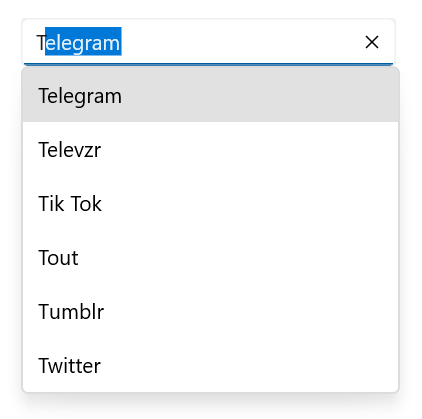

# Searching and Filtering in .NET MAUI Autocomplete (SfAutocomplete)

The `Autocomplete` control allows for rich text searching and filtering functionality.

## Searching based on member path

The `DisplayMemberPath` and `TextMemberPath` properties of Autocomplete control specify the property path, by which the searching must be done when a custom data is bound to the `ItemsSource` property.

 * `DisplayMemberPath` - Specifies the property path whose value is displayed as text in the drop-down menu. The default value is `string.Empty`.

 * `TextMemberPath` - Specifies the property path whose value is used to perform searching based on user input received in the selection box portion of the `Autocomplete` control. The default value is `string.Empty`. When `TextMemberPath` is `null` or `string.Empty`, searching will be performed based on `DisplayMemberPath`. 

N> `DisplayMemberPath` and `TextMemberPath` will be effective for the collection item that holds two or more properties in it.

N> When both the `DisplayMemberPath` and `TextMemberPath` properties have a `null` or `string.Empty` value, searching will be performed based on the class name with namespace of the item.

### Searching based on DisplayMemberPath

Searching will be performed based on the `DisplayMemberPath` property while entering the text into the selection box when `TextMemberPath` is `null` or `string.Empty`. 




//Model.cs
public class SocialMedia
{
    public string Name { get; set; }
    public int ID { get; set; }
}

//ViewModel.cs
public class SocialMediaViewModel
{
    public ObservableCollection<SocialMedia> SocialMedias { get; set; }
    public SocialMediaViewModel()
    {
        this.SocialMedias = new ObservableCollection<SocialMedia>();
        this.SocialMedias.Add(new SocialMedia() { Name = "Facebook", ID = 0 });
        this.SocialMedias.Add(new SocialMedia() { Name = "Google Plus", ID = 1 });
        this.SocialMedias.Add(new SocialMedia() { Name = "Instagram", ID = 2 });
        this.SocialMedias.Add(new SocialMedia() { Name = "LinkedIn", ID = 3 });
        this.SocialMedias.Add(new SocialMedia() { Name = "Skype", ID = 4 });
        this.SocialMedias.Add(new SocialMedia() { Name = "Telegram", ID = 5 });
        this.SocialMedias.Add(new SocialMedia() { Name = "Televzr", ID = 6 });
        this.SocialMedias.Add(new SocialMedia() { Name = "Tik Tok", ID = 7 });
        this.SocialMedias.Add(new SocialMedia() { Name = "Tout", ID = 8 });
        this.SocialMedias.Add(new SocialMedia() { Name = "Tumblr", ID = 9 });
        this.SocialMedias.Add(new SocialMedia() { Name = "Twitter", ID = 10 });
        this.SocialMedias.Add(new SocialMedia() { Name = "Vimeo", ID = 11 });
        this.SocialMedias.Add(new SocialMedia() { Name = "WhatsApp", ID = 12 });
        this.SocialMedias.Add(new SocialMedia() { Name = "YouTube", ID = 13 });
    }
}







<editors:SfAutocomplete x:Name="autocomplete"
                        WidthRequest="250" 
                        ItemsSource="{Binding SocialMedias}"
                        DisplayMemberPath="Name" />





autocomplete.DisplayMemberPath = "Name";




For e.g. After typing `T` in selection box, social medias which have starting letter `T` will be listed in drop-down.

The following image illustrates the result of the above code:

### Searching based on TextMemberPath

Searching will be performed based on the `TextMemberPath` property, while entering the text into the selection box. If `TextMemberPath` is `null` or `string.Empty`, searching will be performed based on `DisplayMemberPath`. 




<editors:SfAutocomplete x:Name="autocomplete"
                        WidthRequest="250"
                        ItemsSource="{Binding SocialMedias}"
                        TextMemberPath="ID"
                        DisplayMemberPath="Name" />





autocomplete.TextMemberPath = "ID";




The following image illustrates the result of the above code:

## Filtering mode

The `TextSearchMode` property of the `Autocomplete` can be used to regulate how the control behaves when it receives user input. The default text filtering type is `StartsWith`, which ignores accent and is case insensitive. The text filter modes that are available are as follows,

* StartsWith
* Contains

### Filter with beginning text

Set the `TextSearchMode` property value to `StartWith` to filter matching items based on the starting text. The first item in the drop-down list that matches the user input will be highlighted. 




<editors:SfAutocomplete x:Name="autoComplete"
                        WidthRequest="250"
                        TextSearchMode="StartsWith"
                        ItemsSource="{Binding SocialMedias}"
                        DisplayMemberPath="Name"
                        TextMemberPath="Name" />





autocomplete.TextSearchMode = AutocompleteTextSearchMode.StartsWith;




The following image illustrates the result of the above code:

### Filter with contains text

Set the `TextSearchMode` property value to `Contains` to filter the matching items based on the containing specific text. The first item  in the drop-down list that matches the user input will be highlighted. 




<editors:SfAutocomplete x:Name="autoComplete"
                        WidthRequest="250"
                        TextSearchMode="Contains"
                        ItemsSource="{Binding SocialMedias}"
                        DisplayMemberPath="Name"
                        TextMemberPath="Name" />





autocomplete.TextSearchMode = AutocompleteTextSearchMode.Contains;




The following gif image illustrates the result of the above code:

