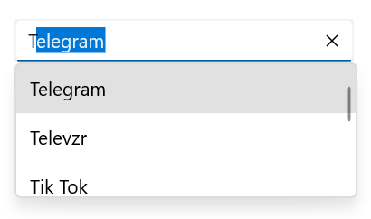

# UI Customization in .NET MAUI Autocomplete (SfAutocomplete)

This section explains different UI customizations available in the [.NET MAUI Autocomplete](https://help.syncfusion.com/cr/maui/Syncfusion.Maui.Inputs.SfAutocomplete.html) control.

## Placeholder

You can prompt the user with any information by using the [Placeholder](https://help.syncfusion.com/cr/maui/Syncfusion.Maui.Core.SfDropdownEntry.html#Syncfusion_Maui_Core_SfDropdownEntry_Placeholder) property. This text will be displayed only if no items are selected or the edit text is empty. The default value of the Placeholder property is `string.Empty` (No string will be displayed).




<editors:SfAutocomplete x:Name="autocomplete"
                        WidthRequest="250"
                        Placeholder="Select a social media"
                        ItemsSource="{Binding SocialMedias}"
                        DisplayMemberPath="Name"
                        TextMemberPath="Name" />




autocomplete.Placeholder = "Select a social media";




The following image illustrates the result of the above code:

## Placeholder Color

The placeholder text color can be changed by using the [PlaceholderColor](https://help.syncfusion.com/cr/maui/Syncfusion.Maui.Core.SfDropdownEntry.html#Syncfusion_Maui_Core_SfDropdownEntry_PlaceholderColor) property. The default value of the PlaceholderColor property is `Colors.Gray`.




<editors:SfAutocomplete x:Name="autocomplete"
                        WidthRequest="250"
                        ItemsSource="{Binding SocialMedias}"
                        DisplayMemberPath="Name"
                        TextMemberPath="Name"
                        Placeholder="Select a social media"
                        PlaceholderColor="Red" />




autocomplete.PlaceholderColor = Colors.Red;




The following gif image illustrates the result of the above code:

## Clear Button Icon Color

The clear button icon color can be changed by using the [ClearButtonIconColor](https://help.syncfusion.com/cr/maui/Syncfusion.Maui.Core.SfDropdownEntry.html#Syncfusion_Maui_Core_SfDropdownEntry_ClearButtonIconColor) property. The default value of the ClearButtonIconColor property is `Colors.Black`.




<editors:SfAutocomplete x:Name="autocomplete"
                        WidthRequest="250"
                        ItemsSource="{Binding SocialMedias}"
                        DisplayMemberPath="Name"
                        TextMemberPath="Name"
                        Placeholder="Select a social media"
                        PlaceholderColor="Red"
                        ClearButtonIconColor="Red" />




autocomplete.ClearButtonIconColor = Colors.Red;




The following gif image illustrates the result of the above code:

## Stroke

The Autocomplete border color can be changed by using the `Stroke` property.




<editors:SfAutocomplete x:Name="autocomplete"
                        WidthRequest="250"
                        ItemsSource="{Binding SocialMedias}"
                        DisplayMemberPath="Name"
                        TextMemberPath="Name"
                        Placeholder="Select a social media"
                        PlaceholderColor="Red"
                        Stroke="Red" />




autocomplete.Stroke = Colors.Red;




The following gif image illustrates the result of the above code.

## Maximum DropDown Height

The maximum height of the drop-down can be changed by using the [MaxDropDownHeight](https://help.syncfusion.com/cr/maui/Syncfusion.Maui.Core.SfDropdownEntry.html#Syncfusion_Maui_Core_SfDropdownEntry_MaxDropDownHeight) property of the `Autocomplete` control. The default value of the MaxDropDownHeight property is `400d`. 

N> If the `MaxDropDownHeight` is too small compared to the populated items, the scroll viewer will be automatically shown to navigate the hidden items.




<editors:SfAutocomplete x:Name="autocomplete"
                        WidthRequest="250"
                        MaxDropDownHeight = "100"
                        ItemsSource="{Binding SocialMedias}"
                        DisplayMemberPath="Name"
                        TextMemberPath="Name" />




autocomplete.MaxDropDownHeight = 100;




The following gif image illustrates the result of the above code:

