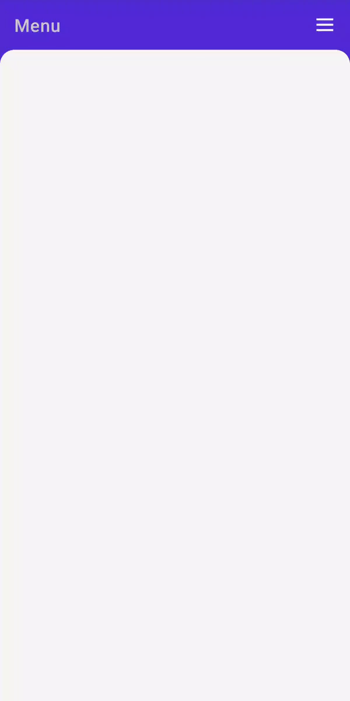

# Getting started with .NET MAUI Backdrop Page

This section explains the steps required to add the Backdrop page and its elements such as BackLayer and FrontLayer in the project. This section covers only the basic features needed to know and gets started with the Syncfusion backdrop page.

## Creating an application using the .NET MAUI Backdrop Page

* Create a new .NET MAUI application in the Visual Studio.

* The Syncfusion .NET MAUI components are available on the [nuget.org](https://www.nuget.org/). To add the SfBackdropPage to your project, open the NuGet package manager in Visual Studio, and search for [Syncfusion.Maui.Backdrop], then install it.

### Register the handler

The Syncfusion.Maui.Core NuGet is a dependent package for all Syncfusion controls of .NET MAUI. In the MauiProgram.cs file, register the handler for the Syncfusion core.



using Microsoft.Maui;
using Microsoft.Maui.Hosting;
using Microsoft.Maui.Controls.Compatibility;
using Microsoft.Maui.Controls.Hosting;
using Microsoft.Maui.Controls.Xaml;
using Syncfusion.Maui.Core.Hosting;

namespace MyProject
{
    public static class MauiProgram
    {
        public static MauiApp CreateMauiApp()
        {
            var builder = MauiApp.CreateBuilder();
            builder
            .UseMauiApp<App>()
            .ConfigureSyncfusionCore()
            .ConfigureFonts(fonts =>
            {
                fonts.AddFont("OpenSans-Regular.ttf", "OpenSansRegular");
            });

            return builder.Build();
        }
    }
}



## Initializing backdrop page

Create a page and import the SfBackdropPage namespace along with XAML namespaces in .NET MAUI.





<backdrop:SfBackdropPage xmlns="http://schemas.microsoft.com/dotnet/2021/maui"
                         xmlns:x="http://schemas.microsoft.com/winfx/2009/xaml"
                         x:Class="BackdropGettingStarted.BackdropSamplePage"
                         Title="Menu"
                         xmlns:backdrop="clr-namespace:Syncfusion.Maui.Backdrop;assembly=Syncfusion.Maui.Backdrop"
                         >
    
</backdrop:SfBackdropPage>





using Syncfusion.Maui.Backdrop;
namespace BackdropGettingStarted;

public partial class BackdropSamplePage : SfBackdropPage
{
    public BackdropSamplePage()
    {
        InitializeComponent();
        this.Title = "Menu";
    }
}





N> The `Title` and `ToolBarItems` properties of the `Page` can be used to customize the appearance of the header.

### Configure header

The page header for the backdrop appears only when adding a backdrop as a child of the NavigationPage. To know more about it, refer to the `header configuration.`

## Add back layer content

The back layer holds actionable content (navigation or filtration), which is relevant to the front layer. The back layer will either fill the entire background or occupy the background based on the content height.

 

 

<backdrop:SfBackdropPage.BackLayer>
    <backdrop:BackdropBackLayer>
        <Grid>
            <Grid.RowDefinitions>
                <RowDefinition Height="Auto"/>
            </Grid.RowDefinitions>
            <ListView>
                <ListView.ItemsSource>
                    <x:Array Type="{x:Type x:String}">
                        <x:String>Appetizers</x:String>
                        <x:String>Soups</x:String>
                        <x:String>Desserts</x:String>
                        <x:String>Salads</x:String>
                    </x:Array>
                </ListView.ItemsSource>
            </ListView>
        </Grid>
    </backdrop:BackdropBackLayer>
</backdrop:SfBackdropPage.BackLayer> 



 

this.BackLayer = new BackdropBackLayer
{
    Content = new Grid
    {
        RowDefinitions =
        {
            new RowDefinition () { Height = GridLength.Auto}
        },
        Children =
        {
            new ListView
            {
                ItemsSource = new string[] { "Appetizers", "Soups", "Desserts" ,"Salads"}
            }
        }
    }
};





## Add front layer content
The front layer always appears in front of the back layer. It is displayed to the full width and holds primary content.

 

 

<backdrop:SfBackdropPage.FrontLayer>
        <backdrop:BackdropFrontLayer>
            <Grid BackgroundColor="WhiteSmoke" />
        </backdrop:BackdropFrontLayer>
</backdrop:SfBackdropPage.FrontLayer> 



 

this.FrontLayer = new BackdropFrontLayer()
{
    Content = new Grid
    {
        BackgroundColor = Colors.WhiteSmoke,
    }
};





## Reveal and conceal the back layer

The following options are provided in the backdrop to reveal and conceal the back layer.

* **Programmatically** - Reveals the back layer by setting the `IsBackLayerRevealed` property to true. By default, it is set to false.
* **Touch interaction** - Reveals the back layer by clicking the toolbar icon at the top-right corner of the navigation bar header. The Hamburger (or menu ) icon reveals, and the Close icon conceals the back layer. When adding the backdrop as a child of the FlyoutPage, the Hamburger and Close icons will be replaced by expand (or down arrow) and collapse (or up arrow) icons respectively.
* **Swipe or fling action** - Reveals the back layer by swipe or fling action on the front layer to the required direction. Swipe downwards to reveal, and swipe upwards to conceal the back layer.  The swipe or fling action will be handled only on the top of the front layer to the `RevealedHeight.`

For more information about reveal height customization, please refer to this `link`.

 

 

<backdrop:SfBackdropPage xmlns="http://schemas.microsoft.com/dotnet/2021/maui"
                         xmlns:x="http://schemas.microsoft.com/winfx/2009/xaml"
                         x:Class="BackdropGettingStarted.BackdropSamplePage"
                         Title="Menu"
                         xmlns:backdrop="clr-namespace:Syncfusion.Maui.Backdrop;assembly=Syncfusion.Maui.Backdrop"
                         IsBackLayerRevealed="True">

</backdrop:SfBackdropPage>
 


 

#region Constructor

public BackdropSamplePage()
{
    this.IsBackLayerRevealed = true;
}

#endregion





N> 
* Get the complete getting started sample from GitHub `link.`
* Refer to Syncfusion `.NET MAUI Backdrop` feature tour page for its groundbreaking feature representations.