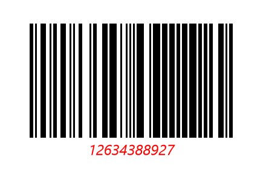
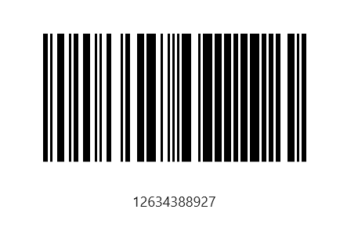
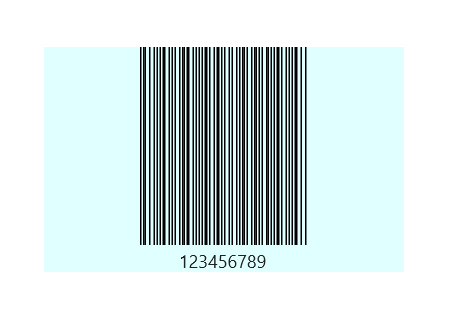
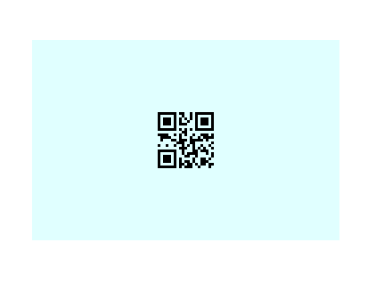
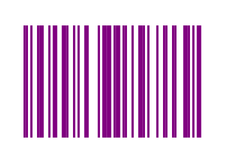
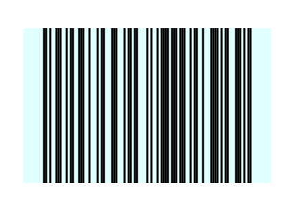

# Customization in .NET MAUI Barcodes (SfBarcodeGenerator)

## Text customization

### Displaying input value

The provided input value of the barcode can be displayed by enabling its `ShowText` property. By default, the `ShowText` is false.





        <barcode:SfBarcodeGenerator Value="12634388927" 
                                    HeightRequest="150"
                                    WidthRequest="300" 
                                    ShowText="True"/>





        SfBarcodeGenerator barcode = new SfBarcodeGenerator();
        barcode.HeightRequest = 150;
        barcode.WidthRequest = 300;
        barcode.Value = "12634388927";
        barcode.ShowText = true;
        this.Content = barcode;





### Text style customization

The style of the text can be customized with the `TextStyle` property of the barcode generator.





            <barcode:SfBarcodeGenerator Value="12634388927" 
                                        HeightRequest="150"
                                        WidthRequest="300" 
                                        ShowText="True">
                <barcode:SfBarcodeGenerator.TextStyle>
                    <barcode:BarcodeTextStyle FontAttributes="Italic" 
                                              FontSize="16" 
                                              FontFamily="Times" 
                                              TextColor="Red"/>
                </barcode:SfBarcodeGenerator.TextStyle>
            </barcode:SfBarcodeGenerator>





        SfBarcodeGenerator barcode = new SfBarcodeGenerator();
        barcode.HeightRequest = 150;
        barcode.WidthRequest = 300;
        barcode.Value = "12634388927";
        barcode.ShowText = true;
        barcode.TextStyle = new BarcodeTextStyle()
        {
            FontAttributes = FontAttributes.Italic,
            FontFamily = "Time",
            FontSize = 16,
            TextColor = Colors.Red
        };

        this.Content = barcode;





### Text spacing

The space between the text and the barcode can be controlled by the `TextSpacing` property of barcode generator. By default, the value of `TextSpacing` is 2.





            <barcode:SfBarcodeGenerator Value="12634388927" 
                                        HeightRequest="150"
                                        WidthRequest="300" 
                                        ShowText="True" 
                                        TextSpacing="25">
            </barcode:SfBarcodeGenerator>





        SfBarcodeGenerator barcode = new SfBarcodeGenerator();
        barcode.HeightRequest = 150;
        barcode.WidthRequest = 300;
        barcode.Value = "12634388927";
        barcode.ShowText = true;
        barcode.TextSpacing = 25;
        this.Content = barcode;





### Horizontal text alignment

The horizontal alignment of the text can be controlled by `TextAlignment` property of barcode generator. The displayed value can be positioned at `Start`, `Center` or `End` of the control. The default value of `TextAlignment` property is center.





       <barcode:SfBarcodeGenerator Value="12634" 
                                   HeightRequest="150"
                                   WidthRequest="240" 
                                   ShowText="True" 
                                   TextAlignment="End">





        SfBarcodeGenerator barcode = new SfBarcodeGenerator();
        barcode.HeightRequest = 150;
        barcode.WidthRequest = 240;
        barcode.Value = "12634";
        barcode.ShowText = true;
        barcode.TextAlignment = TextAlignment.End;
        this.Content = barcode;





## Bar customization

### Bar width customization

Both the one dimensional and the two dimensional symbology support the `Module` property. The property is used to define the size of the smallest line or dot of the barcode.

For one dimensional barcode, if this property is not set, the size of the smallest bar line is determined depending on the width available.

The following code snippet shows the one dimensional barcode with `Module` property,





            <barcode:SfBarcodeGenerator Value="123456789" 
                                        HeightRequest="150"
                                        WidthRequest="240" 
                                        ShowText="True" 
                                        BackgroundColor="LightCyan">
                <barcode:SfBarcodeGenerator.Symbology>
                    <barcode:Codabar Module="1"/>
                </barcode:SfBarcodeGenerator.Symbology>
            </barcode:SfBarcodeGenerator>





        SfBarcodeGenerator barcode = new SfBarcodeGenerator();
        barcode.HeightRequest = 150;
        barcode.WidthRequest = 240;
        barcode.Value = "123456789";
        barcode.ShowText = true;
        barcode.BackgroundColor = Colors.LightCyan;
        barcode.Symbology = new Codabar() { Module = 1 };
        this.Content = barcode;





N> In the image above, the smallest bar line width is 1 logical pixel.

Below code snippet shows the one dimensional barcode without the `Module` property,





        <barcode:SfBarcodeGenerator Value="123456789" 
                                    HeightRequest="150"
                                    WidthRequest="240" 
                                    ShowText="True" 
                                    BackgroundColor="LightCyan" Margin="50,20">
            <barcode:SfBarcodeGenerator.Symbology>
                <barcode:Codabar />
            </barcode:SfBarcodeGenerator.Symbology>
        </barcode:SfBarcodeGenerator>





        SfBarcodeGenerator barcode = new SfBarcodeGenerator();
        barcode.HeightRequest = 150;
        barcode.WidthRequest = 240;
        barcode.Value = "123456789";
        barcode.ShowText = true;
        barcode.BackgroundColor = Colors.LightCyan;
        barcode.Symbology = new Codabar();
        this.Content = barcode;





N>  In the image above, the smallest bar line width is calculated on the basis of the available width as a result of the total computed inputs(0’s and 1’s) divided by the available width.

For two dimensional barcode , if the `Module` property is not set, the size of smallest dot is calculated based on the minimum of available width or height.

The following code snippet shows the two dimensional barcode with `Module` property,





            <barcode:SfBarcodeGenerator Value="123456789" 
                                        HeightRequest="150"
                                        WidthRequest="230"  
                                        BackgroundColor="LightCyan">
                <barcode:SfBarcodeGenerator.Symbology>
                    <barcode:QRCode Module="2"/>
                </barcode:SfBarcodeGenerator.Symbology>
            </barcode:SfBarcodeGenerator>





        SfBarcodeGenerator barcode = new SfBarcodeGenerator();
        barcode.HeightRequest = 150;
        barcode.WidthRequest = 230;
        barcode.Value = "123456789";
        barcode.BackgroundColor = Colors.LightCyan;
        barcode.Symbology = new QRCode() { Module = 2 };
        this.Content = barcode;





Below code snippet shows the two dimensional barcode without the `Module` property,





            <barcode:SfBarcodeGenerator Value="123456789" 
                                        HeightRequest="150"
                                        WidthRequest="230"  
                                        BackgroundColor="LightCyan">
                <barcode:SfBarcodeGenerator.Symbology>
                    <barcode:QRCode />
                </barcode:SfBarcodeGenerator.Symbology>
            </barcode:SfBarcodeGenerator>





        SfBarcodeGenerator barcode = new SfBarcodeGenerator();
        barcode.HeightRequest = 150;
        barcode.WidthRequest = 230;
        barcode.Value = "123456789";
        barcode.BackgroundColor = Colors.LightCyan;
        barcode.Symbology = new QRCode();
        this.Content = barcode;





### Bar color customization

The bar color of the barcode can be customized by using its `ForegroundColor` property as like the following code snippet,





            <barcode:SfBarcodeGenerator Value="12634" 
                                        HeightRequest="150"
                                        WidthRequest="240"
                                        ForegroundColor="Purple">
            </barcode:SfBarcodeGenerator>





        SfBarcodeGenerator barcode = new SfBarcodeGenerator();
        barcode.HeightRequest = 150;
        barcode.WidthRequest = 240;
        barcode.Value = "12634";
        barcode.ForegroundColor = Colors.Purple;
        this.Content = barcode;





### Background color customization

The background color of barcode can be customized with the `BackgroundColor` property of barcode generator as like the below code snippet,





            <barcode:SfBarcodeGenerator Value="123456789" 
                                        HeightRequest="150"
                                        WidthRequest="240"
                                        BackgroundColor="LightCyan">
            </barcode:SfBarcodeGenerator>





        SfBarcodeGenerator barcode = new SfBarcodeGenerator();
        barcode.HeightRequest = 150;
        barcode.WidthRequest = 240;
        barcode.Value = "123456789";
        barcode.BackgroundColor = Colors.LightCyan;
        this.Content = barcode;





