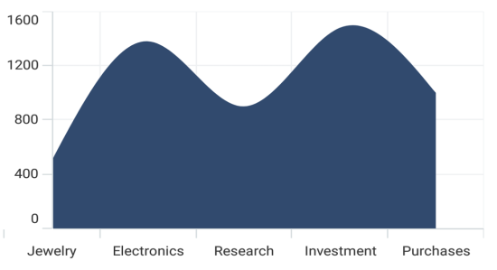

# Area Chart in .NET MAUI Chart

## Area Chart

The area chart is rendered by using a collection of line segments connected to form a closed loop area, filled with the specified color. To render a area chart, create an instance of [AreaSeries](https://help.syncfusion.com/cr/maui/Syncfusion.Maui.Charts.AreaSeries.html?tabs=tabid-1) and add it to the [Series](https://help.syncfusion.com/cr/maui/Syncfusion.Maui.Charts.SfCartesianChart.html#Syncfusion_Maui_Charts_SfCartesianChart_Series) collection property of the chart.

N> The cartesian chart has [Series](https://help.syncfusion.com/cr/maui/Syncfusion.Maui.Charts.SfCartesianChart.html#Syncfusion_Maui_Charts_SfCartesianChart_Series) as its default content.





<chart:SfCartesianChart>
    
    <chart:SfCartesianChart.XAxes>
        <chart:CategoryAxis />
    </chart:SfCartesianChart.XAxes>

    <chart:SfCartesianChart.YAxes>
        <chart:NumericalAxis />
    </chart:SfCartesianChart.YAxes>   

    <chart:AreaSeries ItemsSource="{Binding Data}"
					  XBindingPath="Demand"
					  YBindingPath="Year2010"/>  

</chart:SfCartesianChart>





SfCartesianChart chart = new SfCartesianChart();
CategoryAxis primaryAxis = new CategoryAxis();
chart.XAxes.Add(primaryAxis);
NumericalAxis secondaryAxis = new NumericalAxis();
chart.YAxes.Add(secondaryAxis);

AreaSeries series = new AreaSeries()
{
    ItemsSource = new ViewModel().Data,
    XBindingPath = "Demand",
    YBindingPath = "Year2010",
};

chart.Series.Add(series);
this.Content = chart;





## Spline Area Chart

The [SplineAreaSeries](https://help.syncfusion.com/cr/maui/Syncfusion.Maui.Charts.SplineAreaSeries.html?tabs=tabid-1) connects a series of data points using smooth bezier line curves, with the underlying areas filled.





<chart:SfCartesianChart>

    <chart:SfCartesianChart.XAxes>
        <chart:CategoryAxis />
    </chart:SfCartesianChart.XAxes>

    <chart:SfCartesianChart.YAxes>
        <chart:NumericalAxis />
    </chart:SfCartesianChart.YAxes>
            
    <chart:SplineAreaSeries ItemsSource="{Binding Data}"
							XBindingPath="Demand" 
							YBindingPath="Year2010"/>  

</chart:SfCartesianChart>





SfCartesianChart chart = new SfCartesianChart();
CategoryAxis primaryAxis = new CategoryAxis();
chart.XAxes.Add(primaryAxis);
NumericalAxis secondaryAxis = new NumericalAxis();
chart.YAxes.Add(secondaryAxis);

SplineAreaSeries series = new SplineAreaSeries()
{
    ItemsSource = new ViewModel().Data,
    XBindingPath = "Demand",
    YBindingPath = "Year2010",
};

chart.Series.Add(series);
this.Content = chart;





## Enable Marker

A marker, also known as a symbol, is used to determine or highlight the position of the data point. To enable markers in the series, set the [ShowMarkers]() property to true.





<chart:SfCartesianChart>
...
 <chart:AreaSeries XBindingPath="Year"
                   YBindingPath="Percentage"
                   ItemsSource="{Binding Data}"
                   ShowMarkers="True"/>

</chart:SfCartesianChart>





SfCartesianChart chart = new SfCartesianChart();

...
AreaSeries series = new LineSeries()
{
    XBindingPath = "Year",
    YBindingPath = "Percentage",
    ItemsSource = new ViewModel().Data,
    ShowMarkers= true,
 };

chart.Series.Add(series);
this.Content= chart;





### Marker customization

In order to change the series markers appearance, create an instance of the [MarkerSettings]() property.

Following properties are used to customize marker appearance,

* [Type](), of type `ShapeType`, describes the shape of the series marker. The default value of this property is [ShapeType.Circle]()
* [Stroke](), of type `Brush`, indicates the brush used to paint the marker border.
* [StrokeWidth](), of type `double`, indicates the width of the border.
* [Fill](), of type `Brush`, indicates the color of the marker
* [Width](), of type `double`, indicates the width of the marker
* [Height](), of type `double`, indicates the height of the marker





<chart:SfCartesianChart>
...
 <chart:AreaSeries XBindingPath="Year"
                   YBindingPath="Percentage"
                   ItemsSource="{Binding Data}"
                   ShowMarkers="True">
    <chart:AreaSeries.MarkerSettings>
        <chart:ChartMarkerSettings Type="Circle"
                                   Fill="Brown"
                                   Stroke="Blue"
                                   StrokeWidth="2"
                                   Height="15"
                                   Width="15"/>
    </chart:AreaSeries.MarkerSettings>
 </chart:AreaSeries>

</chart:SfCartesianChart>





SfCartesianChart chart = new SfCartesianChart();

...
ChartMarkerSettings chartMarker= new ChartMarkerSettings();
        chartMarker.Type = ShapeType.Diamond;
        chartMarker.Fill = Colors.Brown;
        chartMarker.Stroke = Colors.Brown;
        chartMarker.StrokeWidth= 1;
        chartMarker.Height = 5;
        chartMarker.Width = 5;

AreaSeries series = new LineSeries()
{
   XBindingPath = "Year",
   YBindingPath = "Percentage",
   ItemsSource = new ViewModel().Data,
   ShowMarkers = true,
 };

chart.Series.Add(series);
this.Content = chart;





