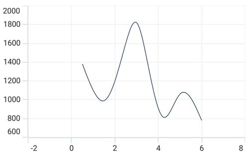
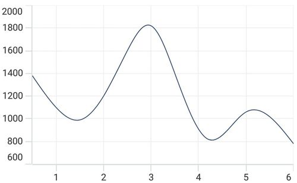
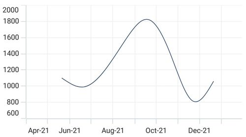
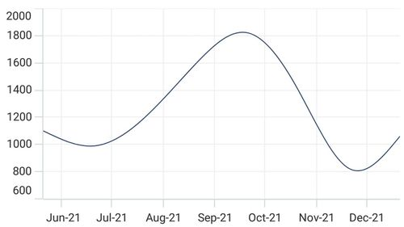

# Axis Range Padding in .NET MAUI Chart

Range padding is used to apply the minimum and maximum extremes of chart axis range by using the [RangePadding](https://help.syncfusion.com/cr/maui/Syncfusion.Maui.Charts.NumericalAxis.html#Syncfusion_Maui_Charts_NumericalAxis_RangePadding) property. The [NumericalAxis](https://help.syncfusion.com/cr/maui/Syncfusion.Maui.Charts.NumericalAxis.html) and [DateTimeAxis](https://help.syncfusion.com/cr/maui/Syncfusion.Maui.Charts.DateTimeAxis.html) have a [RangePadding](https://help.syncfusion.com/cr/maui/Syncfusion.Maui.Charts.NumericalAxis.html#Syncfusion_Maui_Charts_NumericalAxis_RangePadding) property that can be used to add padding to the range of the chart axis.

## Numerical Range Padding

The [RangePadding](https://help.syncfusion.com/cr/maui/Syncfusion.Maui.Charts.NumericalAxis.html#Syncfusion_Maui_Charts_NumericalAxis_RangePadding) is used to set the numeric range for axis.

The following types are available for [NumericalAxis](https://help.syncfusion.com/cr/maui/Syncfusion.Maui.Charts.NumericalAxis.html) range padding:

* `Additional` - The visible start and end range will be added with an additional interval. 
* `None` - The visible range sets to exact minimum and maximum value of the items source.
* `Normal` - The visible range will be the actual range calculated from given items source and series types.
* `Auto` - Automatically chosen based on the orientation of the axis.
* `Round` - The visible start and end range round to nearest interval value.
* `RoundStart` - The visible start range round to nearest interval value.
* `RoundEnd` - The visible end range round to nearest interval value. 
* `PrependInterval` - The visible start range will be prepended with an additional interval.
* `AppendInterval` - The visible end range will be appended with an additional interval.

By default, the [RangePadding](https://help.syncfusion.com/cr/maui/Syncfusion.Maui.Charts.NumericalAxis.html#Syncfusion_Maui_Charts_NumericalAxis_RangePadding) value for [SfCartesianChart](https://help.syncfusion.com/cr/maui/Syncfusion.Maui.Charts.SfCartesianChart.html?tabs=tabid-1) is `Auto` and for [YAxes]() is `Round`.

**Additional**





<chart:SfCartesianChart>
. . .
    <chart:SfCartesianChart.PrimaryAxis>
        <chart:NumericalAxis RangePadding="Additional"/>
    </chart:SfCartesianChart.PrimaryAxis>

    <chart:SfCartesianChart.SecondaryAxis>
        <chart:NumericalAxis />
    </chart:SfCartesianChart.SecondaryAxis>
. . .
</chart:SfCartesianChart>





SfCartesianChart chart = new SfCartesianChart();

chart.PrimaryAxis = new NumericalAxis()
{
    RangePadding = NumericalPadding.Additional,
};

chart.SecondaryAxis = new NumericalAxis();





**None**





<chart:SfCartesianChart>
. . .
    <chart:SfCartesianChart.PrimaryAxis>
        <chart:NumericalAxis RangePadding="None"/>
    </chart:SfCartesianChart.PrimaryAxis>

    <chart:SfCartesianChart.SecondaryAxis>
        <chart:NumericalAxis />
    </chart:SfCartesianChart.SecondaryAxis>
. . .
</chart:SfCartesianChart>





SfCartesianChart chart = new SfCartesianChart();

chart.PrimaryAxis = new NumericalAxis()
{
    RangePadding = NumericalPadding.None,
};

chart.SecondaryAxis = new NumericalAxis();





**Round**





<chart:SfCartesianChart>
. . .
    <chart:SfCartesianChart.PrimaryAxis>
        <chart:NumericalAxis  RangePadding="Round"/>
    </chart:SfCartesianChart.PrimaryAxis>

    <chart:SfCartesianChart.SecondaryAxis>
        <chart:NumericalAxis />
    </chart:SfCartesianChart.SecondaryAxis>
. . .
</chart:SfCartesianChart>





SfCartesianChart chart = new SfCartesianChart();

chart.PrimaryAxis = new NumericalAxis()
{
    RangePadding = NumericalPadding.Round,
};

chart.SecondaryAxis = new NumericalAxis();





## DateTime Range Padding

The [RangePadding](https://help.syncfusion.com/cr/maui/Syncfusion.Maui.Charts.NumericalAxis.html#Syncfusion_Maui_Charts_NumericalAxis_RangePadding) types available in the [DateTimeAxis](https://help.syncfusion.com/cr/maui/Syncfusion.Maui.Charts.DateTimeAxis.html) are: 

* `Auto` - Automatically chosen based on the orientation of the axis.
* `Additional` - The visible start and end range will be added with an additional interval.
* `None` - The visible range sets to exact minimum and maximum value of the items source.
* `Round` - The visible start and end range round to nearest interval value.
* `RoundStart` - The visible start range round to nearest interval value.
* `RoundEnd` - The visible end range round to nearest interval value.
* `PrependInterval` - The visible start range will be prepended with an additional interval.
* `AppendInterval` - The visible start range will be appended with an additional interval.

**Additional**





<chart:SfCartesianChart>
. . .
    <chart:SfCartesianChart.PrimaryAxis>
        <chart:DateTimeAxis RangePadding="Additional"/>
    </chart:SfCartesianChart.PrimaryAxis>

    <chart:SfCartesianChart.SecondaryAxis>
        <chart:NumericalAxis />
    </chart:SfCartesianChart.SecondaryAxis>
. . .
</chart:SfCartesianChart>





SfCartesianChart chart = new SfCartesianChart();

chart.PrimaryAxis = new DateTimeAxis()
{
    RangePadding = DateTimeRangePadding.Additional
};

chart.SecondaryAxis = new NumericalAxis();





**None**





<chart:SfCartesianChart>
. . .
    <chart:SfCartesianChart.PrimaryAxis>
        <chart:DateTimeAxis RangePadding="None" />
    </chart:SfCartesianChart.PrimaryAxis>

    <chart:SfCartesianChart.SecondaryAxis>
        <chart:NumericalAxis />
    </chart:SfCartesianChart.SecondaryAxis>
. . .
</chart:SfCartesianChart>





SfCartesianChart chart = new SfCartesianChart();

chart.PrimaryAxis = new DateTimeAxis()
{
    RangePadding = DateTimeRangePadding.None
};

chart.SecondaryAxis = new NumericalAxis();





**Round**





<chart:SfCartesianChart>
. . .
    <chart:SfCartesianChart.PrimaryAxis>
        <chart:DateTimeAxis RangePadding="Round"/>
    </chart:SfCartesianChart.PrimaryAxis>

    <chart:SfCartesianChart.SecondaryAxis>
        <chart:NumericalAxis />
    </chart:SfCartesianChart.SecondaryAxis>
. . .
</chart:SfCartesianChart>





SfCartesianChart chart = new SfCartesianChart();

chart.PrimaryAxis = new DateTimeAxis()
{
    RangePadding = DateTimeRangePadding.Round
};

chart.SecondaryAxis = new NumericalAxis();





