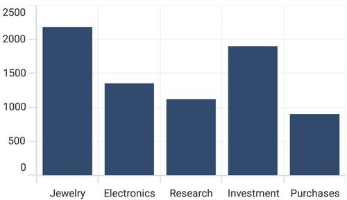
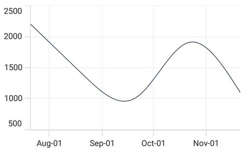
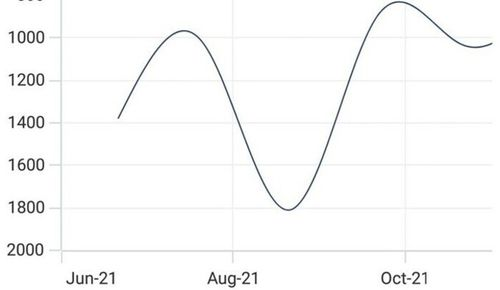
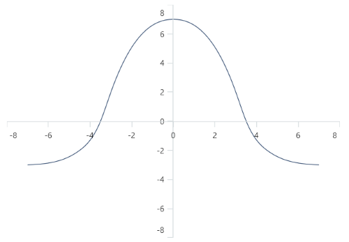

# Types of Axis in .NET MAUI Chart

Cartesian chart supports the following types of chart axis.

* NumericalAxis
* CategoryAxis
* DateTimeAxis

## Numerical Axis

[NumericalAxis](https://help.syncfusion.com/cr/maui/Syncfusion.Maui.Charts.NumericalAxis.html) is used to plot numerical values to the chart. [NumericalAxis](https://help.syncfusion.com/cr/maui/Syncfusion.Maui.Charts.NumericalAxis.html) can be defined for both [PrimaryAxis](https://help.syncfusion.com/cr/maui/Syncfusion.Maui.Charts.SfCartesianChart.html#Syncfusion_Maui_Charts_SfCartesianChart_PrimaryAxis) and [SecondaryAxis](https://help.syncfusion.com/cr/maui/Syncfusion.Maui.Charts.SfCartesianChart.html#Syncfusion_Maui_Charts_SfCartesianChart_SecondaryAxis).





<chart:SfCartesianChart>
    . . .
    <chart:SfCartesianChart.XAxes>
        <chart:NumericalAxis/>
    </chart:SfCartesianChart.XAxes>
    <chart:SfCartesianChart.YAxes>
        <chart:NumericalAxis/>
    </chart:SfCartesianChart.YAxes>

</chart:SfCartesianChart>





SfCartesianChart chart = new SfCartesianChart();
. . .
NumericalAxis primaryAxis = new NumericalAxis();
chart.XAxes.Add(primaryAxis);

NumericalAxis secondaryAxis = new NumericalAxis();
chart.YAxes.Add(secondaryAxis);





### Interval

Axis interval can be customized by using the [Interval](https://help.syncfusion.com/cr/maui/Syncfusion.Maui.Charts.CategoryAxis.html#Syncfusion_Maui_Charts_CategoryAxis_Interval) property. By default, interval will be calculated based on the minimum and maximum value of the provided data.





<chart:SfCartesianChart>
. . .
<chart:SfCartesianChart.XAxes>
    <chart:NumericalAxis Interval="10" />
</chart:SfCartesianChart.XAxes>
<chart:SfCartesianChart.YAxes>
    <chart:NumericalAxis/>
</chart:SfCartesianChart.YAxes>

</chart:SfCartesianChart>





SfCartesianChart chart = new SfCartesianChart();
. . .
NumericalAxis primaryAxis = new NumericalAxis()
{
    Interval = 10, 
};
chart.XAxes.Add(primaryAxis);

NumericalAxis secondaryAxis = new NumericalAxis();
chart.YAxes.Add(secondaryAxis);





### Customizing the Range

[Maximum](https://help.syncfusion.com/cr/maui/Syncfusion.Maui.Charts.NumericalAxis.html#Syncfusion_Maui_Charts_NumericalAxis_Maximum) and [Minimum](https://help.syncfusion.com/cr/maui/Syncfusion.Maui.Charts.NumericalAxis.html#Syncfusion_Maui_Charts_NumericalAxis_Minimum) properties of axis is used for setting the maximum and minimum value of the axis range respectively.

N> If  minimum or maximum value is set, the other value is calculated by default internally.





<chart:SfCartesianChart.YAxes>
    <chart:NumericalAxis Maximum="2750" Minimum="250" Interval="250"/>
</chart:SfCartesianChart.YAxes>





NumericalAxis secondaryAxis = new NumericalAxis()
{
    Maximum = 2750,
    Minimum = 250,
    Interval = 250
};
chart.YAxes.Add(secondaryAxis);





## Category Axis

The [CategoryAxis](https://help.syncfusion.com/cr/maui/Syncfusion.Maui.Charts.CategoryAxis.html) is an indexed based axis that plots values based on the index of the data point collection. The points are equally spaced here.





<chart:SfCartesianChart>
. . .
<chart:SfCartesianChart.XAxes>
    <chart:CategoryAxis/>
</chart:SfCartesianChart.XAxes>

</chart:SfCartesianChart>





SfCartesianChart chart = new SfCartesianChart();
. . .
CategoryAxis primaryAxis = new CategoryAxis();
chart.XAxes.Add(primaryAxis);





### Label placement

The [LabelPlacement](https://help.syncfusion.com/cr/maui/Syncfusion.Maui.Charts.CategoryAxis.html#Syncfusion_Maui_Charts_CategoryAxis_LabelPlacement) property in [CategoryAxis](https://help.syncfusion.com/cr/maui/Syncfusion.Maui.Charts.CategoryAxis.html) is used to placed the axis labels based on ticks and between ticks. The default value of [LabelPlacement](https://help.syncfusion.com/cr/maui/Syncfusion.Maui.Charts.CategoryAxis.html#Syncfusion_Maui_Charts_CategoryAxis_LabelPlacement) is [OnTicks](https://help.syncfusion.com/cr/maui/Syncfusion.Maui.Charts.LabelPlacement.html#Syncfusion_Maui_Charts_LabelPlacement_OnTicks).





<chart:SfCartesianChart>
    . . .
    <chart:SfCartesianChart.XAxes>
        <chart:CategoryAxis LabelPlacement="BetweenTicks"/>
    </chart:SfCartesianChart.XAxes>

</chart:SfCartesianChart>





SfCartesianChart chart = new SfCartesianChart();
. . .
CategoryAxis primaryAxis = new CategoryAxis()
{
    LabelPlacement = LabelPlacement.BetweenTicks
};
chart.XAxes.Add(primaryAxis);





### Interval

By default, the [CategoryAxis](https://help.syncfusion.com/cr/maui/Syncfusion.Maui.Charts.CategoryAxis.html) axis labels are display with fixed interval 1. It can customized by using the [Interval](https://help.syncfusion.com/cr/maui/Syncfusion.Maui.Charts.CategoryAxis.html#Syncfusion_Maui_Charts_CategoryAxis_Interval) property of axis.





<chart:SfCartesianChart>
    . . .
    <chart:SfCartesianChart.XAxes>
        <chart:CategoryAxis Interval="2" />
    </chart:SfCartesianChart.XAxes>
    <chart:SfCartesianChart.YAxes>
        <chart:NumericalAxis/>
    </chart:SfCartesianChart.YAxes>

</chart:SfCartesianChart>





SfCartesianChart chart = new SfCartesianChart();
. . .
CategoryAxis primaryAxis = new CategoryAxis()
{
    Interval = 2, 
};
chart.XAxes.Add(primaryAxis);

NumericalAxis secondaryAxis = new NumericalAxis();
chart.YAxes.Add(secondaryAxis);





## DateTime Axis

[DateTimeAxis](https://help.syncfusion.com/cr/maui/Syncfusion.Maui.Charts.DateTimeAxis.html) is used to plot `DateTime` values. The [DateTimeAxis](https://help.syncfusion.com/cr/maui/Syncfusion.Maui.Charts.DateTimeAxis.html) is widely used to make financial charts in places like the Stock Market, where index plotting is done every day.





<chart:SfCartesianChart>
    . . .
    <chart:SfCartesianChart.XAxes>
        <chart:DateTimeAxis/>
    </chart:SfCartesianChart.XAxes>

</chart:SfCartesianChart>





SfCartesianChart chart = new SfCartesianChart();
. . .
DateTimeAxis primaryAxis = new DateTimeAxis();
chart.XAxes.Add(primaryAxis);





### Interval

In [DateTimeAxis](https://help.syncfusion.com/cr/maui/Syncfusion.Maui.Charts.DateTimeAxis.html), intervals can be customized by using the [Interval](https://help.syncfusion.com/cr/maui/Syncfusion.Maui.Charts.CategoryAxis.html#Syncfusion_Maui_Charts_CategoryAxis_Interval) and [IntervalType](https://help.syncfusion.com/cr/maui/Syncfusion.Maui.Charts.DateTimeAxis.html#Syncfusion_Maui_Charts_DateTimeAxis_IntervalType) properties. For example, setting [Interval](https://help.syncfusion.com/cr/maui/Syncfusion.Maui.Charts.CategoryAxis.html#Syncfusion_Maui_Charts_CategoryAxis_Interval) as 6 and [IntervalType](https://help.syncfusion.com/cr/maui/Syncfusion.Maui.Charts.DateTimeAxis.html#Syncfusion_Maui_Charts_DateTimeAxis_IntervalType) as [Months](https://help.syncfusion.com/cr/maui/Syncfusion.Maui.Charts.DateTimeIntervalType.html#Syncfusion_Maui_Charts_DateTimeIntervalType_Months) will consider 6 months as interval.





<chart:SfCartesianChart>
    . . .
    <chart:SfCartesianChart.XAxes>
        <chart:DateTimeAxis Interval="6" IntervalType="Months"/>
    </chart:SfCartesianChart.XAxes>
    <chart:SfCartesianChart.YAxes>
        <chart:NumericalAxis/>
    </chart:SfCartesianChart.YAxes>

</chart:SfCartesianChart>





SfCartesianChart chart = new SfCartesianChart();
. . .
DateTimeAxis primaryAxis = new DateTimeAxis()
{
    Interval = 6, 
    IntervalType = DateTimeIntervalType.Months
};
chart.XAxes.Add(primaryAxis);

NumericalAxis secondaryAxis = new NumericalAxis();
chart.YAxes.Add(secondaryAxis);





### Customizing the Range

[Minimum](https://help.syncfusion.com/cr/maui/Syncfusion.Maui.Charts.DateTimeAxis.html#Syncfusion_Maui_Charts_DateTimeAxis_Minimum) and [Maximum](https://help.syncfusion.com/cr/maui/Syncfusion.Maui.Charts.DateTimeAxis.html#Syncfusion_Maui_Charts_DateTimeAxis_Maximum) properties behavior is same as in [NumericalAxis](https://help.syncfusion.com/cr/maui/Syncfusion.Maui.Charts.NumericalAxis.html) instead of setting numerical value, have to set date time values.





<chart:SfCartesianChart>
    . . .
    <chart:SfCartesianChart.XAxes>
        <chart:DateTimeAxis Minimum="2021/05/10" Maximum="2021/11/01"/>
    </chart:SfCartesianChart.XAxes>

</chart:SfCartesianChart>





SfCartesianChart chart = new SfCartesianChart();
. . .
DateTimeAxis primaryAxis = new DateTimeAxis()
{
    Minimum = new DateTime(2021,05,10),
    Maximum = new DateTime(2021,11,01),
};
chart.XAxes.Add(primaryAxis);





## Inversed

Axis can be inverted by using the [IsInversed](https://help.syncfusion.com/cr/maui/Syncfusion.Maui.Charts.ChartAxis.html#Syncfusion_Maui_Charts_ChartAxis_IsInversed) property. The default value of this property is `False`.





<chart:SfCartesianChart>
    . . .
    <chart:SfCartesianChart.YAxes>
        <chart:NumericalAxis IsInversed="True"/>
    </chart:SfCartesianChart.YAxes>

</chart:SfCartesianChart>





SfCartesianChart chart = new SfCartesianChart();
. . .
NumericalAxis secondaryAxis = new NumericalAxis();
secondaryAxis.IsInversed = true;
chart.YAxes.Add(secondaryAxis);





## Axis Visibility

Axis visibility can be controlled using the [IsVisible](https://help.syncfusion.com/cr/maui/Syncfusion.Maui.Charts.ChartAxis.html#Syncfusion_Maui_Charts_ChartAxis_IsVisible) property of axis. Default value of [IsVisible](https://help.syncfusion.com/cr/maui/Syncfusion.Maui.Charts.ChartAxis.html#Syncfusion_Maui_Charts_ChartAxis_IsVisible) property is `True`.





<chart:SfCartesianChart.YAxes>
    <chart:NumericalAxis IsVisible="False"/>
</chart:SfCartesianChart.YAxes>





SfCartesianChart chart = new SfCartesianChart();
. . .
NumericalAxis secondaryAxis = new NumericalAxis() { IsVisible = false };
chart.YAxes.Add(secondaryAxis);





## Multiple Axes

Cartesian charts provides support to arrange the multiple series inside the same chart area with specified x-axis and y-axis. There are two properties [XAxis](https://help.syncfusion.com/cr/maui/Syncfusion.Maui.Charts.CartesianSeries.html#Syncfusion_Maui_Charts_CartesianSeries_XAxis) and [YAxis](https://help.syncfusion.com/cr/maui/Syncfusion.Maui.Charts.CartesianSeries.html#Syncfusion_Maui_Charts_CartesianSeries_YAxis) in all the Cartesian series type, which is used to provide multiple axes support. These axes can be arranged in a stacking order or in a side by side pattern.

By default, all the series are plotted based on primary and secondary axis.





<ContentPage xmlns="http://schemas.microsoft.com/dotnet/2021/maui"
             xmlns:x="http://schemas.microsoft.com/winfx/2009/xaml"
             xmlns:sys="clr-namespace:System;assembly=mscorlib"
             xmlns:chart="clr-namespace:Syncfusion.Maui.Charts;assembly=Syncfusion.Maui.Charts">

<chart:SfCartesianChart>
    . . .
	<chart:SfCartesianChart.XAxes>
                    <chart:DateTimeAxis Name="series_XAxis" ShowMajorGridLines="False" />
                </chart:SfCartesianChart.XAxes>
                <chart:SfCartesianChart.YAxes>
					<chart:NumericalAxis ShowMajorGridLines="False" />
                    <chart:NumericalAxis Name="series_YAxis" CrossesAt="{Static x:Double.MaxValue}" ShowMajorGridLines="False" />
    <chart:SfCartesianChart.Series>
        <chart:SfCartesianChart.Series>
            <chart:ColumnSeries ItemsSource="{Binding Data1}" 
                    XBindingPath="Date"
                    YBindingPath="Value"
					XAxisName ="series_XAxis"
					YAxisName="series_YAxis">
            </chart:ColumnSeries>
            <chart:SplineSeries ItemsSource="{Binding Data}" 
                    XBindingPath="Date"
                    YBindingPath="Value"/>
    </chart:SfCartesianChart.Series>
</chart:SfCartesianChart>

</ContentPage>





SfCartesianChart chart = new SfCartesianChart();
. . .

ColumnSeries series1 = new ColumnSeries()
{
    ItemsSource = new ViewModel().Demands,
    XBindingPath = "Demand",
    YBindingPath = "Year2011"
};

SplineSeries series2 = new SplineSeries()
{
    ItemsSource = new ViewModel().Demands,
    XBindingPath = "Date",
    YBindingPath = "Year2011",
};

DateTimeAxis primaryAxis = new DateTimeAxis()
{
    ShowMajorGridLines = false
};
primaryAxis.Name = "series_XAxis";
chart.XAxes.Add(primaryAxis);
series1.XAxisName = "series_YAxis";

NumericalAxis secondaryAxis = new NumericalAxis()
{
    CrossesAt = double.MaxValue,
    ShowMajorGridLines = false
};
secondaryAxis.Name = "series_YAxis";
chart.YAxes.Add(secondaryAxis);
NumericalAxis secondaryAxis1 = new NumericalAxis();
chart.YAxes.Add(secondaryAxis1);
series1.YAxisName = "series_YAxis";

chart.Series.Add(series1);
chart.Series.Add(series2);





In the above image, the [ColumnSeries](https://help.syncfusion.com/cr/maui/Syncfusion.Maui.Charts.ColumnSeries.html?tabs=tabid-1) is plotted based on additional X & Y axes, and [SplineSeries](https://help.syncfusion.com/cr/maui/Syncfusion.Maui.Charts.SplineSeries.html?tabs=tabid-1) is plotted based on the primary and secondary axes.

## Axis Crossing

The chart allows you to customize the origin, by default the axis will be rendered with (0,0) as the origin in x and y-axes. An axis can be positioned anywhere in the chart area by using the [CrossesAt](https://help.syncfusion.com/cr/maui/Syncfusion.Maui.Charts.ChartAxis.html#Syncfusion_Maui_Charts_ChartAxis_CrossesAt) property. his property specifies where the horizontal axis intersects or crosses the vertical axis, and vice versa. The default value of the CrossesAt property is `double.NaN`.





<chart:SfCartesianChart>
    
    <chart:SfCartesianChart.XAxes>
            <chart:NumericalAxis CrossesAt="0" Minimum="-8" Maximum="8" ShowMajorGridLines="False" />
    </chart:SfCartesianChart.XAxes>

    <chart:SfCartesianChart.YAxes>
            <chart:NumericalAxis CrossesAt="0" Minimum="-8" Maximum="8"  ShowMajorGridLines="False" />
    </chart:SfCartesianChart.YAxes>

</chart:SfCartesianChart>





SfCartesianChart chart = new SfCartesianChart();
NumericalAxis primaryAxis = new NumericalAxis();
primaryAxis.CrossesAt = 0;
primaryAxis.Minimum = -8;
primaryAxis.Maximum = 8;
primaryAxis.ShowMajorGridLines = false;
chart.XAxes.Add(primaryAxis);
NumericalAxis secondaryAxis = new NumericalAxis();
secondaryAxis.CrossesAt = 0;
secondaryAxis.Minimum = -8;
secondaryAxis.Maximum = 8;
secondaryAxis.ShowMajorGridLines = false;
chart.YAxes.Add(secondaryAxis);





### Positioning the axis elements while crossing

The [RenderNextToCrossingValue](https://help.syncfusion.com/cr/maui/Syncfusion.Maui.Charts.ChartAxis.html#Syncfusion_Maui_Charts_ChartAxis_RenderNextToCrossingValue) property is used to determine whether the crossing axis should be placed at crossing position or not. The default value of [RenderNextToCrossingValue](https://help.syncfusion.com/cr/maui/Syncfusion.Maui.Charts.ChartAxis.html#Syncfusion_Maui_Charts_ChartAxis_RenderNextToCrossingValue) property is true.





<chart:SfCartesianChart>
    
    <chart:SfCartesianChart.XAxes>
            <chart:NumericalAxis CrossesAt="0" RenderNextToCrossingValue="False" />
    </chart:SfCartesianChart.XAxes>

    <chart:SfCartesianChart.YAxes>
            <chart:NumericalAxis CrossesAt="0" />
    </chart:SfCartesianChart.YAxes>

</chart:SfCartesianChart>





SfCartesianChart chart = new SfCartesianChart();
NumericalAxis primaryAxis = new NumericalAxis();
primaryAxis.CrossesAt = 0;
primaryAxis.RenderNextToCrossingValue = false;
chart.XAxes.Add(primaryAxis);
NumericalAxis secondaryAxis = new NumericalAxis();
secondaryAxis.CrossesAt = 0;
chart.YAxes.Add(secondaryAxis);





### Crossing the date-time axis

For the crossing in date time horizontal axis, date object should be provided as value for CrossesAt property of vertical axis.





<chart:SfCartesianChart>
    
    <chart:SfCartesianChart.XAxes>
            <chart:DateTimeAxis />
    </chart:SfCartesianChart.XAxes>

    <chart:SfCartesianChart.yAxes>
            <chart:NumericalAxis />
    </chart:SfCartesianChart.yAxes>

</chart:SfCartesianChart>





SfCartesianChart chart = new SfCartesianChart();
NumericalAxis primaryAxis = new NumericalAxis();
chart.XAxes.Add(primaryAxis);
NumericalAxis secondaryAxis = new NumericalAxis();
secondaryAxis.CrossesAt = new DateTime(2021, 01, 01);;
chart.YAxes.Add(secondaryAxis);





## Events

### ActualRangeChanged

The [ActualRangeChanged](https://help.syncfusion.com/cr/maui/Syncfusion.Maui.Charts.ActualRangeChangedEventArgs.html) event is triggered when the actual range of the axis is changed. The argument contains the following information:

* [ActualMinimum](https://help.syncfusion.com/cr/maui/Syncfusion.Maui.Charts.ActualRangeChangedEventArgs.html#Syncfusion_Maui_Charts_ActualRangeChangedEventArgs_ActualMinimum) - used to get or set the actual minimum value of the axis.
* [ActualMaximum](https://help.syncfusion.com/cr/maui/Syncfusion.Maui.Charts.ActualRangeChangedEventArgs.html#Syncfusion_Maui_Charts_ActualRangeChangedEventArgs_ActualMaximum) - used to get or set the actual maximum value of the axis.
* [VisibleMinimum](https://help.syncfusion.com/cr/maui/Syncfusion.Maui.Charts.ActualRangeChangedEventArgs.html#Syncfusion_Maui_Charts_ActualRangeChangedEventArgs_VisibleMinimum) - used to get or set the visible minimum value of the axis.
* [VisibleMaximum](https://help.syncfusion.com/cr/maui/Syncfusion.Maui.Charts.ActualRangeChangedEventArgs.html#Syncfusion_Maui_Charts_ActualRangeChangedEventArgs_VisibleMaximum) - used to get or set the visible maximum value of the axis.

N> The actual range and visible range are similar unless the range is changed by specifying the [ZoomPosition](https://help.syncfusion.com/cr/maui/Syncfusion.Maui.Charts.ChartAxis.html#Syncfusion_Maui_Charts_ChartAxis_ZoomPosition) and [ZoomFactor](https://help.syncfusion.com/cr/maui/Syncfusion.Maui.Charts.ChartAxis.html#Syncfusion_Maui_Charts_ChartAxis_ZoomFactor) properties or zooming the chart interactively. The visible range is always the range that you can see visually on the screen.

### LabelCreated

The [LabelCreated](https://help.syncfusion.com/cr/maui/Syncfusion.Maui.Charts.ChartAxis.html#Syncfusion_Maui_Charts_ChartAxis_LabelCreated) event is triggered when the axis label is created. The argument contains the following information:

* [LabelContent](https://help.syncfusion.com/cr/maui/Syncfusion.Maui.Charts.ChartAxisLabelEventArgs.html#Syncfusion_Maui_Charts_ChartAxisLabelEventArgs_LabelContent) - Used to get or set the text of axis label.
* [Position](https://help.syncfusion.com/cr/maui/Syncfusion.Maui.Charts.ChartAxisLabelEventArgs.html#Syncfusion_Maui_Charts_ChartAxisLabelEventArgs_Position) - Used to get the position of label.
* [LabelStyle](https://help.syncfusion.com/cr/maui/Syncfusion.Maui.Charts.ChartAxisLabelEventArgs.html#Syncfusion_Maui_Charts_ChartAxisLabelEventArgs_LabelStyle) - Used to customize the appearance of axis labels.