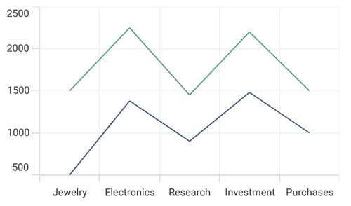
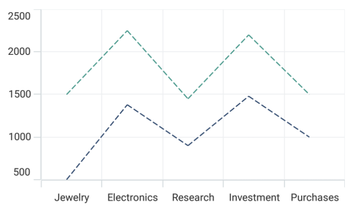
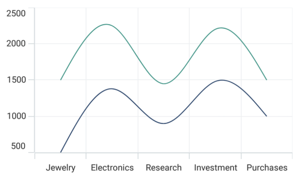
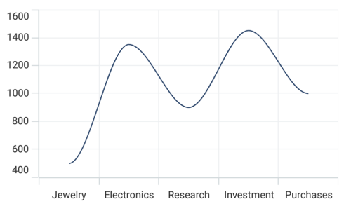

# Line Chart in .NET MAUI Chart

## Line Chart

Line chart is used to represent the data trends at equal intervals by connecting points on a plot with straight lines. To render a line chart, create an instance of [LineSeries](https://help.syncfusion.com/cr/maui/Syncfusion.Maui.Charts.LineSeries.html?tabs=tabid-1), and add it to the [Series](https://help.syncfusion.com/cr/maui/Syncfusion.Maui.Charts.SfCartesianChart.html#Syncfusion_Maui_Charts_SfCartesianChart_Series) collection property of [SfCartesianChart](https://help.syncfusion.com/cr/maui/Syncfusion.Maui.Charts.SfCartesianChart.html?tabs=tabid-1)
.

N> The cartesian chart has [Series](https://help.syncfusion.com/cr/maui/Syncfusion.Maui.Charts.SfCartesianChart.html#Syncfusion_Maui_Charts_SfCartesianChart_Series) as its default content.





<chart:SfCartesianChart>
    <chart:SfCartesianChart.XAxes>
        <chart:CategoryAxis />
    </chart:SfCartesianChart.XAxes>

    <chart:SfCartesianChart.YAxes>
        <chart:NumericalAxis />
    </chart:SfCartesianChart.YAxes>  

    <chart:LineSeries XBindingPath="Demand" ItemsSource="{Binding Data}" YBindingPath="Year2010"/>
    <chart:LineSeries XBindingPath="Demand" ItemsSource="{Binding Data}" YBindingPath="Year2011"/>
</chart:SfCartesianChart>





SfCartesianChart chart = new SfCartesianChart();
CategoryAxis primaryAxis = new CategoryAxis();
chart.XAxes.Add(primaryAxis);
NumericalAxis secondaryAxis = new NumericalAxis();
chart.YAxes.Add(secondaryAxis);

LineSeries series1 = new LineSeries()
{
    ItemsSource = new ViewModel().Data,
    XBindingPath = "Demand",
    YBindingPath = "Year2010",
};

LineSeries series2 = new LineSeries()
{
    ItemsSource = new ViewModel().Data,
    XBindingPath = "Demand",
    YBindingPath = "Year2011",

};

chart.Series.Add(series1);
chart.Series.Add(series2);

this.Content = chart;





### Dashed line

The [StrokeDashArray](https://help.syncfusion.com/cr/maui/Syncfusion.Maui.Charts.LineSeries.html#Syncfusion_Maui_Charts_LineSeries_StrokeDashArray) property of [LineSeries](https://help.syncfusion.com/cr/maui/Syncfusion.Maui.Charts.LineSeries.html?tabs=tabid-1) is used to render the line series with dashes. Odd value is considered as rendering size and even value is considered as gap.





<chart:SfCartesianChart>
    <chart:SfCartesianChart.Resources>
        <DoubleCollection x:Key="dashArray">
            <x:Double>5</x:Double>
            <x:Double>2</x:Double>
        </DoubleCollection>
    </chart:SfCartesianChart.Resources>

    <chart:SfCartesianChart.XAxes>
        <chart:CategoryAxis />
    </chart:SfCartesianChart.XAxes>

    <chart:SfCartesianChart.YAxes>
        <chart:NumericalAxis />
    </chart:SfCartesianChart.YAxes>  

    <chart:LineSeries XBindingPath="Demand" ItemsSource="{Binding Data}" YBindingPath="Year2010" StrokeDashArray="{StaticResource dashArray}"/>
    <chart:LineSeries XBindingPath="Demand" ItemsSource="{Binding Data}" YBindingPath="Year2011" StrokeDashArray="{StaticResource dashArray}"/>
</chart:SfCartesianChart>





SfCartesianChart chart = new SfCartesianChart();
CategoryAxis primaryAxis = new CategoryAxis();
chart.XAxes.Add(primaryAxis);
NumericalAxis secondaryAxis = new NumericalAxis();
chart.YAxes.Add(secondaryAxis);

DoubleCollection doubleCollection = new DoubleCollection();
doubleCollection.Add(5);
doubleCollection.Add(2);
. . .
LineSeries series1 = new LineSeries()
{
    ItemsSource = new ViewModel().Data,
    XBindingPath = "Demand",
    YBindingPath = "Year2010",
    StrokeDashArray = doubleCollection

};

LineSeries series2 = new LineSeries()
{
    ItemsSource = new ViewModel().Data,
    XBindingPath = "Demand",
    YBindingPath = "Year2011",
    StrokeDashArray = doubleCollection
};

chart.Series.Add(series1);
chart.Series.Add(series2);

this.Content = chart;





## Spline Chart 

The [SplineSeries](https://help.syncfusion.com/cr/maui/Syncfusion.Maui.Charts.SplineSeries.html?tabs=tabid-1) resembles line series, but instead of connecting the data points with line segments, the data points are connected by smooth bezier curves.





<chart:SfCartesianChart>
    <chart:SfCartesianChart.XAxes>
        <chart:CategoryAxis />
    </chart:SfCartesianChart.XAxes>

    <chart:SfCartesianChart.YAxes>
        <chart:NumericalAxis />
    </chart:SfCartesianChart.YAxes>  

    <chart:SplineSeries XBindingPath="Demand" ItemsSource="{Binding Data}" YBindingPath="Year2010"/>
    <chart:SplineSeries XBindingPath="Demand" ItemsSource="{Binding Data}" YBindingPath="Year2011"/>
</chart:SfCartesianChart>





SfCartesianChart chart = new SfCartesianChart();
CategoryAxis primaryAxis = new CategoryAxis();
chart.XAxes.Add(primaryAxis);
NumericalAxis secondaryAxis = new NumericalAxis();
chart.YAxes.Add(secondaryAxis);

SplineSeries series1 = new SplineSeries()
{
    ItemsSource = new ViewModel().Data,
    XBindingPath = "Demand",
    YBindingPath = "Year2010",
};

SplineSeries series2 = new SplineSeries()
{
    ItemsSource = new ViewModel().Data,
    XBindingPath = "Demand",
    YBindingPath = "Year2011",
};

chart.Series.Add(series1);
chart.Series.Add(series2);

this.Content = chart;





### Spline rendering types

The [Type](https://help.syncfusion.com/cr/maui/Syncfusion.Maui.Charts.SplineSeries.html#Syncfusion_Maui_Charts_SplineSeries_Type) property allows to change the rendering type of spline curve in series. The default value of [Type](https://help.syncfusion.com/cr/maui/Syncfusion.Maui.Charts.SplineSeries.html#Syncfusion_Maui_Charts_SplineSeries_Type) is [Natural](https://help.syncfusion.com/cr/maui/Syncfusion.Maui.Charts.SplineType.html#Syncfusion_Maui_Charts_SplineType_Natural).

The following types are used in SplineSeries:

* `Natural`
* `Monotonic`
* `Cardinal`
* `Clamped`





<chart:SfCartesianChart>
    <chart:SfCartesianChart.XAxes>
        <chart:CategoryAxis />
    </chart:SfCartesianChart.XAxes>

    <chart:SfCartesianChart.YAxes>
        <chart:NumericalAxis />
    </chart:SfCartesianChart.YAxes>  

    <chart:SplineSeries XBindingPath="Demand" ItemsSource="{Binding Data}" YBindingPath="Year2010" Type="Cardinal"/>
</chart:SfCartesianChart>





SfCartesianChart chart = new SfCartesianChart();
CategoryAxis primaryAxis = new CategoryAxis();
chart.XAxes.Add(primaryAxis);
NumericalAxis secondaryAxis = new NumericalAxis();
chart.YAxes.Add(secondaryAxis);

SplineSeries series = new SplineSeries()
{
    ItemsSource = new ViewModel().Data,
    XBindingPath = "Demand",
    YBindingPath = "Year2010",
    Type = SplineType.Cardinal
};

chart.Series.Add(series);

this.Content = chart;





