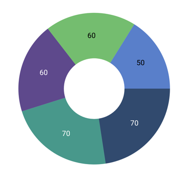
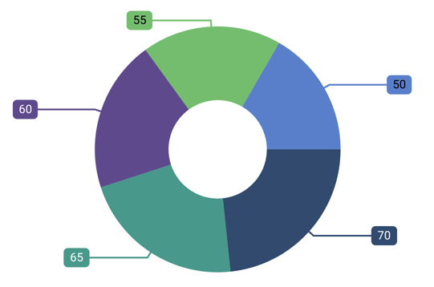
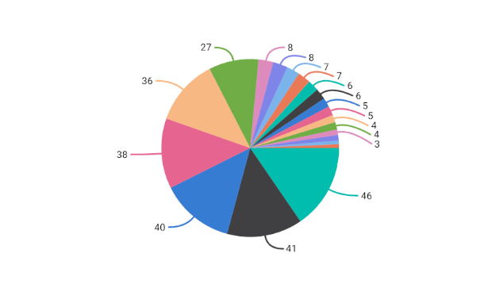

# Data Label in .NET MAUI Chart

Data labels are used to display values related to a chart segment. Values from data point(x, y) or other custom properties from a data source can be displayed. 

Each data label can be represented by the following:

* Label - displays the segment label content at the (X, Y) point.
* Connector line - used to connect the (X, Y) point and the label element.

## Enable Data Label 

[ShowDataLabels](https://help.syncfusion.com/cr/maui/Syncfusion.Maui.Charts.ChartSeries.html#Syncfusion_Maui_Charts_ChartSeries_ShowDataLabels) property of series is used to enable the data labels.





<chart:SfCircularChart>
. . .
<chart:PieSeries ShowDataLabels="True"
                ItemsSource="{Binding Data}"  
                XBindingPath="Product" 
                YBindingPath="SalesRate"/>
. . .
</chart:SfCircularChart>





SfCircularChart chart = new SfCircularChart();
. . .
PieSeries series = new PieSeries();
series.ShowDataLabels = true;
. . .
chart.Series.Add(series);



 

Data labels can be customized by using the [DataLabelSettings](https://help.syncfusion.com/cr/maui/Syncfusion.Maui.Charts.CircularSeries.html#Syncfusion_Maui_Charts_CircularSeries_DataLabelSettings) property of chart series. For customizing, need to create an instance of [CircularDataLabelSettings](https://help.syncfusion.com/cr/maui/Syncfusion.Maui.Charts.CircularDataLabelSettings.html) and set to the [DataLabelSettings](https://help.syncfusion.com/cr/maui/Syncfusion.Maui.Charts.CircularSeries.html#Syncfusion_Maui_Charts_CircularSeries_DataLabelSettings) property. Following properties are used to customize the data labels which are available in [CircularDataLabelSettings](https://help.syncfusion.com/cr/maui/Syncfusion.Maui.Charts.CircularDataLabelSettings.html).

* [ConnectorType](https://help.syncfusion.com/cr/maui/Syncfusion.Maui.Charts.CircularDataLabelSettings.html#Syncfusion_Maui_Charts_CircularDataLabelSettings_ConnectorType) - Gets or sets the type of connector line to be drawn.
* [LabelStyle](https://help.syncfusion.com/cr/maui/Syncfusion.Maui.Charts.ChartDataLabelSettings.html#Syncfusion_Maui_Charts_ChartDataLabelSettings_LabelStyle) - Gets or sets the options for customizing the data labels. 
* [UseSeriesPalette](https://help.syncfusion.com/cr/maui/Syncfusion.Maui.Charts.ChartDataLabelSettings.html#Syncfusion_Maui_Charts_ChartDataLabelSettings_UseSeriesPalette) - Gets or sets a value indicating whether the data label should reflect the series interior.

 

## Applying Series Brush

[UseSeriesPalette](https://help.syncfusion.com/cr/maui/Syncfusion.Maui.Charts.ChartDataLabelSettings.html#Syncfusion_Maui_Charts_ChartDataLabelSettings_UseSeriesPalette) property is used to set the interior of the series to the data label background. 





<chart:SfCircularChart>
. . .
<chart:PieSeries ShowDataLabels="True">
    <chart:PieSeries.DataLabelSettings>
        <chart:CircularDataLabelSettings UseSeriesPalette="True"/>
    </chart:PieSeries.DataLabelSettings>
</chart:PieSeries>

</chart:SfCircularChart>





SfCircularChart chart = new SfCircularChart();
. . .
PieSeries series = new PieSeries();
series.ShowDataLabels = true;
series.DataLabelSettings = new CircularDataLabelSettings()
{
    UseSeriesPalette = true,
};

chart.Series.Add(series);





## Smart Labels

This feature is used to arrange the data labels smartly and avoid the intersection when there is overlapping of labels. The property [SmartLabelAlignment](https://help.syncfusion.com/cr/maui/Syncfusion.Maui.Charts.CircularSeries.html#Syncfusion_Maui_Charts_CircularSeries_SmartLabelAlignment) in CircularSeries is used to arrange the data marker labels smartly. By default, it is Shift.

If the [LabelPlacement](https://help.syncfusion.com/cr/maui/Syncfusion.Maui.Charts.ChartDataLabelSettings.html#Syncfusion_Maui_Charts_ChartDataLabelSettings_LabelPlacement) is [Placement.Inner]() and the [SmartLabelAlignment](https://help.syncfusion.com/cr/maui/Syncfusion.Maui.Charts.CircularSeries.html#Syncfusion_Maui_Charts_CircularSeries_SmartLabelAlignment) is [SmartLabelAlignment.Shift](https://help.syncfusion.com/cr/maui/Syncfusion.Maui.Charts.SmartLabelAlignment.html#Syncfusion_Maui_Charts_SmartLabelAlignment_Shift), the overlapped labels will shift to outside the slices and arrange smartly. If the [LabelPlacement](https://help.syncfusion.com/cr/maui/Syncfusion.Maui.Charts.ChartDataLabelSettings.html#Syncfusion_Maui_Charts_ChartDataLabelSettings_LabelPlacement) is [Placement.Inner]() and the [SmartLabelAlignment](https://help.syncfusion.com/cr/maui/Syncfusion.Maui.Charts.CircularSeries.html#Syncfusion_Maui_Charts_CircularSeries_SmartLabelAlignment) is [SmartLabelAlignment.Hide](https://help.syncfusion.com/cr/maui/Syncfusion.Maui.Charts.SmartLabelAlignment.html#Syncfusion_Maui_Charts_SmartLabelAlignment_Hide), the overlapped labels will be hidden.

If the [LabelPlacement](https://help.syncfusion.com/cr/maui/Syncfusion.Maui.Charts.ChartDataLabelSettings.html#Syncfusion_Maui_Charts_ChartDataLabelSettings_LabelPlacement) is [Placement.Outer]() and the [SmartLabelAlignment](https://help.syncfusion.com/cr/maui/Syncfusion.Maui.Charts.CircularSeries.html#Syncfusion_Maui_Charts_CircularSeries_SmartLabelAlignment) is [SmartLabelAlignment.Shift](), the overlapped labels arrange smartly. If the [LabelPlacement](https://help.syncfusion.com/cr/maui/Syncfusion.Maui.Charts.ChartDataLabelSettings.html#Syncfusion_Maui_Charts_ChartDataLabelSettings_LabelPlacement) is [Placement.Outer]() and the [SmartLabelAlignment]() is [SmartLabelAlignment.Hide](https://help.syncfusion.com/cr/maui/Syncfusion.Maui.Charts.SmartLabelAlignment.html#Syncfusion_Maui_Charts_SmartLabelAlignment_Hide), the overlapped labels will be hidden.

If the [SmartLabelAlignment](https://help.syncfusion.com/cr/maui/Syncfusion.Maui.Charts.CircularSeries.html#Syncfusion_Maui_Charts_CircularSeries_SmartLabelAlignment) is [SmartLabelAlignment.None](https://help.syncfusion.com/cr/maui/Syncfusion.Maui.Charts.SmartLabelAlignment.html#Syncfusion_Maui_Charts_SmartLabelAlignment_None), then the overlapped labels will be visible irrespective of [LabelPlacement](https://help.syncfusion.com/cr/maui/Syncfusion.Maui.Charts.ChartDataLabelSettings.html#Syncfusion_Maui_Charts_ChartDataLabelSettings_LabelPlacement).

When the [SmartLabelAlignment](https://help.syncfusion.com/cr/maui/Syncfusion.Maui.Charts.CircularSeries.html#Syncfusion_Maui_Charts_CircularSeries_SmartLabelAlignment) is [SmartLabelAlignment.Shift](https://help.syncfusion.com/cr/maui/Syncfusion.Maui.Charts.SmartLabelAlignment.html#Syncfusion_Maui_Charts_SmartLabelAlignment_Shift), and if the data label goes out of the chart area, then the labels got trimmed based on the available size. The values of the [SmartLabelAlignment]() are listed below:

* [SmartLabelAlignment.Hide](https://help.syncfusion.com/cr/maui/Syncfusion.Maui.Charts.SmartLabelAlignment.html#Syncfusion_Maui_Charts_SmartLabelAlignment_Hide) - hides the intersected data labels.
* [SmartLabelAlignment.None](https://help.syncfusion.com/cr/maui/Syncfusion.Maui.Charts.SmartLabelAlignment.html#Syncfusion_Maui_Charts_SmartLabelAlignment_None) - intersected data labels will be visible.
* [SmartLabelAlignment.Shift](https://help.syncfusion.com/cr/maui/Syncfusion.Maui.Charts.SmartLabelAlignment.html#Syncfusion_Maui_Charts_SmartLabelAlignment_Shift) - smartly arranges the overlapped data labels.





<chart:SfCircularChart>
. . .
<chart:PieSeries ShowDataLabels="True">
    <chart:PieSeries.DataLabelSettings>
                <chart:CircularDataLabelSettings LabelPlacement="Outer" ConnectorType="Curve" UseSeriesPalette="False">
                    <chart:CircularDataLabelSettings.LabelStyle>
                        <chart:ChartDataLabelStyle Margin="0"/>
                    </chart:CircularDataLabelSettings.LabelStyle>
                </chart:CircularDataLabelSettings>
    </chart:PieSeries.DataLabelSettings>
</chart:PieSeries>

</chart:SfCircularChart>





SfCircularChart chart = new SfCircularChart();
. . .
PieSeries series = new PieSeries();
series.ShowDataLabels = true;
var dataLabelSettings = new CircularDataLabelSettings()
{
	LabelPlacement = Placement.Outer,
	ConnectorType = ConnectorType.Curve,
	UseSeriesPalette = false
};

dataLabelSettings.LabelStyle = new ChartDataLabelStyle() { Margin = 0 };
series.DataLabelSettings = dataLabelSettings;

chart.Series.Add(series);





