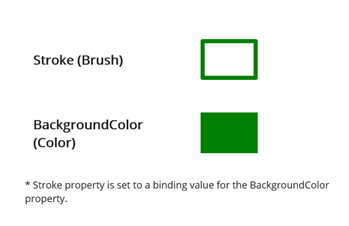
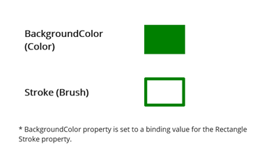
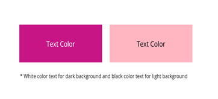
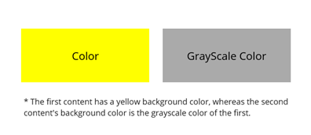
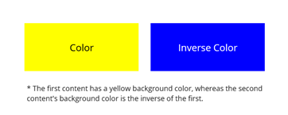
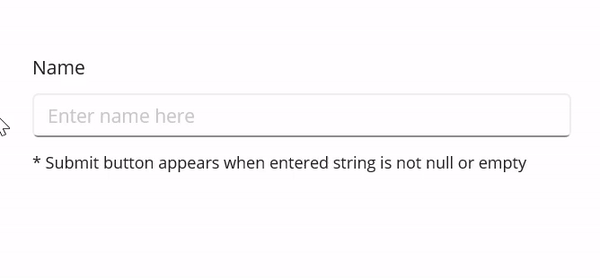
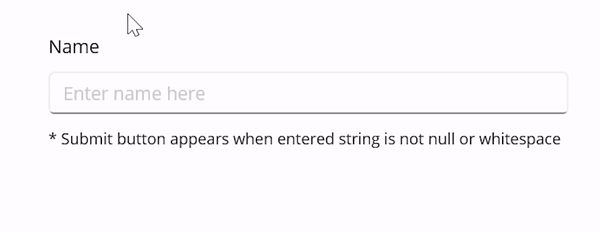

# Syncfusion .NET MAUI Converters

## Getting started with Syncfusion .NET MAUI Converters

This section explains you the steps to configure a Converters in a real-time scenario

## Adding a Syncfusion Maui Core reference

Syncfusion .NET MAUI Converters are available in [Nuget.org](https://www.nuget.org/). To add [Converters](https://help.syncfusion.com/cr/maui/Syncfusion.Maui.Core.Converters.html?tabs=tabid-1) to your project, open the NuGet package manager in Visual Studio, search for [Syncfusion.Maui.Core](https://www.nuget.org/packages/Syncfusion.Maui.Core/) and then install it.

## Adding a namespace

Step 1: Add the NuGet to the project as discussed in the above reference section. 

Step 2: Add the namespace as shown in the following code sample.





    xmlns:syncfusionConverters="clr-namespace:Syncfusion.Maui.Core.Converters;assembly=Syncfusion.Maui.Core"
            
	




    using Syncfusion.Maui.Core.Converters;





## BoolToObjectConverter

The BoolToObjectConverter is a value converter that converts a boolean value into an object. By including both a TrueObject and a FalseObject in the converter, the appropriate object will be used based on the binding value.

In this below sample, I am trying to set the two different font sizes of the text based on the IsChecked boolean property of the CheckBox control.





    <?xml version="1.0" encoding="utf-8" ?>
    <ContentPage xmlns="http://schemas.microsoft.com/dotnet/2021/maui"
                xmlns:x="http://schemas.microsoft.com/winfx/2009/xaml"
                xmlns:syncfusionConverters="clr-namespace:Syncfusion.Maui.Core.Converters;assembly=Syncfusion.Maui.Core"
                x:Class="MAUIValueConverters.BoolToObjectConverterPage">
        <ContentPage.Resources>
            <syncfusionConverters:BoolToObjectConverter x:Key="boolToObjectConverter"  TrueValueObject="16" FalseValueObject="14"/>
        </ContentPage.Resources>
        <VerticalStackLayout WidthRequest="400" HorizontalOptions="Center" VerticalOptions="Center" Spacing="20">
            <Label Text="Select your favourite fruit: "/>
            <Grid>
                <Grid.RowDefinitions>
                    <RowDefinition Height="*"/>
                    <RowDefinition Height="*"/>
                    <RowDefinition Height="*"/>
                    <RowDefinition Height="*"/>
                </Grid.RowDefinitions>
                <Grid.ColumnDefinitions>
                    <ColumnDefinition Width="40"/>
                    <ColumnDefinition Width="*"/>
                </Grid.ColumnDefinitions>

                <CheckBox x:Name="checkBox1" Grid.Row="0" Grid.Column="0" />
                <Label VerticalOptions="Center"  Grid.Row="0" Grid.Column="1"  BindingContext="{x:Reference checkBox1}" Text="Apple" FontSize="{Binding IsChecked, Converter={StaticResource boolToObjectConverter}}"/>

                <CheckBox x:Name="checkBox2" Grid.Row="1" Grid.Column="0" />
                <Label   VerticalOptions="Center"  Grid.Row="1" Grid.Column="1"  BindingContext="{x:Reference checkBox2}" Text="Orange" FontSize="{Binding IsChecked, Converter={StaticResource boolToObjectConverter}}"/>

                <CheckBox x:Name="checkBox3" Grid.Row="2" Grid.Column="0" />
                <Label  VerticalOptions="Center"  Grid.Row="2" Grid.Column="1"  BindingContext="{x:Reference checkBox3}" Text="Mango" FontSize="{Binding IsChecked, Converter={StaticResource boolToObjectConverter}}"/>

                <CheckBox x:Name="checkBox4" Grid.Row="3" Grid.Column="0" />
                <Label  VerticalOptions="Center"  Grid.Row="3" Grid.Column="1"  BindingContext="{x:Reference checkBox4}" Text="Strawberry" FontSize="{Binding IsChecked, Converter={StaticResource boolToObjectConverter}}"/>
            </Grid>
            <Label Text="* The font size of a specific fruit name will increase if it was checked." FontSize="12"/>
        </VerticalStackLayout>
    </ContentPage>





The following gif image illustrates the result of the above code.

## BoolToOpacityConverter

The BoolToOpacityConverter is a value converter that converts the boolean value into opacity. 

In this sample, the image will show if the boolean value is true and vice versa.





    <?xml version="1.0" encoding="utf-8" ?>
    <ContentPage xmlns="http://schemas.microsoft.com/dotnet/2021/maui"
    xmlns:x="http://schemas.microsoft.com/winfx/2009/xaml"
    xmlns:syncfusionConverters="clr-namespace:Syncfusion.Maui.Core.Converters;assembly=Syncfusion.Maui.Core"
    x:Class="MAUIValueConverters.BoolToOpacityConverterPage">

    <ContentPage.Resources>
    <syncfusionConverters:BoolToOpacityConverter x:Key="boolToOpacityConverter"/>
    </ContentPage.Resources>

    <VerticalStackLayout WidthRequest="400">
        <Grid HeightRequest="300">
            <Image BindingContext="{x:Reference visibilitySwitch}"
            IsVisible="{Binding IsToggled, Converter={StaticResource boolToOpacityConverter}}"
            Source="dotnet_bot.png"
            SemanticProperties.Description="Cute dot net bot waving hi to you!"
            HeightRequest="200"
            HorizontalOptions="Center" />
        </Grid>
        <Label Text="Show / Hide image with bool value" HorizontalOptions="Center"/>
        <Switch x:Name="visibilitySwitch" IsToggled="True" HorizontalOptions="Center"/>
    </VerticalStackLayout>
    </ContentPage>





The following gif image illustrates the result of the above code.

## BrushToColorConverter

The BrushToColorConverter is a value converter, it converts Brush into Color. This converter has the ConvertBack method, so it also works in two-way binding mode. 

In this sample, the rectangle `Stroke` property is set to a binding value for the `BackgroundColor` property using BrushToColorConverter. 





    <?xml version="1.0" encoding="utf-8" ?>
    <ContentPage xmlns="http://schemas.microsoft.com/dotnet/2021/maui"
                xmlns:x="http://schemas.microsoft.com/winfx/2009/xaml"
                xmlns:syncfusionConverters="clr-namespace:Syncfusion.Maui.Core.Converters;assembly=Syncfusion.Maui.Core"
                x:Class="MAUIValueConverters.BrushToColorConverterPage">
        <ContentPage.Resources>
            <syncfusionConverters:BrushToColorConverter x:Key="brushToColorConverter"/>
        </ContentPage.Resources>
        <VerticalStackLayout WidthRequest="400" Spacing="20" VerticalOptions="Center">
            <Grid RowDefinitions="Auto" ColumnDefinitions="50*,50*" ColumnSpacing="30" Padding="10">
                <Label Text="Stroke (Brush) " FontSize="16" VerticalOptions="Center"  FontAttributes="Bold"/>
                <Rectangle x:Name="brushProperty" Grid.Column="1" HeightRequest="50" Stroke="Green" StrokeThickness="5" WidthRequest="50" HorizontalOptions="Start"/>

            </Grid>
            <Grid RowDefinitions="Auto" ColumnDefinitions="50*,50*" ColumnSpacing="30" Padding="10">
                <Label Text="BackgroundColor (Color)" FontSize="16" VerticalOptions="Center"  FontAttributes="Bold"/>
                <StackLayout Grid.Column="1"
                            BindingContext="{x:Reference brushProperty}"
                            HeightRequest="50"
                            WidthRequest="50"
                            BackgroundColor="{Binding Stroke,Converter={StaticResource brushToColorConverter}}" HorizontalOptions="Start"/>

            </Grid>

            <Label FontSize="12" Text="* Stroke property is set to an binding value for BackgroundColor property."/>
        </VerticalStackLayout>
    </ContentPage>





The following screenshot illustrates the result of the above code.

## ColorToBrushConverter

The ColorToBrushConverter is a value converter, it converts Color into Brush. This converter has the ConvertBack method, so it also works in two-way binding mode.

In this sample, the `BackgroundColor` property is set to a binding value for the rectangle `Stroke` property using ColorToBrushConverter.





    <?xml version="1.0" encoding="utf-8" ?>
    <ContentPage xmlns="http://schemas.microsoft.com/dotnet/2021/maui"
                xmlns:x="http://schemas.microsoft.com/winfx/2009/xaml"
                xmlns:syncfusionConverters="clr-namespace:Syncfusion.Maui.Core.Converters;assembly=Syncfusion.Maui.Core"
                x:Class="MAUIValueConverters.ColorToBrushConverterPage">
        <ContentPage.Resources>
            <syncfusionConverters:ColorToBrushConverter x:Key="colorToBrushConverter"/>
        </ContentPage.Resources>
        <VerticalStackLayout WidthRequest="400" Spacing="20" VerticalOptions="Center">
            
            <Grid RowDefinitions="Auto" ColumnDefinitions="50*,50*" ColumnSpacing="30" Padding="10">
                <Label Text="BackgroundColor (Color)" FontSize="16" VerticalOptions="Center"  FontAttributes="Bold"/>
                <StackLayout Grid.Column="1" x:Name="colorProperty" 
                            HeightRequest="50"
                            WidthRequest="50"
                            BackgroundColor="Green" HorizontalOptions="Start"/>
            </Grid>

            <Grid RowDefinitions="Auto" ColumnDefinitions="50*,50*" ColumnSpacing="30" Padding="10">
                <Label Text="Stroke (Brush) " FontSize="16" VerticalOptions="Center" FontAttributes="Bold"/>
                <Rectangle BindingContext="{x:Reference colorProperty}" Grid.Column="1" HeightRequest="50" Stroke="{Binding BackgroundColor, Converter= {StaticResource colorToBrushConverter}}" StrokeThickness="5" WidthRequest="50" HorizontalOptions="Start"/>

            </Grid>
            <Label FontSize="12" Text="* BackgroundColor property is set to an binding value for Rectangle Stroke property."/>
        </VerticalStackLayout>
    </ContentPage>





The following screenshot illustrates the result of the above code.

## ColorToOnColorConverter

The ColorToOnColorConverter is a value converter, it converts the text color as white or black based on its background color density.

In this sample, `TextColor` property is set based on `BackgroundColor` property using ColorToOnColorConverter.





    <?xml version="1.0" encoding="utf-8" ?>
    <ContentPage xmlns="http://schemas.microsoft.com/dotnet/2021/maui"
                xmlns:x="http://schemas.microsoft.com/winfx/2009/xaml"
                xmlns:syncfusionConverters="clr-namespace:Syncfusion.Maui.Core.Converters;assembly=Syncfusion.Maui.Core"
                x:Class="MAUIValueConverters.ColorToOnColorConverterPage">
        <ContentPage.Resources>
            <syncfusionConverters:ColorToOnColorConverter x:Key="colorToOnColorConverter"/>
        </ContentPage.Resources>
        <VerticalStackLayout WidthRequest="400" Spacing="20" VerticalOptions="Center" HorizontalOptions="Center">
            <HorizontalStackLayout Spacing="20" HorizontalOptions="Center">
                <Grid x:Name="parentGrid" HeightRequest="80" WidthRequest="190" BackgroundColor="MediumVioletRed">
                    <Label BindingContext="{x:Reference parentGrid}" HorizontalOptions="Center" VerticalOptions="Center" FontSize="16" Text="Text Color" TextColor="{Binding BackgroundColor, Converter={StaticResource colorToOnColorConverter}}" />
                </Grid>
                <Grid x:Name="parentGrid1" HeightRequest="80" WidthRequest="190" BackgroundColor="LightPink">

                    <Label BindingContext="{x:Reference parentGrid1}" HorizontalOptions="Center" VerticalOptions="Center" FontSize="16" Text="Text Color" TextColor="{Binding BackgroundColor, Converter={StaticResource colorToOnColorConverter}}" />
                </Grid>
            </HorizontalStackLayout>
            <Label Text="* White color text for dark background and black color text for light background" HorizontalOptions="Center" FontSize="12"/>
        </VerticalStackLayout>
    </ContentPage>





The following screenshot illustrates the result of the above code.

## ColorToGrayScaleColorConverter

The ColorToGrayScaleColorConverter is a value converter, it converts the color into its grayscale value color.

In this sample, the first content has a yellow background color, whereas the second content’s `BackgroundColor` property is set based on the `BackgroundColor` property of the first content using ColorToGrayScaleColorConverter. 





    <?xml version="1.0" encoding="utf-8" ?>
    <ContentPage xmlns="http://schemas.microsoft.com/dotnet/2021/maui"
                xmlns:x="http://schemas.microsoft.com/winfx/2009/xaml"
                xmlns:syncfusionConverters="clr-namespace:Syncfusion.Maui.Core.Converters;assembly=Syncfusion.Maui.Core"
                x:Class="MAUIValueConverters.ColorToGrayScaleColorConverterPage">
        <ContentPage.Resources>
            <syncfusionConverters:ColorToGrayScaleColorConverter x:Key="colorToGrayScaleColorConverter"/>
        </ContentPage.Resources>
        <VerticalStackLayout WidthRequest="400" Spacing="20" VerticalOptions="Center" HorizontalOptions="Center">
            <HorizontalStackLayout Spacing="20" HorizontalOptions="Center">
                <Grid x:Name="parentGrid" HeightRequest="80" WidthRequest="190" BackgroundColor="Yellow">
                    <Label HorizontalOptions="Center" VerticalOptions="Center" FontSize="16" Text="Color" TextColor="Black" />
                </Grid>
                <Grid BindingContext="{x:Reference parentGrid}" HeightRequest="80" WidthRequest="190" BackgroundColor="{Binding BackgroundColor, Converter={StaticResource colorToGrayScaleColorConverter}}">
                    <Label HorizontalOptions="Center" VerticalOptions="Center" FontSize="16" Text="GrayScale Color" TextColor="Black" />
                </Grid>
            </HorizontalStackLayout>
            <Label Text="* The first content has a yellow background color, whereas the second content's background color is the gray scale color of the first." HorizontalOptions="Center" FontSize="12"/>
        </VerticalStackLayout>
    </ContentPage>





The following screenshot illustrates the result of the above code.

## ColorToInverseColorConverter

The ColorToInverseColorConverter is a value converter, it converts the color into its inverse color.

In this sample, the first content has a yellow background color, whereas the second content’s `BackgroundColor` property is set based on the `BackgroundColor` property of the first content using ColorToInverseColorConverter. 





    <?xml version="1.0" encoding="utf-8" ?>
    <ContentPage xmlns="http://schemas.microsoft.com/dotnet/2021/maui"
                xmlns:x="http://schemas.microsoft.com/winfx/2009/xaml"
                xmlns:syncfusionConverters="clr-namespace:Syncfusion.Maui.Core.Converters;assembly=Syncfusion.Maui.Core"
                x:Class="MAUIValueConverters.ColorToInverseColorConverterPage">
        <ContentPage.Resources>
            <syncfusionConverters:ColorToInverseColorConverter x:Key="colorToInverseColorConverter"/>
        </ContentPage.Resources>
        <VerticalStackLayout WidthRequest="400" Spacing="20" VerticalOptions="Center" HorizontalOptions="Center">
            <HorizontalStackLayout Spacing="20" HorizontalOptions="Center">
                <Grid x:Name="parentGrid" HeightRequest="80" WidthRequest="190" BackgroundColor="Yellow">
                    <Label HorizontalOptions="Center" VerticalOptions="Center" FontSize="16" Text="Color" TextColor="Black" />
                </Grid>
                <Grid BindingContext="{x:Reference parentGrid}" HeightRequest="80" WidthRequest="190" BackgroundColor="{Binding BackgroundColor, Converter={StaticResource colorToInverseColorConverter}}">
                    <Label HorizontalOptions="Center" VerticalOptions="Center" FontSize="16" Text="Inverse Color" TextColor="White" />
                </Grid>
            </HorizontalStackLayout>
            <Label Text="* The first content has a yellow background color, whereas the second content's background color is the inverse of the first." HorizontalOptions="Center" FontSize="12"/>
        </VerticalStackLayout>
    </ContentPage>





The following screenshot illustrates the result of the above code.

## CompareConverter

CompareConverter is a value converter, It converts an object into another object based on comparing the `Value` and `ComparingValue` using `ComparisonOperator.` Based on the result, it returns the `TrueObject` or `FalseObject.` If TrueObject and FalseObject are not set by the user, it returns a Boolean value.

In this sample, I set the TrueObject as "Available", FalseObject as "Not_Available", ComparisonOperator as "GreaterThan", and ComparingValue as four. If the item count is greater than two it returns the TrueObject or else, it returns FalseObject. 





    <?xml version="1.0" encoding="utf-8" ?>
    <ContentPage xmlns="http://schemas.microsoft.com/dotnet/2021/maui"
                xmlns:x="http://schemas.microsoft.com/winfx/2009/xaml"
                xmlns:syncfusionConverters="clr-namespace:Syncfusion.Maui.Core.Converters;assembly=Syncfusion.Maui.Core"
                x:Class="MAUIValueConverters.CompareConverterPage">
        <ContentPage.Resources>
            <x:Double x:Key="ComparingValue">4</x:Double>
        </ContentPage.Resources>
        
        <VerticalStackLayout WidthRequest="400" VerticalOptions="Center" Spacing="20">
            <Label Text="Laptop Sale!!!" FontSize="16" HorizontalOptions="Center"/>
            
            <HorizontalStackLayout Spacing="10" HorizontalOptions="Center">
                <Label Text="Item count: " VerticalOptions="Center"/>
                <Label BindingContext="{x:Reference stepper}" VerticalOptions="Center" Text="{Binding Value}"/>
                <Stepper x:Name="stepper" Minimum="0" Maximum="10" Value="2" />
            </HorizontalStackLayout>
            <Label Text="* Offer - buy 4 or more get 50% OFF" FontSize="12" HorizontalOptions="Center"/>
            <HorizontalStackLayout Spacing="10" HorizontalOptions="Center">
                <Label Text="Offer : "/>
                <Label BindingContext="{x:Reference stepper}"  Text="{Binding Value,Converter={syncfusionConverters:CompareConverter ComparisonOperator=GreaterOrEqual, ValueForComparing={StaticResource ComparingValue}, FalseValueObject=Not_Available, TrueValueObject=Available}}"
                        TextColor="{Binding Value,Converter={syncfusionConverters:CompareConverter ComparisonOperator=GreaterOrEqual, ValueForComparing={StaticResource ComparingValue}, FalseValueObject=#FF0000, TrueValueObject=#00FF00}}"/>
            </HorizontalStackLayout>
        </VerticalStackLayout>
    </ContentPage>





The following gif image illustrates the result of the above code.

## DecimalValueConverter

The DecimalValueConverter is a value converter that converts the input value into a specified number of fractional digits based on the `NumberDecimalDigits` provided by the user. 

In this below sample, `NumberDecimalDigits` assigned as two, so the total value will be rounded off by two digits.





    <?xml version="1.0" encoding="utf-8" ?>
    <ContentPage xmlns="http://schemas.microsoft.com/dotnet/2021/maui"
                xmlns:x="http://schemas.microsoft.com/winfx/2009/xaml"
                xmlns:syncfusionConverters="clr-namespace:Syncfusion.Maui.Core.Converters;assembly=Syncfusion.Maui.Core"
                x:Class="MAUIValueConverters.DecimalValueConverterPage"
                xmlns:local="clr-namespace:MAUIValueConverters">

        <ContentPage.BindingContext>
            <local:DecimalValueConverterViewModel/>
        </ContentPage.BindingContext>

        <ContentPage.Resources>
            <ResourceDictionary>
                <syncfusionConverters:DecimalValueConverter x:Key="DecimalValueConverter" OutputType="String" NumberDecimalDigits="2"/>
                
            </ResourceDictionary>
        </ContentPage.Resources>

        <Grid  HorizontalOptions="Center" VerticalOptions="Center"
            RowSpacing="10" ColumnSpacing="30"
            RowDefinitions="*,*,*" ColumnDefinitions="*,*">

            <Label Grid.Row="0" Grid.Column="0"
                Text="Value of one stock price in numbers"/>

            <Entry  Grid.Row="0" Grid.Column="1" Text="{Binding CostPerStock}"
                    HorizontalTextAlignment="Center" VerticalTextAlignment="Center"/>

            <Label Grid.Row="1" Grid.Column="0"
                Text="Quantity purchased"/>

            <Grid Grid.Row="1" Grid.Column="1"
                ColumnDefinitions="*,*" ColumnSpacing="10">

                <Stepper Minimum="1" Maximum="100" Value="{Binding Quantity}"
                        HorizontalOptions="Center" VerticalOptions="Center"/>
                <Label   Text="{Binding Quantity}" Grid.Column="1"/>
            </Grid>

            <Label Grid.Row="2"
                Text="Total stock value"/>

            <Label Grid.Row="2" Grid.Column="1"
                Text="{Binding TotalValue,Converter={StaticResource DecimalValueConverter}}" TextColor="Red"/>
        </Grid>
    </ContentPage>





    public class DecimalValueConverterViewModel : INotifyPropertyChanged
    {
        private double quantity;
        private string totalValue;
        private string costPerStock = "1";

        public double Quantity
        {
            get { return quantity; }
            set 
            {
                quantity = value;
                OnPropertyChanged();
            }
        }

        public string TotalValue
        {
            get { return totalValue; }
            set 
            { 
                totalValue = value;
                OnPropertyChanged();
            }
        }
        public string CostPerStock
        {
            get { return costPerStock; }
            set 
            {
                if (value == "")
                    costPerStock = "0";
                else
                    costPerStock = value;
                OnPropertyChanged();
                
            }
        }
   
        public event PropertyChangedEventHandler PropertyChanged;

        public void OnPropertyChanged([CallerMemberName] string propertyName = null)
        {
            PropertyChanged?.Invoke(this, new PropertyChangedEventArgs(propertyName));

            if(propertyName == nameof(CostPerStock) || propertyName == nameof(Quantity))
                TotalValue = (Convert.ToDouble(CostPerStock) * Quantity).ToString();
        }
    }





The following gif image illustrates the result of the above code.

## DoubleToIntConverter

DoubleToIntConverter is a value converter that converts a double value into an integer value.

In this sample, the input value is converted into an integer value assigned to the selected index of the picker control.





    <?xml version="1.0" encoding="utf-8" ?>
    <ContentPage xmlns="http://schemas.microsoft.com/dotnet/2021/maui"
                xmlns:x="http://schemas.microsoft.com/winfx/2009/xaml"
                xmlns:syncfusionConverters="clr-namespace:Syncfusion.Maui.Core.Converters;assembly=Syncfusion.Maui.Core"
                x:Class="MAUIValueConverters.DoubleToIntConverterPage">
    <ContentPage.Resources>
        <syncfusionConverters:DoubleToIntConverter x:Key="DoubleToIntConverter"/>
        <ResourceDictionary>
            <x:Array x:Key="Color" Type="{x:Type x:String}">
                <x:String>Worst</x:String>
                <x:String>Very Poor</x:String>
                <x:String>Poor</x:String>
                <x:String>Below Average</x:String>
                <x:String>Average</x:String>
                <x:String>Above Average</x:String>
                <x:String>Satisfied</x:String>
                <x:String>Very Satisfied</x:String>
                <x:String>Excellent</x:String>
                <x:String>Very Excellent</x:String>
            </x:Array>
        </ResourceDictionary>
    </ContentPage.Resources>

    <VerticalStackLayout Spacing="20"
                            HorizontalOptions="Center"
                            VerticalOptions="Center">
        <Slider  x:Name="sliderValue" Maximum="10" Minimum="0" />

        <Label Text="{Binding Source={x:Reference sliderValue},
                    Path=Value,
                    StringFormat='Your level based on your mark {0:F2}'}"/>

        <Picker BindingContext="{x:Reference sliderValue}" 
                ItemsSource="{StaticResource Color}" 
                SelectedIndex="{Binding Value ,Converter={StaticResource DoubleToIntConverter},Mode=TwoWay}"
                WidthRequest="200">

        </Picker>

    </VerticalStackLayout>

    </ContentPage>





The following gif image illustrates the result of the above code.

## EnumToIntConverter

EnumToIntConverter is a value converter that converts the enum value to its primitive integer data type. 

In this sample, when the picker is selected, the corresponding integer value is displayed on the label.





    <?xml version="1.0" encoding="utf-8" ?>
    <ContentPage xmlns="http://schemas.microsoft.com/dotnet/2021/maui"
                xmlns:x="http://schemas.microsoft.com/winfx/2009/xaml"
                xmlns:syncfusionConverters="clr-namespace:Syncfusion.Maui.Core.Converters;assembly=Syncfusion.Maui.Core"
                x:Class="MAUIValueConverters.EnumToIntConverterPage"
                xmlns:local="clr-namespace:MAUIValueConverters">

        <ContentPage.Resources>
            <ResourceDictionary>
                <syncfusionConverters:EnumToIntConverter x:Key="EnumToIntConverter"/>
            </ResourceDictionary>
        </ContentPage.Resources>

        <ContentPage.BindingContext>
            <local:EnumToIntViewModel/>
        </ContentPage.BindingContext>

        <ContentPage.Content>
            <StackLayout HorizontalOptions="Center" VerticalOptions="Center">

                <Grid RowDefinitions="*,*" HorizontalOptions="Center" RowSpacing="20">
                <HorizontalStackLayout Spacing="20">
                    <Label Text="Select the category to identify the floor"
                        HorizontalTextAlignment="Center"
                        VerticalTextAlignment="Center"/>
                    <Picker x:Name="directionPicker"
                        TitleColor="Black"
                        ItemsSource="{Binding TotalFloor}"
                        SelectedIndex="{Binding SelectedFloor,Converter={StaticResource EnumToIntConverter},ConverterParameter={x:Type local:Floor}}"/>
                </HorizontalStackLayout>

                <Label Grid.Row="1"
                    TextColor="Red"
                    Text="{Binding SelectedFloor, Converter={StaticResource EnumToIntConverter},StringFormat='Please press number {0} in the lift'}"/>
                </Grid>
            </StackLayout>
                
        </ContentPage.Content>
    </ContentPage>





    public class EnumToIntViewModel : INotifyPropertyChanged
    {
        public IReadOnlyList<string> TotalFloor { get;} = Enum.GetNames(typeof(Floor));

        private Floor selectedFloor = Floor.Electronics;

        public Floor SelectedFloor
        {
            get
            {
                return selectedFloor;
            }
            set
            {
                selectedFloor = value;
                NotifyPropertyChanged();
            }
        }

        public event PropertyChangedEventHandler PropertyChanged;

        protected virtual void NotifyPropertyChanged([CallerMemberName] string propertyName = "")
        {
            PropertyChanged?.Invoke(this, new PropertyChangedEventArgs(propertyName));
        }
        
    }
    public enum Floor
    {
        Clothing = 0,
        Electronics = 1,
        Household = 2,
        Gym = 3,
        Food_Court = 4,
        Theatre =5,
    }





The following gif image illustrates the result of the above code.

## EqualConverter

EqualConverter is a value converter that checks the input binding value whether it is equal to the converter parameter value or not and returns the Boolean value.

In this sample, if the input value is matched with the converter parameter value, then the label is visible and vice versa.





    <?xml version="1.0" encoding="utf-8" ?>
    <ContentPage xmlns="http://schemas.microsoft.com/dotnet/2021/maui"
                xmlns:x="http://schemas.microsoft.com/winfx/2009/xaml"
                xmlns:syncfusionConverters="clr-namespace:Syncfusion.Maui.Core.Converters;assembly=Syncfusion.Maui.Core"
                x:Class="MAUIValueConverters.EqualConverterPage"
                xmlns:local="clr-namespace:MAUIValueConverters">

        <ContentPage.Resources>
            <syncfusionConverters:EqualConverter x:Key="EqualConverter"/>
            
        </ContentPage.Resources>

        <StackLayout HorizontalOptions="Center" VerticalOptions="Center">
            <Grid RowDefinitions="*,*,*" ColumnDefinitions="*,*" RowSpacing="20">

                <Label Text="Trivia" FontSize="Medium"/>
                <Label Text="What is the value of pie" Grid.Row="1" Grid.Column="0"/>
                <HorizontalStackLayout Grid.Row="1" Grid.Column="1" Spacing="20">
                    <Entry x:Name="questionOne"/>
                    <Label BindingContext="{Reference questionOne}"
                    Text="Correct"
                    TextColor="LimeGreen"
                    IsVisible="{Binding Text, Converter={StaticResource EqualConverter},ConverterParameter=3.14}"/>
                </HorizontalStackLayout>

                <Label Text="The sun rises in the east" Grid.Row="2" Grid.Column="0"/>
                <HorizontalStackLayout Grid.Row="2" Grid.Column="2" Spacing="20">
                    <Entry x:Name="questionTwo"/>
                    <Label BindingContext="{Reference questionTwo}"
                    Text="Correct"
                    TextColor="LimeGreen"
                    IsVisible="{Binding Text, Converter={StaticResource EqualConverter},ConverterParameter=True}"/>
                </HorizontalStackLayout>
            </Grid>
        </StackLayout>

    </ContentPage>
	




The following gif image illustrates the result of the above code.

## FormatStringConverter

!!! need to change
FormatStringConverter is a value converter that converts.





    <?xml version="1.0" encoding="utf-8" ?>
    <ContentPage xmlns="http://schemas.microsoft.com/dotnet/2021/maui"
                xmlns:x="http://schemas.microsoft.com/winfx/2009/xaml"
                xmlns:syncfusionConverters="clr-namespace:Syncfusion.Maui.Core.Converters;assembly=Syncfusion.Maui.Core"
                x:Class="MAUIValueConverter.FormatStringConverterPage">
    </ContentPage>





The following gif image illustrates the result of the above code.

## IndexToArrayItemConverter

The IndexToArrayItemConverter is a value converter that converts a number value into an array item. The ConverterParameter is should used to pass in the array.

In this below sample, getting the array item using the value property of Stepper control.





    <?xml version="1.0" encoding="utf-8" ?>
    <ContentPage xmlns="http://schemas.microsoft.com/dotnet/2021/maui"
                xmlns:x="http://schemas.microsoft.com/winfx/2009/xaml"
                xmlns:syncfusionConverters="clr-namespace:Syncfusion.Maui.Core.Converters;assembly=Syncfusion.Maui.Core"
                x:Class="MAUIValueConverters.IndexToArrayItemConverterPage">
        <ContentPage.Resources>
            <syncfusionConverters:IndexToArrayItemConverter x:Key="indexToArrayItemConverter"/>
            <x:Array x:Key="Country" Type="{x:Type x:String}">
                <x:String>India</x:String>
                <x:String>England</x:String>
                <x:String>America</x:String>
                <x:String>Russia</x:String>
                <x:String>Africa</x:String>
            </x:Array>
        </ContentPage.Resources>
        <VerticalStackLayout Spacing="20" HorizontalOptions="Center" VerticalOptions="Center">

            <Label Text="Index To Array Item" FontSize="18" HorizontalOptions="Center"/>
            <HorizontalStackLayout Spacing="20">
                <StackLayout Orientation="Horizontal" VerticalOptions="Center" Spacing="10">
                    <Label Text="Index Value : "/>
                    <Label Text="{Binding Value, Source={x:Reference Stepper}}"/>
                </StackLayout>
                <Picker x:Name="picker" BindingContext="{x:Reference Stepper}"
                    ItemsSource="{StaticResource Country}"
                    SelectedItem="{Binding Value, Converter={StaticResource indexToArrayItemConverter},ConverterParameter={StaticResource Country}}">
                </Picker>
            </HorizontalStackLayout>
            <HorizontalStackLayout Spacing="20">
                <Label Text="Change Index Value : " VerticalOptions="Center"/>
                <Stepper x:Name="Stepper"
                    Minimum="0"
                    Maximum="4"
                    Increment="1" />
            </HorizontalStackLayout>
        </VerticalStackLayout>
    </ContentPage>





The following gif image illustrates the result of the above code.

## InverseOpacityConverter

The InverseOpacityConverter is a value converter that converts the Boolean value into inverted opacity. 

In this sample, the image will show if the value is set to zero and vice versa.





    <?xml version="1.0" encoding="utf-8" ?>
    <ContentPage xmlns="http://schemas.microsoft.com/dotnet/2021/maui"
                xmlns:x="http://schemas.microsoft.com/winfx/2009/xaml"
                xmlns:syncfusionConverters="clr-namespace:Syncfusion.Maui.Core.Converters;assembly=Syncfusion.Maui.Core"
                x:Class="MAUIValueConverters.InverseOpacityConverterPage">
    <ContentPage.Resources>
        <syncfusionConverters:InverseOpacityConverter x:Key="InverseOpacityConverter"/>
    </ContentPage.Resources>
    <VerticalStackLayout WidthRequest="400">
        <Grid HeightRequest="300">
            <Image BindingContext="{x:Reference opacitySlider}"
            Opacity="{Binding Value,Converter={StaticResource InverseOpacityConverter}}"
            Source="dotnet_bot.png"
            SemanticProperties.Description="Cute dot net bot waving hi to you!"
            HeightRequest="200"
            HorizontalOptions="Center" />
        </Grid>
        <Label Text="Invert opacity value based on slider value"/>
        <Slider x:Name="opacitySlider" Minimum="0" Maximum="1"/>
    </VerticalStackLayout>
    </ContentPage>





The following gif image illustrates the result of the above code.

## InvertedBoolConverter

The InvertedBoolConverter is a value converter, it converts true value as false and false value as true.

In this sample, the image `IsVisible` property is set to an inverse value of the switch `IsToggled` property. 





    <?xml version="1.0" encoding="utf-8" ?>
    <ContentPage xmlns="http://schemas.microsoft.com/dotnet/2021/maui"
                xmlns:x="http://schemas.microsoft.com/winfx/2009/xaml"
                xmlns:syncfusionConverters="clr-namespace:Syncfusion.Maui.Core.Converters;assembly=Syncfusion.Maui.Core"
                x:Class="MAUIValueConverters.InvertedBoolConverterPage">
        <ContentPage.Resources>
            <syncfusionConverters:InvertedBoolConverter x:Key="invertedBoolConverter"/>
        </ContentPage.Resources>
        <VerticalStackLayout WidthRequest="400">
            <Grid HeightRequest="300">
            <Image BindingContext="{x:Reference visibilitySwitch}"
                IsVisible="{Binding IsToggled, Converter={StaticResource invertedBoolConverter}}"
                    Source="dotnet_bot.png"
                    SemanticProperties.Description="Cute dot net bot waving hi to you!"
                    HeightRequest="200"
                    HorizontalOptions="Center" />
            </Grid>
            <Label Text="Show / Hide image with inverted bool value"/>
            <Switch x:Name="visibilitySwitch"/>
        </VerticalStackLayout>
    </ContentPage>





The following gif image illustrates the result of the above code.

## IsListNotNullOrEmptyConverter

The IsListNotNullOrEmptyConverter is a value converter that converts a list into a boolean value. It returns true when the list is not null or empty. 

In this below sample, the button will only be visible when the number of people is equal to or greater than one, i.e., the list is not null or empty.





    <?xml version="1.0" encoding="utf-8" ?>
    <ContentPage xmlns="http://schemas.microsoft.com/dotnet/2021/maui"
                xmlns:x="http://schemas.microsoft.com/winfx/2009/xaml"
                xmlns:ViewModel="clr-namespace:MAUIValueConverters"
                xmlns:syncfusionConverters="clr-namespace:Syncfusion.Maui.Core.Converters;assembly=Syncfusion.Maui.Core"
                x:Class="MAUIValueConverters.IsListNotNullOrEmptyConverterPage">
        <ContentPage.Resources>
            <syncfusionConverters:IsListNotNullOrEmptyConverter x:Key="isListNotNullOrEmptyConverter"/>
        </ContentPage.Resources>
        <ContentPage.BindingContext>
            <ViewModel:IsListNotNullOrEmptyViewModel x:Name="isListNotNullOrEmptyViewModel"/>
        </ContentPage.BindingContext>

        <VerticalStackLayout HorizontalOptions="Center" VerticalOptions="Center" Spacing="20">
            <Label Text="Ticket Booking System" HorizontalOptions="Center" FontSize="Medium"/>
            <HorizontalStackLayout HorizontalOptions="Center">
            <Label Text="Total Number Of Person :"/>
            <Label Text="{Binding ListOfItems.Count}"/>
            </HorizontalStackLayout>
            <StackLayout Orientation="Horizontal" Spacing="20">
                <Button Text="Clear Person" Command="{Binding ClearCollectionCommand}"/>
                <Button Text="Add Person" Command="{Binding AddCollectionCommand}"/>
            </StackLayout>
            <StackLayout HeightRequest="200" WidthRequest="200">
                <Label Text="* Booking can be allowed when number of person is equal to one or more than one." FontSize="10"/>
                <Button Text="Book Ticket" IsVisible="{Binding ListOfItems,Converter={StaticResource isListNotNullOrEmptyConverter}}" BackgroundColor="Green" TextColor="White"/>
            </StackLayout>
        </VerticalStackLayout>
    </ContentPage>





    internal class IsListNotNullOrEmptyViewModel : INotifyPropertyChanged
    {
        private string newItem = "Person";
        public IsListNotNullOrEmptyViewModel()
        {
            AddCollectionCommand = new Command(() => ListOfItems.Add(newItem));
            ClearCollectionCommand = new Command(ListOfItems.Clear);
            ListOfItems.CollectionChanged += HandleCollectionChanged;
        }
        private ObservableCollection<string> listOfItems = new ObservableCollection<string>()
                {
                "Person",
                "Person",
                "Person",
                };

        public ObservableCollection<string> ListOfItems
        {
            get { return listOfItems; }
            set { listOfItems = value; }
        }

        public ICommand ClearCollectionCommand { get; }
        public ICommand AddCollectionCommand { get; }

        public event PropertyChangedEventHandler PropertyChanged;

        private void HandleCollectionChanged(object sender, NotifyCollectionChangedEventArgs e)
        {
            OnPropertyChanged(nameof(ListOfItems));
        }

        private void OnPropertyChanged([CallerMemberName] string propertyName = "")
        {
            if (propertyName != null)
            {
                PropertyChanged?.Invoke(this, new PropertyChangedEventArgs(propertyName));
            }
        }
    }





The following gif image illustrates the result of the above code.

## IsStringNotNullOrEmptyConverter

The IsStringNotNullOrEmptyConverter is a value converter that converts a string into a boolean value. It returns true when the string is not null or empty.

In this below sample, the visibility of the submit button is based on the text entered by the user.





    <?xml version="1.0" encoding="utf-8" ?>
    <ContentPage xmlns="http://schemas.microsoft.com/dotnet/2021/maui"
                xmlns:x="http://schemas.microsoft.com/winfx/2009/xaml"
                xmlns:syncfusionConverters="clr-namespace:Syncfusion.Maui.Core.Converters;assembly=Syncfusion.Maui.Core"
                x:Class="MAUIValueConverters.IsStringNotNullOrEmptyConverterPage">
        <ContentPage.Resources>
            <syncfusionConverters:IsStringNotNullOrEmptyConverter x:Key="isStringNotNullOrEmptyConverter"/>
        </ContentPage.Resources>
        <VerticalStackLayout HeightRequest="200" HorizontalOptions="Center" VerticalOptions="Center" Spacing="10">
            <Label Text="Name"/>

            <Entry x:Name="Entry" Placeholder="Enter name here" WidthRequest="400"/>
            <Label Text="* Submit button appears when entered string is not null or empty " FontSize="12"/>

            <Button Text="Submit" WidthRequest="100"
                    BindingContext="{x:Reference Entry}"
                    IsVisible="{Binding Text, Converter={StaticResource isStringNotNullOrEmptyConverter}}"/>

        </VerticalStackLayout>
    </ContentPage>





The following gif image illustrates the result of the above code.

## IsStringNotNullOrWhitespaceConverter

The IsStringNotNullOrWhitespaceConverter is a value converter that converts a string into a boolean value. It returns true when the string is not null or whitespace.

In this below sample, I am trying to set the visibility of the submit button based on the text entered by the user.





    <?xml version="1.0" encoding="utf-8" ?>
    <ContentPage xmlns="http://schemas.microsoft.com/dotnet/2021/maui"
                xmlns:x="http://schemas.microsoft.com/winfx/2009/xaml"
                xmlns:syncfusionConverters="clr-namespace:Syncfusion.Maui.Core.Converters;assembly=Syncfusion.Maui.Core"
                x:Class="MAUIValueConverters.IsStringNotNullOrWhitespaceConverterPage">
        <ContentPage.Resources>
            <syncfusionConverters:IsStringNotNullOrWhitespaceConverter x:Key="isStringNotNullOrWhitespaceConverter"/>
        </ContentPage.Resources>
        <VerticalStackLayout HeightRequest="200" HorizontalOptions="Center" VerticalOptions="Center" Spacing="10">
            <Label Text="Name"/>
            
            <Entry x:Name="Entry" Placeholder="Enter name here" WidthRequest="400"/>
            <Label Text="* Submit button appears when entered string is not null or whitespace " FontSize="12"/>

            <Button Text="Submit" WidthRequest="100"
                    BindingContext="{x:Reference Entry}"
                    IsVisible="{Binding Text, Converter={StaticResource isStringNotNullOrWhitespaceConverter}}"/>
        
        </VerticalStackLayout>
    </ContentPage>





The following gif image illustrates the result of the above code.

## ListToStringConverter

The ListToStringConverter is a value converter that converts the incoming IEnumerable value into a string based on separator provided by the user using `Separator` property.

In this sample, the items in the list are converted into string separated by a comma.





    <?xml version="1.0" encoding="utf-8" ?>
    <ContentPage xmlns="http://schemas.microsoft.com/dotnet/2021/maui"
                xmlns:x="http://schemas.microsoft.com/winfx/2009/xaml"
                xmlns:syncfusionConverters="clr-namespace:Syncfusion.Maui.Core.Converters;assembly=Syncfusion.Maui.Core"
                x:Class="MAUIValueConverters.ListToStringConverterPage"
                xmlns:local="clr-namespace:MAUIValueConverters">

        <ContentPage.Resources>
            <ResourceDictionary>
                <syncfusionConverters:ListToStringConverter x:Key="ListToStringConverter" Separator=","/>
                
            </ResourceDictionary>
        </ContentPage.Resources>

        <ContentPage.BindingContext>
            <local:ListToStringViewModel/>
        </ContentPage.BindingContext>

        <StackLayout Spacing="15"
                    HorizontalOptions="Center"
                    VerticalOptions="Center">
            <Grid RowDefinitions="*,*,*,*" ColumnDefinitions="*" HorizontalOptions="Center"
                RowSpacing="20">
                <HorizontalStackLayout Grid.Row="0" Spacing="20">
                    <Label Text="Enter the items to be added to cart"/>
                    <Entry Text="{Binding Item,Mode=TwoWay}" WidthRequest="150"/>
                </HorizontalStackLayout>
                <HorizontalStackLayout Grid.Row="2" Spacing="100">
                    <Label Text="{Binding ItemsCount,StringFormat='No of items in cart {0:F2}'}" WidthRequest="150"/>
                    <Button Text="Add to cart" Command="{Binding AddCommand}"
                    HorizontalOptions="Center" VerticalOptions="Center"/>
                </HorizontalStackLayout>
                <Label Text="{Binding CartList, Converter={StaticResource ListToStringConverter},StringFormat='Your cart contains {0:F2}'}" Grid.Row="3"
                    FontSize="18"/>
            </Grid>
        </StackLayout>
    </ContentPage>





    public class ListToStringViewModel : INotifyPropertyChanged
    {
        public ListToStringViewModel()
        {
            CartList = new ObservableCollection<string>();

            CartList.CollectionChanged += HandleCollectionChanged;

            AddCommand = new Command(() =>
            {
                CartList.Add(Item);
                ItemsCount = CartList.Count().ToString();
            });
        }

        private string item;

        public string Item
        {
            get
            {
                return item;
            }
            set
            {
                item = value;
                NotifyPropertyChanged();
            }
        }

        private string itemsCount;

        public string ItemsCount
        {
            get { return itemsCount; }
            set 
            { 
                itemsCount = value;
                NotifyPropertyChanged();
            }
        }

        public ObservableCollection<string> CartList { get; set; }

        public event PropertyChangedEventHandler PropertyChanged;

        protected virtual void NotifyPropertyChanged([CallerMemberName] string propertyName = "")
        {
            PropertyChanged?.Invoke(this, new PropertyChangedEventArgs(propertyName));
        }

        private void HandleCollectionChanged(object sender, NotifyCollectionChangedEventArgs e)
        {
            NotifyPropertyChanged(nameof(CartList));
        }
        public ICommand AddCommand { get; set; }

    }





The following gif image illustrates the result of the above code.

## MultiConverter

The MultiConverter is a value converter that allows multiple converters to bind together. 

In this sample, TextCaseConverter converts the casing into an upper case and then returns the value. After that, EqualConverter checks whether the value is equal or not and returns the Boolean value.





    <?xml version="1.0" encoding="utf-8" ?>
    <ContentPage xmlns="http://schemas.microsoft.com/dotnet/2021/maui"
                xmlns:x="http://schemas.microsoft.com/winfx/2009/xaml"
                xmlns:syncfusionConverters="clr-namespace:Syncfusion.Maui.Core.Converters;assembly=Syncfusion.Maui.Core"
                x:Class="MAUIValueConverters.MultiConverterPage"
                xmlns:local="clr-namespace:MAUIValueConverters">

        <ContentPage.BindingContext>
            <local:MultiConverterViewModel/>
        </ContentPage.BindingContext>
        <ContentPage.Resources>
            <ResourceDictionary>
                <syncfusionConverters:MultiConverter x:Key="MultiConverter">
                    <syncfusionConverters:TextCaseConverter />
                    <syncfusionConverters:EqualConverter />
                </syncfusionConverters:MultiConverter>
                <x:Array x:Key="ParameterOfMultiConverter" Type="{x:Type syncfusionConverters:ParametersOfMultiConverter}">
                    <syncfusionConverters:ParametersOfMultiConverter TypeOfConverter="{x:Type syncfusionConverters:TextCaseConverter}" ValueOfConverter="{x:Static syncfusionConverters:CasingMode.UpperCase}" />
                    <syncfusionConverters:ParametersOfMultiConverter TypeOfConverter="{x:Type syncfusionConverters:EqualConverter}" ValueOfConverter="RED" />
                </x:Array>
            </ResourceDictionary>
        </ContentPage.Resources>

        <StackLayout HorizontalOptions="Center"
                    VerticalOptions="Center">
            <Grid RowDefinitions="*,*" ColumnDefinitions="*,*" RowSpacing="20">
                <Label Text="Trivia" FontSize="Medium" HorizontalTextAlignment="Center" VerticalTextAlignment="Center"/>
                <Label Text="Which color in the traffic signal stops the vehicle?" Grid.Row="1" Grid.Column="0" HorizontalTextAlignment="Center" VerticalTextAlignment="Center"/>
                <HorizontalStackLayout Grid.Row="1" Grid.Column="1" Spacing="20">
                    <Entry Text="{Binding EnteredAnswer}"/>
                    <Label Text="Correct"
                    TextColor="LimeGreen" HorizontalTextAlignment="Center" VerticalTextAlignment="Center"
                    IsVisible="{Binding EnteredAnswer, Converter={StaticResource MultiConverter}, ConverterParameter={StaticResource ParameterOfMultiConverter}}"/>
                </HorizontalStackLayout>
            </Grid>
        </StackLayout>
    </ContentPage>
	




    public class MultiConverterViewModel : INotifyPropertyChanged
    {
        private string enteredAnswer =String.Empty;

        public string EnteredAnswer
        {
            get => enteredAnswer;
            set
            {
            enteredAnswer = value;
            OnPropertyChanged();
            }
        }

        public event PropertyChangedEventHandler PropertyChanged;

        private void OnPropertyChanged([CallerMemberName] string propertyName = "")
        {
            if (PropertyChanged != null)
            {
                PropertyChanged?.Invoke(this, new PropertyChangedEventArgs(propertyName));
            }
        }
    }





The following gif image illustrates the result of the above code.

## NumberToBoolConverter

The NumberToBoolConverter is a value converter that converts the numeric value into Boolean value.

In this sample,the proceed button is visible depending on the input number value.





    <?xml version="1.0" encoding="utf-8" ?>
    <ContentPage xmlns="http://schemas.microsoft.com/dotnet/2021/maui"
                xmlns:x="http://schemas.microsoft.com/winfx/2009/xaml"
                xmlns:syncfusionConverters="clr-namespace:Syncfusion.Maui.Core.Converters;assembly=Syncfusion.Maui.Core"
                x:Class="MAUIValueConverters.NumberToBoolConverterPage"
                xmlns:local="clr-namespace:MAUIValueConverters">

        <ContentPage.BindingContext>
            <local:NumberToBoolViewModel/>
        </ContentPage.BindingContext>

        <ContentPage.Resources>
            <syncfusionConverters:NumberToBoolConverter x:Key="NumberToBoolConverter"/>
        </ContentPage.Resources>
        
        <StackLayout HorizontalOptions="Center"
                    VerticalOptions="Center">

            <Grid RowDefinitions="*,*,50"
                ColumnDefinitions="200,200"
                HorizontalOptions="Center"
                RowSpacing="20">

                <Label Text="Family Chicken Combo" HorizontalTextAlignment="Center" VerticalTextAlignment="Center"/>
                <HorizontalStackLayout Grid.Column="1" Spacing="20">
                    <Label Text="Add" VerticalTextAlignment="Center" HorizontalTextAlignment="Center"/>
                    <CheckBox IsChecked="{Binding EntryValue,Converter={StaticResource NumberToBoolConverter},Mode=TwoWay}"/>
                </HorizontalStackLayout>

                <Label Text="Select quantity" Grid.Row="1" HorizontalTextAlignment="Center" VerticalTextAlignment="Center"/>
                <HorizontalStackLayout Grid.Row="1" Grid.Column="1" Spacing="10">
                    <Stepper x:Name="StepperValue" Minimum="0" Maximum="100" Value="{Binding EntryValue}"/>
                    <Label BindingContext="{x:Reference StepperValue}"
                        Text="{Binding Value}" HorizontalTextAlignment="Center" VerticalTextAlignment="Center"/>
                </HorizontalStackLayout>
                
                <Label Text="* Proceed appears only if the quantity is atleast one" FontAttributes="Italic" Grid.Row="2" FontSize="12"/>
                <Button Text="Proceed" BackgroundColor="YellowGreen" IsVisible="{Binding EntryValue,Converter={StaticResource NumberToBoolConverter}}"
                        Grid.Row="2"
                        Grid.Column="1"
                        WidthRequest="200"
                        HorizontalOptions="Start"/>
            </Grid>
        </StackLayout>
    </ContentPage>





    public class NumberToBoolViewModel : INotifyPropertyChanged
    {
        private double entryValue;

        public double EntryValue
        {
            get { return entryValue; }
            set { entryValue = value; OnPropertyChanged(); }
        }

        public event PropertyChangedEventHandler PropertyChanged;

        public void OnPropertyChanged([CallerMemberName] string propertyName = null)
        {
            PropertyChanged?.Invoke(this, new PropertyChangedEventArgs(propertyName));
        }
    }





The following gif image illustrates the result of the above code.

## StringToListConverter

The StringToListConverter is a value converter, that converts the string value into a list based on the separator provided by the user using `Separator` or `Separators` property.

In this sample, the string is added to the list if a comma is entered on the entry.





    <?xml version="1.0" encoding="utf-8" ?>
    <ContentPage xmlns="http://schemas.microsoft.com/dotnet/2021/maui"
                xmlns:x="http://schemas.microsoft.com/winfx/2009/xaml"
                xmlns:syncfusionConverters="clr-namespace:Syncfusion.Maui.Core.Converters;assembly=Syncfusion.Maui.Core"
                x:Class="MAUIValueConverters.StringToListConverterPage">

        <ContentPage.Resources>
            <ResourceDictionary>
                <syncfusionConverters:StringToListConverter x:Key="StringToListConverter" SplitOptions="RemoveEmptyEntries">
                    <syncfusionConverters:StringToListConverter.Separators>
                        <x:String>,</x:String>
                        <x:String>.</x:String>
                        <x:String>;</x:String>
                    </syncfusionConverters:StringToListConverter.Separators>
                </syncfusionConverters:StringToListConverter>
            </ResourceDictionary>
        </ContentPage.Resources>

        <ContentPage.Content>
            <StackLayout HorizontalOptions="Center"
                        VerticalOptions="Center">

                <Grid Margin="20,0" RowDefinitions="Auto,Auto,Auto,*" RowSpacing="20" HeightRequest="300">

                    <HorizontalStackLayout>
                        <Label Text="Enter the products needs to add in the cart" />
                        <Label Text=" (seperated by ' , ' or ' . ' or ' ; ')" FontAttributes="Italic"/>
                    </HorizontalStackLayout>

                    <Entry x:Name="ProductItem"
                    Grid.Row="1"
                    FontSize="Medium"
                    Placeholder="Enter here"
                    Text="Apple ,Orange " 
                    TextColor="Black"/>
                    
                    <Label Text="Your product in cart"
                        Grid.Row="2"
                        BackgroundColor="DarkViolet"
                        TextColor="White"
                        WidthRequest="140"
                        HorizontalOptions="Start"
                        HorizontalTextAlignment="Center"/>

                    <ListView
                    HeightRequest="300"
                    Grid.Row="3"
                    BindingContext="{x:Reference Name=ProductItem}"
                    ItemsSource="{Binding Path=Text, Converter={StaticResource StringToListConverter}}">
                        <ListView.ItemTemplate>
                            <DataTemplate>
                                <ViewCell>
                                    <Label FontSize="Medium" Text="{Binding .}" />
                                </ViewCell>
                            </DataTemplate>
                        </ListView.ItemTemplate>
                    </ListView>
                </Grid>
            </StackLayout>
        </ContentPage.Content>
    </ContentPage>





The following gif image illustrates the result of the above code.

## TextCaseConverter

The TextCaseConverter is a value converter that converts the input string to the desired casing provided by the user. The type of casing is specified using the `CasingMode` property.

In this sample, input string is converted into upper case, lower case, pascal case, and paragraph case.





    <?xml version="1.0" encoding="utf-8" ?>
    <ContentPage xmlns="http://schemas.microsoft.com/dotnet/2021/maui"
                xmlns:x="http://schemas.microsoft.com/winfx/2009/xaml"
                xmlns:syncfusionConverters="clr-namespace:Syncfusion.Maui.Core.Converters;assembly=Syncfusion.Maui.Core"
                x:Class="MAUIValueConverters.TextCaseConverterPage"
                xmlns:local="clr-namespace:MAUIValueConverters">

        <ContentPage.Resources>
            <ResourceDictionary>
                <syncfusionConverters:TextCaseConverter x:Key="UpperCaseTextCaseConverter" CasingMode="UpperCase"></syncfusionConverters:TextCaseConverter>
                <syncfusionConverters:TextCaseConverter x:Key="LowerCaseTextCaseConverter" CasingMode="LowerCase"></syncfusionConverters:TextCaseConverter>
                <syncfusionConverters:TextCaseConverter x:Key="PascalCaseTextCaseConverter" CasingMode="PascalCase"></syncfusionConverters:TextCaseConverter>
                <syncfusionConverters:TextCaseConverter x:Key="ParagraphCaseTextCaseConverter" CasingMode="ParagraphCase"></syncfusionConverters:TextCaseConverter>
                
            </ResourceDictionary>
        </ContentPage.Resources>

        <StackLayout HorizontalOptions="Center" VerticalOptions="Center" Margin="20">
            <Grid RowSpacing="20" RowDefinitions="*,*,*,*,*" ColumnDefinitions="*,*">

                <Label Grid.Row="0" Grid.Column="0"
                    Text="Enter a text"/>

                <Entry x:Name="entry" Grid.Row="0" Grid.Column="1" Text=" "/>

                <Label Grid.Row="1" Grid.Column="0" Text="Text in upper case"/>
                <Label Grid.Row="1" Grid.Column="1" BindingContext="{x:Reference entry}"
                    Text="{Binding Text, Converter={StaticResource UpperCaseTextCaseConverter}}"/>

                <Label Grid.Row="2" Grid.Column="0" Text="Text in lower case"/>
                <Label Grid.Row="2" Grid.Column="1"
                    BindingContext="{x:Reference entry}"
                    Text="{Binding Text, Converter={StaticResource LowerCaseTextCaseConverter}}"/>

                <Label Grid.Row="3" Grid.Column="0" Text="Text in pascal case"/>
                <Label Grid.Row="3" Grid.Column="1"
                    BindingContext="{x:Reference entry}"
                    Text="{Binding Text, Converter={StaticResource PascalCaseTextCaseConverter}}"/>

                <Label Grid.Row="4" Grid.Column="0"
                    Text="Text in paragraph case"
                    HorizontalTextAlignment="Center" VerticalTextAlignment="Center"/>
                <Label Grid.Row="4" Grid.Column="1"
                    BindingContext="{x:Reference entry}"
                    Text="{Binding Text, Converter={StaticResource ParagraphCaseTextCaseConverter}}"/>

            </Grid>
        </StackLayout>

    </ContentPage>





The following gif image illustrates the result of the above code.

