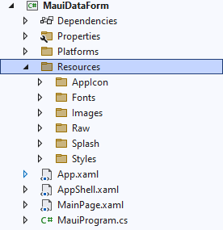
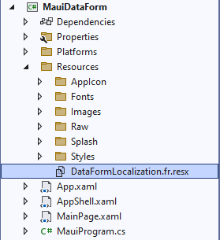
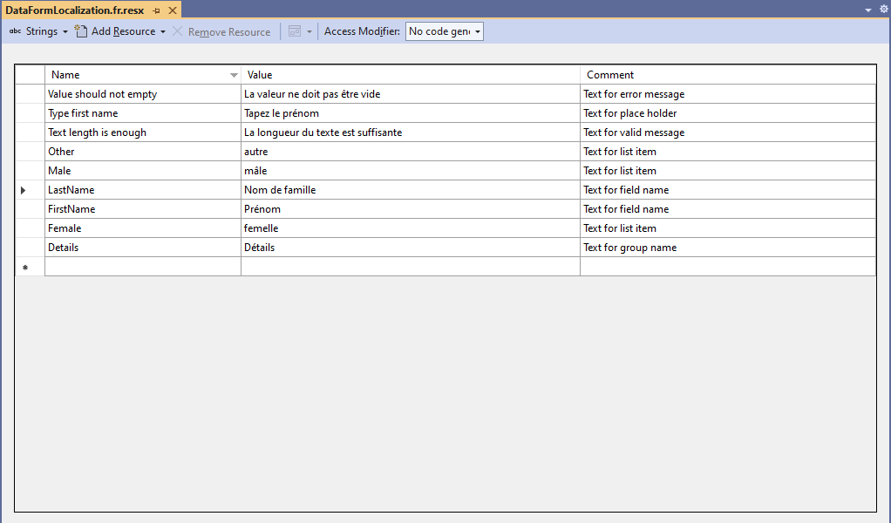

# Localization in .NET MAUI DataForm (SfDataForm)

Localization is the process of translating the application resources into different language for the specific cultures. The `SfDataForm` can be localized by adding `resource` file. 

You can localize the DataFormItem [Display](https://learn.microsoft.com/en-us/dotnet/api/system.componentmodel.dataannotations.displayattribute?view=net-7.0) attribute values and validation ([Required](https://docs.microsoft.com/en-us/dotnet/api/system.componentmodel.dataannotations.requiredattribute?view=netframework-4.8), [StringLength](https://docs.microsoft.com/en-us/dotnet/api/system.componentmodel.dataannotations.stringlengthattribute?view=netframework-4.8) ) attributes values by using `ResourceType` display attribute or using the `GenerateDataFormItem` event.

## Setting CurrentUICulture to the application

Application culture can be changed by setting `CurrentUICulture` in `App.xaml.cs` file.




using System.Globalization;

public partial class App : Application
{
	public App()
	{
		InitializeComponent();

		MainPage = new AppShell();
        var culture = new CultureInfo("fr");
        CultureInfo.CurrentUICulture = culture;
    }
}




N>
The required `resx` files with `Build Action` as `EmbeddedResource` (File name should contain culture code) into the `Resources` folder.

## Localize application level

To localize the `DataForm` based on `CurrentUICulture` using `resource` files, follow the below steps.

1. Right-click on the `Resources` folder in the application.

    

2. Select `Add` and then `NewItem`.
3. In Add New Item wizard, select the Resource File option and name the filename as `DataFormLocalization.<culture name>.resx.` For example, give the name as `DataFormLocalization.fr.resx` for French culture.

    

4. The culture name indicates the name of the language and country.

5. Now, select `Add` option to add the resource file in **Resources** folder.

    

6. Add the Name/Value pair in Resource Designer of `DataFormLocalization.fr.resx` file and change its corresponding value to corresponding culture.
 
    

## Localizing data form item display values

Here, the display attributes or data form item display values get localized based on culture from Localization Resource File (.Resx).

#### Using attribute

`ResourceType` [Display](https://learn.microsoft.com/en-us/dotnet/api/system.componentmodel.dataannotations.displayattribute?view=net-7.0) attribute specifies the Resources File (.Resx) which is used to localize the Display attribute of `Name`, `ShortName`, `GroupName`, `Prompt`, and `ItemsSource` values.




    [Display(Name = "First Name", ShortName = "Name", GroupName = "Details", Prompt = "Type first name", ResourceType = typeof(DataFormLocalization))]
    public string FirstName { get; set; }




#### Using event

You can also localize the DataFormItem `LabelText`, `PlaceHolderText`, `GroupName` in the `GenerateDataFormItem` event of SfDataForm by using the Resources (.Resx) file.

Here, string member of .resx file will be accessed through the class (in resxFilename.Designer.cs) which was auto-generated when .resx file created and static string members get localized using [ResourceManager](https://learn.microsoft.com/en-us/dotnet/api/system.resources.resourcemanager.getstring?view=net-7.0) based on culture.




[Display(Name = "First Name", GroupName = "Details", Prompt = "Type first name")]
public String FirstName { get; set; }

this.dataForm.GenerateDataFormItem += OnGenerateDataFormItem;

    private void OnGenerateDataFormItem(object sender, GenerateDataFormItemEventArgs e)
    {
        if (e.DataFormItem?.GroupName == "Details")
        {
            e.DataFormItem.GroupName = DataFormLocalization.GroupName;
        }
        if (e.DataFormItem.LabelText == "First Name")
        {
            e.DataFormItem.LabelText = DataFormLocalization.FirstName;
            e.DataFormItem.PlaceholderText = DataFormLocalization.PlaceHolder;
        }
    }




## Localizing validation error messages

Here, the validation (`Required`,`StringLength`) attributes or data form error messages get localized based on culture from Localization Resource File (.Resx).

#### Using attribute

The `Required` and `StringLength` attributes error message can be localized using [ErrorMessageResourceType](https://docs.microsoft.com/en-us/dotnet/api/system.componentmodel.dataannotations.validationattribute.errormessageresourcetype?redirectedfrom=MSDN&view=net-5.0#System_ComponentModel_DataAnnotations_ValidationAttribute_ErrorMessageResourceType ) and [ErrorMessageResourceName](https://docs.microsoft.com/en-us/dotnet/api/system.componentmodel.dataannotations.validationattribute.errormessageresourcetype?redirectedfrom=MSDN&view=net-5.0#System_ComponentModel_DataAnnotations_ValidationAttribute_ErrorMessageResourceType ) properties which are used to get a localized error messages from Localization Resource File (.Resx) based on culture.




    [Required(ErrorMessage = "Value should not be empty", ErrorMessageResourceName = "ErrorMessage", ErrorMessageResourceType = typeof(DataFormLocalization))]
    [StringLength(15, ErrorMessage = "Enter proper name", ErrorMessageResourceName ="ErrorMessageLength", ErrorMessageResourceType =typeof(DataFormLocalization))]
    public string Name { get; set; }




#### Using event

You can also localize the data form error message in the ` ValidateProperty` event of SfDataForm by using the Resources (.Resx) file.




    [DataFormDisplayOptions(ValidMessage = "Text length is enough")]
    [Required(ErrorMessage = "Enter proper name")]
    [StringLength(15, ErrorMessage = "Enter proper name")]
    public string Name { get; set; }

this.dataForm.ValidateProperty += DataForm_ValidateProperty;

    private void DataForm_ValidateProperty(object sender, DataFormValidatePropertyEventArgs e)
    {
        e.ErrorMessage = DataFormLocalization.ErrorMessage;
        e.ValidMessage = DataFormLocalization.ValidMessage;
    }




## Localizing DataForm List items

You can also localize DataForm List items (Picker, AutoComplete, RadioGroup, ComoboBox) ItemsSource using `ResourceType` [Display](https://learn.microsoft.com/en-us/dotnet/api/system.componentmodel.dataannotations.displayattribute?view=net-7.0) attribute and [SfDataForm.ItemsSourceProvider]




    [Display(ResourceType = typeof(DataFormLocalization))]
    public string Gender { get; set; }

    this.dataForm.RegisterEditor("Gender", DataFormEditorType.RadioGroup);
    this.dataForm.GenerateDataFormItem += OnGenerateDataFormItem;

    private void OnGenerateDataFormItem(object sender, GenerateDataFormItemEventArgs e)
    {
        if (e.DataFormItem?.FieldName == "Gender")
        {
            var list = new List<string>();
            list.Add("Male");
            list.Add("Female");
            list.Add("Other");
            (e.DataFormItem as DataFormRadioGroupItem).ItemsSource = list;            
        }
    }




Here, the radio group items source get localized based on culture from Localization Resource File (.Resx).