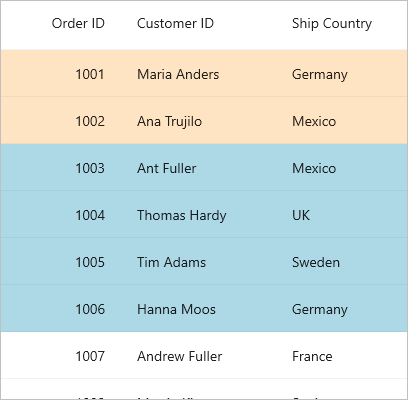
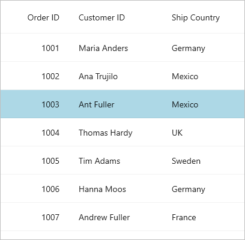
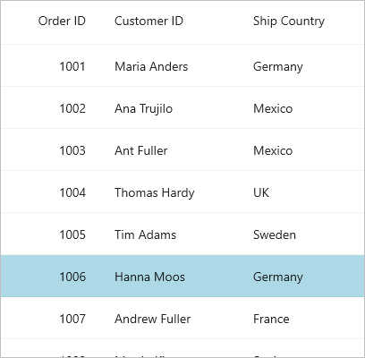
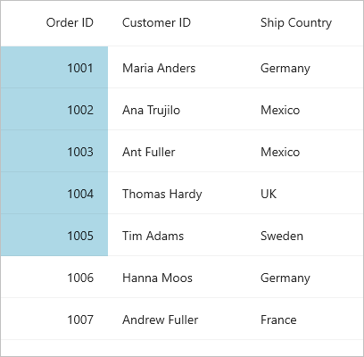

# Conditional Styling in .NET MAUI DataGrid (SfDataGrid)
The [SfDataGrid] (https://help.syncfusion.com/cr/maui/Syncfusion.Maui.DataGrid.html) allows to customize the style of the individual cells and rows based on the requirements. 

## Conditional row style
The data rows can be customized conditionally by writing the style with converter for [DataGridRow] (https://help.syncfusion.com/cr/maui/Syncfusion.Maui.DataGrid.DataGridRow.html) control. Its BindingContext is underlying datasource object.



<ContentPage xmlns:syncfusion="http://schemas.syncfusion.com/maui">
    <ContentPage.Resources>
        <local:ColorConverter x:Key="converter"/>
        
    </ContentPage.Resources>
</ContentPage>


public class ColorConverter : IValueConverter
{
    object IValueConverter.Convert(object value, Type targetType, object parameter, CultureInfo info)
    {
        var input = (value as OrderInfo).OrderID;
        if (input < 1003)
            return Colors.Bisque;
        else if (input < 1007)
            return Colors.LightBlue;
        else
            return Colors.White;
    }
    public object ConvertBack(object value, Type targetType, object parameter, CultureInfo culture)
    {
        throw new NotImplementedException();
    }
}



## How to style a particular row based on row index
Styling can be applied to a particular row based on RowIndex property by writing the style for [DataGridRow] (https://help.syncfusion.com/cr/maui/Syncfusion.Maui.DataGrid.DataGridRow.html) TargetType.



<ContentPage xmlns:syncfusion="http://schemas.syncfusion.com/maui">
    <ContentPage.Resources>
        <local:ColorConverter x:Key="converter"/>
        
    </ContentPage.Resources>
</ContentPage>


public class ColorConverter : IValueConverter
{
    object IValueConverter.Convert(object value, Type targetType, object parameter, CultureInfo info)
    {
        var dataGridRow = value as DataGridRow;
        var rowIndex = dataGridRow.DataRow.RowIndex;
        if (rowIndex == 3)
           return Colors.LightBlue;
        else
            return Colors.White;
    }
    public object ConvertBack(object value, Type targetType, object parameter, CultureInfo culture)
    {
        throw new NotImplementedException();
    }
}



## How to style a particular row based on RowData
Styling can be applied to a particular row based on RowData property by writing the style for [DataGridRow] (https://help.syncfusion.com/cr/maui/Syncfusion.Maui.DataGrid.DataGridRow.html) TargetType.



<ContentPage xmlns:syncfusion="http://schemas.syncfusion.com/maui">
    <ContentPage.Resources>
        <local:ColorConverter x:Key="converter"/>
        
    </ContentPage.Resources>
</ContentPage>


public class ColorConverter : IValueConverter
{
    object IValueConverter.Convert(object value, Type targetType, object parameter, CultureInfo info)
    {
        var dataGridRow = value as DataGridRow;
        var rowData = dataGridRow.DataRow.RowData;
        if(rowData == (dataGridRow.DataGrid.BindingContext as ViewModel).OrderInfoCollection[5])
            return Colors.LightBlue;
        else
            return Colors.White;
    }
    public object ConvertBack(object value, Type targetType, object parameter, CultureInfo culture)
    {
        throw new NotImplementedException();
    }
}



## Conditional style for particular column

The `SfDataGrid` provides the support to apply the conditional style for specific column by using [CellStyle] (https://help.syncfusion.com/cr/maui/Syncfusion.Maui.DataGrid.DataGridColumn.html#Syncfusion_Maui_DataGrid_DataGridColumn_CellStyleProperty) property in [DataGridColumn] (https://help.syncfusion.com/cr/maui/Syncfusion.Maui.DataGrid.DataGridColumn.html).

% tabs %}

<ContentPage xmlns:syncfusion="http://schemas.syncfusion.com/maui">
    <ContentPage.Resources>
        <local:ColorConverter x:Key="converter"/>
    </ContentPage.Resources>
    <ContentPage.Content>
        <syncfusion:SfDataGrid ItemsSource="{Binding OrderInfoCollection}">
            <syncfusion:SfDataGrid.Columns>
                <syncfusion:DataGridNumericColumn MappingName="OrderID" HeaderText="Order ID"  Format="d">
                    <syncfusion:DataGridNumericColumn.CellStyle>
                        
                    </syncfusion:DataGridNumericColumn.CellStyle>
                </syncfusion:DataGridNumericColumn>
            </syncfusion:SfDataGrid.Columns>
        </syncfusion:SfDataGrid>
    </ContentPage.Content>
</ContentPage>


public class ColorConverter : IValueConverter
{
    object IValueConverter.Convert(object value, Type targetType, object parameter, CultureInfo info)
    {
        if ((int)value < 1006)
            return Colors.LightBlue;
        else
            return Colors.White;
    }
    public object ConvertBack(object value, Type targetType, object parameter, CultureInfo culture)
    {
        throw new NotImplementedException();
    }
}



