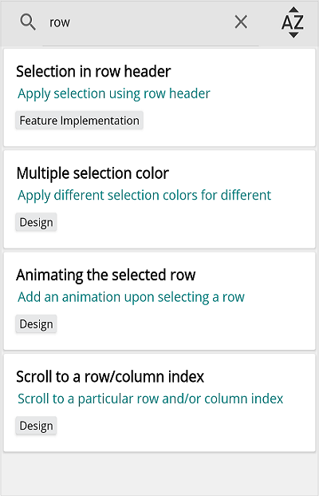
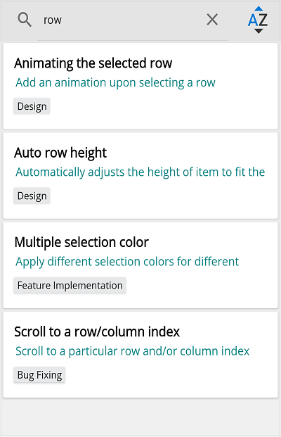

# Filtering in .NET MAUI ListView (SfListView)

This section explains how to filter the data and its related operations in the SfListView.

## Programmatic filtering

The [SfListView](https://help.syncfusion.com/cr/maui/Syncfusion.Maui.ListView.SfListView.html) supports data filtering by setting the [SfListView.DataSource.Filter](https://help.syncfusion.com/cr/maui/Syncfusion.DataSource.DataSource.html#Syncfusion_DataSource_DataSource_Filter) property. You have to call the [SfListView.DataSource.RefreshFilter](https://help.syncfusion.com/cr/maui/Syncfusion.DataSource.DataSource.html#Syncfusion_DataSource_DataSource_RefreshFilter) method after assigning the `Filter` property for refreshing the view.

The [FilterChanged](https://help.syncfusion.com/cr/maui/Syncfusion.DataSource.DataSource.html#Syncfusion_DataSource_DataSource_FilterChanged) event is raised once filtering is applied to the SfListView.

The `FilterContacts` method filters the data contains the filter text value. Assign the `FilterContacts` method to the `SfListView.DataSource.Filter` predicate to filter the `ContactName`. To apply filtering in the SfListView, follow the code example:



<ContentPage xmlns:syncfusion="clr-namespace:Syncfusion.Maui.ListView;assembly=Syncfusion.Maui.ListView">
 <Grid>
	 <Grid.RowDefinitions>
                <RowDefinition Height="Auto"/>
                <RowDefinition Height="Auto"/>
   </Grid.RowDefinitions>
      <SearchBar x:Name="filterText" HeightRequest="40"
           Placeholder="Search here to filter"
           TextChanged="OnFilterTextChanged" Grid.Row="0"/>
      <syncfusion:SfListView x:Name="listView" Grid.Row="1" ItemSize="60" ItemsSource="{Binding Items}"/>
  </Grid>
</ContentPage>


var grid = new Grid();

var searchBar = new SearchBar() { Placeholder = "Search here to filter" };
searchBar.TextChanged += OnFilterTextChanged;

var listView = new SfListView();
listView.ItemsSource = viewModel.Items;
listView.ItemSize = 60;

grid.Children.Add(searchBar);
grid.Children.Add(listView);



 
The following code example illustrates how to filter the data using `FilterContacts` method in the ViewModel:



SearchBar searchBar = null;
private void OnFilterTextChanged(object sender, TextChangedEventArgs e)
{
  searchBar = (sender as SearchBar);
  if (listView.DataSource != null)
  {
    this.listView.DataSource.Filter = FilterContacts;
    this.listView.DataSource.RefreshFilter();
  }
}
 
private bool FilterContacts(object obj)
{
  if (searchBar == null || searchBar.Text == null)
     return true;

  var taskInfo = obj as TaskInfo;
            return (taskInfo.Title.ToLower().Contains(searchBar.Text.ToLower())
                || taskInfo.Description.ToLower().Contains(searchBar.Text.ToLower()));
      return true;
  else
      return false;
}



The following screenshot shows the output rendered when the items are filtered:

### Filter based on multiple criteria

The [SfListView](https://help.syncfusion.com/cr/maui/Syncfusion.Maui.ListView.SfListView.html) allows filtering the items based on multiple criteria. The following code example explains how to  filter the data using multiple properties:



private bool FilterContacts(object obj)
{
  if (searchBar == null || searchBar.Text == null)
     return true;

  var taskInfo = obj as TaskInfo;
      return (taskInfo.Title.ToLower().Contains(searchBar.Text.ToLower())
                || taskInfo.Description.ToLower().Contains(searchBar.Text.ToLower()));
      return true;
  else
      return false;
}



## Getting the filtered data

You can get filtered items from the view and modify it in the [SfListView.DataSource.FilterChanged](https://help.syncfusion.com/cr/maui/Syncfusion.DataSource.DataSource.html#Syncfusion_DataSource_DataSource_FilterChanged) event. When filter is applied, the filtered items are available in the [SfListView.DataSource.DisplayItems](https://help.syncfusion.com/cr/maui/Syncfusion.DataSource.DataSource.html#Syncfusion_DataSource_DataSource_DisplayItems).



listView.DataSource.FilterChanged += DataSource_FilterChanged;
...
private void DataSource_FilterChanged(object sender, NotifyCollectionChangedEventArgs e)
{
   //TaskInfo is model class 
 ObservableCollection<TaskInfo> taskInfo = new ObservableCollection<TaskInfo>();
  // Get the filtered items
  var items = (sender as DataSource).DisplayItems;
  foreach (TaskInfo item in items)
     taskInfo.Add(item as TaskInfo);
}



## Clear filtering

The SfListView allows clearing the filters by setting the [DataSource.Filter](https://help.syncfusion.com/cr/maui/Syncfusion.DataSource.DataSource.html#Syncfusion_DataSource_DataSource_Filter) to null, and call the [DataSource.RefreshFilter](https://help.syncfusion.com/cr/maui/Syncfusion.DataSource.DataSource.html#Syncfusion_DataSource_DataSource_RefreshFilter) method.



listView.DataSource.Filter = null;
listView.DataSource.RefreshFilter();



## Sort the filtered items

The order of the filtered items can be rearranged in the `FilterChanged` event by adding [SortDescriptor](https://help.syncfusion.com/cr/maui/Syncfusion.DataSource.SortDescriptor.html). To sort the filtered items, follow the code example:



private void DataSource_FilterChanged(object sender, NotifyCollectionChangedEventArgs e)
{
  listView.Clear();
  listView.DataSource.SortDescriptors.Add(new SortDescriptor { PropertyName = "Title", 
                                                               Direction = ListSortDirection.Ascending });
  listView.RefreshView();
}



The following screenshot shows the output rendered when the filtered items are sorted:

