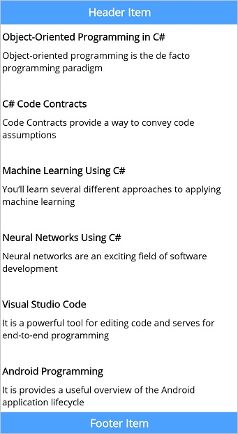

# Getting Started with .NET Maui ListView (SfListView)

This section provides a quick overview of how to get started with the .NET Maui ListView (SfListView) for Maui. Walk-through the entire process of creating the real world SfListView.

N> MAUI ListView is now available for iOS, Android, and MacCatalyst.

## Creating an application using the .NET MAUI ListView

 1. Create a new .NET MAUI application in Visual Studio.
 2. Syncfusion .NET MAUI components are available on [nuget.org](https://www.nuget.org/). To add SfListView to your project, open the NuGet package manager in Visual Studio, search for Syncfusion.Maui.ListView and then install it.
 3. Import the control namespace `Syncfusion.Maui.ListView` in XAML or C# code.
 4. Initialize the [SfListView](https://help.syncfusion.com/cr/maui/Syncfusion.Maui.ListView.html) control.
 



<ContentPage   
    . . .
    xmlns:syncfusion="clr-namespace:Syncfusion.Maui.ListView;assembly=Syncfusion.Maui.ListView">

    <syncfusion:SfListView />
</ContentPage>




using Syncfusion.Maui.ListView;
. . .

public partial class MainPage : ContentPage
{
    public MainPage()
    {
        InitializeComponent();
        SfListView listView = new SfListView();
        this.Content = listView;
    }
}




## Register the handler

To use this control inside an application, you must initialize the `SfListView` handler.



using Microsoft.Maui.Controls.Hosting;
using Microsoft.Maui.Controls.Xaml;
using Microsoft.Maui.Hosting;
using Syncfusion.Maui.ListView;
using Syncfusion.Maui.ListView.Handlers;
using Syncfusion.Maui.ListView.Hosting;

namespace GettingStarted
{
    public class MauiProgram 
    {
        public static MauiApp CreateMauiApp()
        {
            var builder = MauiApp.CreateBuilder();
            builder
                .UseMauiApp<App>()
                .ConfigureFonts(fonts =>
                {
                    fonts.AddFont("OpenSans-Regular.ttf", "OpenSansRegular");
                });

            builder.ConfigureSyncfusionListView();
            return builder.Build();
        }
    }
}
 


## Creating data model for the listview

Create a data model to bind it to the control. 

Create a simple data source in a new class file as shown in the following code example, and save it as BookInfo.cs file. 



public class BookInfo : INotifyPropertyChanged
{
    private string bookName;
    private string bookDesc;

    public string BookName
    {
        get { return bookName; }
        set
        {
            bookName = value;
            OnPropertyChanged("BookName");
        }
    }

    public string BookDescription
    {
        get { return bookDesc; }
        set
        {
            bookDesc = value;
            OnPropertyChanged("BookDescription");
        }
    }

    public event PropertyChangedEventHandler PropertyChanged;

    public void OnPropertyChanged(string name)
    {
        if (this.PropertyChanged != null)
           this.PropertyChanged(this, new PropertyChangedEventArgs(name));
    }
}
 



N> If you want your data model to respond to property changes, then implement [INotifyPropertyChanged](https://docs.microsoft.com/en-us/dotnet/api/system.componentmodel.inotifypropertychanged?view=net-6.0) interface in your model class.

Create a model repository class with `BookInfo` collection property initialized with required number of data objects in a new class file as shown in the following code example, and save it as BookInfoRepository.cs file:



public class BookInfoRepository
{
    private ObservableCollection<BookInfo> bookInfo;

    public ObservableCollection<BookInfo> BookInfo
    {
        get { return bookInfo; }
        set { this.bookInfo = value; }
    }

    public BookInfoRepository()
    {
        GenerateBookInfo();
    }

    internal void GenerateBookInfo()
    {
        bookInfo = new ObservableCollection<BookInfo>();
        bookInfo.Add(new BookInfo() { BookName = "Object-Oriented Programming in C#", BookDescription = "Object-oriented programming is a programming paradigm based on the concept of objects" });
        bookInfo.Add(new BookInfo() { BookName = "C# Code Contracts", BookDescription = "Code Contracts provide a way to convey code assumptions" });
        bookInfo.Add(new BookInfo() { BookName = "Machine Learning Using C#", BookDescription = "You will learn several different approaches to applying machine learning" });
        bookInfo.Add(new BookInfo() { BookName = "Neural Networks Using C#", BookDescription = "Neural networks are an exciting field of software development" });
        bookInfo.Add(new BookInfo() { BookName = "Visual Studio Code", BookDescription = "It is a powerful tool for editing code and serves for end-to-end programming" });
        bookInfo.Add(new BookInfo() { BookName = "Android Programming", BookDescription = "It provides a useful overview of the Android application life cycle" });
        bookInfo.Add(new BookInfo() { BookName = "iOS Succinctly", BookDescription = "It is for developers looking to step into frightening world of iPhone" });
        bookInfo.Add(new BookInfo() { BookName = "Visual Studio 2015", BookDescription = "The new version of the widely-used integrated development environment" });
        bookInfo.Add(new BookInfo() { BookName = "Xamarin.Forms", BookDescription = "It creates mappings from its C# classes and controls directly" });
        bookInfo.Add(new BookInfo() { BookName = "Windows Store Apps", BookDescription = "Windows Store apps present a radical shift in Windows development" });
    }
}




## Binding data to the listview

To bind the data source of the SfListView, set the [SfListView.ItemsSource](https://help.syncfusion.com/cr/maui/Syncfusion.Maui.ListView.SfListView.html#Syncfusion_Maui_ListView_SfListView_ItemsSource) property as follows. You can bind the data source of the `SfListView` either from XAML or code.

The following code example binds the previously created collection to the `SfListView.ItemsSource` property:



<ContentPage xmlns="http://schemas.microsoft.com/dotnet/2021/maui"
             xmlns:x="http://schemas.microsoft.com/winfx/2009/xaml"
             xmlns:syncfusion="clr-namespace:Syncfusion.Maui.ListView;assembly=Syncfusion.Maui.ListView"
             xmlns:local="clr-namespace:GettingStarted;assembly=GettingStarted"
             x:Class="GettingStarted.MainPage">
  <ContentPage.BindingContext>
    <local:BookInfoRepository />
  </ContentPage.BindingContext>
   <syncfusion:SfListView x:Name="listView" 
                   ItemsSource="{Binding BookInfo}" />
</ContentPage>


BookInfoRepository viewModel = new BookInfoRepository ();
listView.ItemsSource = viewModel.BookInfo; 



## Defining an item template
 
 By defining the [SfListView.ItemTemplate](https://help.syncfusion.com/cr/maui/Syncfusion.Maui.ListView.SfListView.html#Syncfusion_Maui_ListView_SfListView_ItemTemplate) of the SfListView, a custom user interface(UI) can be achieved to display the data items. 
 


<ContentPage xmlns:syncfusion="clr-namespace:Syncfusion.Maui.ListView;assembly=Syncfusion.Maui.ListView">
  <syncfusion:SfListView x:Name="listView" 
                   ItemsSource="{Binding BookInfo}"
                   ItemSize="100">
    <syncfusion:SfListView.ItemTemplate>
        <DataTemplate>
        <Grid Padding="10">
            <Grid.RowDefinitions>
            <RowDefinition Height="0.4*" />
            <RowDefinition Height="0.6*" />
            </Grid.RowDefinitions>
            <Label Text="{Binding BookName}" FontAttributes="Bold" TextColor="Teal" FontSize="21" />
            <Label GridLayout.Row="1" Text="{Binding BookDescription}" TextColor="Teal" FontSize="15"/>
        </Grid>
        </DataTemplate>
    </syncfusion:SfListView.ItemTemplate>
  </syncfusion:SfListView>
</ContentPage>


using Microsoft.Maui.Controls;
using Syncfusion.Maui.ListView;
using System;

namespace GettingStarted
{
    public class App : Application
    {
        SfListView listView;
        public App()
        {
            BookInfoRepository viewModel = new BookInfoRepository ();
            listView = new SfListView();
            listView.ItemSize = 100;
            listView.ItemsSource = viewModel.BookInfo;
            listView.ItemTemplate = new DataTemplate(() => {
                var grid = new Grid();
                grid.RowDefinitions.Add(new RowDefinition());
                grid.RowDefinitions.Add(new RowDefinition());
                var bookName = new Label { FontAttributes = FontAttributes.Bold, BackgroundColor = Colors.Teal, FontSize = 21 };
                bookName.SetBinding(Label.TextProperty, new Binding("BookName"));
                var bookDescription = new Label { BackgroundColor = Colors.Teal, FontSize = 15 };
                bookDescription.SetBinding(Label.TextProperty, new Binding("BookDescription"));

                grid.Children.Add(bookName);
                grid.Children.Add(bookDescription);
                grid.SetRow(bookName, 0);
                grid.SetRow(bookDescription, 1);

                return grid;
            });
            MainPage = new ContentPage { Content = listView };
        }
    }
} 



You can also download the entire source code of this demo [here](https://github.com/SyncfusionExamples/gettingstarted-listview-.net-maui).

## Layouts

SfListView supports different layouts such as linear and grid layouts. The linear layout arranges the items in a single column, whereas the grid layout arranges the items in a predefined number of columns defined by the [SpanCount](https://help.syncfusion.com/cr/maui/Syncfusion.Maui.ListView.GridLayout.html#Syncfusion_Maui_ListView_GridLayout_SpanCount) property of [GridLayout](https://help.syncfusion.com/cr/maui/Syncfusion.Maui.ListView.GridLayout.html). 

The [SfListView.ItemsLayout](https://help.syncfusion.com/cr/maui/Syncfusion.Maui.ListView.SfListView.html#Syncfusion_Maui_ListView_SfListView_ItemsLayout) property is used to define the layout of the SfListView. [LinearLayout](https://help.syncfusion.com/cr/maui/Syncfusion.Maui.ListView.LinearLayout.html) is default layout of this control.



<ContentPage xmlns:syncfusion="clr-namespace:Syncfusion.Maui.ListView;assembly=Syncfusion.Maui.ListView">
 <syncfusion:SfListView x:Name="listView" 
                   ItemsSource="{Binding BookInfo}"
                   ItemSize="100">
    <syncfusion:SfListView.ItemsLayout>
      <syncfusion:GridLayout SpanCount="3" />
    </syncfusion:SfListView.ItemsLayout>
  </syncfusion:SfListView>
</ContentPage>


listView.ItemsLayout = new GridLayout() { SpanCount = 3 };



## DataSource

The [DataSource](https://help.syncfusion.com/cr/maui/Syncfusion.DataSource.DataSource.html) gets raw data and performs data operations such as sorting, filtering, and grouping in SfListView. The data source of the ListView is set by using the `ItemsSource` attribute.



<ContentPage xmlns="http://schemas.microsoft.com/dotnet/2021/maui"
             xmlns:x="http://schemas.microsoft.com/winfx/2009/xaml"
             xmlns:syncfusion="clr-namespace:Syncfusion.Maui.ListView;assembly=Syncfusion.Maui.ListView"
             xmlns:data="clr-namespace:Syncfusion.Maui.DataSource;assembly=Syncfusion.Maui.DataSource"             
             xmlns:local="clr-namespace:GettingStarted;assembly=GettingStarted"
             x:Class="GettingStarted.MainPage">             
             
  <syncfusion:SfListView x:Name="listView"  ItemsSource="{Binding DataSource.DisplayItems}" >
  </syncfusion:SfListView>
</ContentPage>


 SfListView listView = new SfListView();
 DataSource dataSource = new DataSource();
 dataSource.Source = ViewModel.BookInfo;
 listView.DataSource = dataSource;
 listView.DataSource.Refresh();



## Sorting

The SfListView allows you to sort its data by using the [SfListView.DataSource.SortDescriptors](https://help.syncfusion.com/cr/maui/Syncfusion.DataSource.DataSource.html#Syncfusion_DataSource_DataSource_SortDescriptors) property. Create a [SortDescriptor](https://help.syncfusion.com/cr/maui/Syncfusion.DataSource.SortDescriptor.html) for the property to be sorted, and add it to the `DataSource.SortDescriptors` collection.

Refresh the view by calling the [SfListView.RefreshView](https://help.syncfusion.com/cr/maui/Syncfusion.Maui.ListView.SfListView.html#Syncfusion_Maui_ListView_SfListView_RefreshView) method.

SortDescriptor object holds the following three properties:

 * [PropertyName](https://help.syncfusion.com/cr/maui/Syncfusion.DataSource.SortDescriptor.html#Syncfusion_DataSource_SortDescriptor_PropertyName): Describes the name of the sorted property.
 * [Direction](https://help.syncfusion.com/cr/maui/Syncfusion.DataSource.SortDescriptor.html#Syncfusion_DataSource_SortDescriptor_Direction): Describes an object of type [ListSortDirection](https://help.syncfusion.com/cr/maui/Syncfusion.DataSource.ListSortDirection.html) that defines the sorting direction.
 * [Comparer](https://help.syncfusion.com/cr/maui/Syncfusion.DataSource.SortDescriptor.html#Syncfusion_DataSource_SortDescriptor_Comparer): Describes a comparer that will be applied when sorting.
 


<ContentPage xmlns="http://schemas.microsoft.com/dotnet/2021/maui"
             xmlns:x="http://schemas.microsoft.com/winfx/2009/xaml"
             xmlns:syncfusion="clr-namespace:Syncfusion.Maui.ListView;assembly=Syncfusion.Maui.ListView"
             xmlns:data="clr-namespace:Syncfusion.Maui.DataSource;assembly=Syncfusion.Maui.DataSource"            
             xmlns:local="clr-namespace:GettingStarted;assembly=GettingStarted"
             x:Class="GettingStarted.MainPage">             
             
  <syncfusion:SfListView x:Name="listView">
    <syncfusion:SfListView.DataSource>
      <data:DataSource>
        <data:DataSource.SortDescriptors>
          <data:SortDescriptor PropertyName="BookName" Direction="Ascending"/>
        </data:DataSource.SortDescriptors>
      </data:DataSource>
    </syncfusion:SfListView.DataSource>
  </syncfusion:SfListView>
</ContentPage>


 listView.DataSource.SortDescriptors.Add(new SortDescriptor()
 {
   PropertyName = "BookName",
   Direction = ListSortDirection.Ascending,
 }); 
 listView.RefreshView();



## Filtering

The SfListView supports you to filter the records in view by setting predicate to the [SfListView.DataSource.Filter](https://help.syncfusion.com/cr/maui/Syncfusion.DataSource.DataSource.html#Syncfusion_DataSource_DataSource_Filter) property. Call the [DataSource.RefreshFilter](https://help.syncfusion.com/cr/maui/Syncfusion.DataSource.DataSource.html#Syncfusion_DataSource_DataSource_RefreshFilter) method after assigning the `Filter` property for refreshing the view.

To filter the items based on the Title property of the underlying data by using `FilterContacts` method, follow the code example:
 


<ContentPage xmlns:syncfusion="clr-namespace:Syncfusion.Maui.ListView;assembly=Syncfusion.Maui.ListView">
    <Grid>
	 <Grid.RowDefinitions>
           <RowDefinition Height="Auto"/>
           <RowDefinition Height="Auto"/>
     </Grid.RowDefinitions>
      <SearchBar x:Name="filterText" HeightRequest="40"
           Placeholder="Search here to filter"
           TextChanged="OnFilterTextChanged" GridLayout.Row="0"/>
      <syncfusion:SfListView x:Name="listView" GridLayout.Row="1" ItemsSource="{Binding BookInfo}"/>
    </Grid>
  </ContentPage>


var grid = new Grid();
grid.RowDefinitions.Add(new RowDefinition());
grid.RowDefinitions.Add(new RowDefinition());
var viewModel = new BookInfoRepository ();

var searchBar = new SearchBar() { Placeholder = "Search here to filter" };
searchBar.TextChanged += OnFilterTextChanged;

listView = new SfListView();
listView.ItemsSource = viewModel.BookInfo;

grid.Children.Add(searchBar);
grid.Children.Add(listView);
grid.SetRow(searchBar, 0);
grid.SetRow(listView, 1);
...
private void OnFilterTextChanged(object sender, TextChangedEventArgs e)
{
  searchBar = (sender as SearchBar);
  if (listView.DataSource != null)
  {
     this.listView.DataSource.Filter = FilterContacts;
     this.listView.DataSource.RefreshFilter();
  }
}

private bool FilterContacts(object obj)
{
  if (searchBar == null || searchBar.Text == null)
    return true;

  var bookInfo = obj as BookInfo;
  if (bookInfo.BookName.ToLower().Contains(searchBar.Text.ToLower())
      || bookInfo.BookDescription.ToLower().Contains(searchBar.Text.ToLower()))
      return true;
  else
      return false;
}



## Grouping

By using the [SfListView.DataSource.GroupDescriptors](https://help.syncfusion.com/cr/maui/Syncfusion.DataSource.DataSource.html#Syncfusion_DataSource_DataSource_GroupDescriptors) property, the SfListView can display the items in a group. Create [GroupDescriptor](https://help.syncfusion.com/cr/maui/Syncfusion.DataSource.GroupDescriptor.html) for the property to be grouped, and add it to the `DataSource.GroupDescriptors` collection.

`GroupDescriptor` object holds the following properties:

 * [PropertyName](https://help.syncfusion.com/cr/maui/Syncfusion.DataSource.GroupDescriptor.html#Syncfusion_DataSource_GroupDescriptor_PropertyName): Describes the name of the property to be grouped.
 * [KeySelector](https://help.syncfusion.com/cr/maui/Syncfusion.DataSource.GroupDescriptor.html#Syncfusion_DataSource_GroupDescriptor_KeySelector): Describes selector to return the group key.
 * [Comparer](https://help.syncfusion.com/cr/maui/Syncfusion.DataSource.GroupDescriptor.html#Syncfusion_DataSource_GroupDescriptor_Comparer): Describes the comparer that will be applied when sorting.

It also supports you to stick the group header by enabling the [SfListView.IsStickyGroupHeader](https://help.syncfusion.com/cr/maui/Syncfusion.Maui.ListView.SfListView.html#Syncfusion_Maui_ListView_SfListView_IsStickyGroupHeader) property.



<ContentPage  xmlns:syncfusion="clr-namespace:Syncfusion.Maui.ListView;assembly=Syncfusion.Maui.ListView"
              xmlns:data="clr-namespace:Syncfusion.Maui.DataSource;assembly=Syncfusion.Maui.DataSource">
  <syncfusion:SfListView x:Name="listView">
    <syncfusion:SfListView.DataSource>
      <data:DataSource>
        <data:DataSource.GroupDescriptors>
          <data:GroupDescriptor PropertyName="BookName"/>
        </data:DataSource.GroupDescriptors>
      </data:DataSource>
    </syncfusion:SfListView.DataSource>
  </syncfusion:SfListView>
</ContentPage>


 listView.DataSource.GroupDescriptors.Add(new GroupDescriptor()
 {
   PropertyName = "BookName",
 });



## Selection

The SfListView allows selecting the item by setting the [SfListView.SelectionMode](https://help.syncfusion.com/cr/maui/Syncfusion.Maui.ListView.SfListView.html#Syncfusion_Maui_ListView_SfListView_SelectionMode) property. Set the `SfListView.SelectionMode` property to single, multiple, and none based on the requirements. Information about the selected item can be tracked using the [SfListView.SelectedItem](https://help.syncfusion.com/cr/maui/Syncfusion.Maui.ListView.SfListView.html#Syncfusion_Maui_ListView_SfListView_SelectedItem) and [SfListView.SelectedItems](https://help.syncfusion.com/cr/maui/Syncfusion.Maui.ListView.SfListView.html#Syncfusion_Maui_ListView_SfListView_SelectedItems) properties. It also allows changing the selection highlight color by using the [SfListView.SelectionBackground](https://help.syncfusion.com/cr/maui/Syncfusion.Maui.ListView.SfListView.html#Syncfusion_Maui_ListView_SfListView_SelectionBackground).

The gesture type can be changed to select the item by setting the [SfListView.SelectionGesture](https://help.syncfusion.com/cr/maui/Syncfusion.Maui.ListView.SfListView.html#Syncfusion_Maui_ListView_SfListView_SelectionGesture) property. Set the `SfListView.SelectionGesture` property to Tap, DoubleTap, and Hold based on the requirements.

The [SelectionChanging](https://help.syncfusion.com/cr/maui/Syncfusion.Maui.ListView.SfListView.html#Syncfusion_Maui_ListView_SfListView_SelectionChanging) and [SelectionChanged](https://help.syncfusion.com/cr/maui/Syncfusion.Maui.ListView.SfListView.html#Syncfusion_Maui_ListView_SfListView_SelectionChanged) events of the SfListView can be used to handle selection operations.
 


<ContentPage xmlns:syncfusion="clr-namespace:Syncfusion.Maui.ListView;assembly=Syncfusion.Maui.ListView">
  <syncfusion:SfListView x:Name="listView" 
                 SelectionMode="Single"
                 SelectionGesture="Tap"
                 SelectionBackgroundColor="#E4E4E4"/>}
</ContentPage>


listView.SelectionMode = SelectionMode.Single;
listView.SelectionGesture = TouchGesture.Tap;
listView.SelectionBackgroundColor = Colors.FromHex("#E4E4E4");



## Header and Footer

The SfListView allows setting the header and footer to the user interface(UI) view by setting the DataTemplate to the [HeaderTemplate](https://help.syncfusion.com/cr/maui/Syncfusion.Maui.ListView.SfListView.html#Syncfusion_Maui_ListView_SfListView_HeaderTemplate) and [FooterTemplate](https://help.syncfusion.com/cr/maui/Syncfusion.Maui.ListView.SfListView.html#Syncfusion_Maui_ListView_SfListView_FooterTemplate).

The header and footer can be handled as scrollable or sticky to the view by enabling or disabling the [IsStickyHeader](https://help.syncfusion.com/cr/maui/Syncfusion.Maui.ListView.SfListView.html#Syncfusion_Maui_ListView_SfListView_IsStickyHeader) and [IsStickyFooter](https://help.syncfusion.com/cr/maui/Syncfusion.Maui.ListView.SfListView.html#Syncfusion_Maui_ListView_SfListView_IsStickyFooter) properties.
 


<ContentPage xmlns:syncfusion="clr-namespace:Syncfusion.Maui.ListView;assembly=Syncfusion.Maui.ListView">
<syncfusion:SfListView x:Name="listView"
                 ItemsSource="{Binding InboxInfo}"
                 IsStickyHeader="true"
                 IsStickyFooter="true">
  <syncfusion:SfListView.HeaderTemplate>
    <DataTemplate>
      <Grid BackgroundColor="#4CA1FE" HeightRequest="45">
        <Label Text="Inbox" FontAttributes="Bold" FontSize="18" TextColor="White" />
      </Grid>
    </DataTemplate>
  </syncfusion:SfListView.HeaderTemplate>
  <syncfusion:SfListView.FooterTemplate>
    <DataTemplate>
      <Grid BackgroundColor="#DC595F">
        <Grid.ColumnDefinitions>
          <ColumnDefinition />
          <ColumnDefinition />
        </Grid.ColumnDefinitions>
        <Image GridLayout.Column="0" Source="Edit.png" />
        <Image GridLayout.Column="1" Source="Delete.png" />
      </Grid>
    </DataTemplate>
  </syncfusion:SfListView.FooterTemplate>
  </syncfusion:SfListView>
</ContentPage>


ViewModel viewModel = new ViewModel ();
listView.ItemsSource = viewModel.InboxInfo; 
listView.IsStickyHeader = true;
listView.IsStickyFooter = true;
listView.HeaderTemplate = new DataTemplate(() =>
{
  var grid = new Grid();
  grid.ColumnDefinitions.Add(new ColumnDefinition());
  grid.ColumnDefinitions.Add(new ColumnDefinition());
  grid.BackgroundColor = Color.FromHex("#4CA1FE");
  var headerLabel = new Label { BackgroundColor = Colors.White, FontSize = 18,
                                FontAttributes = FontAttributes.Bold };
  headerLabel.Text = "Inbox";
  grid.Children.Add(headerLabel);
  return grid;
});
listView.FooterTemplate = new DataTemplate(() =>
{
  var grid = new Grid();
  grid.ColumnDefinitions.Add(new ColumnDefinition());
  grid.ColumnDefinitions.Add(new ColumnDefinition());
  grid.BackgroundColor = Colors.FromHex("#DC595F");
  var editImage = new Image();
  editImage.Source = "Edit.png";
  var deleteImage = new Image();
  deleteImage.Source = "Delete.png";
  grid.Children.Add(editImage);
  grid.Children.Add(deleteImage);
  grid.SetColumn(editImage, 0);
  grid.SetColumn(deleteImage, 1);
  return grid;
});



