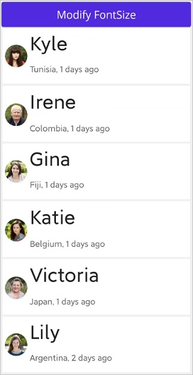
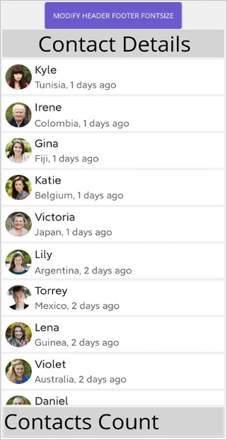

# Item Size Customization in .NET MAUI ListView (SfListView)

This section explains how to customize the item size in the `.NET MAUI ListView` (SfListView).

## Customize item size of a particular item on-demand

The `SfListView` allows customizing the size of the item on-demand by the [SfListView.QueryItemSize](https://help.syncfusion.com/cr/maui/Syncfusion.Maui.ListView.SfListView.html#Syncfusion_Maui_ListView_SfListView_QueryItemSize) event using the item index. This event is raised whenever items come to view and triggered with [QueryItemSizeEventArgs](https://help.syncfusion.com/cr/maui/Syncfusion.Maui.ListView.QueryItemSizeEventArgs.html).

The `SfListView.QueryItemSize` event provides the following properties in their arguments:

 * [ItemIndex](https://help.syncfusion.com/cr/maui/Syncfusion.Maui.ListView.QueryItemSizeEventArgs.html#Syncfusion_Maui_ListView_QueryItemSizeEventArgs_ItemIndex): Identifies a particular item in the `SfListView`. 
 * [ItemData](https://help.syncfusion.com/cr/maui/Syncfusion.Maui.ListView.QueryItemSizeEventArgs.html#Syncfusion_Maui_ListView_QueryItemSizeEventArgs_ItemData): Identifies the underlying data bound to that item.
 * [ItemSize](https://help.syncfusion.com/cr/maui/Syncfusion.Maui.ListView.QueryItemSizeEventArgs.html#Syncfusion_Maui_ListView_QueryItemSizeEventArgs_ItemSize): Identifies size of the queried item. For vertical orientation, it will be considered as the item height. For horizontal orientation, it will be considered as the item width.
 * [ItemType](https://help.syncfusion.com/cr/maui/Syncfusion.Maui.ListView.QueryItemSizeEventArgs.html#Syncfusion_Maui_ListView_QueryItemSizeEventArgs_ItemType): Identifies the item type of the queried item.
 * [Handled](https://help.syncfusion.com/cr/maui/Syncfusion.Maui.ListView.QueryItemSizeEventArgs.html#Syncfusion_Maui_ListView_QueryItemSizeEventArgs_Handled): Decides whether the specified size can be set to the item or not. The default value is `false`. When this property is not set, the decided size will not set to the item.



this.listView.QueryItemSize += ListView_QueryItemSize;

private void ListView_QueryItemSize(object sender, Syncfusion.Maui.ListView.QueryItemSizeEventArgs e)
{
    if(e.ItemIndex == 1)
    {
        e.ItemSize = 300;
        e.Handled = true;
    }
}



## AutoFit the items based on the content

The `SfListView` allows dynamically adjusting size of items based on the content loaded in the [SfListView.ItemTemplate](https://help.syncfusion.com/cr/maui/Syncfusion.Maui.ListView.SfListView.html#Syncfusion_Maui_ListView_SfListView_ItemTemplate) by defining the [SfListView.AutoFitMode](https://help.syncfusion.com/cr/maui/Syncfusion.Maui.ListView.SfListView.html#Syncfusion_Maui_ListView_SfListView_AutoFitMode) property.

The control contains the following three types of `AutoFitMode`:

 * [Height](https://help.syncfusion.com/cr/maui/Syncfusion.Maui.ListView.AutoFitMode.html#Syncfusion_Maui_ListView_AutoFitMode_Height): AutoFit the items based on the content.
 * [DynamicHeight](https://help.syncfusion.com/cr/maui/Syncfusion.Maui.ListView.AutoFitMode.html#Syncfusion_Maui_ListView_AutoFitMode_DynamicHeight): If the size of the content changes at run time, autofit the items based on it.
 * [None](https://help.syncfusion.com/cr/maui/Syncfusion.Maui.ListView.AutoFitMode.html#Syncfusion_Maui_ListView_AutoFitMode_None): [SfListView.ItemSize](https://help.syncfusion.com/cr/maui/Syncfusion.Maui.ListView.SfListView.html#Syncfusion_Maui_ListView_SfListView_ItemSize)  is used to layout the `SfListView` items.

 N> If you define any size manually to the view loaded in [SfListView.ItemTemplate](https://help.syncfusion.com/cr/maui/Syncfusion.Maui.ListView.SfListView.html#Syncfusion_Maui_ListView_SfListView_ItemTemplate), the `SfListView` will return that size as the item size for each item.

### AutoFitMode as Height

AutoFit considers height of the item when [SfListView.Orientation](https://help.syncfusion.com/cr/maui/Syncfusion.Maui.ListView.SfListView.html#Syncfusion_Maui_ListView_SfListView_Orientation) is set to `Vertical`. When `SfListView.Orientation` is set to `Horizontal`, it considers width of the item. The [SfListView.GridLayout](https://help.syncfusion.com/cr/maui/Syncfusion.Maui.ListView.GridLayout.html) AutoFits all the items in a row and takes the maximum item height of the row and applies to all other items in the row.



<ContentPage xmlns:syncfusion="clr-namespace:Syncfusion.Maui.ListView;assembly=Syncfusion.Maui.ListView">
  <syncfusion:SfListView x:Name="listView" 
                    ItemSize="200"
                    AutoFitMode="Height"
                    ItemsSource="{Binding BookInfo}" />
</ContentPage>


listView.AutoFitMode = AutoFitMode.Height; 



### AutoFitMode as DynamicHeight

AutoFit considers height of the item when `SfListView.Orientation` is set to `Vertical`. When `SfListView.Orientation` is set to `Horizontal`, it considers width of the item. The `SfListView.GridLayout` autofit all the items in a row and takes the maximum item height of the row and applies to all other items in the row.



<ContentPage xmlns:syncfusion="clr-namespace:Syncfusion.Maui.ListView;assembly=Syncfusion.Maui.ListView">
  <syncfusion:SfListView x:Name="listView" 
                    ItemSize="200"
                    AutoFitMode="DynamicHeight"
                    ItemsSource="{Binding ContactsInfo}" />
</ContentPage>


listView.AutoFitMode = AutoFitMode.DynamicHeight; 



## Updating the list-view item size based on font at runtime

.NET MAUI ListView (SfListView) allows you to resize the item size based on the change in font size of the label element at runtime when `SfListView.AutoFitMode` is [DynamicHeight](https://help.syncfusion.com/cr/maui/Syncfusion.Maui.ListView.AutoFitMode.html#Syncfusion_Maui_ListView_AutoFitMode_DynamicHeight).



<ContentPage xmlns:syncfusion="clr-namespace:Syncfusion.Maui.ListView;assembly=Syncfusion.Maui.ListView">       
 <Grid>
    <Grid.RowDefinitions>
        <RowDefinition Height="50"/>
        <RowDefinition Height="*"/>
    </Grid.RowDefinitions>
    <Button Text="Modify FontSize" Clicked="Button_Clicked"/>
    <syncfusion:SfListView x:Name="listView"  
                ItemSpacing="2"
                GridLayout.Row="1"
                ItemsSource="{Binding Items}" 
                BackgroundColor="#FFE8E8EC"
                AutoFitMode="DynamicHeight"
                ItemSize="60">
        <syncfusion:SfListView.ItemTemplate>
            <DataTemplate>
                <Grid x:Name="grid" RowSpacing="1">
                    <Grid Grid.Column="0">
                        <Image HeightRequest="45" Margin="5,0,0,0" WidthRequest="45" Source="{Binding ContactImage}" VerticalOptions="Center" HorizontalOptions="Center" />
                    </Grid>
                    <Grid Grid.Column="1" RowSpacing="1" Padding="5" VerticalOptions="Center">
                        <Label LineBreakMode="NoWrap"
                            TextColor="#474747"
                            FontSize="{Binding BindingContext.FontSize, Source={x:Reference Name=listView}}"
                            Text="{Binding ContactName}">
                        </Label>
                        <Label Grid.Row="1" 
                             FontSize="13"
                             TextColor="#474747"
                             LineBreakMode="NoWrap"
                             Text="{Binding CallTime}"/>
                    </Grid>
                </Grid>
            </DataTemplate>
        </syncfusion:SfListView.ItemTemplate>
    </syncfusion:SfListView>  
</Grid>              
</ContentPage>


private void Button_Clicked(object sender, EventArgs e)
{
    ViewModel.FontSize += 25;
}



## Updating the Header and Footer height based on font at runtime

`SfListView` allows you to resize the `Header` and `Footer` item sizes based on the change in font size of the label element at runtime by calling [RefreshItem](https://help.syncfusion.com/cr/maui/Syncfusion.Maui.ListView.SfListView.html#Syncfusion_Maui_ListView_SfListView_RefreshItem_System_Int32_System_Int32_System_Boolean_) method asynchronously when `SfListView.AutoFitMode` is set to `Height`.



<ContentPage xmlns:syncfusion="clr-namespace:Syncfusion.Maui.ListView;assembly=Syncfusion.Maui.ListView">       
 <Grid>
    <Grid.RowDefinitions>
        <RowDefinition Height="50"/>
        <RowDefinition Height="*"/>
    </Grid.RowDefinitions>
    <Button Text="Change FontSize" Command="{Binding ResizeHeaderFooterCommand}" CommandParameter="{x:Reference listView}"/>
    <syncfusion:SfListView x:Name="listView" 
                ItemsSource="{Binding Contacts}"
                BackgroundColor="White"
                AutoFitMode="Height">
                <syncfusion:SfListView.HeaderTemplate>
                    <DataTemplate>
                        <ViewCell>
                            <Grid>
                                <Label Text="Contact Details"
                                       FontSize="{Binding BindingContext.FontSize, Source={x:Reference listView}}"/>
                            </Grid>
                        </ViewCell>
                    </DataTemplate>
                </syncfusion:SfListView.HeaderTemplate>
                <syncfusion:SfListView.FooterTemplate>
                    <DataTemplate>
                        <ViewCell>
                            <Grid >
                                <Label Text="{Binding contactsinfo.Count}" HorizontalOptions="Start" TextColor="Black" Grid.Column="1" FontSize="{Binding BindingContext.FontSize, Source={x:Reference listView}}"/>
                                <Label Grid.Column="0" HorizontalOptions="End" Text="Contacts Count" TextColor="Black" FontSize="{Binding BindingContext.FontSize, Source={x:Reference listView}}"/>
                            </Grid>
                        </ViewCell>
                    </DataTemplate>
                </syncfusion:SfListView.FooterTemplate>
    </syncfusion:SfListView>                
</ContentPage>


namespace SfListViewSample
{
    public class ContactsViewModel : INotifyPropertyChanged
    {
        public Command ResizeHeaderFooterCommand { get; set; }
        public ContactsViewModel()
        {
           ResizeHeaderFooterCommand = new Command(ResizeHeaderFooter);
        }
        private void ResizeHeaderFooter(object obj)
        {
            list = obj as SfListView;
            var maxFont = 40;
            var minFont = 18;
            if (FontSize >= maxFont)
            {
                FontSize = minFont;
            }
            else
            {
                FontSize += 10;
            }
            list.RefreshItem(-1, -1, true);
        }
    }
}       



## Load images with autofit mode

By default, the image is not loaded with the actual size in `AutoFitMode` because it measures the size before the layout. As a result, the size of the child view changes cannot be found from the parent view. It is a known issue with `ListView`, but it can be fixed by calling the `RefreshItem` method in the `Loaded` event of `ListView`.



<ContentPage xmlns:syncfusion="clr-namespace:Syncfusion.Maui.ListView;assembly=Syncfusion.Maui.ListView">
    <ContentPage.Content>
        <Grid>
            <syncfusion:SfListView x:Name="listView" 
                                   AutoFitMode="Height"
                                   ItemsSource="{Binding ContactsInfo}"
                                   Loaded="ListView_Loaded">
                <syncfusion:SfListView.ItemTemplate>
                    <DataTemplate>
                        <StackLayout>
                            <StackLayout>
                                <Label Text="{Binding ContactName}" />
                                <Label Text="{Binding ContactNumber}"  />
                            </StackLayout>
                            <Image Source="{Binding ContactImage}"  />
                        </StackLayout>
                    </DataTemplate>
                </syncfusion:SfListView.ItemTemplate>
            </syncfusion:SfListView>
        </Grid>
    </ContentPage.Content>
</ContentPage>


private void ListView_Loaded(object sender, Syncfusion.Maui.ListView.ListViewLoadedEventArgs e)
{
    Device.BeginInvokeOnMainThread(async() =>
    {
        await Task.Delay(100);
        listView.RefreshItem();
    });
}



## Limitations

 * Defines the size of the image when loading an image in the [SfListView.ItemTemplate](https://help.syncfusion.com/cr/maui/Syncfusion.Maui.ListView.SfListView.html#Syncfusion_Maui_ListView_SfListView_ItemTemplate). Because it does not return the actual measured size when measuring the item before layout.
 * Avoids `SfListView` inside the `SfListView`, if `SfListView.AutoFitMode` is `Height` or `DynamicHeight`. Because the inner `SfListView` does not return the actual measured size when measuring before layout the item.                                                                                                                                                              