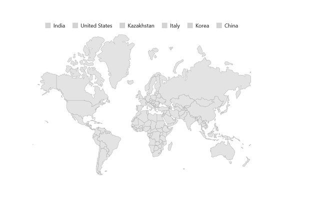
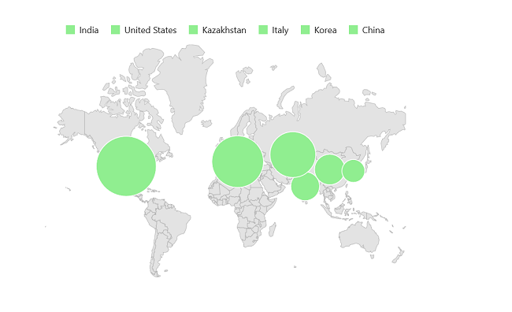
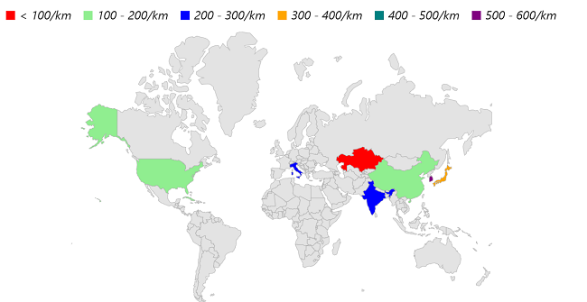
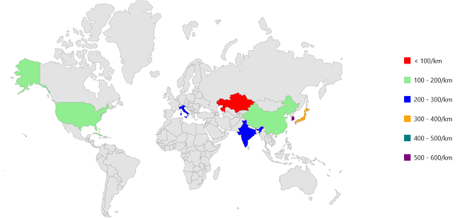

# Legend in .NET MAUI Maps (SfMaps)

You can provide clear information on the data plotted on the map using legend.

## Shape legend

You can show shape legend by setting the `Legend` property as `MapLegend(LegendSourceType.Shape)`. By default, the legend item's text is displayed based on the value of `ColorMappings.Text` property. The default value of the `Legend` property is `null` and hence the legend will not be shown by default.





     <map:SfMaps>
            <map:SfMaps.Layer>
                <map:MapShapeLayer DataSource="{Binding Data}"
								   PrimaryValuePath="State" 
								   ShapeDataField="name" 
								   ShapeStroke="DarkGrey">
                       
                        <map:MapShapeLayer.ColorMappings>
                            <map:EqualColorMapping Color="Gray" Value="51" Text="India" />
                            <map:EqualColorMapping Color="Gray" Value="58" Text="United States" />
                            <map:EqualColorMapping Color="Gray" Value="41" Text="Kazakhstan" />
                            <map:EqualColorMapping Color="Gray" Value="48" Text="Italy" />
                            <map:EqualColorMapping Color="Gray" Value="14" Text="Korea" />
                            <map:EqualColorMapping Color="Gray" Value="23" Text="China" />
                        </map:MapShapeLayer.ColorMappings>

                        <map:MapShapeLayer.Legend>
                            <map:MapLegend SourceType="Shape" Placement="Top" />
                        </map:MapShapeLayer.Legend>
                        
                </map:MapShapeLayer>
           </map:SfMaps.Layer>
    </map:SfMaps>





public MainPage()
{
    InitializeComponent();
    ViewModel viewModel = new ViewModel();
    this.BindingContext = viewModel;

    SfMaps maps = new SfMaps();
    MapShapeLayer layer = new MapShapeLayer();
    layer.ShapesSource = MapSource.FromResource("MyProject.world1.shp");
    layer.DataSource = viewModel.Data;
    layer.PrimaryValuePath = "State";
    layer.ShapeDataField = "name";
    layer.ShapeStroke = Colors.DarkGrey;

    layer.ColorMappings.Add(new EqualColorMapping() { Color = Colors.Gray, Value = "51", Text = "India"});
    layer.ColorMappings.Add(new EqualColorMapping() { Color = Colors.Gray, Value = "58", Text = "United States" });
    layer.ColorMappings.Add(new EqualColorMapping() { Color = Colors.Gray, Value = "41", Text = "Kazakhstan" });
    layer.ColorMappings.Add(new EqualColorMapping() { Color = Colors.Gray, Value = "48", Text = "Italy" });
    layer.ColorMappings.Add(new EqualColorMapping() { Color = Colors.Gray, Value = "14", Text = "Korea" });
    layer.ColorMappings.Add(new EqualColorMapping() { Color = Colors.Gray, Value = "23", Text = "China" });

    MapLegend legendSet = new MapLegend();
    legendSet.SourceType = LegendSourceType.Shape;
    legendSet.Placement = Syncfusion.Maui.Core.LegendPlacement.Top;
    layer.Legend = legendSet;

    maps.Layer = layer;
    this.Content = maps;
}

public class ViewModel
{
    public ObservableCollection<Model> Data { get; set; }
	
    public ViewModel()
    {
        Data = new ObservableCollection<Model>();
        Data.Add(new Model("India", 51));
        Data.Add(new Model("United States", 58));
        Data.Add(new Model("Kazakhstan", 41));
        Data.Add(new Model("Italy", 48));
        Data.Add(new Model("Korea", 14));
        Data.Add(new Model("China", 23));
    }
}

public class Model
{
    public String State { get; set; }
    public int Population { get; set; }
	
    public Model(string state, int population)
    {
        State = state;
        Population = population;
    }
}





## Bubble legend

You can show bubble legend by setting the `MapShapeLayer.Legend` property as `MapLegend(SourceType.Bubble)`. By default, the legend item's text is displayed based on the value of `ColorMapping.Text` property.





     <map:SfMaps>
            <map:SfMaps.Layer>
                <map:MapShapeLayer DataSource="{Binding Data}"  
								   ShowBubbles="True" 
								   PrimaryValuePath="State" 
								   ShapeDataField="name" 
								   ShapeStroke="DarkGray">

                        <map:MapShapeLayer.BubbleSettings>
                            <map:MapBubbleSettings ColorValuePath="Population"
												   SizeValuePath="Population"
												   MinSize="30"
												   MaxSize="80">

								<map:MapBubbleSettings.ColorMappings>
									<map:EqualColorMapping Color="LightGreen" Value="21" Text="India" />
									<map:EqualColorMapping Color="LightGreen" Value="58" Text="United States" />
									<map:EqualColorMapping Color="LightGreen" Value="41" Text="Kazakhstan" />
									<map:EqualColorMapping Color="LightGreen" Value="48" Text="Italy" />
									<map:EqualColorMapping Color="LightGreen" Value="14" Text="Korea" />
									<map:EqualColorMapping Color="LightGreen" Value="23" Text="China" />
								</map:MapBubbleSettings.ColorMappings>
							</map:MapBubbleSettings>
						</map:MapShapeLayer.BubbleSettings>
                        
                        <map:MapShapeLayer.Legend>
                            <map:MapLegend SourceType="Bubble" Placement="Top" />
                        </map:MapShapeLayer.Legend>
                        
                </map:MapShapeLayer>
           </map:SfMaps.Layer>
    </map:SfMaps>





public MainPage()
{
    InitializeComponent();
    ViewModel viewModel = new ViewModel();
    this.BindingContext = viewModel;

    MapShapeLayer layer = new MapShapeLayer();
    layer.ShapesSource = MapSource.FromResource("MyProject.world1.shp");
    layer.DataSource = viewModel.Data;
    layer.PrimaryValuePath = "State";
    layer.ShapeDataField = "name";
    layer.ShowBubbles = true;
    layer.ShapeStroke = Colors.DarkGrey;
    
    MapBubbleSettings bubbleSetting = new MapBubbleSettings()
    {
        ColorValuePath = "Population",
        SizeValuePath = "Population",
        MinSize = 30,
        MaxSize = 80,
    };

    bubbleSetting.ColorMappings.Add(new EqualColorMapping() { Color = Colors.LightGreen, Value = "21", Text = "India"});
    bubbleSetting.ColorMappings.Add(new EqualColorMapping() { Color = Colors.LightGreen, Value = "58", Text = "United States" });
    bubbleSetting.ColorMappings.Add(new EqualColorMapping() { Color = Colors.LightGreen, Value = "41", Text = "Kazakhstan" });
    bubbleSetting.ColorMappings.Add(new EqualColorMapping() { Color = Colors.LightGreen, Value = "48", Text = "Italy" });
    bubbleSetting.ColorMappings.Add(new EqualColorMapping() { Color = Colors.LightGreen, Value = "14", Text = "Korea" });
    bubbleSetting.ColorMappings.Add(new EqualColorMapping() { Color = Colors.LightGreen, Value = "23", Text = "China" });

    layer.BubbleSettings = bubbleSetting;
    MapLegend legendSet = new MapLegend();
    legendSet.SourceType = LegendSourceType.Bubble;
    legendSet.Placement = Syncfusion.Maui.Core.LegendPlacement.Top;
    layer.Legend = legendSet;

    SfMaps maps = new SfMaps();
    maps.Layer = layer;
    this.Content = maps;
}

public class ViewModel
{
    public ObservableCollection<Model> Data { get; set; }
	
    public ViewModel()
    {
        Data = new ObservableCollection<Model>();
        Data.Add(new Model("India", 21));
        Data.Add(new Model("United States", 58));
        Data.Add(new Model("Kazakhstan", 41));
        Data.Add(new Model("Italy", 48));
        Data.Add(new Model("Korea", 14));
        Data.Add(new Model("China", 23));
    }
}

public class Model
{
    public String State { get; set; }
    public int Population { get; set; }
	
    public Model(string state, int population)
    {
        State = state;
        Population = population;
    }
}





## Legend text customization

You can customize the legend item's text style using the `MapLegend.TextStyle` property.





     <map:SfMaps>
            <map:SfMaps.Layer>
                <map:MapShapeLayer DataSource="{Binding Data}"
   								   PrimaryValuePath="State"
   								   ShapeDataField="name" 
   								   ShapeStroke="DarkGray" 
   								   ShapeColorValuePath="Population">

                        <map:MapShapeLayer.ColorMappings>
                            <map:RangeColorMapping Color="Red" From="0" To="100" Text="0 - 100/km" />
                            <map:RangeColorMapping Color="LightGreen" From="101" To="200"  Text="100 - 200/km" />
                            <map:RangeColorMapping Color="Blue" From="201" To="300"  Text="200 - 300/km" />
                            <map:RangeColorMapping Color="Orange" From="301" To="400"  Text="300 - 400/km" />
                            <map:RangeColorMapping Color="Teal" From="401" To="500"  Text="400 - 500/km" />
                            <map:RangeColorMapping Color="Purple" From="501" To="600"  Text="500 - 600/km" />
                        </map:MapShapeLayer.ColorMappings>

                        <map:MapShapeLayer.Legend>
                            <map:MapLegend SourceType="Shape" Placement="Top">
                                <map:MapLegend.TextStyle>
                                    <map:MapLabelStyle FontSize="16"
													   TextColor="Black"
													   FontFamily="Times"
													   FontAttributes="Italic" />
                                </map:MapLegend.TextStyle>
                            </map:MapLegend>    
                        </map:MapShapeLayer.Legend>
                        
                </map:MapShapeLayer>
           </map:SfMaps.Layer>
    </map:SfMaps>





    public MainPage()
    {
        InitializeComponent();
        ViewModel viewModel = new ViewModel();
        this.BindingContext = viewModel;

        MapShapeLayer layer = new MapShapeLayer();
        layer.ShapesSource = MapSource.FromResource("MyProject.world1.shp");
        layer.DataSource = viewModel.Data;
        layer.PrimaryValuePath = "State";
        layer.ShapeDataField = "name";
        layer.ShapeStroke = Colors.DarkGrey;
        layer.ShapeColorValuePath = "Population";

        layer.ColorMappings.Add(new RangeColorMapping() { Color = Colors.Red, From = 0, To = 100, Text = "< 100/km" });
        layer.ColorMappings.Add(new RangeColorMapping() { Color = Colors.LightGreen, From = 101, To = 200, Text = "100 - 200/km" });
        layer.ColorMappings.Add(new RangeColorMapping() { Color = Colors.Blue, From = 201, To = 300, Text = "200 - 300/km" });
        layer.ColorMappings.Add(new RangeColorMapping() { Color = Colors.Orange, From = 301, To = 400, Text = "300 - 400/km" });
        layer.ColorMappings.Add(new RangeColorMapping() { Color = Colors.Teal, From = 401, To = 500, Text = "400 - 500/km" });
        layer.ColorMappings.Add(new RangeColorMapping() { Color = Colors.Purple, From = 501, To = 600, Text = "500 - 600/km" });

        MapLegend legendSet = new MapLegend();
        legendSet.SourceType = LegendSourceType.Shape;
        legendSet.Placement = Syncfusion.Maui.Core.LegendPlacement.Top;

        MapLabelStyle mapLabelStyle = new MapLabelStyle();
        mapLabelStyle.TextColor = Colors.Black;
        mapLabelStyle.FontSize = 16;
        mapLabelStyle.FontFamily = "Times";
        mapLabelStyle.FontAttributes = FontAttributes.Italic;
        
        legendSet.TextStyle = mapLabelStyle;
        layer.Legend = legendSet;

        SfMaps maps = new SfMaps();
        maps.Layer = layer;
        this.Content = maps;
    }
	
	public class ViewModel
	{
		public ObservableCollection<Model> Data { get; set; }
		
		public ViewModel()
		{
			Data = new ObservableCollection<Model>();
			Data.Add(new Model("India", 205));
			Data.Add(new Model("United States", 190));
			Data.Add(new Model("Kazakhstan", 37));
			Data.Add(new Model("Italy", 201));
			Data.Add(new Model("Korea", 512));
			Data.Add(new Model("Japan", 335));
			Data.Add(new Model("Cuba", 103));
			Data.Add(new Model("China", 148));
		}
	}

	public class Model
	{
		public String State { get; set; }
		public int Population { get; set; }
		
		public Model(string state, int population)
		{
			State = state;
			Population = population;
		}
	}





## Position

You can position the legend items in different directions using the `MapLegend.Placement` property. The default value of the `Placement` property is `Placement.Top`. The possible values are `Left`, `Right`, `Top`, and `Bottom`.





     <map:SfMaps>
            <map:SfMaps.Layer>
                <map:MapShapeLayer DataSource="{Binding Data}"
   								   PrimaryValuePath="State" 
   								   ShapeDataField="name" 
   								   ShapeStroke="DarkGray" 
   								   ShapeColorValuePath="Population">

                        <map:MapShapeLayer.ColorMappings>
                            <map:RangeColorMapping Color="Red" From="0" To="100" Text="0 - 100/km" />
                            <map:RangeColorMapping Color="LightGreen" From="101" To="200"  Text="100 - 200/km" />
                            <map:RangeColorMapping Color="Blue" From="201" To="300"  Text="200 - 300/km" />
                            <map:RangeColorMapping Color="Orange" From="301" To="400"  Text="300 - 400/km" />
                            <map:RangeColorMapping Color="Teal" From="401" To="500"  Text="400 - 500/km" />
                            <map:RangeColorMapping Color="Purple" From="501" To="600"  Text="500 - 600/km" />
                        </map:MapShapeLayer.ColorMappings>

                        <map:MapShapeLayer.Legend>
                            <map:MapLegend SourceType="Shape" Placement="Right" />
                        </map:MapShapeLayer.Legend>
                        
                </map:MapShapeLayer>
           </map:SfMaps.Layer>
    </map:SfMaps>





public MainPage()
{
    InitializeComponent();
    ViewModel viewModel = new ViewModel();
    this.BindingContext = viewModel;

    MapShapeLayer layer = new MapShapeLayer();
    layer.ShapesSource = MapSource.FromResource("MyProject.world1.shp");
    layer.DataSource = viewModel.Data;
    layer.PrimaryValuePath = "State";
    layer.ShapeDataField = "name";
    layer.ShapeStroke = Colors.DarkGrey;
    layer.ShapeColorValuePath = "Population";

    layer.ColorMappings.Add(new RangeColorMapping() { Color = Colors.Red, From = 0, To = 100, Text = "< 100/km" });
    layer.ColorMappings.Add(new RangeColorMapping() { Color = Colors.LightGreen, From = 101, To = 200, Text = "100 - 200/km" });
    layer.ColorMappings.Add(new RangeColorMapping() { Color = Colors.Blue, From = 201, To = 300, Text = "200 - 300/km" });
    layer.ColorMappings.Add(new RangeColorMapping() { Color = Colors.Orange, From = 301, To = 400, Text = "300 - 400/km" });
    layer.ColorMappings.Add(new RangeColorMapping() { Color = Colors.Teal, From = 401, To = 500, Text = "400 - 500/km" });
    layer.ColorMappings.Add(new RangeColorMapping() { Color = Colors.Purple, From = 501, To = 600, Text = "500 - 600/km" });

    MapLegend legendSet = new MapLegend();
    legendSet.SourceType = LegendSourceType.Shape;
    legendSet.Placement = Syncfusion.Maui.Core.LegendPlacement.Right;

    MapLabelStyle mapLabelStyle = new MapLabelStyle();
    mapLabelStyle.TextColor = Colors.Black;
    mapLabelStyle.FontSize = 16;
    mapLabelStyle.FontFamily = "Times";
    mapLabelStyle.FontAttributes = FontAttributes.Italic;
    
    legendSet.TextStyle = mapLabelStyle;
    layer.Legend = legendSet;

    SfMaps maps = new SfMaps();
    maps.Layer = layer;
    this.Content = maps;
}

public class ViewModel
{
    public ObservableCollection<Model> Data { get; set; }
	
    public ViewModel()
    {
        Data = new ObservableCollection<Model>();
        Data.Add(new Model("India", 205));
        Data.Add(new Model("United States", 190));
        Data.Add(new Model("Kazakhstan", 37));
        Data.Add(new Model("Italy", 201));
        Data.Add(new Model("Korea", 512));
        Data.Add(new Model("Japan", 335));
        Data.Add(new Model("Cuba", 103));
        Data.Add(new Model("China", 148));
    }
}

public class Model
{
    public String State { get; set; }
    public int Population { get; set; }
	
    public Model(string state, int population)
    {
        State = state;
        Population = population;
    }
}





N> You can refer to our `.NET MAUI Maps` feature tour page for its groundbreaking feature representations. You can also explore our `.NET MAUI Maps Legend example` that shows how to configure a Maps in .NET MAUI.