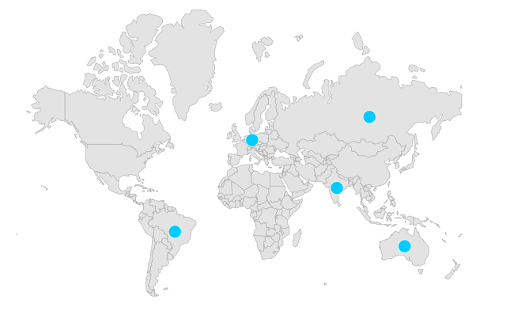
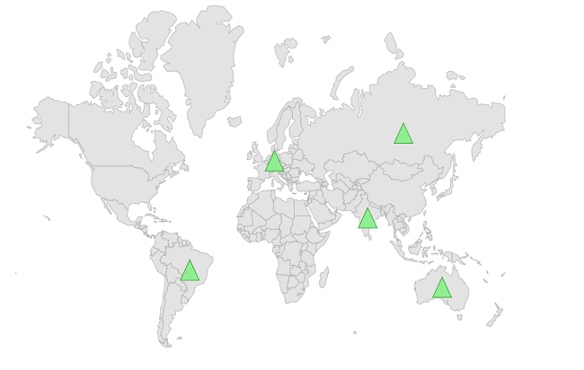
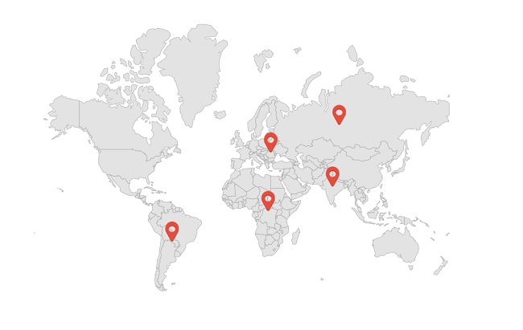
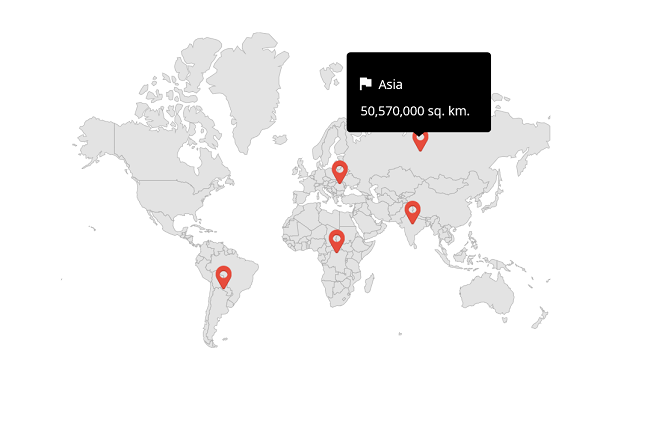
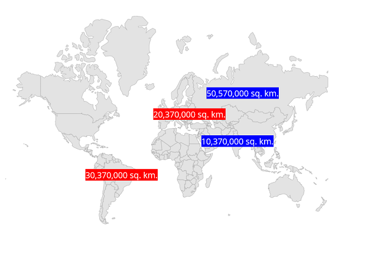

# Markers in MAUI Maps (SfMaps)

Markers can be used to denote the locations. It is possible to use the built-in symbols or display a custom control at a specific latitude and longitude on a map.

## Adding markers

### Shape layer

You can show markers at any position on the map by providing latitude and longitude position to the `MapMarker`, which is from the `Markers` collection.





		<map:SfMaps>
            <map:SfMaps.Layer>
                <map:MapShapeLayer ShapesSource="{local:MapSourceResourceExtension MyProject.world1.shp}"
                                   ShapeStroke="DarkGrey"
                                   ShowMarkerTooltip="True">
								   
                    <map:MapShapeLayer.Markers>
                        <map:MapMarkerCollection>
                            <map:MapMarker Latitude="20.5595"
										   IconWidth="15"
										   IconHeight="15"
										   IconFill="#00ccff"
										   IconType="Circle" 
										   Longitude="22.9375" />
                            <map:MapMarker Latitude="21.7679"
										   IconWidth="15"
										   IconHeight="15"
										   IconFill="#00ccff"
										   IconType="Circle" 
										   Longitude="78.8718" />
                            <map:MapMarker Latitude="133.7751"
										   IconWidth="15"
										   IconHeight="15"
										   IconFill="#00ccff"
										   IconType="Circle" 
										   Longitude="25.2744" />
                            <map:MapMarker Latitude="60.2551"
										   IconWidth="15"
										   IconHeight="15"
										   IconFill="#00ccff"
										   IconType="Circle" 
										   Longitude="84.5260" />
                            <map:MapMarker Latitude="195.4915"
										   IconWidth="15"
										   IconHeight="15"
										   IconType="Circle"
										   IconFill="#00ccff"
										   Longitude="-50.7832" />
                        </map:MapMarkerCollection>
                    </map:MapShapeLayer.Markers>
                </map:MapShapeLayer>
            </map:SfMaps.Layer>
        </map:SfMaps>





public MarkerTool()
{
	InitializeComponent();
	
     MapShapeLayer layer = new MapShapeLayer();
     layer.ShapesSource = MapSource.FromResource("MyProject.world1.shp");

     MapMarker mapMarker = new MapMarker();
     mapMarker.Latitude = 20.5595;
     mapMarker.Longitude = 22.9375;
     mapMarker.IconHeight = 15;
     mapMarker.IconWidth = 15;
     mapMarker.IconType = MapIconType.Circle;
     mapMarker.IconFill = Color.FromRgb(0, 204, 255);

     MapMarker mapMarker1 = new MapMarker();
     mapMarker1.Latitude = 21.7679;
     mapMarker1.Longitude = 78.8718;
     mapMarker1.IconHeight = 15;
     mapMarker1.IconWidth = 15;
     mapMarker1.IconType = MapIconType.Circle;
     mapMarker1.IconFill = Color.FromRgb(0, 204, 255);

     MapMarker mapMarker2 = new MapMarker();
     mapMarker2.Latitude = 133.7751;
     mapMarker2.Longitude = 25.2744;
     mapMarker2.IconHeight = 15;
     mapMarker2.IconWidth = 15;
     mapMarker2.IconType = MapIconType.Circle;
     mapMarker2.IconFill = Color.FromRgb(0, 204, 255);

     MapMarker mapMarker3 = new MapMarker();
     mapMarker3.Latitude = 60.2551;
     mapMarker3.Longitude = 84.5260;
     mapMarker3.IconHeight = 15;
     mapMarker3.IconWidth = 15;
     mapMarker3.IconType = MapIconType.Circle;
     mapMarker3.IconFill = Color.FromRgb(0, 204, 255);

     MapMarker mapMarker4 = new MapMarker();
     mapMarker4.Latitude = 195.4915;
     mapMarker4.Longitude = -50.7832;
     mapMarker4.IconHeight = 15;
     mapMarker4.IconWidth = 15;
     mapMarker4.IconType = MapIconType.Circle;
     mapMarker4.IconFill = Color.FromRgb(0, 204, 255);

     MapMarkerCollection mapMarkers =new MapMarkerCollection();
     mapMarkers.Add(mapMarker);
     mapMarkers.Add(mapMarker1);
     mapMarkers.Add(mapMarker2);
     mapMarkers.Add(mapMarker3);
     mapMarkers.Add(mapMarker4);
     layer.Markers = mapMarkers;

     SfMaps map = new SfMaps();
     map.Layer = layer;
     map.Margin = new Thickness(0, 50, 0, 0);
     this.Content = map;
 }





N>
* Refer the `MapMarkerCollection`, for collection of `MapMarker`.

## Appearance customization

You can customize the built-in markers appearance using the `IconType`, `IconFill`, `IconStroke`, `IconStrokeThickness`, `IconWidth` and `IconHeight` properties of the `MapMarker`.

* **Alignment** - You can change the position of the marker from the given coordinate using the `HorizontalAlignment` and `VerticalAlignment` property. The default value is `MapAlignment.Center`. The available alignment options are `Center`, `Start`, `End`.
* **Offset** - You can adjust the marker position from the given coordinate using the `Offset` property. The default value of the `Offset` property is `Offset.zero`.

N>
* The default value of the `IconType` is `MapIconType.circle`.
* The default value of the `IconStrokeThickness` is `1.0`.
* The default value of the `IconFill` is `Color.FromRgb(138, 69, 175)`.
* The default value of the `IconWidth` and `IconHeight` is `8.0`.





		<map:SfMaps>
            <map:SfMaps.Layer>
                <map:MapShapeLayer ShapesSource="{local:MapSourceResourceExtension MyProject.world1.shp}"
                                   ShapeStroke="DarkGrey"
                                   ShowMarkerTooltip="True">
                    <map:MapShapeLayer.Markers>
                        <map:MapMarkerCollection>
                            <map:MapMarker Latitude="20.5595"
										   IconWidth="20"
										   IconHeight="20"
										   IconFill="LightGreen"
										   IconType="Triangle" 
										   Longitude="22.9375"
										   IconStroke="Green"
										   IconStrokeThickness="3" />
                            <map:MapMarker Latitude="21.7679" 
										   IconWidth="20"
										   IconHeight="20"
										   IconFill="LightGreen"
										   IconType="Triangle" 
										   Longitude="78.8718"
										   IconStroke="Green"
										   IconStrokeThickness="3" />
                            <map:MapMarker Latitude="133.7751" 
										   IconWidth="20"
										   IconHeight="20"
										   IconFill="LightGreen"
										   IconType="Triangle" 
										   Longitude="25.2744"
										   IconStroke="Green"
										   IconStrokeThickness="3" />
                            <map:MapMarker Latitude="60.2551"
										   IconWidth="20"
										   IconHeight="20"
										   IconFill="LightGreen"
										   IconType="Triangle" 
										   Longitude="84.5260"
										   IconStroke="Green"
										   IconStrokeThickness="3"/>
                            <map:MapMarker Latitude="195.4915"
										   IconWidth="20"
										   IconHeight="20"
										   IconType="Triangle"
										   IconFill="LightGreen"
										   Longitude="-50.7832"
										   IconStroke="Green"
										   IconStrokeThickness="3" />
                        </map:MapMarkerCollection>
                    </map:MapShapeLayer.Markers>
                </map:MapShapeLayer>
            </map:SfMaps.Layer>
        </map:SfMaps>





	public MarkerTool()
	{
		InitializeComponent();
        MapShapeLayer layer = new MapShapeLayer();
        layer.ShapesSource = MapSource.FromResource("MyProject.world1.shp");

        MapMarker mapMarker = new MapMarker();
        mapMarker.Latitude = 20.5595;
        mapMarker.Longitude = 22.9375;
        mapMarker.IconHeight = 20;
        mapMarker.IconWidth = 20;
        mapMarker.IconType = MapIconType.Triangle;
        mapMarker.IconFill = Colors.LightGreen;
        mapMarker.IconStroke = Colors.Green;
        mapMarker.IconStrokeThickness = 3;

        MapMarker mapMarker1 = new MapMarker();
        mapMarker1.Latitude = 21.7679;
        mapMarker1.Longitude = 78.8718;
        mapMarker1.IconHeight = 20;
        mapMarker1.IconWidth = 20;
        mapMarker1.IconType = MapIconType.Triangle;
        mapMarker1.IconFill = Colors.LightGreen;
        mapMarker1.IconStroke = Colors.Green;
        mapMarker1.IconStrokeThickness = 3;

        MapMarker mapMarker2 = new MapMarker();
        mapMarker2.Latitude = 133.7751;
        mapMarker2.Longitude = 25.2744;
        mapMarker2.IconHeight = 20;
        mapMarker2.IconWidth = 20;
        mapMarker2.IconType = MapIconType.Triangle;
        mapMarker2.IconFill = Colors.LightGreen;
        mapMarker2.IconStroke = Colors.Green;
        mapMarker2.IconStrokeThickness = 3;

        MapMarker mapMarker3 = new MapMarker();
        mapMarker3.Latitude = 60.2551;
        mapMarker3.Longitude = 84.5260;
        mapMarker3.IconHeight = 20;
        mapMarker3.IconWidth = 20;
        mapMarker3.IconType = MapIconType.Triangle;
        mapMarker3.IconFill = Colors.LightGreen;
        mapMarker3.IconStroke = Colors.Green;
        mapMarker3.IconStrokeThickness = 3;

        MapMarker mapMarker4 = new MapMarker();
        mapMarker4.Latitude = 195.4915;
        mapMarker4.Longitude = -50.7832;
        mapMarker4.IconHeight = 20;
        mapMarker4.IconWidth = 20;
        mapMarker4.IconType = MapIconType.Triangle;
        mapMarker4.IconFill = Colors.LightGreen;
        mapMarker4.IconStroke = Colors.Green;
        mapMarker4.IconStrokeThickness = 3;

        MapMarkerCollection mapMarkers = new MapMarkerCollection();
        mapMarkers.Add(mapMarker);
        mapMarkers.Add(mapMarker1);
        mapMarkers.Add(mapMarker2);
        mapMarkers.Add(mapMarker3);
        mapMarkers.Add(mapMarker4);
        layer.Markers = mapMarkers;

        SfMaps map = new SfMaps();
        map.Layer = layer;
        this.Content = map;
    }





## Adding custom markers

You can show custom marker using the `MarkerTemplate` property of the `MapShapeLayer` which returns the template to customize markers.





	<ContentPage.Resources>
        <ResourceDictionary>
            <DataTemplate x:Key="LowPopulationTemplate">
                <StackLayout 
                      HorizontalOptions="StartAndExpand"
                      VerticalOptions="Center">
                    <Image Source="map.png"
                       HeightRequest="30"
                       WidthRequest="30" />
                </StackLayout>
            </DataTemplate>
        </ResourceDictionary>
    </ContentPage.Resources>
	
    <map:SfMaps>
        <map:SfMaps.Layer>
            <map:MapShapeLayer ShapesSource="{local:MapSourceResourceExtension MyProject.world1.shp}"
                               ShapeStroke="DarkGrey"
                               MarkerTemplate="{StaticResource LowPopulationTemplate}"
                               ShowMarkerTooltip="True">
                <map:MapShapeLayer.Markers>
                    <map:MapMarkerCollection>
                        <map:MapMarker Latitude="20.5595" Longitude="22.9375" HorizontalAlignment="Center" VerticalAlignment="Start"/>
                        <map:MapMarker Latitude="21.7679" Longitude="78.8718" HorizontalAlignment="Center" VerticalAlignment="Start"  />
                        <map:MapMarker Latitude="133.7751" Longitude="25.2744" HorizontalAlignment="Center" VerticalAlignment="Start" />
                        <map:MapMarker Latitude="60.2551" Longitude="84.5260" HorizontalAlignment="Center" VerticalAlignment="Start" />
                        <map:MapMarker Latitude="195.4915" Longitude="-50.7832" HorizontalAlignment="Center" VerticalAlignment="Start"  />
                    </map:MapMarkerCollection>
                </map:MapShapeLayer.Markers>
            </map:MapShapeLayer>
        </map:SfMaps.Layer>
    </map:SfMaps>





	public MainPage()
    {
        InitializeComponent();
		
        MapShapeLayer layer = new MapShapeLayer();
        layer.ShapesSource = MapSource.FromResource("MyProject.world1.shp");

        MapMarker mapMarker = new MapMarker();
        mapMarker.Latitude = 20.5595;
        mapMarker.Longitude = 22.9375;

        MapMarker mapMarker1 = new MapMarker();
        mapMarker1.Latitude = 21.7679;
        mapMarker1.Longitude = 78.8718;

        MapMarker mapMarker2 = new MapMarker();
        mapMarker2.Latitude = 133.7751;
        mapMarker2.Longitude = 25.2744;

        MapMarker mapMarker3 = new MapMarker();
        mapMarker3.Latitude = 60.2551;
        mapMarker3.Longitude = 84.5260;

        MapMarker mapMarker4 = new MapMarker();
        mapMarker4.Latitude = 195.4915;
        mapMarker4.Longitude = -50.7832;

        MapMarkerCollection mapMarkers = new MapMarkerCollection();
        mapMarkers.Add(mapMarker);
        mapMarkers.Add(mapMarker1);
        mapMarkers.Add(mapMarker2);
        mapMarkers.Add(mapMarker3);
        mapMarkers.Add(mapMarker4);
        
        layer.Markers = mapMarkers;
        layer.MarkerTemplate = CreateDataTemplate();
		
        SfMaps map = new SfMaps();
        map.Layer = layer;
        map.Margin = new Thickness(0, 50, 0, 0);
        this.Content = map;
    }
	
    private DataTemplate CreateDataTemplate()
    {
        return new DataTemplate(() =>
        {
            var stackLayout = new StackLayout();
            var image = new Image { Source = "map.png", WidthRequest = 20, HeightRequest = 20 };
            stackLayout.Add(image);
            return new ViewCell { View = stackLayout };
        });
    }





### Customizing data templates in marker tooltip

Data template can be used to customize the marker tooltip. The following code example shows the usage of `DataTemplate`.





	<ContentPage.Resources>
        <ResourceDictionary>
            <DataTemplate x:Key="MapMarkerTemplate">
                <StackLayout HorizontalOptions="StartAndExpand"
							 VerticalOptions="Center">
                    <Image Source="map.png"
                           HeightRequest="30"
						   WidthRequest="30" />
                </StackLayout>
            </DataTemplate>
        </ResourceDictionary>
    </ContentPage.Resources>
	
    <map:SfMaps>
        <map:SfMaps.Layer>
            <map:MapShapeLayer ShapesSource="{local:MapSourceResourceExtension MyProject.world1.shp}"
                               ShapeStroke="DarkGrey"
                               ShapeHoverFill="Transparent"   
                               ShapeHoverStroke="Transparent"
                               MarkerTemplate="{StaticResource MapMarkerTemplate}"
                               ShowMarkerTooltip="True">
							   
                  <map:MapShapeLayer.Markers>
                    <map:MapMarkerCollection>
                        <local:CustomMarker Name="South africa" Area="38,570,000 sq. km."  Latitude="20.5595" Longitude="22.9375"  />
                        <local:CustomMarker Name="India" Area="30,370,000 sq. km." Latitude="21.7679" Longitude="78.8718"  />
                        <local:CustomMarker Name="Europe" Area="20,370,000 sq. km." Latitude="133.7751"  Longitude="25.2744"  />
                        <local:CustomMarker Name="Asia" Area="50,570,000 sq. km." Latitude="60.2551" Longitude="84.5260" />
                        <local:CustomMarker Name="South America" Area="30,370,000 sq. km." Latitude="195.4915"  Longitude="-50.7832"  />
                    </map:MapMarkerCollection>
                </map:MapShapeLayer.Markers>
			
                <map:MapShapeLayer.MarkerTooltipTemplate>
                    <DataTemplate>
                        <Grid Padding="10" WidthRequest="150">
                            <Grid.RowDefinitions>
                                <RowDefinition Height="Auto" />
                                <RowDefinition Height="Auto" />
                                <RowDefinition Height="Auto" />
                            </Grid.RowDefinitions>
                            <Grid.ColumnDefinitions>
                                <ColumnDefinition Width="10"/>
                                <ColumnDefinition Width="Auto"/>
                            </Grid.ColumnDefinitions>
                            <Image Source="flag.png" Grid.Column="0" Grid.Row="0" WidthRequest="20" HeightRequest="20" />
                            <Label Text="{Binding Name}" TextColor="White"  Grid.Column="1" Grid.Row="0" Padding="10"/>
                            <Label Grid.Row="2" Grid.ColumnSpan="2"  Text="{Binding Area}" TextColor="White" />
                        </Grid>
                    </DataTemplate>
                </map:MapShapeLayer.MarkerTooltipTemplate>
			
            </map:MapShapeLayer>
        </map:SfMaps.Layer>
    </map:SfMaps>





	public MainPage()
    {
        InitializeComponent();
        
        MapShapeLayer layer = new MapShapeLayer();
        layer.ShapesSource = MapSource.FromResource("MyProject.world1.shp");
        layer.ShapeHoverFill = Colors.Transparent;
        layer.ShapeHoverStroke = Colors.Transparent;
        CustomMarker customMarker = new CustomMarker();
        customMarker.Latitude = 20.5595;
        customMarker.Longitude = 22.9375;
        customMarker.Name = "South africa";
        customMarker.Area = "38,570,000 sq. km.";

        CustomMarker customMarker1 = new CustomMarker();
        customMarker1.Latitude = 21.7679;
        customMarker1.Longitude = 78.8718;
        customMarker.Name = "India";
        customMarker.Area = "30,370,000 sq. km.";

        CustomMarker customMarker2 = new CustomMarker();
        customMarker2.Latitude = 133.7751;
        customMarker2.Longitude = 25.2744;
        customMarker.Name = "Europe";
        customMarker.Area = "20,370,000 sq. km.";

        CustomMarker customMarker3 = new CustomMarker();
        customMarker3.Latitude = 60.2551;
        customMarker3.Longitude = 84.5260;
        customMarker.Name = "Asia";
        customMarker.Area = "50,570,000 sq. km.";

        CustomMarker customMarker4 = new CustomMarker();
        customMarker4.Latitude = 195.4915;
        customMarker4.Longitude = -50.7832;
        customMarker.Name = "South America";
        customMarker.Area = "30,370,000 sq. km.";

        MapMarkerCollection mapMarkers = new MapMarkerCollection();
        mapMarkers.Add(customMarker);
        mapMarkers.Add(customMarker1);
        mapMarkers.Add(customMarker2);
        mapMarkers.Add(customMarker3);
        mapMarkers.Add(customMarker4);

        layer.Markers = mapMarkers;

        layer.MarkerTemplate = CreateDataTemplate();
        layer.MarkerTooltipTemplate = CreateToolTip();
        layer.ShowMarkerTooltip = true;
		
        SfMaps map = new SfMaps();
        map.Layer = layer;
        map.Margin = new Thickness(0, 50, 0, 0);
        this.Content = map;
    }
	
    private DataTemplate CreateDataTemplate()
    {
        return new DataTemplate(() =>
        {
            var stackLayout = new StackLayout();
            var image = new Image { Source = "map.png", WidthRequest = 20, HeightRequest = 20 };
            stackLayout.Add(image);
            return new ViewCell { View = stackLayout };
        });
    }
	
    private DataTemplate CreateToolTip()
    {
        return new DataTemplate(() =>
        {
           var grid = new Grid()
            {
                RowDefinitions =
                {
                  new RowDefinition(),
                  new RowDefinition(),
                  new RowDefinition()
                },
                ColumnDefinitions =
                {
                    new ColumnDefinition(),
                    new ColumnDefinition(),
                }
            };
          
            var image = new Image { Source = "flag.png", WidthRequest = 20, HeightRequest = 20 };
            grid.SetRow(image, 0); grid.SetColumn(image, 0);
            var label = new Label { FontAttributes = FontAttributes.Bold, TextColor = Colors.White, Padding = 5, Text = "Asia", };
            Binding binding = new Binding();
            binding.Path = nameof(CustomMarker1.Name);
            label.SetBinding(Label.TextProperty, binding);
            grid.SetRow(label, 0); grid.SetColumn(label, 1);
           
            var areaLabel = new Label { FontAttributes = FontAttributes.Bold, Text = "10,180,000 sq. km.", TextColor = Colors.White, };
            Binding binding1 = new Binding();
            binding1.Path = nameof(CustomMarker1.Area);
            areaLabel.SetBinding(Label.TextProperty, binding1);
            grid.SetRow(areaLabel, 2); grid.SetColumnSpan(areaLabel, 2);

            grid.Children.Add(image);
            grid.Children.Add(label);
            grid.Children.Add(areaLabel);
            return new ViewCell { View = grid };
        });
    }

	public class CustomMarker : MapMarker
	{
		public string Name { get; set; }
		public string Area { get; set; }
	}





### Customizing data templates selector in markers

Data template selector can be customized the appearance of each item with different templates based on specific constraints. You can choose a DataTemplate for each item at runtime based on the value of data-bound property using DataTemplateSelector.





	<ContentPage.Resources>
        <ResourceDictionary>
            <DataTemplate x:Key="MarkerTemplate1">
                <StackLayout IsClippedToBounds="false"
                         HorizontalOptions="StartAndExpand"
                         VerticalOptions="Center"
                         HeightRequest="30">
                    <Label Text="{Binding Latitude}"
                           Scale="1"
                           TextColor="White"
                           BackgroundColor="Red"
                           HorizontalOptions="StartAndExpand"
                       VerticalOptions="Center" />
                </StackLayout>
            </DataTemplate>
			
            <DataTemplate x:Key="MarkerTemplate2">
                <StackLayout IsClippedToBounds="false"
                         HorizontalOptions="StartAndExpand"
                         VerticalOptions="Center"
                         HeightRequest="30">
                    <Label Text="{Binding Latitude}"
                           Scale="1"
                           TextColor="Red"
                           BackgroundColor="Yellow"
                           HorizontalOptions="StartAndExpand"
                       VerticalOptions="Center" />
                </StackLayout>
            </DataTemplate>
			
			<local:MarkerTemplateSelector x:Key="MarkerTemplateSelector"
										  Template1="{StaticResource MarkerTemplate1}"
										  Template2="{StaticResource MarkerTemplate2}" />
			
        </ResourceDictionary>
    </ContentPage.Resources>

	<map:SfMaps>
        <map:SfMaps.Layer>
            <map:MapShapeLayer ShapesSource = "{local:ImageResource MyProject.world1.shp}"
							   ShapeStroke="DarkGrey"
							   MarkerTemplate="{StaticResource MarkerTemplateSelector}">
							   
            <map:MapShapeLayer.Markers>
                <map:MapMarkerCollection>
                    <map:MapMarker Latitude="20.5595" Longitude="22.9375"  />
                    <map:MapMarker Latitude="21.7679" Longitude="78.8718"  />
                    <map:MapMarker Latitude="133.7751" Longitude="25.2744"  />
                    <map:MapMarker Latitude="60.2551" Longitude="84.5260" />
                    <map:MapMarker Latitude="195.4915" Longitude="-50.7832"  />
                </map:MapMarkerCollection>
            </map:MapShapeLayer.Markers>
			
            </map:MapShapeLayer>
        </map:SfMaps.Layer>
    </map:SfMaps>





public class MarkerTemplateSelector : DataTemplateSelector
{
    public DataTemplate Template1 { get; set; }
    public DataTemplate Template2 { get; set; }
	
    protected override DataTemplate OnSelectTemplate(object item, BindableObject container)
    {
        return (double)((MapMarker)item).Latitude < 20 ? Template1 : Template2;
    }
} 





N> You can refer to our `MAUI Maps` feature tour page for its groundbreaking feature representations. You can also explore our `MAUI Maps Markers example` that shows how to configure a Maps in MAUI.