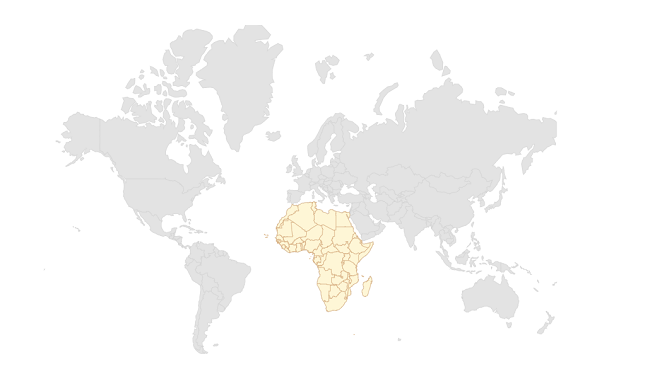
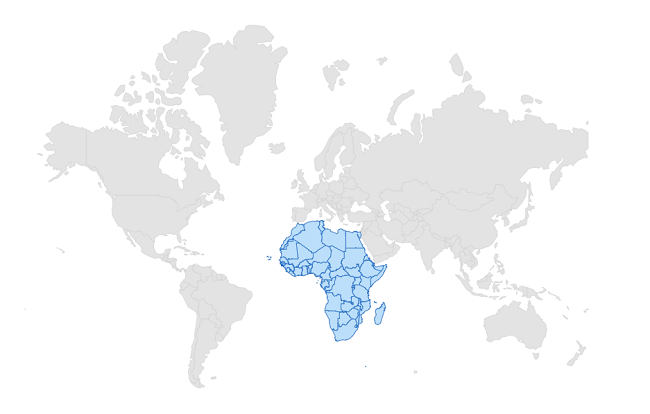
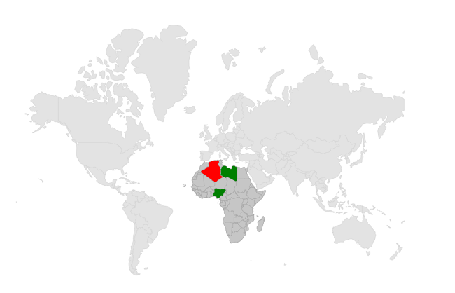
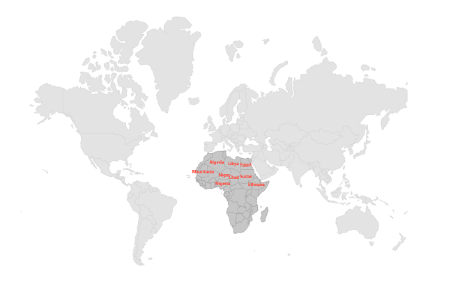
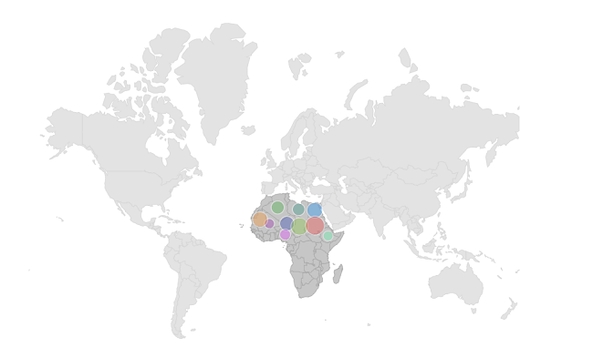

# Shape Sublayer in .NET MAUI Maps (SfMaps)

The shape sublayer is where geographical rendering will happen for the sublayer. This is similar to the main `MapShapeLayer` rendering. This section explains adding a shape sublayer on the shape layer.

## Shape sublayer on shape layer

The `Sublayers` in `MapShapeLayer` contains collection of `MapSublayer`.The actual geographical rendering is done in the each `MapShapeSublayer`. The `ShapesSource` property of the `MapShapeSublayer` is of type `MapSource`. The path of the .json file which contains the GeoJSON data has to be set to the `ShapesSource`.

The `ShapeDataField` property of the `ShapesSource` is used to refer the unique field name in the .json file to identify each shapes.





 <map:SfMaps>
     <map:SfMaps.Layer>
         <map:MapShapeLayer x:Name="shape"
                            ShapesSource="{local:ImageResource MapDemo.ShapeFiles.world1.shp}">
             <map:MapShapeLayer.Sublayers>
                 <map:MapShapeSublayer x:Name="layer"
                                       ShapeStroke="DarkGrey"
                                       ShapeFill="#c6c6c6"
                                       ShapesSource="{local:ImageResource MapDemo.ShapeFiles.africa.json">
                 </map:MapShapeSublayer>
             </map:MapShapeLayer.Sublayers>
         </map:MapShapeLayer>
     </map:SfMaps.Layer>
 </map:SfMaps>





SfMaps maps = new SfMaps();
MapShapeLayer layer = new MapShapeLayer();
layer.ShapesSource = MapSource.FromResource("MapDemo.ShapeFiles.world1.shp");
MapShapeSublayer sublayer = new MapShapeSublayer();
sublayer.ShapesSource = MapSource.FromResource("MapDemo.ShapeFiles.africa.json");
sublayer.ShapeFill = Color.FromRgb(198, 198, 198);
sublayer.ShapeStroke = Colors.DarkGrey;
layer.Sublayers.Add(sublayer);
maps.Layer = layer;
this.Content = maps;





N>
* Refer the `MapShapeLayer`, for adding shape layer in `SfMaps`.

## Color and stroke color

You can change the color, strokeColor and strokeWidth of the shape sublayer using the `ShapeFill`, `ShapeStroke` and `ShapeStrokeThickness` properties.





<map:SfMaps>
    <map:SfMaps.Layer>
        <map:MapShapeLayer x:Name="shape"
                           ShapesSource="{local:ImageResource MapDemo.ShapeFiles.world1.shp}">
            <map:MapShapeLayer.Sublayers>
                <map:MapShapeSublayer x:Name="layer"
                                      ShapeStroke="#226ac1"
                                      ShapeFill="#bbdefa"
                                      ShapesSource="{local:ImageResource MapDemo.ShapeFiles.africa.json}">
                </map:MapShapeSublayer>
            </map:MapShapeLayer.Sublayers>
        </map:MapShapeLayer>
    </map:SfMaps.Layer>
</map:SfMaps>





SfMaps maps = new SfMaps();
MapShapeLayer layer = new MapShapeLayer();
layer.ShapesSource = MapSource.FromResource("MapDemo.ShapeFiles.world1.shp");
MapShapeSublayer sublayer = new MapShapeSublayer();
sublayer.ShapesSource = MapSource.FromResource("MapDemo.ShapeFiles.africa.json");
sublayer.ShapeFill = Color.FromRgb(187, 222, 250);
sublayer.ShapeStroke = Color.FromRgb(34, 106, 193);
layer.Sublayers.Add(sublayer);
maps.Layer = layer;
this.Content = maps;





## Equal color mapping

You can apply color to the sublayer shape by comparing a value from the `ColorMappings` with the `EqualColorMapping.Value`. For the matched values, the `EqualColorMapping.color` will be applied to the respective shapes.





<map:SfMaps>
    <map:SfMaps.Layer>
        <map:MapShapeLayer x:Name="shape"
                           ShapesSource="{local:ImageResource MapDemo.ShapeFiles.world1.shp}"
                           >
            <map:MapShapeLayer.Sublayers>
                <map:MapShapeSublayer x:Name="layer"
                                      ShapesSource="{local:ImageResource MapDemo.ShapeFiles.africa.json}"
                                      ShapeStroke="DarkGrey"
                                      ShapeFill="#c6c6c6"
                                      ShapeDataField="name"
                                      PrimaryValuePath="State"
                                      ShapeColorValuePath="Storage"
                                      >
                    <map:MapShapeSublayer.ColorMappings>
                        <map:EqualColorMapping Color="Red"
                                               Value="Low" />
                        <map:EqualColorMapping Color="Green"
                                               Value="High" />
                    </map:MapShapeSublayer.ColorMappings>
                </map:MapShapeSublayer>
            </map:MapShapeLayer.Sublayers>
        </map:MapShapeLayer>
    </map:SfMaps.Layer>
</map:SfMaps>





public MainPage()
{
	  InitializeComponent();
    ViewModel viewModel = new ViewModel();
    this.BindingContext = viewModel;
    SfMaps maps = new SfMaps();
    MapShapeLayer layer = new MapShapeLayer();
    layer.ShapesSource = MapSource.FromResource("MapDemo.ShapeFiles.world1.shp");
    MapShapeSublayer sublayer = new MapShapeSublayer();
    sublayer.ShapesSource = MapSource.FromResource("MapDemo.ShapeFiles.africa.json");
    sublayer.ShapeFill = Color.FromRgb(198, 198, 198);
    sublayer.ShapeStroke = Colors.DarkGrey;
    sublayer.DataSource = viewModel.Data;
    sublayer.PrimaryValuePath = "State";
    sublayer.ShapeDataField = "name";
    sublayer.ShapeColorValuePath = "Storage";

    EqualColorMapping colorMapping = new EqualColorMapping();
    colorMapping.Color = Colors.Red;
    colorMapping.Value = "Low";

    EqualColorMapping colorMapping1 = new EqualColorMapping();
    colorMapping1.Color = Colors.Green;
    colorMapping1.Value = "High";

    sublayer.ColorMappings.Add(colorMapping);
    sublayer.ColorMappings.Add(colorMapping1);

    layer.Sublayers.Add(sublayer);
    maps.Layer = layer;
    this.Content = maps;
}

public class ViewModel
{
    public ObservableCollection<Model> Data { get; set; }

    public ViewModel()
    {
        Data = new ObservableCollection<Model>();
        Data.Add(new Model("Algeria", "Low"));
        Data.Add(new Model("Nigeria", "High"));
        Data.Add(new Model("Libya", "High")); ;
    }
}

public class Model
{
    public String State { get; set; }
    public String Storage { get; set; }

    public Model(string state, string storage)
    {
        State = state;
        Storage = storage;
    }
}





## Range color mapping

You can apply color to the sublayer shapes based on whether the value from `ColorMappings` falls within the `RangeColorMapping.From` and `RangeColorMapping.To`. Then, the `RangeColorMapping.Color` will be applied to the respective shapes.





<map:SfMaps>
    <map:SfMaps.Layer>
        <map:MapShapeLayer x:Name="layer"
                           ShapesSource="{local:ImageResource MapDemo.ShapeFiles.world1.shp}"
                           >
            <map:MapShapeLayer.Sublayers>
                <map:MapShapeSublayer x:Name="sublayer"
                                      ShapesSource="{local:ImageResource MapDemo.ShapeFiles.africa.json}"
                                      ShapeStroke="DarkGrey"
                                      ShapeFill="#c6c6c6"
                                      ShapeDataField="name"
                                      PrimaryValuePath="State"
                                      ShapeColorValuePath="Count"
                                      >
                    <map:MapShapeSublayer.ColorMappings>
                        <map:RangeColorMapping Color="Red"
                                               From="0" To="100" />
                        <map:RangeColorMapping Color="Green"
                                               From="101" To="300" />
                    </map:MapShapeSublayer.ColorMappings>
                </map:MapShapeSublayer>
            </map:MapShapeLayer.Sublayers>
        </map:MapShapeLayer>
    </map:SfMaps.Layer>
</map:SfMaps>





public MainPage()
{
	  InitializeComponent();
    ViewModel viewModel = new ViewModel();
    this.BindingContext = viewModel;
    SfMaps maps = new SfMaps();
    MapShapeLayer layer = new MapShapeLayer();
    layer.ShapesSource = MapSource.FromResource("MapDemo.ShapeFiles.world1.shp");
    MapShapeSublayer sublayer = new MapShapeSublayer();
    sublayer.ShapesSource = MapSource.FromResource("MapDemo.ShapeFiles.africa.json");
    sublayer.ShapeFill = Color.FromRgb(198, 198, 198);
    sublayer.ShapeStroke = Colors.DarkGrey;
    sublayer.DataSource = viewModel.Data;
    sublayer.PrimaryValuePath = "State";
    sublayer.ShapeDataField = "name";
    sublayer.ShapeColorValuePath = "Count";

    RangeColorMapping colorMapping = new RangeColorMapping();
    colorMapping.Color = Colors.Red;
    colorMapping.From = 0;
    colorMapping.To = 100;

    RangeColorMapping colorMapping1 = new RangeColorMapping();
    colorMapping.Color = Colors.Green;
    colorMapping.From = 101;
    colorMapping.To = 300;

    sublayer.ColorMappings.Add(colorMapping);
    sublayer.ColorMappings.Add(colorMapping1);

    layer.Sublayers.Add(sublayer);
    maps.Layer = layer;
    this.Content = maps;
}

public class ViewModel
{
    public ObservableCollection<Model> Data { get; set; }

    public ViewModel()
    {
        Data = new ObservableCollection<Model>();
        Data.Add(new Model("Algeria", 196));
        Data.Add(new Model("Nigeria", 280));
        Data.Add(new Model("Libya", 45)); 
    }
}

public class Model
{
    public String State { get; set; }
    public double Count { get; set; }

    public Model(string state, double count)
    {
        State = state;
        Count = count;
    }
}





## Enable data labels and its customization

You can enable data labels to the shape sublayer using the `ShowDataLabels` and `DataLabelPath` properties. The `ShowDataLabels` is used to control the visibility of data labels, the `DataLabelPath` is used to decide which underline property has to be displayed as data labels. The default value of `ShowDataLabels` is `false`. 





<map:SfMaps>
    <map:SfMaps.Layer>
        <map:MapShapeLayer x:Name="layer"
                           ShapesSource="{local:ImageResource MapDemo.ShapeFiles.world1.shp}">
            <map:MapShapeLayer.Sublayers>
                <map:MapShapeSublayer x:Name="sublayer"
                                      ShapesSource="{local:ImageResource MapDemo.ShapeFiles.africa.json}"
                                      ShapeStroke="DarkGrey"
                                      ShapeFill="#c6c6c6"
                                      ShapeDataField="name"
                                      PrimaryValuePath="State"
                                      ShowDataLabels="True">
                    <map:MapShapeSublayer.DataLabelSettings>
                        <map:MapDataLabelSettings DataLabelPath="State" >
                        <map:MapDataLabelSettings.DataLabelStyle>
                            <map:MapLabelStyle FontSize="6"
                                               TextColor="#ff4e41"
                                               FontAttributes="Bold" />
                        </map:MapDataLabelSettings.DataLabelStyle>
                            </map:MapDataLabelSettings>
                    </map:MapShapeSublayer.DataLabelSettings>
                </map:MapShapeSublayer>
            </map:MapShapeLayer.Sublayers>
        </map:MapShapeLayer>
    </map:SfMaps.Layer>
</map:SfMaps>





public SublayerDataLabels()
{
	InitializeComponent();
    ViewModel viewModel = new ViewModel();
    this.BindingContext = viewModel;
    SfMaps maps = new SfMaps();
    MapShapeLayer layer = new MapShapeLayer();
    layer.ShapesSource = MapSource.FromResource("MapDemo.ShapeFiles.world1.shp");
    MapShapeSublayer sublayer = new MapShapeSublayer();
    sublayer.ShapesSource = MapSource.FromResource("MapDemo.ShapeFiles.africa.json");
    sublayer.ShapeFill = Color.FromRgb(198, 198, 198);
    sublayer.ShapeStroke = Colors.DarkGray;
    sublayer.DataSource = viewModel.Data;
    sublayer.PrimaryValuePath = "State";
    sublayer.ShapeDataField = "name";
    sublayer.ShowDataLabels = true;

    sublayer.DataLabelSettings = new MapDataLabelSettings()
    {
        DataLabelPath = "State",
        DataLabelStyle = new MapLabelStyle()
        {
            FontSize = 6,
            FontAttributes = FontAttributes.Bold,
            TextColor = Color.FromRgb(255, 78, 65)
        },
    };

    layer.Sublayers.Add(sublayer);
    maps.Layer = layer;
    this.Content = maps;
}
public class ViewModel
{
    public ObservableCollection<Model> Data { get; set; }

    public ViewModel()
    {
        Data = new ObservableCollection<Model>();
        Data.Add(new Model("Algeria", Colors.Green));
        Data.Add(new Model("Libya", Colors.Teal));
        Data.Add(new Model("Egypt", Colors.Blue));
        Data.Add(new Model("Niger", Colors.Indigo));
        Data.Add(new Model("Nigeria", Colors.MediumPurple));
        Data.Add(new Model("Chad", Colors.LightGreen));
        Data.Add(new Model("Sudan", Colors.IndianRed));
        Data.Add(new Model("Mauritania", Colors.Orange));
        Data.Add(new Model("South Sudan", Colors.Lime));
        Data.Add(new Model("Ethiopia", Colors.GreenYellow));
    }
}

public class Model
{
    public String State { get; set; }
    public Color Color { get; set; }

    public Model(string state, Color color)
    {
        State = state;
        Color = color;
    }
}





## Add bubbles to the sublayer

You can enable bubbles to the shape sublayer using the `ShowBubbles`. You can customize bubbles appearance using the `BubbleSettings`. This property is used to specify the value based on which the bubble's size has to be rendered.

N> Refer the `Bubbles` section, to know more about the bubbles customization.





<map:SfMaps>
    <map:SfMaps.Layer>
        <map:MapShapeLayer x:Name="layer"
                           ShapesSource="{local:ImageResource MapDemo.ShapeFiles.world1.shp}">
            <map:MapShapeLayer.Sublayers>
                <map:MapShapeSublayer x:Name="sublayer"
                                      ShapesSource="{local:ImageResource MapDemo.ShapeFiles.africa.json}"
                                      ShapeStroke="DarkGrey"
                                      ShapeFill="#c6c6c6"
                                      ShapeDataField="name"
                                      DataSource="{Binding Data}"
                                      PrimaryValuePath="State"
                                      ShowBubbles="True">
                    <map:MapShapeSublayer.BubbleSettings>
                        <map:MapBubbleSettings ColorValuePath="Color"
                                               SizeValuePath="Size"
                                               MinSize="10"
                                               MaxSize="20">
                        </map:MapBubbleSettings>
                    </map:MapShapeSublayer.BubbleSettings>
                </map:MapShapeSublayer>
            </map:MapShapeLayer.Sublayers>
        </map:MapShapeLayer>
    </map:SfMaps.Layer>
</map:SfMaps>





public BubblesSubUG()
{
    InitializeComponent();
    ViewModel viewModel = new ViewModel();
    this.BindingContext = viewModel;
    SfMaps maps = new SfMaps();
    MapShapeLayer layer = new MapShapeLayer();
    layer.ShapesSource = MapSource.FromResource("MapDemo.ShapeFiles.world1.shp");
    MapShapeSublayer sublayer = new MapShapeSublayer();
    sublayer.ShapesSource = MapSource.FromResource("MapDemo.ShapeFiles.africa.json");
    sublayer.ShapeFill = Color.FromRgb(198, 198, 198);
    sublayer.ShapeStroke = Colors.DarkGray;
    sublayer.DataSource = viewModel.Data;
    sublayer.PrimaryValuePath = "State";
    sublayer.ShapeDataField = "name";
    sublayer.ShowBubbles = true;

    MapBubbleSettings bubbleSetting = new MapBubbleSettings()
    {
        ColorValuePath = "Color",
        SizeValuePath = "Size",
        MinSize = 10,
        MaxSize = 20
    };

    sublayer.BubbleSettings = bubbleSetting;
    layer.Sublayers.Add(sublayer);
    maps.Layer = layer;
    this.Content = maps;
}
public class ViewModel
{
    public ObservableCollection<Model> Data { get; set; }

    public ViewModel()
    {
        Data = new ObservableCollection<Model>();
        Data.Add(new Model("Algeria", Color.FromRgb(80, 175, 80), 36232));
        Data.Add(new Model("Libya", Color.FromRgb(64, 150, 137), 34121));
        Data.Add(new Model("Egypt", Color.FromRgb(48, 150, 243), 43453));
        Data.Add(new Model("Mali", Color.FromRgb(157, 59, 176), 28123));
        Data.Add(new Model("Niger", Color.FromRgb(63, 81, 181), 40111));
        Data.Add(new Model("Nigeria", Color.FromRgb(225, 87, 249), 30232));
        Data.Add(new Model("Chad", Color.FromRgb(139, 194, 74), 48132));
        Data.Add(new Model("Sudan", Color.FromRgb(238, 79, 79), 52654));
        Data.Add(new Model("Mauritania", Color.FromRgb(243, 151, 62), 42231));
        Data.Add(new Model("South Sudan", Color.FromRgb(198, 198, 198), 40421));
        Data.Add(new Model("Ethiopia", Color.FromRgb(109, 240, 174), 27198));
    }
}

public class Model
{
    public String State { get; set; }
    public Color Color { get; set; }
    public double Size { get; set; }

    public Model(string state, Color color, double size)
    {
        State = state;
        Color = color;
        Size = size;
    }
}





N> You can refer to our [.NET MAUI Maps](https://www.syncfusion.com/maui-controls/maui-maps) feature tour page for its groundbreaking feature representations. You can also explore our `.NET MAUI Maps Sublayer example` that shows how to configure a Maps in .NET MAUI.