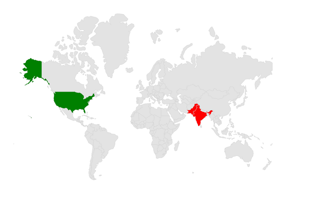

# Shapes in .NET MAUI Maps (SfMaps)

This section explains about shapes and how to apply colors to them based on specific values in the .NET MAUI maps.

## Shape color

You can apply color, stroke color and thickness to the shapes using the [`ShapeFill`](https://help.syncfusion.com/cr/maui/Syncfusion.Maui.Maps.MapShapeLayer.html#Syncfusion_Maui_Maps_MapShapeLayer_ShapeFill), [`ShapeStroke`](https://help.syncfusion.com/cr/maui/Syncfusion.Maui.Maps.MapShapeLayer.html#Syncfusion_Maui_Maps_MapShapeLayer_ShapeStroke) and [`ShapeStrokeThickness`](https://help.syncfusion.com/cr/maui/Syncfusion.Maui.Maps.MapShapeLayer.html#Syncfusion_Maui_Maps_MapShapeLayer_ShapeStrokeThickness) properties respectivey.





<map:SfMaps>
    <map:SfMaps.Layer>
        <map:MapShapeLayer ShapeStroke="#1585ed"
                           ShapeFill="#b5dcff"  
                           ShapeStrokeThickness="2">
        </map:MapShapeLayer>
    </maps:SfMaps.Layer>
</maps:SfMaps>





	public MainPage()
    {
        InitializeComponent();
		
        MapShapeLayer layer = new MapShapeLayer();
        layer.ShapesSource = MapSource.FromResource("MyProject.world-map.json");
        layer.ShapeFill = Color.FromRgb(181, 220, 255);
        layer.ShapeStroke = Color.FromRgb(21, 133, 237);
        layer.ShapeStrokeThickness = 2;
		
        SfMaps maps = new SfMaps();
        maps.Layer = layer;
		
        this.Content = maps;
    }





## Hover color

You can apply hover color, hover stoke color and hover stroke thickness to the shapes using the [`ShapeHoverFill`](https://help.syncfusion.com/cr/maui/Syncfusion.Maui.Maps.MapShapeLayer.html#Syncfusion_Maui_Maps_MapShapeLayer_ShapeHoverFill), [`ShapeHoverStroke`](https://help.syncfusion.com/cr/maui/Syncfusion.Maui.Maps.MapShapeLayer.html#Syncfusion_Maui_Maps_MapShapeLayer_ShapeHoverStroke) and [`ShapeHoverStrokeThickness`](https://help.syncfusion.com/cr/maui/Syncfusion.Maui.Maps.MapShapeLayer.html#Syncfusion_Maui_Maps_MapShapeLayer_ShapeHoverStrokeThickness) properties respectively.





<map:SfMaps>
    <map:SfMaps.Layer>
        <map:MapShapeLayer ShapeHoverStroke="Blue"
                           ShapeHoverFill="LightBlue"  
                           ShapeHoverStrokeThickness="2">
        </map:MapShapeLayer>
    </map:SfMaps.Layer>
</map:SfMaps>





	public MainPage()
    {
        InitializeComponent();
		
        MapShapeLayer layer = new MapShapeLayer();
        
        layer.ShapeHoverFill = Brush.LightBlue;
        layer.ShapeHoverStroke = Brush.Blue;
        layer.ShapeHoverStrokeThickness = 2;
		layer.ShapesSource = MapSource.FromResource("MyProject.world-map.json");
        SfMaps maps = new SfMaps();
        maps.Layer = layer;
		
        this.Content = maps;
    }
    




## Applying colors based on the data

The [`ShapeColorValuePath`](https://help.syncfusion.com/cr/maui/Syncfusion.Maui.Maps.MapShapeLayer.html#Syncfusion_Maui_Maps_MapShapeLayer_ShapeColorValuePath) provides a color directly. The color will then be applied to the respective shape. Otherwise, you must provide [`ColorMapping`](https://help.syncfusion.com/cr/maui/Syncfusion.Maui.Maps.MapShapeLayer.html#Syncfusion_Maui_Maps_MapShapeLayer_ColorMappings).

N> You can show legend using the [`Legend`](https://help.syncfusion.com/cr/maui/Syncfusion.Maui.Maps.MapShapeLayer.html#Syncfusion_Maui_Maps_MapShapeLayer_Legend) property.The icon's color of the legend is applied based on the colors from [`ShapeColorValuePath`](https://help.syncfusion.com/cr/maui/Syncfusion.Maui.Maps.MapShapeLayer.html#Syncfusion_Maui_Maps_MapShapeLayer_ShapeColorValuePath) property and has to provide text for the legend from the [`ColorMapping.Text`](https://help.syncfusion.com/cr/maui/Syncfusion.Maui.Maps.ColorMapping.html#Syncfusion_Maui_Maps_ColorMapping_Text) property. 





<map:SfMaps>
    <map:SfMaps.Layer>
        <map:MapShapeLayer DataSource="{Binding Data}"       
                           PrimaryValuePath="State" 
                           ShapeDataField="STATE_NAME"
                           ShapeStrokeThickness="0" 
                           ShapeColorValuePath="Color">
        </map:MapShapeLayer>
    </map:SfMaps.Layer>
</map:SfMaps>





public MainPage()
{
    InitializeComponent();
	
    ViewModel viewModel = new ViewModel();
    this.BindingContext = viewModel;
	
    MapShapeLayer layer = new MapShapeLayer();
    layer.ShapesSource = MapSource.FromResource("MyProject.australia.json");
    layer.DataSource = viewModel.Data;
    layer.PrimaryValuePath = "State";
    layer.ShapeDataField = "STATE_NAME";
    layer.ShapeColorValuePath = "Color";
    layer.ShapeStrokeThickness = 0;

    SfMaps maps = new SfMaps();
    maps.Layer = layer;
    this.Content = maps;
}

public class ViewModel
{
    public ObservableCollection<Model> Data { get; set; }
	
    public ViewModel()
    {
        Data = new ObservableCollection<Model>();
        Data.Add(new Model("New South Wales", Color.FromRgb(208,183,0)));
        Data.Add(new Model("Northern Territory",  Color.FromRgb(255,78,66)));
        Data.Add(new Model("Victoria",  Color.FromRgb(207,78,238)));
        Data.Add(new Model("Tasmania", Color.FromRgb(79,147,216)));
        Data.Add(new Model("Queensland",  Color.FromRgb(0,213,207)));
        Data.Add(new Model("Western Australia", Color.FromRgb(139,106,223)));
        Data.Add(new Model("South Australia", Color.FromRgb(123,255,103)));
    }
}

public class Model
{
    public String State { get; set; }
    public Color Color { get; set; }
	
    public Model(string state, Color color)
    {
        State = state;
        Color = color;
    }
}





## Equal color mapping

You can apply color to the shape by comparing a value from the [`ColorMappings`](https://help.syncfusion.com/cr/maui/Syncfusion.Maui.Maps.MapShapeLayer.html#Syncfusion_Maui_Maps_MapShapeLayer_ColorMappings) with the [`EqualColorMapping.Value`](https://help.syncfusion.com/cr/maui/Syncfusion.Maui.Maps.MapBubbleSettings.html#Syncfusion_Maui_Maps_MapBubbleSettings_ColorValuePath). For the matched values, the [`EqualColorMapping.color`](https://help.syncfusion.com/cr/maui/Syncfusion.Maui.Maps.ColorMapping.html#Syncfusion_Maui_Maps_ColorMapping_Color) will be applied to the respective shapes.





<map:SfMaps>
    <map:SfMaps.Layer>
        <map:MapShapeLayer DataSource="{Binding Data}" 
                           PrimaryValuePath="Country" 
                           ShapeDataField="name" 
                           ShapeColorValuePath="Count">
        
            <map:MapShapeLayer.ColorMappings>
                <map:EqualColorMapping Color="Red" Value="Low" />
                    <map:EqualColorMapping Color="Green" Value="High" />
            </map:MapShapeLayer.ColorMappings>

        </map:MapShapeLayer>
    </map:SfMaps.Layer>
</map:SfMaps>





public MainPage()
{
    InitializeComponent();
	
    ViewModel viewModel = new ViewModel();
    this.BindingContext = viewModel;
	
    MapShapeLayer layer = new MapShapeLayer();
    layer.ShapesSource = MapSource.FromResource("MyProject.world-map.json");
    layer.DataSource = viewModel.Data;
    layer.PrimaryValuePath = "Country";
    layer.ShapeDataField = "name";
    layer.ShapeColorValuePath = "Count";

    EqualColorMapping colorMapping = new EqualColorMapping();
    colorMapping.Color = Colors.Red;
    colorMapping.Value = "Low";

    EqualColorMapping colorMapping1 = new EqualColorMapping();
    colorMapping1.Color = Colors.Green;
    colorMapping1.Value = "High";

    layer.ColorMappings.Add(colorMapping);
    layer.ColorMappings.Add(colorMapping1);
        
    SfMaps maps = new SfMaps();
    maps.Layer = layer;
	
    this.Content = maps;
}

public class ViewModel
{
    public ObservableCollection<Model> Data { get; set; }
	
    public ViewModel()
    {
        Data = new ObservableCollection<Model>();
        Data.Add(new Model("India", "Low"));
        Data.Add(new Model("United States", "High"));
        Data.Add(new Model("Pakistan", "Low"));;
    }
}

public class Model
{
    public String Country { get; set; }
    public String Count { get; set; }
	
    public Model(string country, string count)
    {
        Country = country;
        Count = count;
    }
}





## Range color mapping

You can apply color to the shapes based on whether the value from [`ColorMappings`](https://help.syncfusion.com/cr/maui/Syncfusion.Maui.Maps.MapShapeLayer.html#Syncfusion_Maui_Maps_MapShapeLayer_ColorMappings) falls within the [`RangeColorMapping.From`](https://help.syncfusion.com/cr/maui/Syncfusion.Maui.Maps.RangeColorMapping.html#Syncfusion_Maui_Maps_RangeColorMapping_From) and [`RangeColorMapping.To`](https://help.syncfusion.com/cr/maui/Syncfusion.Maui.Maps.RangeColorMapping.html#Syncfusion_Maui_Maps_RangeColorMapping_To). Then, the [`RangeColorMapping.Color`](https://help.syncfusion.com/cr/maui/Syncfusion.Maui.Maps.ColorMapping.html#Syncfusion_Maui_Maps_ColorMapping_Color) will be applied to the respective shapes.





<map:SfMaps>
    <map:SfMaps.Layer>
        <map:MapShapeLayer DataSource="{Binding Data}" 
                           PrimaryValuePath="Country" 
                           ShapeDataField="name" 
                           ShapeColorValuePath="Count">
        
            <map:MapShapeLayer.ColorMappings>
                <map:RangeColorMapping Color="Green" From="0" To="90" />
                <map:RangeColorMapping Color="Red" From="100" To="150" />
            </map:MapShapeLayer.ColorMappings>

        </map:MapShapeLayer>
    </map:SfMaps.Layer>
</map:SfMaps>





public MainPage()
{
    InitializeComponent();
	
    ViewModel viewModel = new ViewModel();
    this.BindingContext = viewModel;
	
    MapShapeLayer layer = new MapShapeLayer();
    layer.ShapesSource = MapSource.FromResource("MyProject.world-map.json");
    layer.DataSource = viewModel.Data;
    layer.PrimaryValuePath = "Country";
    layer.ShapeDataField = "name";
    layer.ShapeColorValuePath = "Count";

    RangeColorMapping colorMapping = new RangeColorMapping();
    colorMapping.Color = Colors.Green;
    colorMapping.From = 0;
    colorMapping.To = 90;

    RangeColorMapping colorMapping1 = new RangeColorMapping();
    colorMapping.Color = Colors.Red;
    colorMapping.From =100;
    colorMapping.To = 150;

    layer.ColorMappings.Add(colorMapping);
    layer.ColorMappings.Add(colorMapping1);
        
    SfMaps maps = new SfMaps();
    maps.Layer = layer;
	
    this.Content = maps;
}

public class ViewModel
{
    public ObservableCollection<Model> Data { get; set; }
	
    public ViewModel()
    {
        Data = new ObservableCollection<Model>();
        Data.Add(new Model("India", 80));
        Data.Add(new Model("United States",30 ));
        Data.Add(new Model("Kazakhstan", 105 ));
    }
}

public class Model
{
    public String Country { get; set; }
    public String Count { get; set; }
	
    public Model(string country, int count)
    {
        Country = country;
        Count = count;
    }
}





N>
* Refer to the [`BubbleSettings`](https://help.syncfusion.com/cr/maui/Syncfusion.Maui.Maps.MapShapeLayer.html#Syncfusion_Maui_Maps_MapShapeLayer_BubbleSettings), for setting the bubble colors based on the specific value. You can also refer to our [.NET MAUI Maps](https://www.syncfusion.com/maui-controls/maui-maps) feature tour page for its groundbreaking feature representations. You can also explore our [.NET MAUI Maps Shapes example](https://github.com/syncfusion/maui-demos/) that shows how to configure a Maps in .NET MAUI.