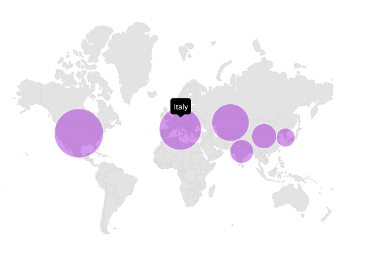
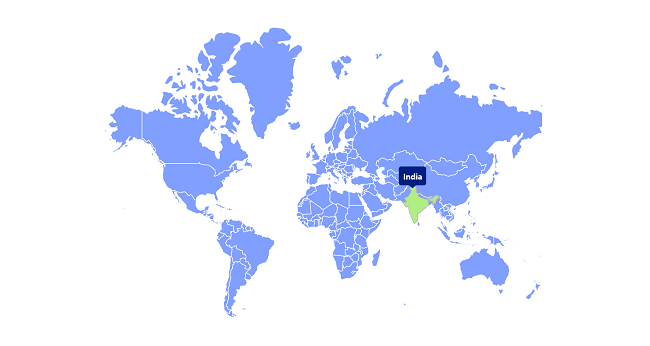
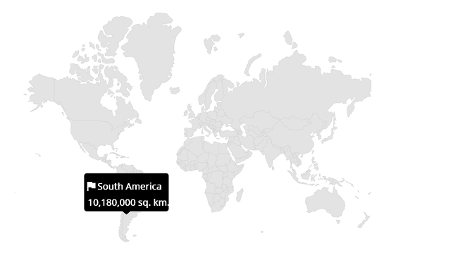

# Tooltip in .NET MAUI Maps (SfMaps)
A tooltip indicates the shape, bubble and marker information during the tap or hover interactions. This section demonstrates how to show tooltips for the shapes, bubbles, and markers in the maps and how to customize them.

## Tooltip for the shapes

The [`ShowShapeTooltip`](https://help.syncfusion.com/cr/maui/Syncfusion.Maui.Maps.MapShapeLayer.html#Syncfusion_Maui_Maps_MapShapeLayer_ShowShapeTooltip) is used to indicate the shape information whenever you interact with the shapes i.e., while tapping on touch devices and hovering enter in the mouse enabled devices.





<map:SfMaps>
    <map:SfMaps.Layer>
        <map:MapShapeLayer ShapesSource="https://cdn.syncfusion.com/maps/map-data/world-map.json"
                           DataSource="{Binding Data}"
                           PrimaryValuePath="State" 
                           ShapeDataField="name" 
                           ShowShapeToolTip="True">
        </map:MapShapeLayer>
    </map:SfMaps.Layer>
</map:SfMaps>





public MainPage()
{
   InitializeComponent();
   
   ViewModel viewModel = new ViewModel();
   this.BindingContext = viewModel;
   
   MapShapeLayer layer = new MapShapeLayer();
   layer.ShapesSource = MapSource.FromUri(new Uri("https://cdn.syncfusion.com/maps/map-data/world-map.json"));
   layer.DataSource = viewModel.Data;
   layer.PrimaryValuePath = "State";
   layer.ShapeDataField = "name";
   layer.ShowShapeToolTip = true;

   SfMaps maps = new SfMaps();
   maps.Layer = layer;
   this.Content = maps;
}

public class ViewModel
{
    public ObservableCollection<Model> Data { get; set; }
	
    public ViewModel()
    {
        Data = new ObservableCollection<Model>();
        Data.Add(new Model("India", 21));
        Data.Add(new Model("United States", 58));
        Data.Add(new Model("Kazakhstan", 41));
        Data.Add(new Model("Italy", 48));
        Data.Add(new Model("Korea", 14));
        Data.Add(new Model("China", 23));
    }
}

public class Model
{
    public String State { get; set; }
    public int Population { get; set; }
	
    public Model(string state, int population)
    {
        State = state;
        Population = population;
    }
}





## Tooltip for the bubbles

The [`ShowBubbleTooltip`](https://help.syncfusion.com/cr/maui/Syncfusion.Maui.Maps.MapShapeLayer.html#Syncfusion_Maui_Maps_MapShapeLayer_ShowBubbleTooltip) is used to indicate the bubble information whenever you interact with the bubbles i.e., while tapping on touch devices and hovering enter in the mouse enabled devices.





<map:SfMaps>
    <map:SfMaps.Layer>
        <map:MapShapeLayer ShapesSource="https://cdn.syncfusion.com/maps/map-data/world-map.json"
                           DataSource="{Binding Data}"
                           PrimaryValuePath="State" 
                           ShapeDataField="name" 
                           ShapeHoverFill = "Transparent" 
                           ShapeHoverStroke="Transparent"
                           ShowBubbles="True"
                           ShowBubbleTooltip="True">

            <map:MapShapeLayer.BubbleSettings>
                <map:MapBubbleSettings ColorValuePath="Population" 
                                       SizeValuePath="Population" 
                                       Fill="DarkViolet"
                                       MinSize="30"
                                       MaxSize="80">
                </map:MapBubbleSettings>
            </map:MapShapeLayer.BubbleSettings>
            
        </map:MapShapeLayer>
    </map:SfMaps.Layer>
</map:SfMaps>





	public MainPage()
	{
		InitializeComponent();
		
        ViewModel viewModel = new ViewModel();
        this.BindingContext = viewModel;
		
        MapShapeLayer layer = new MapShapeLayer();
        layer.ShapesSource = MapSource.FromUri(new Uri("https://cdn.syncfusion.com/maps/map-data/world-map.json"));
        layer.DataSource = viewModel.Data;
        layer.PrimaryValuePath = "State";
        layer.ShapeDataField = "name";
        layer.ShapeHoverFill = Colors.Transparent;
        layer.ShapeHoverStroke = Colors.Transparent;
        layer.ShowBubbles = true;
        layer.ShowBubbleTooltip = true;

        MapBubbleSettings bubbleSetting = new MapBubbleSettings()
        {
            ColorValuePath = "Population",
            SizeValuePath = "Population",
            Fill = Colors.DarkViolet,
            MinSize = 30,
            MaxSize = 80
        };

        layer.BubbleSettings = bubbleSetting;
		
        SfMaps maps = new SfMaps();
        maps.Layer = layer;
        this.Content = maps;
    }
	
	public class ViewModel
	{
		public ObservableCollection<Model> Data { get; set; }
		
		public ViewModel()
		{
			Data = new ObservableCollection<Model>();
			Data.Add(new Model("India", 21));
			Data.Add(new Model("United States", 58));
			Data.Add(new Model("Kazakhstan", 41));
			Data.Add(new Model("Italy", 48));
			Data.Add(new Model("Korea", 14));
			Data.Add(new Model("China", 23));
		}
	}
	
	public class Model
	{
		public String State { get; set; }
		public int Population { get; set; }
		
		public Model(string state, int population)
		{
			State = state;
			Population = population;
		}
	}





## Tooltip for the markers

The [`ShowMarkerTooltip`](https://help.syncfusion.com/cr/maui/Syncfusion.Maui.Maps.MapLayer.html#Syncfusion_Maui_Maps_MapLayer_ShowMarkerTooltip) is used to indicate the marker information whenever you interact with the markers i.e., while tapping on touch devices and hovering enter in the mouse enabled devices.





<map:SfMaps>
    <map:SfMaps.Layer>
            <map:MapShapeLayer ShapesSource="https://cdn.syncfusion.com/maps/map-data/world-map.json"
                               ShapeStroke="DarkGrey"
                               ShapeHoverFill = "Transparent" 
                               ShapeHoverStroke="Transparent" 
                               ShowMarkerTooltip="True">

                <map:MapShapeLayer.Markers>
                    <map:MapMarkerCollection>
                        <map:MapMarker Latitude="1454.6" 
                                       IconWidth="20" 
                                       IconHeight="20" 
                                       IconType="Diamond" 
                                       Longitude="36.0" />
                        <map:MapMarker Latitude="34.0479"
                                       IconWidth="20" 
                                       IconHeight="20" 
                                       IconType="Circle" 
                                       Longitude="100.6124" />

                    </map:MapMarkerCollection>
                </map:MapShapeLayer.Markers>
            </map:MapShapeLayer>
    </map:SfMaps.Layer>
</map:SfMaps>





	public MainPage()
	{
		InitializeComponent();
		
        MapShapeLayer layer = new MapShapeLayer();
        layer.ShapesSource = MapSource.FromUri(new Uri("https://cdn.syncfusion.com/maps/map-data/world-map.json"));
        layer.ShapeHoverFill = Colors.Transparent;
        layer.ShapeHoverStroke = Colors.Transparent;
        layer.ShowMarkerTooltip = true;

        MapMarker diamondMarker = new MapMarker();
        diamondMarker.Longitude = 36.0;
        diamondMarker.Latitude = 1454.6;
        diamondMarker.IconHeight = 20;
        diamondMarker.IconWidth = 20;
        diamondMarker.IconType = MapIconType.Diamond;

        MapMarker circleMarker = new MapMarker();
        circleMarker.Longitude = 100.6124;
        circleMarker.Latitude = 34.0479;
        circleMarker.IconHeight = 20;
        circleMarker.IconWidth = 20;
        circleMarker.IconType = MapIconType.Circle;

        MapMarkerCollection mapMarkers = new MapMarkerCollection();
        mapMarkers.Add(diamondMarker);
        mapMarkers.Add(circleMarker);

        layer.Markers = mapMarkers;
		
        SfMaps maps = new SfMaps();
        maps.Layer = layer;
        this.Content = maps;
    }





## Appearance customization

Customize the below appearances of the tooltip.

* **Background** - Change the background color of the tooltip in the maps using the `MapTooltipSettings.Background` property.
* **Padding** - Change the padding of the tooltip text in the maps using the `MaptooltipSettings.Padding` property.
* **TextStyle** - Change the tooltip text appearance such as `TextColor`, `FontSize`, `FontAttributes` and `FontFamily` in the maps using the `MapTooltipSettings.TextStyle` property.





<map:SfMaps>
    <map:SfMaps.Layer>
        <map:MapShapeLayer ShapesSource="https://cdn.syncfusion.com/maps/map-data/world-map.json"
                           DataSource="{Binding Data}"
                           PrimaryValuePath="State" 
                           ShapeDataField="name" 
                           ShapeStroke="White"
                           ShapeStrokeThickness="1"
                           ShapeHoverFill="#b0ed83"
                           ShapeFill="#809FFF"
                           ShowShapeToolTip="True">

                <map:MapShapeLayer.ShapeTooltipSettings>
                    <map:MapTooltipSettings Background="#002080"
                                            Padding="2">
                        <map:MapTooltipSettings.TextStyle>
                            <map:MapLabelStyle FontSize="14"
                                               TextColor="White"
                                               FontAttributes="Bold">
                            </map:MapLabelStyle>
                        </map:MapTooltipSettings.TextStyle>
                    </map:MapTooltipSettings>
                </map:MapShapeLayer.ShapeTooltipSettings>
        </map:MapShapeLayer>
    </map:SfMaps.Layer>
</map:SfMaps>





public MainPage()
{
   InitializeComponent();
   
   ViewModel viewModel = new ViewModel();
   this.BindingContext = viewModel;
   
   MapShapeLayer layer = new MapShapeLayer();
   layer.ShapesSource = MapSource.FromUri(new Uri("https://cdn.syncfusion.com/maps/map-data/world-map.json"));
   layer.DataSource = viewModel.Data;
   layer.PrimaryValuePath = "State";
   layer.ShapeDataField = "name";
   layer.ShapeStroke = Colors.White;
   layer.ShapeStrokeThickness = 1;
   layer.ShapeHoverFill = Color.FromArgb("#b0ed83");
   layer.ShapeFill = Color.FromArgb("#809FFF");
   layer.ShowShapeToolTip = true;

   layer.ShapeTooltipSettings = new MapTooltipSettings()
        {
            Background = Color.FromArgb("#002080"),
            Padding = new Thickness(2),
            TextStyle = new MapLabelStyle()
            {
                FontSize = 14,
                TextColor = Colors.White,
                FontAttributes = FontAttributes.Bold
            }
        };

   SfMaps maps = new SfMaps();
   maps.Layer = layer;
   this.Content = maps;
}

public class ViewModel
{
    public ObservableCollection<Model> Data { get; set; }
	
    public ViewModel()
    {
        Data = new ObservableCollection<Model>();
        Data.Add(new Model("India", 21));
        Data.Add(new Model("United States", 58));
        Data.Add(new Model("Kazakhstan", 41));
        Data.Add(new Model("Italy", 48));
        Data.Add(new Model("Korea", 14));
        Data.Add(new Model("China", 23));
    }
}

public class Model
{
    public String State { get; set; }
    public int Population { get; set; }
	
    public Model(string state, int population)
    {
        State = state;
        Population = population;
    }
}





### Apply data template for tooltip

Data template can be used customize the tooltip view using [`ShapeTooltipTemplate`](https://help.syncfusion.com/cr/maui/Syncfusion.Maui.Maps.MapShapeLayer.html#Syncfusion_Maui_Maps_MapShapeLayer_ShapeTooltipTemplate) property. The following code example shows the usage of `DataTemplate`.





<map:SfMaps>
    <map:SfMaps.Layer>
        <map:MapShapeLayer ShapesSource="https://cdn.syncfusion.com/maps/map-data/world-map.json"
                           DataSource="{Binding Data}"
                           ShapeDataField="continent"
                           PrimaryValuePath="Continent"
                           ShapeHoverFill="Transparent"
                           ShapeHoverStroke="transparent"
                           ShowShapeTooltip="True">

            <map:MapShapeLayer.ShapeTooltipTemplate>
                <DataTemplate>
                    <Grid>
                        <Grid.RowDefinitions>
                            <RowDefinition />
                            <RowDefinition />
                            <RowDefinition />
                        </Grid.RowDefinitions>
                        <Grid.ColumnDefinitions>
                            <ColumnDefinition />
                            <ColumnDefinition />
                        </Grid.ColumnDefinitions>
                        <Image Source="flag.png"
                               Grid.Column="0"
                               Grid.Row="0"
                               WidthRequest="20"
                               HeightRequest="20" />
                        <Label Text="{Binding DataItem.Continent}"
                               TextColor="White"
                               Grid.Column="1"
                               Grid.Row="0"
                               Padding="10" />
                        <Label Grid.Row="2"
                               Grid.ColumnSpan="2"
                               Text="{Binding DataItem.Area}"
                               TextColor="White" />
                    </Grid>
                </DataTemplate>
            </map:MapShapeLayer.ShapeTooltipTemplate>
        </map:MapShapeLayer>
    </map:SfMaps.Layer>
</map:SfMaps>





    public ToolTip()
	{
        InitializeComponent();
		
        ViewModel viewModel = new ViewModel();
        this.BindingContext = viewModel;  
		
        MapShapeLayer layer = new MapShapeLayer();
        layer.ShapesSource = MapSource.FromUri(new Uri("https://cdn.syncfusion.com/maps/map-data/world-map.json"));
        layer.PrimaryValuePath = "Continent";
        layer.ShapeDataField = "continent";
        layer.DataSource = viewModel.Data;
        layer.ShapeHoverFill = Colors.Transparent;
        layer.ShapeHoverStroke = Colors.Transparent;
        layer.ShowShapeTooltip = true;
        layer.ShapeTooltipTemplate = CreateDataTemplate();

        SfMaps maps = new SfMaps();
        maps.Layer = layer;
        this.Content = maps;
    }
	
    private DataTemplate CreateDataTemplate()
    {
        return new DataTemplate(() =>
        {
            var grid = new Grid()
            {
                RowDefinitions =
                {
                  new RowDefinition (),
                  new RowDefinition(),
                  new RowDefinition()
                },
                ColumnDefinitions =
                {
                    new ColumnDefinition(),
                    new ColumnDefinition(),
                }
            };
			
            var image = new Image
            {
                Source = "flag.png",
                WidthRequest = 20
                , HeightRequest = 20
            };
            grid.SetRow(image, 0);
            grid.SetColumn(image, 0);
            var label = new Label
            {
                FontAttributes = FontAttributes.Bold,
                TextColor = Colors.White,
                Padding = 5
            };
            Binding binding = new Binding();
            binding.Source = grid.BindingContext;
            binding.Path = nameof(MapTooltipInfo.DataItem) + "." + nameof(Model1.Continent);
            label.SetBinding(Label.TextProperty, binding);
            grid.SetRow(label, 0); grid.SetColumn(label, 1);
            var areaLabel = new Label
            {
                FontAttributes = FontAttributes.Bold,
                TextColor = Colors.White
            };
            grid.SetRow(areaLabel, 2);
            grid.SetColumnSpan(areaLabel, 2);
            Binding binding1 = new Binding();
            binding1.Source = grid.BindingContext;
            binding1.Path = nameof(MapTooltipInfo.DataItem) + "." + nameof(Model1.Area);
            areaLabel.SetBinding(Label.TextProperty, binding1);

            grid.Children.Add(image);
            grid.Children.Add(label);
           
            grid.Children.Add(areaLabel);
            return new ViewCell { View = grid };
        });
    }
	
	public class ViewModel
	{
		public ObservableCollection<Model> Data { get; set; }
		
		public ViewModel()
		{
			Data = new ObservableCollection<Model>
            {
                new Model("Asia", 130, "30,370,000 sq. km.")),
                new Model("Africa", 120, "24,709,000 sq. km.")),
                new Model("Europe", 586, "17,840,000 sq. km.")),
                new Model("North America", 472, "8,600,000 sq. km.")),
                new Model("South America", 363, "10,180,000 sq. km.")),
                new Model("Australia", 348, "59,180,000 sq. km.")),
            };
		}
	}

	public class Model
	{
		public string Continent { get; set; }
		public string Area { get; set; }
		public int Population1 { get; set; }
		
		public Model(string continent, int population, string area)
		{
			this.Continent = continent;
			this.Population1 = population;
			this.Area = area;
		}
	}





N>
* The `BindingContext` of the Tooltip will be the `MapTooltipInfo`, and it has the `DataItem` property. This property holds the corresponding underline object for the shape, bubble tooltip, and the corresponding `MapMarker` for the marker tooltip.

N>
* Refer to the `ShapeTooltipSettings` to customize the shape tooltip appearance.
* Refer to the `BubbleTooltipSettings` to customize the bubble tooltip appearance.
* Refer to the `MarkerTooltipSettings` to customize the marker tooltip appearance.

N>
* Refer to the [`ShapeTooltipTemplate`](https://help.syncfusion.com/cr/maui/Syncfusion.Maui.Maps.MapShapeLayer.html#Syncfusion_Maui_Maps_MapShapeLayer_ShapeTooltipTemplate), for customize tooltip for the shapes.
* Refer to the [`BubbleTooltipTemplate`](https://help.syncfusion.com/cr/maui/Syncfusion.Maui.Maps.MapShapeLayer.html#Syncfusion_Maui_Maps_MapShapeLayer_BubbleTooltipTemplate), for customize tooltip for the bubbles.
* Refer to the [`MarkerTooltipTemplate`](https://help.syncfusion.com/cr/maui/Syncfusion.Maui.Maps.MapLayer.html#Syncfusion_Maui_Maps_MapLayer_MarkerTooltipTemplate), for customize tooltip for the markers.

### Apply data template selector for tooltip

A data template selector also can be used to customize the appearance of each item with different templates based on specific constraints. You can choose a DataTemplate for each item at runtime based on the value of data-bound property using DataTemplateSelector in [`ShapeTooltipTemplate`](https://help.syncfusion.com/cr/maui/Syncfusion.Maui.Maps.MapShapeLayer.html#Syncfusion_Maui_Maps_MapShapeLayer_ShapeTooltipTemplate).





<ContentPage.Resources>
    <ResourceDictionary>
        <DataTemplate x:Key="SouthAfricaTemplate">
            <StackLayout IsClippedToBounds="false"
                         HorizontalOptions="StartAndExpand"
                         VerticalOptions="Center">
                <Label Text="{Binding DataItem.Name}"
                       Scale="1"
                       TextColor="Red"
                       HorizontalOptions="StartAndExpand"
                       VerticalOptions="Center" />
            </StackLayout>
        </DataTemplate>

        <DataTemplate x:Key="SouthAmericaTemplate">
            <StackLayout IsClippedToBounds="false"
                         HorizontalOptions="StartAndExpand"
                         VerticalOptions="Center">
                <Label Text="{Binding DataItem.Name}"
                       Scale="1"
                       TextColor="White"
                       HorizontalOptions="StartAndExpand"
                       VerticalOptions="Center" />
            </StackLayout>
        </DataTemplate>

        <local:MarkerTemplateSelector x:Key="MarkerTemplateSelector"
                                      Template1="{StaticResource SouthAfricaTemplate}"
                                      Template2="{StaticResource SouthAmericaTemplate}" />
    </ResourceDictionary>
</ContentPage.Resources>

<map:SfMaps>
    <map:SfMaps.Layer>
        <map:MapShapeLayer x:Name="layer"
                           ShapesSource="https://cdn.syncfusion.com/maps/map-data/world-map.json"
                           ShapeStroke="DarkGrey"
                           ShowMarkerTooltip="True"
                           ShapeHoverFill="Transparent"
                           ShapeHoverStroke="Transparent"
                           MarkerTooltipTemplate="{StaticResource MarkerTemplateSelector}">

            <map:MapShapeLayer.Markers>
                <map:MapMarkerCollection>
                    <local:CustomMarker Name="South africa"
                                        Latitude="20.5595"
                                        Longitude="22.9375" />
                    <local:CustomMarker Name="South America"
                                        Latitude="195.4915"
                                        Longitude="-50.7832" />
                </map:MapMarkerCollection>
            </map:MapShapeLayer.Markers>

        </map:MapShapeLayer>
    </map:SfMaps.Layer>
</map:SfMaps>





public class MainPage()
{
	public MainPage()
	{
		InitializeComponent();
		layer.ShapesSource = MapSource.FromUri(new Uri("https://cdn.syncfusion.com/maps/map-data/world-map.json"));
	}
}

public class CustomMarker : MapMarker
{
   public string Name { get; set; } 
}

public class MarkerTemplateSelector : DataTemplateSelector
{
    public DataTemplate Template1 { get; set; }
    public DataTemplate Template2 { get; set; }

    protected override DataTemplate OnSelectTemplate(object item, BindableObject container)
    {
        return ((CustomMarker)item).Name == "South africa" ? Template1 : Template2;
    }
}





N>
* Data Template and Data Template selector are also applicable for bubbles and markers.

N> You can refer to our [.NET MAUI Maps](https://www.syncfusion.com/maui-controls/maui-maps) feature tour page for its groundbreaking feature representations. You can also explore our [.NET MAUI Maps Tooltip example](https://github.com/syncfusion/maui-demos/) that shows how to configure a Maps in .NET MAUI.