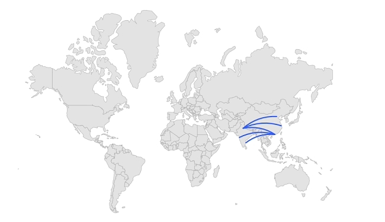
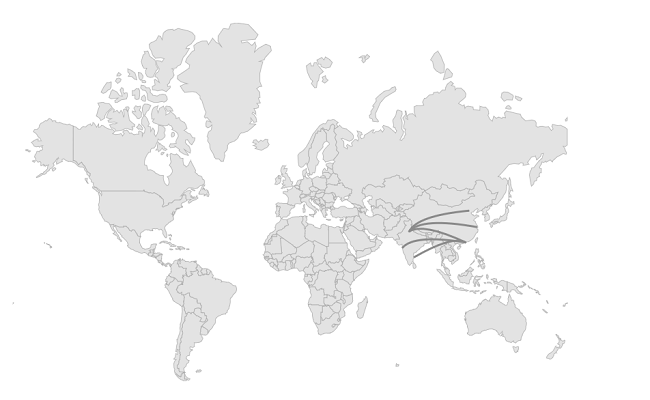
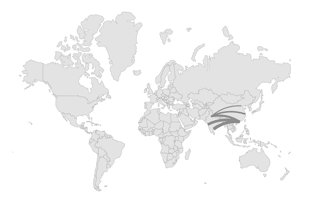

# Arc Layer in .NET MAUI Maps (SfMaps)

Arc layer is a sublayer that renders a group of [`MapArc`]() on [`MapShapeLayer`](https://help.syncfusion.com/cr/maui/Syncfusion.Maui.Maps.MapShapeLayer.html?tabs=tabid-1). This section helps to learn about how to add the arcs and customize them.

## Adding arcs

The [`Arcs`]() is a collection of [`MapArc`](). Every single [`MapArc`]() connects two location coordinates through a curved line. The start coordinate is set to [`MapArc.From`]() property and the end coordinate is set to [`MapArc.To`]() property.





<map:SfMaps>
    <map:SfMaps.Layer>
        <map:MapShapeLayer ShapesSource="https://cdn.syncfusion.com/maps/map-data/world-map.json"
                           ShapeStroke="DarkGrey">
            <map:MapShapeLayer.Sublayers>
                <map:MapArcLayer>
                    <map:MapArcLayer.Arcs>
                        <map:MapArc>
                            <map:MapArc.From>
                                <map:MapLatLng Latitude="77.2090"
                                               Longitude="28.6139" />
                            </map:MapArc.From>
                            <map:MapArc.To>
                                <map:MapLatLng Latitude="116.4074"
                                               Longitude="39.9042" />
                            </map:MapArc.To>
                        </map:MapArc>
                        <map:MapArc>
                            <map:MapArc.From>
                                <map:MapLatLng Latitude="77.1025"
                                               Longitude="28.7041" />
                            </map:MapArc.From>
                            <map:MapArc.To>
                                <map:MapLatLng Latitude="121.4737"
                                               Longitude="31.2304" />
                            </map:MapArc.To>
                        </map:MapArc>
                        <map:MapArc>
                            <map:MapArc.From>
                                <map:MapLatLng Latitude="77.1025"
                                               Longitude="28.7041" />
                            </map:MapArc.From>
                            <map:MapArc.To>
                                <map:MapLatLng Latitude="114.1694"
                                               Longitude="22.3193" />
                            </map:MapArc.To>
                        </map:MapArc>
                        <map:MapArc>
                            <map:MapArc.From>
                                <map:MapLatLng Latitude="72.8777"
                                               Longitude="19.0760" />
                            </map:MapArc.From>
                            <map:MapArc.To>
                                <map:MapLatLng Latitude="114.1694"
                                               Longitude="22.3193" />
                            </map:MapArc.To>
                        </map:MapArc>
                        <map:MapArc>
                            <map:MapArc.From>
                                <map:MapLatLng Latitude="114.1694"
                                               Longitude="22.3193" />
                            </map:MapArc.From>
                            <map:MapArc.To>
                                <map:MapLatLng Latitude="80.2707"
                                               Longitude="13.0827" />
                            </map:MapArc.To>
                        </map:MapArc>
                    </map:MapArcLayer.Arcs>
                </map:MapArcLayer>
            </map:MapShapeLayer.Sublayers>
        </map:MapShapeLayer>
    </map:SfMaps.Layer>
</map:SfMaps>





SfMaps maps = new SfMaps();
MapShapeLayer layer = new MapShapeLayer();
layer.ShapesSource = MapSource.FromUri(new Uri("https://cdn.syncfusion.com/maps/map-data/world-map.json"));
layer.ShapeStroke = Brush.DarkGray;
MapArcLayer arcLayer = new MapArcLayer();
MapArc arc1 = new MapArc();
arc1.From = new MapLatLng(77.2090, 28.6139);
arc1.To = new MapLatLng(116.4074, 39.9042);
MapArc arc2 = new MapArc();
arc2.From = new MapLatLng(77.1025, 28.7041);
arc2.To = new MapLatLng(121.4737, 31.2304);
MapArc arc3 = new MapArc();
arc3.From = new MapLatLng(77.1025, 28.7041);
arc3.To = new MapLatLng(114.1694, 22.3193);
MapArc arc4 = new MapArc();
arc4.From = new MapLatLng(72.8777, 19.0760);
arc4.To = new MapLatLng(114.1694, 22.3193);
MapArc arc5 = new MapArc();
arc5.From = new MapLatLng(114.1694, 22.3193);
arc5.To = new MapLatLng(80.2707, 13.0827);
arcLayer.Arcs.Add(arc1);
arcLayer.Arcs.Add(arc2);
arcLayer.Arcs.Add(arc3);
arcLayer.Arcs.Add(arc4);
arcLayer.Arcs.Add(arc5);
layer.Sublayers.Add(arcLayer);
maps.Layer = layer;
this.Content = maps;





## Height factor

The [`HeightFactor`]() is the distance from the line connecting two points to the arc bend point. The default value of [`HeightFactor`]() property is `0.2` and the value ranges from -1 to 1.

By default, the arc will always render above the [`MapArc.From`]() and [`MapArc.To`]() points. To render the arc below the points, set the value between -1 to 0.





<map:SfMaps>
    <map:SfMaps.Layer>
        <map:MapShapeLayer ShapesSource="https://cdn.syncfusion.com/maps/map-data/world-map.json"
                           ShapeStroke="DarkGrey">
            <map:MapShapeLayer.Sublayers>
                <map:MapArcLayer>
                    <map:MapArcLayer.Arcs>
                        <map:MapArc HeightFactor="-0.2">
                            <map:MapArc.From>
                                <map:MapLatLng Latitude="77.2090"
                                               Longitude="28.6139" />
                            </map:MapArc.From>
                            <map:MapArc.To>
                                <map:MapLatLng Latitude="116.4074"
                                               Longitude="39.9042" />
                            </map:MapArc.To>
                        </map:MapArc>
                        <map:MapArc HeightFactor="-0.2">
                            <map:MapArc.From>
                                <map:MapLatLng Latitude="77.1025"
                                               Longitude="28.7041" />
                            </map:MapArc.From>
                            <map:MapArc.To>
                                <map:MapLatLng Latitude="121.4737"
                                               Longitude="31.2304" />
                            </map:MapArc.To>
                        </map:MapArc>
                        <map:MapArc HeightFactor="-0.2">
                            <map:MapArc.From>
                                <map:MapLatLng Latitude="77.1025"
                                               Longitude="28.7041" />
                            </map:MapArc.From>
                            <map:MapArc.To>
                                <map:MapLatLng Latitude="114.1694"
                                               Longitude="22.3193" />
                            </map:MapArc.To>
                        </map:MapArc>
                        <map:MapArc HeightFactor="-0.2">
                            <map:MapArc.From>
                                <map:MapLatLng Latitude="72.8777"
                                               Longitude="19.0760" />
                            </map:MapArc.From>
                            <map:MapArc.To>
                                <map:MapLatLng Latitude="114.1694"
                                               Longitude="22.3193" />
                            </map:MapArc.To>
                        </map:MapArc>
                        <map:MapArc HeightFactor="-0.2">
                            <map:MapArc.From>
                                <map:MapLatLng Latitude="114.1694"
                                               Longitude="22.3193" />
                            </map:MapArc.From>
                            <map:MapArc.To>
                                <map:MapLatLng Latitude="80.2707"
                                               Longitude="13.0827" />
                            </map:MapArc.To>
                        </map:MapArc>
                    </map:MapArcLayer.Arcs>
                </map:MapArcLayer>
            </map:MapShapeLayer.Sublayers>
        </map:MapShapeLayer>
    </map:SfMaps.Layer>
</map:SfMaps>





SfMaps maps = new SfMaps();
MapShapeLayer layer = new MapShapeLayer();
layer.ShapesSource = MapSource.FromUri(new Uri("https://cdn.syncfusion.com/maps/map-data/world-map.json"));
layer.ShapeStroke = Brush.DarkGray;
MapArcLayer arcLayer = new MapArcLayer();
MapArc arc1 = new MapArc();
arc1.From = new MapLatLng(77.2090, 28.6139);
arc1.To = new MapLatLng(116.4074, 39.9042);
arc1.HeightFactor = -0.2;
MapArc arc2 = new MapArc();
arc2.From = new MapLatLng(77.1025, 28.7041);
arc2.To = new MapLatLng(121.4737, 31.2304);
arc2.HeightFactor = -0.2;
MapArc arc3 = new MapArc();
arc3.From = new MapLatLng(77.1025, 28.7041);
arc3.To = new MapLatLng(114.1694, 22.3193);
arc3.HeightFactor = -0.2;
MapArc arc4 = new MapArc();
arc4.From = new MapLatLng(72.8777, 19.0760);
arc4.To = new MapLatLng(114.1694, 22.3193);
arc4.HeightFactor = -0.2;
MapArc arc5 = new MapArc();
arc5.From = new MapLatLng(114.1694, 22.3193);
arc5.To = new MapLatLng(80.2707, 13.0827);
arc5.HeightFactor = -0.2;
arcLayer.Arcs.Add(arc1);
arcLayer.Arcs.Add(arc2);
arcLayer.Arcs.Add(arc3);
arcLayer.Arcs.Add(arc4);
arcLayer.Arcs.Add(arc5);
layer.Sublayers.Add(arcLayer);
maps.Layer = layer;
this.Content = maps;





## Control point factor

The [`MapArc.ControlPointFactor`]() is the arc bending position. The default value of [`MapArc.ControlPointFactor`]() property is `0.5` and the value ranges from 0 to 1.

By default, the arc will bend at the center between the [`MapArc.From`]() and [`MapArc.To`]() points.





<map:SfMaps>
    <map:SfMaps.Layer>
        <map:MapShapeLayer x:Name="layer"
                           ShapesSource="https://cdn.syncfusion.com/maps/map-data/world-map.json"
                           ShapeStroke="DarkGrey">
            <map:MapShapeLayer.Sublayers>
                <map:MapArcLayer>
                    <map:MapArcLayer.Arcs>
                        <map:MapArc ControlPointFactor="0.2">
                            <map:MapArc.From>
                                <map:MapLatLng Latitude="77.2090"
                                               Longitude="28.6139" />
                            </map:MapArc.From>
                            <map:MapArc.To>
                                <map:MapLatLng Latitude="116.4074"
                                               Longitude="39.9042" />
                            </map:MapArc.To>
                        </map:MapArc>
                        <map:MapArc ControlPointFactor="0.2">
                            <map:MapArc.From>
                                <map:MapLatLng Latitude="77.1025"
                                               Longitude="28.7041" />
                            </map:MapArc.From>
                            <map:MapArc.To>
                                <map:MapLatLng Latitude="121.4737"
                                               Longitude="31.2304" />
                            </map:MapArc.To>
                        </map:MapArc>
                        <map:MapArc ControlPointFactor="0.2">
                            <map:MapArc.From>
                                <map:MapLatLng Latitude="77.1025"
                                               Longitude="28.7041" />
                            </map:MapArc.From>
                            <map:MapArc.To>
                                <map:MapLatLng Latitude="114.1694"
                                               Longitude="22.3193" />
                            </map:MapArc.To>
                        </map:MapArc>
                        <map:MapArc ControlPointFactor="0.2">
                            <map:MapArc.From>
                                <map:MapLatLng Latitude="72.8777"
                                               Longitude="19.0760" />
                            </map:MapArc.From>
                            <map:MapArc.To>
                                <map:MapLatLng Latitude="114.1694"
                                               Longitude="22.3193" />
                            </map:MapArc.To>
                        </map:MapArc>
                        <map:MapArc ControlPointFactor="0.2">
                            <map:MapArc.From>
                                <map:MapLatLng Latitude="114.1694"
                                               Longitude="22.3193" />
                            </map:MapArc.From>
                            <map:MapArc.To>
                                <map:MapLatLng Latitude="80.2707"
                                               Longitude="13.0827" />
                            </map:MapArc.To>
                        </map:MapArc>
                    </map:MapArcLayer.Arcs>
                </map:MapArcLayer>
            </map:MapShapeLayer.Sublayers>
        </map:MapShapeLayer>
    </map:SfMaps.Layer>
</map:SfMaps>





SfMaps maps = new SfMaps();
MapShapeLayer layer = new MapShapeLayer();
layer.ShapesSource = MapSource.FromUri(new Uri("https://cdn.syncfusion.com/maps/map-data/world-map.json"));
layer.ShapeStroke = Brush.DarkGray;
MapArcLayer arcLayer = new MapArcLayer();
MapArc arc1 = new MapArc();
arc1.From = new MapLatLng(77.2090, 28.6139);
arc1.To = new MapLatLng(116.4074, 39.9042);
arc1.ControlPointFactor = 0.2;
MapArc arc2 = new MapArc();
arc2.From = new MapLatLng(77.1025, 28.7041);
arc2.To = new MapLatLng(121.4737, 31.2304);
arc2.ControlPointFactor = 0.2;
MapArc arc3 = new MapArc();
arc3.From = new MapLatLng(77.1025, 28.7041);
arc3.To = new MapLatLng(114.1694, 22.3193);
arc3.ControlPointFactor = 0.2;
MapArc arc4 = new MapArc();
arc4.From = new MapLatLng(72.8777, 19.0760);
arc4.To = new MapLatLng(114.1694, 22.3193);
arc4.ControlPointFactor = 0.2;
MapArc arc5 = new MapArc();
arc5.From = new MapLatLng(114.1694, 22.3193);
arc5.To = new MapLatLng(80.2707, 13.0827);
arc5.ControlPointFactor = 0.2;
arcLayer.Arcs.Add(arc1);
arcLayer.Arcs.Add(arc2);
arcLayer.Arcs.Add(arc3);
arcLayer.Arcs.Add(arc4);
arcLayer.Arcs.Add(arc5);
layer.Sublayers.Add(arcLayer);
maps.Layer = layer;
this.Content = maps;





## Stroke

You can apply colors to each [`MapArc`]() in the [`Arcs`]() collection using the individual [`MapArc.Stroke`]() property.





<map:SfMaps>
    <map:SfMaps.Layer>
        <map:MapShapeLayer ShapesSource="https://cdn.syncfusion.com/maps/map-data/world-map.json"
                           ShapeStroke="DarkGrey">
            <map:MapShapeLayer.Sublayers>
                <map:MapArcLayer>
                    <map:MapArcLayer.Arcs>
                        <map:MapArc Stroke="#ed4545">
                            <map:MapArc.From>
                                <map:MapLatLng Latitude="77.2090"
                                               Longitude="28.6139" />
                            </map:MapArc.From>
                            <map:MapArc.To>
                                <map:MapLatLng Latitude="116.4074"
                                               Longitude="39.9042" />
                            </map:MapArc.To>
                        </map:MapArc>
                        <map:MapArc Stroke="#e35bf8">
                            <map:MapArc.From>
                                <map:MapLatLng Latitude="77.1025"
                                               Longitude="28.7041" />
                            </map:MapArc.From>
                            <map:MapArc.To>
                                <map:MapLatLng Latitude="121.4737"
                                               Longitude="31.2304" />
                            </map:MapArc.To>
                        </map:MapArc>
                        <map:MapArc Stroke="#704cb9">
                            <map:MapArc.From>
                                <map:MapLatLng Latitude="77.1025"
                                               Longitude="28.7041" />
                            </map:MapArc.From>
                            <map:MapArc.To>
                                <map:MapLatLng Latitude="114.1694"
                                               Longitude="22.3193" />
                            </map:MapArc.To>
                        </map:MapArc>
                        <map:MapArc Stroke="#6da0f2">
                            <map:MapArc.From>
                                <map:MapLatLng Latitude="72.8777"
                                               Longitude="19.0760" />
                            </map:MapArc.From>
                            <map:MapArc.To>
                                <map:MapLatLng Latitude="114.1694"
                                               Longitude="22.3193" />
                            </map:MapArc.To>
                        </map:MapArc>
                        <map:MapArc Stroke="#499787">
                            <map:MapArc.From>
                                <map:MapLatLng Latitude="114.1694"
                                               Longitude="22.3193" />
                            </map:MapArc.From>
                            <map:MapArc.To>
                                <map:MapLatLng Latitude="80.2707"
                                               Longitude="13.0827" />
                            </map:MapArc.To>
                        </map:MapArc>
                    </map:MapArcLayer.Arcs>
                </map:MapArcLayer>
            </map:MapShapeLayer.Sublayers>
        </map:MapShapeLayer>
    </map:SfMaps.Layer>
</map:SfMaps>





SfMaps maps = new SfMaps();
MapShapeLayer layer = new MapShapeLayer();
layer.ShapesSource = MapSource.FromUri(new Uri("https://cdn.syncfusion.com/maps/map-data/world-map.json"));
layer.ShapeStroke = Brush.DarkGray;
MapArcLayer arcLayer = new MapArcLayer();
MapArc arc1 = new MapArc();
arc1.From = new MapLatLng(77.2090, 28.6139);
arc1.To = new MapLatLng(116.4074, 39.9042);
arc1.Stroke = Color.FromRgb(237, 69, 69);
MapArc arc2 = new MapArc();
arc2.From = new MapLatLng(77.1025, 28.7041);
arc2.To = new MapLatLng(121.4737, 31.2304);
arc2.Stroke = Color.FromRgb(227, 91, 248);
MapArc arc3 = new MapArc();
arc3.From = new MapLatLng(77.1025, 28.7041);
arc3.To = new MapLatLng(114.1694, 22.3193);
arc3.Stroke = Color.FromRgb(112, 76, 185);
MapArc arc4 = new MapArc();
arc4.From = new MapLatLng(72.8777, 19.0760);
arc4.To = new MapLatLng(114.1694, 22.3193);
arc4.Stroke = Color.FromRgb(109, 160, 242);
MapArc arc5 = new MapArc();
arc5.From = new MapLatLng(114.1694, 22.3193);
arc5.To = new MapLatLng(80.2707, 13.0827);
arc5.Stroke = Color.FromRgb(73, 151, 135);
arcLayer.Arcs.Add(arc1);
arcLayer.Arcs.Add(arc2);
arcLayer.Arcs.Add(arc3);
arcLayer.Arcs.Add(arc4);
arcLayer.Arcs.Add(arc5);
layer.Sublayers.Add(arcLayer);
maps.Layer = layer;
this.Content = maps;





## Stroke thickness

You can apply stroke thickness to each [`MapArc`]() in the [`Arcs`]() collection using the individual [`MapArc.StrokeThickness`]) property. The default value of the [`MapArc.StrokeThickness`]() property is `2`.





<map:SfMaps>
    <map:SfMaps.Layer>
        <map:MapShapeLayer ShapesSource="https://cdn.syncfusion.com/maps/map-data/world-map.json"
                           ShapeStroke="DarkGrey">
            <map:MapShapeLayer.Sublayers>
                <map:MapArcLayer>
                    <map:MapArcLayer.Arcs>
                        <map:MapArc StrokeThickness="2">
                            <map:MapArc.From>
                                <map:MapLatLng Latitude="77.2090"
                                               Longitude="28.6139" />
                            </map:MapArc.From>
                            <map:MapArc.To>
                                <map:MapLatLng Latitude="116.4074"
                                               Longitude="39.9042" />
                            </map:MapArc.To>
                        </map:MapArc>
                        <map:MapArc StrokeThickness="3">
                            <map:MapArc.From>
                                <map:MapLatLng Latitude="77.1025"
                                               Longitude="28.7041" />
                            </map:MapArc.From>
                            <map:MapArc.To>
                                <map:MapLatLng Latitude="121.4737"
                                               Longitude="31.2304" />
                            </map:MapArc.To>
                        </map:MapArc>
                        <map:MapArc StrokeThickness="4">
                            <map:MapArc.From>
                                <map:MapLatLng Latitude="77.1025"
                                               Longitude="28.7041" />
                            </map:MapArc.From>
                            <map:MapArc.To>
                                <map:MapLatLng Latitude="114.1694"
                                               Longitude="22.3193" />
                            </map:MapArc.To>
                        </map:MapArc>
                        <map:MapArc StrokeThickness="5">
                            <map:MapArc.From>
                                <map:MapLatLng Latitude="72.8777"
                                               Longitude="19.0760" />
                            </map:MapArc.From>
                            <map:MapArc.To>
                                <map:MapLatLng Latitude="114.1694"
                                               Longitude="22.3193" />
                            </map:MapArc.To>
                        </map:MapArc>
                        <map:MapArc StrokeThickness="6">
                            <map:MapArc.From>
                                <map:MapLatLng Latitude="114.1694"
                                               Longitude="22.3193" />
                            </map:MapArc.From>
                            <map:MapArc.To>
                                <map:MapLatLng Latitude="80.2707"
                                               Longitude="13.0827" />
                            </map:MapArc.To>
                        </map:MapArc>
                    </map:MapArcLayer.Arcs>
                </map:MapArcLayer>
            </map:MapShapeLayer.Sublayers>
        </map:MapShapeLayer>
    </map:SfMaps.Layer>
</map:SfMaps>





SfMaps maps = new SfMaps();
MapShapeLayer layer = new MapShapeLayer();
layer.ShapesSource = MapSource.FromUri(new Uri("https://cdn.syncfusion.com/maps/map-data/world-map.json"));
layer.ShapeStroke = Brush.DarkGray;
MapArcLayer arcLayer = new MapArcLayer();
MapArc arc1 = new MapArc();
arc1.From = new MapLatLng(77.2090, 28.6139);
arc1.To = new MapLatLng(116.4074, 39.9042);
arc1.StrokeThickness = 2;
MapArc arc2 = new MapArc();
arc2.From = new MapLatLng(77.1025, 28.7041);
arc2.To = new MapLatLng(121.4737, 31.2304);
arc2.StrokeThickness = 3;
MapArc arc3 = new MapArc();
arc3.From = new MapLatLng(77.1025, 28.7041);
arc3.To = new MapLatLng(114.1694, 22.3193);
arc3.StrokeThickness = 4;
MapArc arc4 = new MapArc();
arc4.From = new MapLatLng(72.8777, 19.0760);
arc4.To = new MapLatLng(114.1694, 22.3193);
arc4.StrokeThickness = 5;
MapArc arc5 = new MapArc();
arc5.From = new MapLatLng(114.1694, 22.3193);
arc5.To = new MapLatLng(80.2707, 13.0827);
arc5.StrokeThickness = 6;
arcLayer.Arcs.Add(arc1);
arcLayer.Arcs.Add(arc2);
arcLayer.Arcs.Add(arc3);
arcLayer.Arcs.Add(arc4);
arcLayer.Arcs.Add(arc5);
layer.Sublayers.Add(arcLayer);
maps.Layer = layer;
this.Content = maps;





## Dash array

You can apply dash support for the arc using the [MapArc.StrokeDashArray]() property.

A sequence of dash and gap will be rendered based on the values in this list. Once all values of the list is rendered, it will be repeated again till the end of the arc.





<map:SfMaps>
    <map:SfMaps.Layer>
        <map:MapShapeLayer ShapesSource="https://cdn.syncfusion.com/maps/map-data/world-map.json"
                           ShapeStroke="DarkGrey">
            <map:MapShapeLayer.Sublayers>
                <map:MapArcLayer>
                    <map:MapArcLayer.Arcs>
                        <map:MapArc Stroke="#3d9bf2">
                            <map:MapArc.From>
                                <map:MapLatLng Latitude="77.2090"
                                               Longitude="28.6139" />
                            </map:MapArc.From>
                            <map:MapArc.To>
                                <map:MapLatLng Latitude="116.4074"
                                               Longitude="39.9042" />
                            </map:MapArc.To>
                            <map:MapArc.StrokeDashArray>
                                <DoubleCollection>
                                    <x:Double>4</x:Double>
                                    <x:Double>2</x:Double>
                                    <x:Double>1</x:Double>
                                    <x:Double>2</x:Double>
                                </DoubleCollection>
                            </map:MapArc.StrokeDashArray>
                        </map:MapArc>
                        <map:MapArc Stroke="#3d9bf2">
                            <map:MapArc.From>
                                <map:MapLatLng Latitude="77.1025"
                                               Longitude="28.7041" />
                            </map:MapArc.From>
                            <map:MapArc.To>
                                <map:MapLatLng Latitude="121.4737"
                                               Longitude="31.2304" />
                            </map:MapArc.To>
                            <map:MapArc.StrokeDashArray>
                                <DoubleCollection>
                                    <x:Double>4</x:Double>
                                    <x:Double>2</x:Double>
                                    <x:Double>1</x:Double>
                                    <x:Double>2</x:Double>
                                </DoubleCollection>
                            </map:MapArc.StrokeDashArray>
                        </map:MapArc>
                        <map:MapArc Stroke="#3d9bf2">
                            <map:MapArc.From>
                                <map:MapLatLng Latitude="77.1025"
                                               Longitude="28.7041" />
                            </map:MapArc.From>
                            <map:MapArc.To>
                                <map:MapLatLng Latitude="114.1694"
                                               Longitude="22.3193" />
                            </map:MapArc.To>
                            <map:MapArc.StrokeDashArray>
                                <DoubleCollection>
                                    <x:Double>4</x:Double>
                                    <x:Double>2</x:Double>
                                    <x:Double>1</x:Double>
                                    <x:Double>2</x:Double>
                                </DoubleCollection>
                            </map:MapArc.StrokeDashArray>
                        </map:MapArc>
                        <map:MapArc Stroke="#3d9bf2">
                            <map:MapArc.From>
                                <map:MapLatLng Latitude="72.8777"
                                               Longitude="19.0760" />
                            </map:MapArc.From>
                            <map:MapArc.To>
                                <map:MapLatLng Latitude="114.1694"
                                               Longitude="22.3193" />
                            </map:MapArc.To>
                            <map:MapArc.StrokeDashArray>
                                <DoubleCollection>
                                    <x:Double>4</x:Double>
                                    <x:Double>2</x:Double>
                                    <x:Double>1</x:Double>
                                    <x:Double>2</x:Double>
                                </DoubleCollection>
                            </map:MapArc.StrokeDashArray>
                        </map:MapArc>
                        <map:MapArc Stroke="#3d9bf2">
                            <map:MapArc.From>
                                <map:MapLatLng Latitude="114.1694"
                                               Longitude="22.3193" />
                            </map:MapArc.From>
                            <map:MapArc.To>
                                <map:MapLatLng Latitude="80.2707"
                                               Longitude="13.0827" />
                            </map:MapArc.To>
                            <map:MapArc.StrokeDashArray>
                                <DoubleCollection>
                                    <x:Double>4</x:Double>
                                    <x:Double>2</x:Double>
                                    <x:Double>1</x:Double>
                                    <x:Double>2</x:Double>
                                </DoubleCollection>
                            </map:MapArc.StrokeDashArray>
                        </map:MapArc>
                    </map:MapArcLayer.Arcs>
                </map:MapArcLayer>
            </map:MapShapeLayer.Sublayers>
        </map:MapShapeLayer>
    </map:SfMaps.Layer>
</map:SfMaps>





SfMaps maps = new SfMaps();
MapShapeLayer layer = new MapShapeLayer();
layer.ShapesSource = MapSource.FromUri(new Uri("https://cdn.syncfusion.com/maps/map-data/world-map.json"));
layer.ShapeStroke = Brush.DarkGray;
MapArcLayer arcLayer = new MapArcLayer();
MapArc arc1 = new MapArc();
arc1.From = new MapLatLng(77.2090, 28.6139);
arc1.To = new MapLatLng(116.4074, 39.9042);
arc1.Stroke = Color.FromRgb(61, 155, 242);
arc1.StrokeDashArray = new double[] { 4, 2, 1, 2 };
MapArc arc2 = new MapArc();
arc2.From = new MapLatLng(77.1025, 28.7041);
arc2.To = new MapLatLng(121.4737, 31.2304);
arc2.Stroke = Color.FromRgb(61, 155, 242);
arc2.StrokeDashArray = new double[] { 4, 2, 1, 2 };
MapArc arc3 = new MapArc();
arc3.From = new MapLatLng(77.1025, 28.7041);
arc3.To = new MapLatLng(114.1694, 22.3193);
arc3.Stroke = Color.FromRgb(61, 155, 242);
arc3.StrokeDashArray = new double[] { 4, 2, 1, 2 };
MapArc arc4 = new MapArc();
arc4.From = new MapLatLng(72.8777, 19.0760);
arc4.To = new MapLatLng(114.1694, 22.3193);
arc4.Stroke = Color.FromRgb(61, 155, 242);
arc4.StrokeDashArray = new double[] { 4, 2, 1, 2 };
MapArc arc5 = new MapArc();
arc5.From = new MapLatLng(114.1694, 22.3193);
arc5.To = new MapLatLng(80.2707, 13.0827);
arc5.Stroke = Color.FromRgb(61, 155, 242);
arc5.StrokeDashArray = new double[] { 4, 2, 1, 2 };
arcLayer.Arcs.Add(arc1);
arcLayer.Arcs.Add(arc2);
arcLayer.Arcs.Add(arc3);
arcLayer.Arcs.Add(arc4);
arcLayer.Arcs.Add(arc5);
layer.Sublayers.Add(arcLayer);
maps.Layer = layer;
this.Content = maps;





