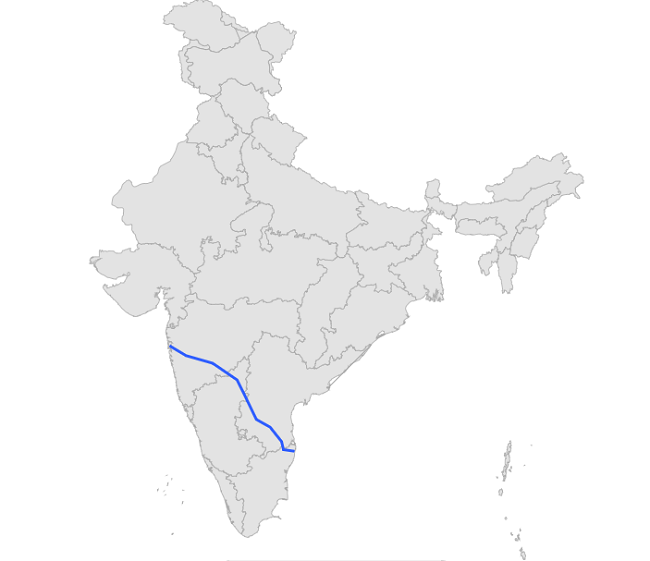
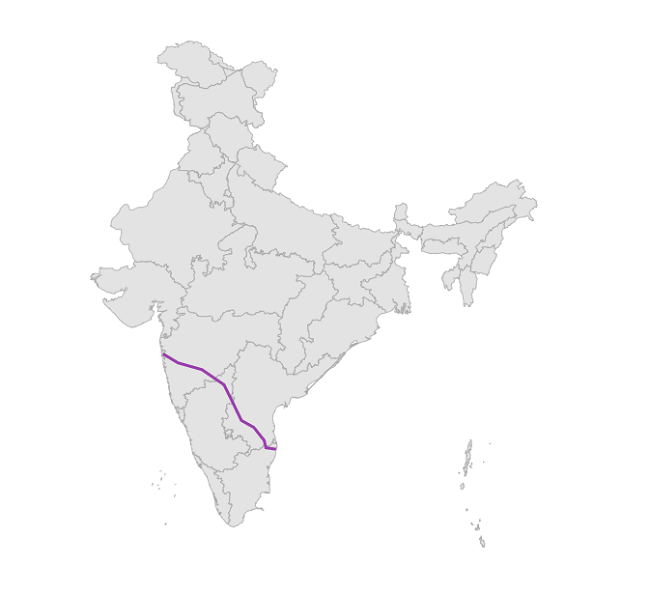
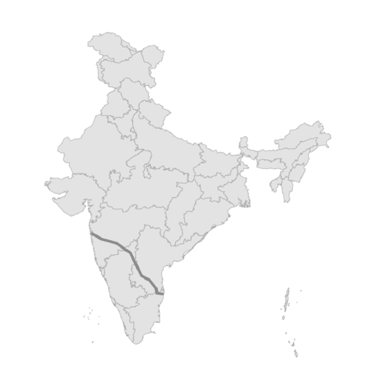
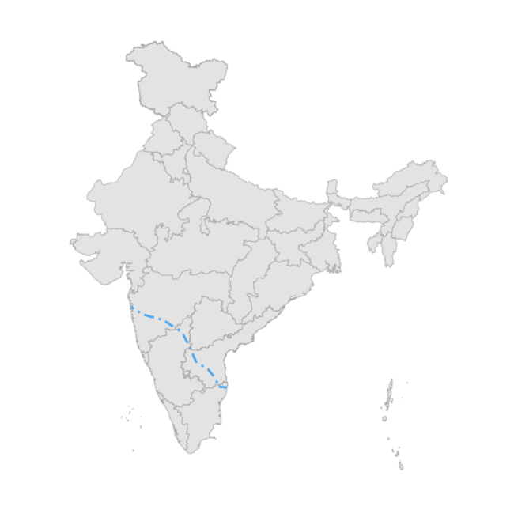

# Polylines in .NET MAUI Maps (SfMaps)

Polyline layer is a sublayer that renders a group of [`MapPolyline`](https://help.syncfusion.com/cr/maui/Syncfusion.Maui.Maps.MapPolyline.html) on [`MapShapeLayer`](https://help.syncfusion.com/cr/maui/Syncfusion.Maui.Maps.MapShapeLayer.html). This section helps to learn about how to add the polylines and customize them.

## Adding polylines

The [`Polylines`](https://help.syncfusion.com/cr/maui/Syncfusion.Maui.Maps.MapPolylineLayer.html#Syncfusion_Maui_Maps_MapPolylineLayer_Polylines) is a collection of [`MapPolyline`](https://help.syncfusion.com/cr/maui/Syncfusion.Maui.Maps.MapPolyline.html). Every single [`MapPolyline`](https://help.syncfusion.com/cr/maui/Syncfusion.Maui.Maps.MapPolyline.html) connects multiple coordinates through a [`Points`](https://help.syncfusion.com/cr/maui/Syncfusion.Maui.Maps.MapPolyline.html#Syncfusion_Maui_Maps_MapPolyline_Points) property.





<map:SfMaps>
    <map:SfMaps.Layer>
        <map:MapShapeLayer ShapesSource="https://cdn.syncfusion.com/maps/map-data/india.json"
                           ShapeStroke="DarkGray">
            <map:MapShapeLayer.Sublayers>
                <map:MapPolylineLayer>
                    <map:MapPolylineLayer.Polylines>
                        <map:MapPolyline>
                            <map:MapPolyline.Points>
                                <map:MapLatLng Latitude="80.2707"
                                               Longitude="13.0827" />
                                <map:MapLatLng Latitude="79.6117"
                                               Longitude="13.1746" />
                                <map:MapLatLng Latitude="79.5037"
                                               Longitude="13.6373" />
                                <map:MapLatLng Latitude="78.8242"
                                               Longitude="14.4673" />
                                <map:MapLatLng Latitude="78.0092"
                                               Longitude="14.9091" />
                                <map:MapLatLng Latitude="77.3566"
                                               Longitude="16.2160" />
                                <map:MapLatLng Latitude="76.8697"
                                               Longitude="17.1557" />
                                <map:MapLatLng Latitude="75.4249"
                                               Longitude="18.0975" />
                                <map:MapLatLng Latitude="73.8567"
                                               Longitude="18.5204" />
                                <map:MapLatLng Latitude="72.8777"
                                               Longitude="19.0760" />
                            </map:MapPolyline.Points>
                        </map:MapPolyline>
                    </map:MapPolylineLayer.Polylines>
                </map:MapPolylineLayer>
            </map:MapShapeLayer.Sublayers>
        </map:MapShapeLayer>
    </map:SfMaps.Layer>
</map:SfMaps>





SfMaps maps = new SfMaps();
MapShapeLayer layer = new MapShapeLayer();
layer.ShapesSource = MapSource.FromResource("MyProject.india.json");
layer.ShapeStroke = Brush.DarkGray;
MapPolylineLayer mapPolylineLayer = new MapPolylineLayer();
MapPolyline polyline = new MapPolyline();
polyline.Points = new ObservableCollection<MapLatLng>()
 {
     new MapLatLng(80.2707, 13.0827),
     new MapLatLng(79.6117, 13.1746),
     new MapLatLng(79.5037, 13.6373),
     new MapLatLng(78.8242, 14.4673),
     new MapLatLng(78.0092, 14.9091),
     new MapLatLng(77.3566, 16.2160),
     new MapLatLng(76.8697, 17.1557),
     new MapLatLng(75.4249, 18.0975),
     new MapLatLng(73.8567, 18.5204),
     new MapLatLng(72.8777, 19.0760),
 };
mapPolylineLayer.Polylines.Add(polyline);
layer.Sublayers.Add(mapPolylineLayer);
maps.Layer = layer;
this.Content = maps;





## Stroke

You can apply colors to each [`MapPolyline`](https://help.syncfusion.com/cr/maui/Syncfusion.Maui.Maps.MapPolyline.html) in the [`Polylines`](https://help.syncfusion.com/cr/maui/Syncfusion.Maui.Maps.MapPolylineLayer.html#Syncfusion_Maui_Maps_MapPolylineLayer_Polylines) collection using the individual [`MapPolyline.Stroke`](https://help.syncfusion.com/cr/maui/Syncfusion.Maui.Maps.MapPolyline.html#Syncfusion_Maui_Maps_MapPolyline_Stroke) property.





<map:SfMaps>
    <map:SfMaps.Layer>
        <map:MapShapeLayer ShapesSource="https://cdn.syncfusion.com/maps/map-data/india.json"
                           ShapeStroke="DarkGray">
            <map:MapShapeLayer.Sublayers>
                <map:MapPolylineLayer>
                    <map:MapPolylineLayer.Polylines>
                        <map:MapPolyline Stroke="#993fad">
                            <map:MapPolyline.Points>
                                <map:MapLatLng Latitude="80.2707"
                                               Longitude="13.0827" />
                                <map:MapLatLng Latitude="79.6117"
                                               Longitude="13.1746" />
                                <map:MapLatLng Latitude="79.5037"
                                               Longitude="13.6373" />
                                <map:MapLatLng Latitude="78.8242"
                                               Longitude="14.4673" />
                                <map:MapLatLng Latitude="78.0092"
                                               Longitude="14.9091" />
                                <map:MapLatLng Latitude="77.3566"
                                               Longitude="16.2160" />
                                <map:MapLatLng Latitude="76.8697"
                                               Longitude="17.1557" />
                                <map:MapLatLng Latitude="75.4249"
                                               Longitude="18.0975" />
                                <map:MapLatLng Latitude="73.8567"
                                               Longitude="18.5204" />
                                <map:MapLatLng Latitude="72.8777"
                                               Longitude="19.0760" />
                            </map:MapPolyline.Points>
                        </map:MapPolyline>
                    </map:MapPolylineLayer.Polylines>
                </map:MapPolylineLayer>
            </map:MapShapeLayer.Sublayers>
        </map:MapShapeLayer>
    </map:SfMaps.Layer>
</map:SfMaps>





SfMaps maps = new SfMaps();
MapShapeLayer layer = new MapShapeLayer();
layer.ShapesSource = MapSource.FromUri(new Uri("https://cdn.syncfusion.com/maps/map-data/india.json"));
layer.ShapeStroke = Brush.DarkGray;
MapPolylineLayer mapPolylineLayer = new MapPolylineLayer();
MapPolyline polyline = new MapPolyline();
polyline.Points = new ObservableCollection<MapLatLng>()
 {
     new MapLatLng(80.2707, 13.0827),
     new MapLatLng(79.6117, 13.1746),
     new MapLatLng(79.5037, 13.6373),
     new MapLatLng(78.8242, 14.4673),
     new MapLatLng(78.0092, 14.9091),
     new MapLatLng(77.3566, 16.2160),
     new MapLatLng(76.8697, 17.1557),
     new MapLatLng(75.4249, 18.0975),
     new MapLatLng(73.8567, 18.5204),
     new MapLatLng(72.8777, 19.0760),
 };
polyline.Stroke = Color.FromRgb(153, 63, 173);
mapPolylineLayer.Polylines.Add(polyline);
layer.Sublayers.Add(mapPolylineLayer);
maps.Layer = layer;
this.Content = maps;





## Stroke thickness

You can apply different stroke thickness to each [`MapPolyline`](https://help.syncfusion.com/cr/maui/Syncfusion.Maui.Maps.MapPolyline.html) in the [`Polylines`](https://help.syncfusion.com/cr/maui/Syncfusion.Maui.Maps.MapPolylineLayer.html#Syncfusion_Maui_Maps_MapPolylineLayer_Polylines) collection using the individual [`MapPolyline.StrokeThickness`](https://help.syncfusion.com/cr/maui/Syncfusion.Maui.Maps.MapPolyline.html#Syncfusion_Maui_Maps_MapPolyline_StrokeThickness) property. The default value of the [`MapPolyline.StrokeThickness`](https://help.syncfusion.com/cr/maui/Syncfusion.Maui.Maps.MapPolyline.html#Syncfusion_Maui_Maps_MapPolyline_StrokeThickness) property is `2`.





<map:SfMaps>
    <map:SfMaps.Layer>
        <map:MapShapeLayer ShapesSource="https://cdn.syncfusion.com/maps/map-data/india.json"
                           ShapeStroke="DarkGray">
            <map:MapShapeLayer.Sublayers>
                <map:MapPolylineLayer>
                    <map:MapPolylineLayer.Polylines>
                        <map:MapPolyline StrokeThickness="3">
                            <map:MapPolyline.Points>
                                <map:MapLatLng Latitude="80.2707"
                                               Longitude="13.0827" />
                                <map:MapLatLng Latitude="79.6117"
                                               Longitude="13.1746" />
                                <map:MapLatLng Latitude="79.5037"
                                               Longitude="13.6373" />
                                <map:MapLatLng Latitude="78.8242"
                                               Longitude="14.4673" />
                                <map:MapLatLng Latitude="78.0092"
                                               Longitude="14.9091" />
                                <map:MapLatLng Latitude="77.3566"
                                               Longitude="16.2160" />
                                <map:MapLatLng Latitude="76.8697"
                                               Longitude="17.1557" />
                                <map:MapLatLng Latitude="75.4249"
                                               Longitude="18.0975" />
                                <map:MapLatLng Latitude="73.8567"
                                               Longitude="18.5204" />
                                <map:MapLatLng Latitude="72.8777"
                                               Longitude="19.0760" />
                            </map:MapPolyline.Points>
                        </map:MapPolyline>
                    </map:MapPolylineLayer.Polylines>
                </map:MapPolylineLayer>
            </map:MapShapeLayer.Sublayers>
        </map:MapShapeLayer>
    </map:SfMaps.Layer>
</map:SfMaps>





SfMaps maps = new SfMaps();
MapShapeLayer layer = new MapShapeLayer();
layer.ShapesSource = MapSource.FromUri(new Uri("https://cdn.syncfusion.com/maps/map-data/india.json"));
layer.ShapeStroke = Brush.DarkGray;
MapPolylineLayer mapPolylineLayer = new MapPolylineLayer();
MapPolyline polyline = new MapPolyline();
polyline.Points = new ObservableCollection<MapLatLng>()
 {
     new MapLatLng(80.2707, 13.0827),
     new MapLatLng(79.6117, 13.1746),
     new MapLatLng(79.5037, 13.6373),
     new MapLatLng(78.8242, 14.4673),
     new MapLatLng(78.0092, 14.9091),
     new MapLatLng(77.3566, 16.2160),
     new MapLatLng(76.8697, 17.1557),
     new MapLatLng(75.4249, 18.0975),
     new MapLatLng(73.8567, 18.5204),
     new MapLatLng(72.8777, 19.0760),
 };
polyline.StrokeThickness = 3;
mapPolylineLayer.Polylines.Add(polyline);
layer.Sublayers.Add(mapPolylineLayer);
maps.Layer = layer;
this.Content = maps;





## Stroke cap

You can apply different stroke cap to each [`MapPolyline`](https://help.syncfusion.com/cr/maui/Syncfusion.Maui.Maps.MapPolyline.html) in the [`Polylines`](https://help.syncfusion.com/cr/maui/Syncfusion.Maui.Maps.MapPolylineLayer.html#Syncfusion_Maui_Maps_MapPolylineLayer_Polylines) collection using the individual [`MapPolyline.StrokeLineCap`](https://help.syncfusion.com/cr/maui/Syncfusion.Maui.Maps.MapPolyline.html#Syncfusion_Maui_Maps_MapPolyline_StrokeLineCap) property. The default value of the [`MapPolylineLayer.StrokeLineCap`](https://help.syncfusion.com/cr/maui/Syncfusion.Maui.Maps.MapPolyline.html#Syncfusion_Maui_Maps_MapPolyline_StrokeLineCap) property is `StrokeLineCap.Butt`. The available values are `Butt`, `Round`, and `Square`.





<map:SfMaps>
    <map:SfMaps.Layer>
        <map:MapShapeLayer ShapesSource="https://cdn.syncfusion.com/maps/map-data/india.json"
                           ShapeStroke="DarkGray">
            <map:MapShapeLayer.Sublayers>
                <map:MapPolylineLayer>
                    <map:MapPolylineLayer.Polylines>
                        <map:MapPolyline StrokeThickness="5"
                                         StrokeLineCap="Round">
                            <map:MapPolyline.Points>
                                <map:MapLatLng Latitude="80.2707"
                                               Longitude="13.0827" />
                                <map:MapLatLng Latitude="79.6117"
                                               Longitude="13.1746" />
                                <map:MapLatLng Latitude="79.5037"
                                               Longitude="13.6373" />
                                <map:MapLatLng Latitude="78.8242"
                                               Longitude="14.4673" />
                                <map:MapLatLng Latitude="78.0092"
                                               Longitude="14.9091" />
                                <map:MapLatLng Latitude="77.3566"
                                               Longitude="16.2160" />
                                <map:MapLatLng Latitude="76.8697"
                                               Longitude="17.1557" />
                                <map:MapLatLng Latitude="75.4249"
                                               Longitude="18.0975" />
                                <map:MapLatLng Latitude="73.8567"
                                               Longitude="18.5204" />
                                <map:MapLatLng Latitude="72.8777"
                                               Longitude="19.0760" />
                            </map:MapPolyline.Points>
                        </map:MapPolyline>
                    </map:MapPolylineLayer.Polylines>
                </map:MapPolylineLayer>
            </map:MapShapeLayer.Sublayers>
        </map:MapShapeLayer>
    </map:SfMaps.Layer>
</map:SfMaps>





SfMaps maps = new SfMaps();
MapShapeLayer layer = new MapShapeLayer();
layer.ShapesSource = MapSource.FromUri(new Uri("https://cdn.syncfusion.com/maps/map-data/india.json"));
layer.ShapeStroke = Brush.DarkGray;
MapPolylineLayer mapPolylineLayer = new MapPolylineLayer();
MapPolyline polyline = new MapPolyline();
polyline.Points = new ObservableCollection<MapLatLng>()
 {
     new MapLatLng(80.2707, 13.0827),
     new MapLatLng(79.6117, 13.1746),
     new MapLatLng(79.5037, 13.6373),
     new MapLatLng(78.8242, 14.4673),
     new MapLatLng(78.0092, 14.9091),
     new MapLatLng(77.3566, 16.2160),
     new MapLatLng(76.8697, 17.1557),
     new MapLatLng(75.4249, 18.0975),
     new MapLatLng(73.8567, 18.5204),
     new MapLatLng(72.8777, 19.0760),
 };
polyline.StrokeThickness = 5;
polyline.StrokeLineCap = LineCap.Round;
mapPolylineLayer.Polylines.Add(polyline);
layer.Sublayers.Add(mapPolylineLayer);
maps.Layer = layer;
this.Content = maps;





## Dash array

You can apply dash support for the polyline using the [`MapPolyline.StrokeDashArray`](https://help.syncfusion.com/cr/maui/Syncfusion.Maui.Maps.MapPolyline.html#Syncfusion_Maui_Maps_MapPolyline_StrokeDashArray) property.

A sequence of dash and gap will be rendered based on the values in this list. Once all values of the list is rendered, it will be repeated again till the end of the polyline.





<map:SfMaps>
    <map:SfMaps.Layer>
        <map:MapShapeLayer ShapesSource="https://cdn.syncfusion.com/maps/map-data/india.json"
                           ShapeStroke="DarkGray">
            <map:MapShapeLayer.Sublayers>
                <map:MapPolylineLayer>
                    <map:MapPolylineLayer.Polylines>
                        <map:MapPolyline Stroke="#52a8ef">
                            <map:MapPolyline.Points>
                                <map:MapLatLng Latitude="80.2707"
                                               Longitude="13.0827" />
                                <map:MapLatLng Latitude="79.6117"
                                               Longitude="13.1746" />
                                <map:MapLatLng Latitude="79.5037"
                                               Longitude="13.6373" />
                                <map:MapLatLng Latitude="78.8242"
                                               Longitude="14.4673" />
                                <map:MapLatLng Latitude="78.0092"
                                               Longitude="14.9091" />
                                <map:MapLatLng Latitude="77.3566"
                                               Longitude="16.2160" />
                                <map:MapLatLng Latitude="76.8697"
                                               Longitude="17.1557" />
                                <map:MapLatLng Latitude="75.4249"
                                               Longitude="18.0975" />
                                <map:MapLatLng Latitude="73.8567"
                                               Longitude="18.5204" />
                                <map:MapLatLng Latitude="72.8777"
                                               Longitude="19.0760" />
                            </map:MapPolyline.Points>
                            <map:MapPolyline.StrokeDashArray>
                                <DoubleCollection>
                                    <x:Double>4</x:Double>
                                    <x:Double>2</x:Double>
                                    <x:Double>1</x:Double>
                                    <x:Double>2</x:Double>
                                </DoubleCollection>
                            </map:MapPolyline.StrokeDashArray>
                        </map:MapPolyline>
                    </map:MapPolylineLayer.Polylines>
                </map:MapPolylineLayer>
            </map:MapShapeLayer.Sublayers>
        </map:MapShapeLayer>
    </map:SfMaps.Layer>
</map:SfMaps>





SfMaps maps = new SfMaps();
MapShapeLayer layer = new MapShapeLayer();
layer.ShapesSource = MapSource.FromUri(new Uri("https://cdn.syncfusion.com/maps/map-data/india.json"));
layer.ShapeStroke = Brush.DarkGray;
MapPolylineLayer mapPolylineLayer = new MapPolylineLayer();
MapPolyline polyline = new MapPolyline();
polyline.Points = new ObservableCollection<MapLatLng>()
{
    new MapLatLng(80.2707, 13.0827),
    new MapLatLng(79.6117, 13.1746),
    new MapLatLng(79.5037, 13.6373),
    new MapLatLng(78.8242, 14.4673),
    new MapLatLng(78.0092, 14.9091),
    new MapLatLng(77.3566, 16.2160),
    new MapLatLng(76.8697, 17.1557),
    new MapLatLng(75.4249, 18.0975),
    new MapLatLng(73.8567, 18.5204),
    new MapLatLng(72.8777, 19.0760),
};
polyline.Stroke = Color.FromRgb(82, 168, 239);
polyline.StrokeDashArray = new double[] { 4, 2, 1, 2 };
mapPolylineLayer.Polylines.Add(polyline);
layer.Sublayers.Add(mapPolylineLayer);
maps.Layer = layer;
this.Content = maps;





