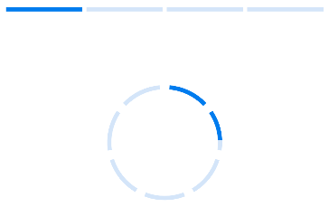

# Segments in .NET MAUI ProgressBar (Progress Bar)

To visualize the progress of multiple sequential tasks, split the progress bar into multiple segments by setting the [`SegmentCount`]() property as demonstrated in the following code sample.

 



<!--Using linear progress bar-->

<progressBar:SfLinearProgressBar Progress="25" SegmentCount="4" />

<!--Using circular progress bar-->

<progressBar:SfCircularProgressBar Progress="25" SegmentCount="7" />





// Using linear progress bar.

SfLinearProgressBar linearProgressBar = new SfLinearProgressBar();

linearProgressBar.Progress = 25;

linearProgressBar.SegmentCount = 4;

this.Content = linearProgressBar;

// Using circular progress bar.

SfCircularProgressBar circularProgressBar = new SfCircularProgressBar();

circularProgressBar.Progress = 25;

circularProgressBar.SegmentCount = 7;

this.Content = circularProgressBar;



 

## Gap customization

You can also customize the default spacing between the segments using the [`GapWidth`]() property as demonstrated in following code sample.

 


<!--Using linear progress bar-->

<progressBar:SfLinearProgressBar Progress="25" SegmentCount="4" SegmentGapWidth="5" />

<!--Using circular progress bar-->

<progressBar:SfCircularProgressBar Progress="25" SegmentCount="7" SegmentGapWidth="10" />




// Using linear progress bar.

SfLinearProgressBar linearProgressBar = new SfLinearProgressBar();

linearProgressBar.Progress = 25;

linearProgressBar.SegmentCount = 4;

linearProgressBar.SegmentGapWidth = 5;

this.Content = linearProgressBar;

// Using circular progress bar.

SfCircularProgressBar circularProgressBar = new SfCircularProgressBar();

circularProgressBar.Progress = 25;

circularProgressBar.SegmentCount = 7;

circularProgressBar.SegmentGapWidth = 10;

this.Content = circularProgressBar;



 

