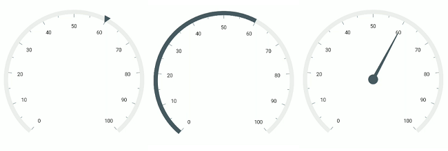

# Pointers in .NET MAUI Radial Gauge

 Pointer is used to indicate values on an axis. The radial gauge control has three types of pointers: 

* `Shape pointer`
* `Content pointer`
* [`Needle Pointer`](https://help.syncfusion.com/maui/radialgauge/needle-pointer)
* [`Range pointer`](https://help.syncfusion.com/maui/radialgauge/range-pointer)

All the pointers can be customized as needed. You can add multiple pointers to the gauge to point the multiple values on the same scale. The value of the pointer is set using the [`Value`](https://help.syncfusion.com/cr/maui/Syncfusion.Maui.Gauges.RadialPointer.html#Syncfusion_Maui_Gauges_RadialPointer_Value) property.

## Multiple pointers

In addition to the default pointer, you can add `N` number of pointers to an axis by adding in the [`Pointers`](https://help.syncfusion.com/cr/maui/Syncfusion.Maui.Gauges.RadialAxis.html#Syncfusion_Maui_Gauges_RadialAxis_Pointers) collection property.





<gauge:SfRadialGauge>
    <gauge:SfRadialGauge.Axes>
        <gauge:RadialAxis>
            <gauge:RadialAxis.Pointers>
                <gauge:RangePointer Value="30" />
                <gauge:ShapePointer Value="70" />
                <gauge:NeedlePointer Value="60" />
            </gauge:RadialAxis.Pointers>
        </gauge:RadialAxis>
    </gauge:SfRadialGauge.Axes>
</gauge:SfRadialGauge>





SfRadialGauge sfRadialGauge = new SfRadialGauge();

RadialAxis radialAxis = new RadialAxis();
RangePointer rangePointer = new RangePointer { Value = 30 };
radialAxis.Pointers.Add(rangePointer);
ShapePointer markerPointer = new ShapePointer { Value = 70 };
radialAxis.Pointers.Add(markerPointer);
NeedlePointer needlePointer = new NeedlePointer { Value = 60 };
radialAxis.Pointers.Add(needlePointer);

sfRadialGauge.Axes.Add(radialAxis);

this.Content = sfRadialGauge;





## Pointer interaction

Pointers can be dragged over the axis scale. It can be achieved by swipe or drag gestures. To enable or disable the pointer drag, use the [`IsInteractive`](https://help.syncfusion.com/cr/maui/Syncfusion.Maui.Gauges.RadialPointer.html#Syncfusion_Maui_Gauges_RadialPointer_IsInteractive) property.





<gauge:SfRadialGauge>
            <gauge:SfRadialGauge.Axes>
                <gauge:RadialAxis ShowTicks="False">
                    <gauge:RadialAxis.AxisLineStyle>
                        <gauge:RadialLineStyle Thickness="30" Fill="CornflowerBlue"/>
                    </gauge:RadialAxis.AxisLineStyle>
                    <gauge:RadialAxis.Pointers>
                        <gauge:ShapePointer Value="30"
                                     IsInteractive="True"
                                     Offset="-30"
                                     Fill="Indigo" />
                    </gauge:RadialAxis.Pointers>
                </gauge:RadialAxis>
            </gauge:SfRadialGauge.Axes>
        </gauge:SfRadialGauge>





 SfRadialGauge sfRadialGauge = new SfRadialGauge();

            RadialAxis radialAxis = new RadialAxis();
            radialAxis.ShowTicks = false;
            radialAxis.AxisLineStyle.Fill = new SolidColorBrush(Colors.CornflowerBlue);
            radialAxis.AxisLineStyle.Thickness = 30;
            sfRadialGauge.Axes.Add(radialAxis);

            ShapePointer markerPointer = new ShapePointer();
            markerPointer.Value = 30;
            markerPointer.IsInteractive = true;
            markerPointer.Fill = new SolidColorBrush(Colors.Indigo);
            markerPointer.Offset = -30;
            radialAxis.Pointers.Add(markerPointer);

this.Content = sfRadialGauge;





## Step frequency

The [`StepFrequency`](https://help.syncfusion.com/cr/maui/Syncfusion.Maui.Gauges.RadialPointer.html#Syncfusion_Maui_Gauges_RadialPointer_StepFrequency) property is used to specify the interval between snap points while dragging the pointer.

For example, if the value of [`StepFrequency`](https://help.syncfusion.com/cr/maui/Syncfusion.Maui.Gauges.RadialPointer.html#Syncfusion_Maui_Gauges_RadialPointer_StepFrequency) is 20, the pointer will not move continuously while dragging; instead, it will update in terms of 20.

N> To work with the [`StepFrequency`](https://help.syncfusion.com/cr/maui/Syncfusion.Maui.Gauges.RadialPointer.html#Syncfusion_Maui_Gauges_RadialPointer_StepFrequency) value, enable pointer interaction support.





 <gauge:SfRadialGauge x:Name="gauge">
            <gauge:SfRadialGauge.Axes>
                <gauge:RadialAxis ShowTicks="False">
                    <gauge:RadialAxis.AxisLineStyle>
                        <gauge:RadialLineStyle Thickness="30" Fill="CornflowerBlue"/>
                    </gauge:RadialAxis.AxisLineStyle>
                    <gauge:RadialAxis.Pointers>
                        <gauge:ShapePointer Value="30"
                                             IsInteractive="True"
                                             StepFrequency="5"
                                             Offset="-30"
                                             Fill="Indigo" />
                    </gauge:RadialAxis.Pointers>
                </gauge:RadialAxis>
            </gauge:SfRadialGauge.Axes>
        </gauge:SfRadialGauge>





 SfRadialGauge sfRadialGauge = new SfRadialGauge();

            RadialAxis radialAxis = new RadialAxis();
            radialAxis.ShowTicks = false;
            radialAxis.AxisLineStyle.Fill = new SolidColorBrush(Colors.CornflowerBlue);
            radialAxis.AxisLineStyle.Thickness = 30;
            sfRadialGauge.Axes.Add(radialAxis);

            ShapePointer markerPointer = new ShapePointer();
            markerPointer.Value = 30;
            markerPointer.IsInteractive = true;
            markerPointer.StepFrequency = 5;
            markerPointer.Fill = new SolidColorBrush(Colors.Indigo);
            markerPointer.Offset = -30;
            radialAxis.Pointers.Add(markerPointer);

            this.Content = sfRadialGauge;





## Event

[`ValueChangeStarted`](https://help.syncfusion.com/cr/maui/Syncfusion.Maui.Gauges.RadialPointer.html#Syncfusion_Maui_Gauges_RadialPointer_ValueChangeStarted) - Occurs whenever the pointer starts to drag.

[`ValueChanging`](https://help.syncfusion.com/cr/maui/Syncfusion.Maui.Gauges.RadialPointer.html#Syncfusion_Maui_Gauges_RadialPointer_ValueChanging) - Occurs before the current drag value gets updated as pointer value. The `Cancel` argument of `ValueChangingEventArgs` allows to restrict the update of current drag value.

[`ValueChanged`](https://help.syncfusion.com/cr/maui/Syncfusion.Maui.Gauges.RadialPointer.html#Syncfusion_Maui_Gauges_RadialPointer_ValueChanged) - Occurs whenever the pointer value is changed while dragging.

[`ValueChangeCompleted`](https://help.syncfusion.com/cr/maui/Syncfusion.Maui.Gauges.RadialPointer.html#Syncfusion_Maui_Gauges_RadialPointer_ValueChangeCompleted) - Occurs once the dragging of the pointer gets completed.





<gauge:SfRadialGauge>
    <gauge:SfRadialGauge.Axes>
        <gauge:RadialAxis>
            <gauge:RadialAxis.Pointers>
                <gauge:ShapePointer Value="30"
                                     IsInteractive="True"
                                     ValueChanging="MarkerPointer_ValueChanging"
                                     ValueChanged="MarkerPointer_ValueChanged"/>
            </gauge:RadialAxis.Pointers>
        </gauge:RadialAxis>
    </gauge:SfRadialGauge.Axes>
</gauge:SfRadialGauge>





SfRadialGauge sfRadialGauge = new SfRadialGauge();

            RadialAxis radialAxis = new RadialAxis();
            sfRadialGauge.Axes.Add(radialAxis);

            ShapePointer markerPointer = new ShapePointer();
            markerPointer.Value = 30;
            markerPointer.IsInteractive = true;
            markerPointer.ValueChanging += MarkerPointer_ValueChanging;
            markerPointer.ValueChanged += MarkerPointer_ValueChanged;
            radialAxis.Pointers.Add(markerPointer);

            this.Content = sfRadialGauge;

...

private void MarkerPointer_ValueChanging(object sender, ValueChangingEventArgs e)
{
    if (e.NewValue > 60)
    {
        e.Cancel = true;
    }
}

private void MarkerPointer_ValueChanged(object sender, ValueChangedEventArgs e)
{

}




