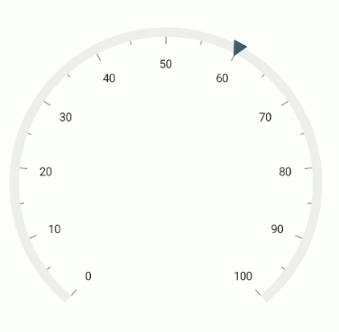
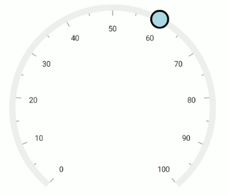
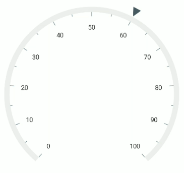

# Shape Pointer in .NET MAUI Radial Gauge

Indicate current values by using different types of shape pointers. You can change the shape type using the `ShapeType` property.





<gauge:SfRadialGauge>
    <gauge:SfRadialGauge.Axes>
        <gauge:RadialAxis>
            <gauge:RadialAxis.Pointers>
                <gauge:ShapePointer Value="60" />
            </gauge:RadialAxis.Pointers>
        </gauge:RadialAxis>
    </gauge:SfRadialGauge.Axes>
</gauge:SfRadialGauge>





SfRadialGauge sfRadialGauge = new SfRadialGauge();

RadialAxis radialAxis = new RadialAxis();
sfRadialGauge.Axes.Add(radialAxis);

ShapePointer pointer = new ShapePointer();
pointer.Value = 60;
radialAxis.Pointers.Add(pointer);

this.Content = sfRadialGauge;





Gauge supports the following types of shapes:

* Circle
* Diamond
* Inverted triangle
* Rectangle
* Triangle

## Shape customization

The shape pointer can be customized using the following properties:

* `Fill` – Allows you to customize the shape color.
* `ShapeHeight` – Allows you to specify the shape height.
* `ShapeWidth` – Allows you to specify the shape width.
* `Stroke` – Allows you to specify the border color for the shape.
* `BorderWidth` – Allows you to specify the border width of the shape.
* `HasShadow` – Allows you to specify the shadow of the shape.
* `OverlayFill` – Allows you to specify the color for the shapes' dragging overlay.
* `OverlayRadius` – Allows you to specify the radius for the shapes' dragging overlay.





<gauge:SfRadialGauge>
    <gauge:SfRadialGauge.Axes>
        <gauge:RadialAxis>
            <gauge:RadialAxis.Pointers>
                <gauge:ShapePointer Value="60"
                                     ShapeHeight="30"
                                     ShapeWidth="30"
                                     Stroke="Black"
                                     BorderWidth="3"
                                     ShapeType="Circle"
                                     Fill="LightBlue"/>
            </gauge:RadialAxis.Pointers>
        </gauge:RadialAxis>
    </gauge:SfRadialGauge.Axes>
</gauge:SfRadialGauge>





SfRadialGauge sfRadialGauge = new SfRadialGauge();

		RadialAxis radialAxis = new RadialAxis();
		sfRadialGauge.Axes.Add(radialAxis);

		ShapePointer pointer = new ShapePointer();
		pointer.Value = 60;
		pointer.ShapeHeight = 30;
		pointer.ShapeWidth = 30;
		pointer.Stroke = Colors.Black;
		pointer.BorderWidth = 3;
		pointer.ShapeType = ShapeType.Circle;
		pointer.Fill = new SolidColorBrush(Colors.LightBlue);
		radialAxis.Pointers.Add(pointer);

		this.Content = sfRadialGauge;





## Shadow support

The shadow can be applied by the `HasShadow` property.





 <gauge:SfRadialGauge>
                <gauge:SfRadialGauge.Axes>
                    <gauge:RadialAxis>
                        <gauge:RadialAxis.Pointers>
                            <gauge:ShapePointer Value="60" ShapeType="Circle" HasShadow="True"/>
                        </gauge:RadialAxis.Pointers>
                    </gauge:RadialAxis>
                </gauge:SfRadialGauge.Axes>
            </gauge:SfRadialGauge>





SfRadialGauge sfRadialGauge = new SfRadialGauge();

		RadialAxis radialAxis = new RadialAxis();
		sfRadialGauge.Axes.Add(radialAxis);

		ShapePointer pointer = new ShapePointer();
		pointer.Value = 60;
		pointer.ShapeType = ShapeType.Circle;
		pointer.HasShadow = true;
		radialAxis.Pointers.Add(pointer);

		this.Content = sfRadialGauge;





## Shape pointer overlay

The shape pointer overlay is rendered around the shape when the shape pointer is dragged. When `IsInteractive` property of pointer is set to true and the marker is dragged, the overlay will come around the marker pointer.





  <gauge:SfRadialGauge>
                <gauge:SfRadialGauge.Axes>
                    <gauge:RadialAxis>
                        <gauge:RadialAxis.Pointers>
                            <gauge:ShapePointer Value="60" ShapeType="Circle" 
                                                IsInteractive="True" OverlayRadius="20"/>
                        </gauge:RadialAxis.Pointers>
                    </gauge:RadialAxis>
                </gauge:SfRadialGauge.Axes>
            </gauge:SfRadialGauge>





SfRadialGauge sfRadialGauge = new SfRadialGauge();

		RadialAxis radialAxis = new RadialAxis();
		sfRadialGauge.Axes.Add(radialAxis);

		ShapePointer pointer = new ShapePointer();
		pointer.Value = 60;
		pointer.ShapeType = ShapeType.Circle;
		pointer.OverlayRadius = 20;
		pointer.IsInteractive = true;
		radialAxis.Pointers.Add(pointer);

		this.Content = sfRadialGauge;





## Marker position customization

The marker pointer can be moved near or far from its actual position using the `Offset` and [`OffsetUnit`](https://help.syncfusion.com/cr/maui/Syncfusion.Maui.Gauges.MarkerPointer.html#Syncfusion_Maui_Gauges_MarkerPointer_OffsetUnit) properties. 

When you set [`OffsetUnit`](https://help.syncfusion.com/cr/maui/Syncfusion.Maui.Gauges.MarkerPointer.html#Syncfusion_Maui_Gauges_MarkerPointer_OffsetUnit) to pixel, the marker pointer will be moved based on the pixel value. If you set [`OffsetUnit`](https://help.syncfusion.com/cr/maui/Syncfusion.Maui.Gauges.MarkerPointer.html#Syncfusion_Maui_Gauges_MarkerPointer_OffsetUnit) to factor, then provided factor will be multiplied by the scale radius value, and then the pointer will be moved to corresponding value. The default value of [`OffsetUnit`](https://help.syncfusion.com/cr/maui/Syncfusion.Maui.Gauges.MarkerPointer.html#Syncfusion_Maui_Gauges_MarkerPointer_OffsetUnit) is [`SizeUnit.Pixel`](https://help.syncfusion.com/cr/maui/Syncfusion.Maui.Gauges.SizeUnit.html#Syncfusion_Maui_Gauges_SizeUnit_Pixel).





<gauge:SfRadialGauge>
    <gauge:SfRadialGauge.Axes>
        <gauge:RadialAxis>
            <gauge:RadialAxis.Pointers>
                <gauge:ShapePointer Value="60"
                                    Offset="-18"/>
            </gauge:RadialAxis.Pointers>
        </gauge:RadialAxis>
    </gauge:SfRadialGauge.Axes>
</gauge:SfRadialGauge>





SfRadialGauge sfRadialGauge = new SfRadialGauge();

RadialAxis radialAxis = new RadialAxis();
sfRadialGauge.Axes.Add(radialAxis);

ShapePointer pointer = new ShapePointer();
pointer.Value = 60;
pointer.Offset = -18;
radialAxis.Pointers.Add(pointer);

this.Content = sfRadialGauge;





