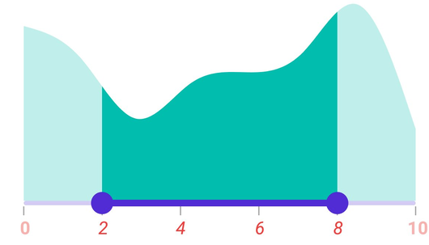

# Labels in .NET MAUI Range Selector (SfRangeSelector)

This section explains about how to add the labels in the range selector.

## Show labels

The [`ShowLabels`](https://help.syncfusion.com/cr/maui/Syncfusion.Maui.Sliders.SliderBase.html#Syncfusion_Maui_Sliders_SliderBase_ShowLabels) property is used to render the labels on given interval. The default value of [`ShowLabels`](https://help.syncfusion.com/cr/maui/Syncfusion.Maui.Sliders.SliderBase.html#Syncfusion_Maui_Sliders_SliderBase_ShowLabels) property is `False`.





<ContentPage 
             ...
             xmlns:rangeselector="clr-namespace:Syncfusion.Maui.Sliders;assembly=Syncfusion.Maui.Sliders"
             xmlns:chart="clr-namespace:Syncfusion.Maui.Charts;assembly=Syncfusion.Maui.Charts">
    <rangeselector:SfRangeSelector Minimum="0" 
                                   Maximum="10"
                                   RangeStart="2"
                                   RangeEnd="8" 
                                   Interval="2" 
                                   ShowLabels="True"
                                   ShowTicks="True">
        <chart:SfCartesianChart />
    </rangeselector:SfRangeSelector>
</ContentPage>





SfRangeSelector rangeSelector = new SfRangeSelector();
rangeSelector.Minimum = 0;
rangeSelector.Maximum = 10;
rangeSelector.RangeStart = 2;
rangeSelector.RangeEnd = 8;
rangeSelector.Interval = 2;
rangeSelector.ShowLabels = true;
rangeSelector.ShowTicks = true;
SfCartesianChart chart = new SfCartesianChart();
rangeSelector.Content = chart;





## Number format

The [`NumberFormat`](https://help.syncfusion.com/cr/maui/Syncfusion.Maui.Sliders.SliderBase.html#Syncfusion_Maui_Sliders_SliderBase_NumberFormat) property is used to format the numeric labels. The default value of [`NumberFormat`](https://help.syncfusion.com/cr/maui/Syncfusion.Maui.Sliders.SliderBase.html#Syncfusion_Maui_Sliders_SliderBase_NumberFormat) property is `0.##`.





<ContentPage 
             ...
             xmlns:rangeselector="clr-namespace:Syncfusion.Maui.Sliders;assembly=Syncfusion.Maui.Sliders"
             xmlns:chart="clr-namespace:Syncfusion.Maui.Charts;assembly=Syncfusion.Maui.Charts">
    <rangeselector:SfRangeSelector Minimum="0" 
                                   Maximum="10"
                                   RangeStart="2"
                                   RangeEnd="8" 
                                   Interval="2"
                                   NumberFormat="$##" 
                                   ShowLabels="True"
                                   ShowTicks="True">
        <chart:SfCartesianChart />
    </rangeselector:SfRangeSelector>
</ContentPage>





SfRangeSelector rangeSelector = new SfRangeSelector();
rangeSelector.Minimum = 0;
rangeSelector.Maximum = 10;
rangeSelector.RangeStart = 2;
rangeSelector.RangeEnd = 8;
rangeSelector.Interval = 2;
rangeSelector.NumberFormat = "$##";
rangeSelector.ShowLabels = true;
rangeSelector.ShowTicks = true;
SfCartesianChart chart = new SfCartesianChart();
rangeSelector.Content = chart;





## Date format

The [`DateFormat`](https://help.syncfusion.com/cr/maui/Syncfusion.Maui.Sliders.SliderBase.html#Syncfusion_Maui_Sliders_SliderBase_DateFormat) property is used to format the date labels. It is mandatory for date [`SfDateTimeRangeSelector`](https://help.syncfusion.com/cr/maui/Syncfusion.Maui.Sliders.SfRangeSelector.html). For date values, the slider does not have auto interval support. So, it is mandatory to set [`Interval`](https://help.syncfusion.com/cr/maui/Syncfusion.Maui.Sliders.SliderBase.html#Syncfusion_Maui_Sliders_SliderBase_Interval), [`IntervalType`](https://help.syncfusion.com/cr/maui/Syncfusion.Maui.Sliders.SliderBase.html#Syncfusion_Maui_Sliders_SliderBase_DateIntervalType), and [`DateFormat`](https://help.syncfusion.com/cr/maui/Syncfusion.Maui.Sliders.SliderBase.html#Syncfusion_Maui_Sliders_SliderBase_DateFormat) for date values. The default value of [`DateFormat`](https://help.syncfusion.com/cr/maui/Syncfusion.Maui.Sliders.SliderBase.html#Syncfusion_Maui_Sliders_SliderBase_DateFormat) property is `yyyy`.





<ContentPage 
             ...
             xmlns:rangeselector="clr-namespace:Syncfusion.Maui.Sliders;assembly=Syncfusion.Maui.Sliders"
             xmlns:chart="clr-namespace:Syncfusion.Maui.Charts;assembly=Syncfusion.Maui.Charts">
    <rangeselector:SfDateTimeRangeSelector Minimum="2000-01-01T09:00:00" 
                                           Maximum="2000-01-01T17:00:00" 
                                           RangeStart="2000-01-01T11:00:00" 
                                           RangeEnd="2000-01-01T15:00:00" 
                                           ShowLabels="True" 
                                           ShowTicks="True" 
                                           IntervalType="Hours" 
                                           Interval="2" 
                                           DateFormat="h tt"
                                           ShowTicks="True">
        <chart:SfCartesianChart />
    </rangeselector:SfDateTimeRangeSelector>
</ContentPage>





SfDateTimeRangeSelector rangeSelector = new SfDateTimeRangeSelector();
rangeSelector.Minimum = new DateTime(2000, 01, 01, 09, 00, 00);
rangeSelector.Maximum = new DateTime(2000, 01, 01, 17, 00, 00);
rangeSelector.RangeStart = new DateTime(2000, 01, 01, 11, 00, 00);
rangeSelector.RangeEnd = new DateTime(2000, 01, 01, 15, 00, 00);
rangeSelector.Interval = 2;
rangeSelector.IntervalType = SliderDateIntervalType.Hours;
rangeSelector.DateFormat = "h tt";
rangeSelector.ShowLabels = true;
rangeSelector.ShowTicks = true;
SfCartesianChart chart = new SfCartesianChart();
rangeSelector.Content = chart;





## Label placement

The [`LabelsPlacement`](https://help.syncfusion.com/cr/maui/Syncfusion.Maui.Sliders.SliderBase.html#Syncfusion_Maui_Sliders_SliderBase_LabelsPlacement) property is used to place the labels either between the major ticks or on the major ticks. The default value of the [`LabelsPlacement`](https://help.syncfusion.com/cr/maui/Syncfusion.Maui.Sliders.SliderBase.html#Syncfusion_Maui_Sliders_SliderBase_LabelsPlacement) property is [`SliderLabelsPlacement.OnTicks`](https://help.syncfusion.com/cr/maui/Syncfusion.Maui.Sliders.SliderLabelsPlacement.html#Syncfusion_Maui_Sliders_SliderLabelsPlacement_OnTicks).





<ContentPage 
             ...
             xmlns:rangeselector="clr-namespace:Syncfusion.Maui.Sliders;assembly=Syncfusion.Maui.Sliders"
             xmlns:chart="clr-namespace:Syncfusion.Maui.Charts;assembly=Syncfusion.Maui.Charts">
    <rangeselector:SfRangeSelector Minimum="0" 
                                   Maximum="10" 
                                   Interval="2"
                                   RangeStart="2"
                                   RangeEnd="8" 
                                   LabelsPlacement="BetweenTicks"  
                                   ShowLabels="True" 
                                   ShowTicks="True">
        <chart:SfCartesianChart />
    </rangeselector:SfRangeSelector>
</ContentPage>





SfRangeSelector rangeSelector = new SfRangeSelector();
rangeSelector.Minimum = 0;
rangeSelector.Maximum = 10;
rangeSelector.RangeStart = 2;
rangeSelector.RangeEnd = 8;
rangeSelector.Interval = 2;
rangeSelector.LabelsPlacement = SliderLabelsPlacement.BetweenTicks;
rangeSelector.ShowLabels = true;
rangeSelector.ShowTicks = true;
SfCartesianChart chart = new SfCartesianChart();
rangeSelector.Content = chart;





N> Refer [here](https://help.syncfusion.com/maui/range-slider/events) to customize label text format through range slider events.

## Label style

You can change the active and inactive label appearance of the range selector using the [`ActiveTextColor`](https://help.syncfusion.com/cr/maui/Syncfusion.Maui.Sliders.SliderLabelStyle.html#Syncfusion_Maui_Sliders_SliderLabelStyle_ActiveTextColor), [`ActiveFontSize`](https://help.syncfusion.com/cr/maui/Syncfusion.Maui.Sliders.SliderLabelStyle.html#Syncfusion_Maui_Sliders_SliderLabelStyle_ActiveFontSize), [`ActiveFontFamily`](https://help.syncfusion.com/cr/maui/Syncfusion.Maui.Sliders.SliderLabelStyle.html#Syncfusion_Maui_Sliders_SliderLabelStyle_ActiveFontFamily), [`ActiveFontAttributes`](https://help.syncfusion.com/cr/maui/Syncfusion.Maui.Sliders.SliderLabelStyle.html#Syncfusion_Maui_Sliders_SliderLabelStyle_ActiveFontAttributes), [`InactiveTextColor`](https://help.syncfusion.com/cr/maui/Syncfusion.Maui.Sliders.SliderLabelStyle.html#Syncfusion_Maui_Sliders_SliderLabelStyle_InactiveTextColor), [`InactiveFontSize`](https://help.syncfusion.com/cr/maui/Syncfusion.Maui.Sliders.SliderLabelStyle.html#Syncfusion_Maui_Sliders_SliderLabelStyle_InactiveFontSize), [`InactiveFontFamily`](https://help.syncfusion.com/cr/maui/Syncfusion.Maui.Sliders.SliderLabelStyle.html#Syncfusion_Maui_Sliders_SliderLabelStyle_InactiveFontFamily), [`InactiveFontAttributes`](https://help.syncfusion.com/cr/maui/Syncfusion.Maui.Sliders.SliderLabelStyle.html#Syncfusion_Maui_Sliders_SliderLabelStyle_InactiveFontAttributes) and [`Offset`](https://help.syncfusion.com/cr/maui/Syncfusion.Maui.Sliders.SliderLabelStyle.html#Syncfusion_Maui_Sliders_SliderLabelStyle_Offset)  properties of the [`LabelStyle`](https://help.syncfusion.com/cr/maui/Syncfusion.Maui.Sliders.SliderLabelStyle.html) class.

The active side of the range selector is between start and end thumbs.

The inactive side of the range selector is between the [`Minimum`](https://help.syncfusion.com/cr/maui/Syncfusion.Maui.Sliders.SliderBase.html#Syncfusion_Maui_Sliders_SliderBase_Minimum) value and the left thumb, and the right thumb and the [`Maximum`](https://help.syncfusion.com/cr/maui/Syncfusion.Maui.Sliders.SliderBase.html#Syncfusion_Maui_Sliders_SliderBase_Maximum) value.





<ContentPage 
             ...
             xmlns:rangeselector="clr-namespace:Syncfusion.Maui.Sliders;assembly=Syncfusion.Maui.Sliders"
             xmlns:chart="clr-namespace:Syncfusion.Maui.Charts;assembly=Syncfusion.Maui.Charts">
    <rangeselector:SfRangeSelector Minimum="2" 
                                   Maximum="10" 
                                   Interval="2" 
                                   RangeStart="2" 
                                   RangeEnd="6" 
                                   ShowLabels="True" 
                                   ShowTicks="True">
        <rangeselector:SfRangeSelector.LabelStyle>
            <rangeselector:SliderLabelStyle ActiveTextColor="#EE3F3F" 
                                            InactiveTextColor="#F7B1AE" 
                                            ActiveFontAttributes="Italic" 
                                            InactiveFontAttributes="Italic" 
                                            ActiveFontSize="16" 
                                            InactiveFontSize="16" />
            </rangeselector:SfRangeSelector.LabelStyle>
        <chart:SfCartesianChart />
    </rangeselector:SfRangeSelector>
</ContentPage>





SfRangeSelector rangeSelector = new SfRangeSeletor();
rangeSelector.Minimum = 0;
rangeSelector.Maximum = 10;
rangeSelector.RangeStart = 2;
rangeSelector.RangeEnd = 6;
rangeSelector.Interval = 2;
rangeSelector.ShowLabels = true;
rangeSelector.ShowTicks = true;
rangeSelector.LabelStyle.ActiveTextColor = Color.FromArgb("#EE3F3F");
rangeSelector.LabelStyle.InactiveTextColor = Color.FromArgb("#F7B1AE");
rangeSelector.LabelStyle.ActiveFontSize = 16;
rangeSelector.LabelStyle.InactiveFontSize = 16;
rangeSelector.LabelStyle.ActiveFontAttributes = FontAttributes.Italic;
rangeSelector.LabelStyle.InactiveFontAttributes = FontAttributes.Italic;
SfCartesianChart chart = new SfCartesianChart();
rangeSelector.Content = chart;





## Label offset

You can adjust the space between ticks and labels of the range selector using the [`Offset`](https://help.syncfusion.com/cr/maui/Syncfusion.Maui.Sliders.SliderLabelStyle.html#Syncfusion_Maui_Sliders_SliderLabelStyle_OffsetProperty) property. The default value of the [`Offset`](https://help.syncfusion.com/cr/maui/Syncfusion.Maui.Sliders.SliderLabelStyle.html#Syncfusion_Maui_Sliders_SliderLabelStyle_Offset) property is 5.0 when [`ShowTicks`](https://help.syncfusion.com/cr/maui/Syncfusion.Maui.Sliders.SliderBase.html#Syncfusion_Maui_Sliders_SliderBase_ShowTicks) enabled, otherwise it is `15.0` by default.





<ContentPage 
             ...
             xmlns:rangeselector="clr-namespace:Syncfusion.Maui.Sliders;assembly=Syncfusion.Maui.Sliders"
             xmlns:chart="clr-namespace:Syncfusion.Maui.Charts;assembly=Syncfusion.Maui.Charts">
    <rangeselector:SfRangeSelector Minimum="0"
                                   Maximum="10"
                                   Interval="2"
                                   RangeStart="2"
                                   RangeEnd="8" 
                                   ShowLabels="True" 
                                   ShowTicks="True">
        <rangeselector:SfRangeSelector.LabelStyle>
            <rangeselector:SliderLabelStyle Offset="10" />
        </rangeselector:SfRangeSelector.LabelStyle>
        <chart:SfCartesianChart />
    </rangeselector:SfRangeSelector>
</ContentPage>





SfRangeSelector rangeSelector = new SfRangeSelector();
rangeSelector.Minimum = 0;
rangeSelector.Maximum = 10;
rangeSelector.RangeStart = 2;
rangeSelector.RangeEnd = 8;
rangeSelector.Interval = 2;
rangeSelector.ShowLabels = true;
rangeSelector.ShowTicks = true;
rangeSelector.LabelStyle.Offset = 10;
SfCartesianChart chart = new SfCartesianChart();
rangeSelector.Content = chart;





