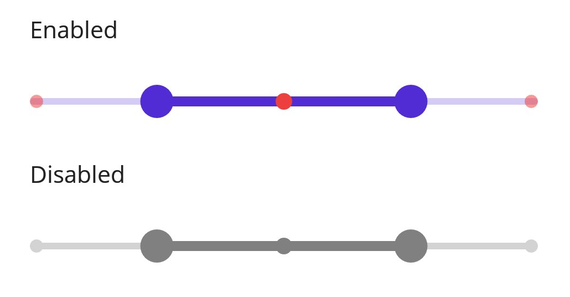

# Dividers in .NET MAUI Range Slider (SfRangeSlider)

This section explains about how to add the dividers in the range slider.

## Show dividers

The [`ShowDividers`](https://help.syncfusion.com/cr/maui/Syncfusion.Maui.Sliders.SliderBase.html#Syncfusion_Maui_Sliders_SliderBase_ShowDividers) property is used to render the dividers on the track. The default value of the [`ShowDividers`](https://help.syncfusion.com/cr/maui/Syncfusion.Maui.Sliders.SliderBase.html#Syncfusion_Maui_Sliders_SliderBase_ShowDividers) property is `False`. It is a shape which is used to represent the major interval points of the track.

For example, if [`Minimum`](https://help.syncfusion.com/cr/maui/Syncfusion.Maui.Sliders.NumericRangeSliderBase.html#Syncfusion_Maui_Sliders_NumericRangeSliderBase_Minimum) is 0.0 and [`Maximum`](https://help.syncfusion.com/cr/maui/Syncfusion.Maui.Sliders.NumericRangeSliderBase.html#Syncfusion_Maui_Sliders_NumericRangeSliderBase_Maximum) is 10.0 and [`Interval`](https://help.syncfusion.com/cr/maui/Syncfusion.Maui.Sliders.SliderBase.html#Syncfusion_Maui_Sliders_SliderBase_Interval) is 2.0, the range slider will render the dividers at 0.0, 2.0, 4.0 and so on.





<sliders:SfRangeSlider Interval="0.2" 
                       ShowDividers="True">
</sliders:SfRangeSlider>





SfRangeSlider rangeSlider = new SfRangeSlider();
rangeSlider.Interval = 0.2;
rangeSlider.ShowDividers = true;





## Divider radius

Change the active and inactive divider radius of the range slider using the [`ActiveRadius`](https://help.syncfusion.com/cr/maui/Syncfusion.Maui.Sliders.SliderDividerStyle.html#Syncfusion_Maui_Sliders_SliderDividerStyle_ActiveRadius) and the [`InactiveRadius`](https://help.syncfusion.com/cr/maui/Syncfusion.Maui.Sliders.SliderDividerStyle.html#Syncfusion_Maui_Sliders_SliderDividerStyle_InactiveRadius) properties of the [`DividerStyle`](https://help.syncfusion.com/cr/maui/Syncfusion.Maui.Sliders.SliderDividerStyle.html) class.





<sliders:SfRangeSlider Interval="0.2" 
                       ShowDividers="True">
   
   <sliders:SfRangeSlider.DividerStyle>
      <sliders:SliderDividerStyle ActiveRadius="7" InactiveRadius="7" />
   </sliders:SfRangeSlider.DividerStyle>

</sliders:SfRangeSlider>





SfRangeSlider rangeSlider = new SfRangeSlider();
rangeSlider.Interval = 0.2;
rangeSlider.ShowDividers = true;
rangeSlider.DividerStyle.ActiveRadius = 7;
rangeSlider.DividerStyle.InactiveRadius = 7;





## Divider stroke width and stroke color

Change the active and inactive divider stroke width of the range slider using the [`ActiveStrokeThickness`](https://help.syncfusion.com/cr/maui/Syncfusion.Maui.Sliders.SliderDividerStyle.html#Syncfusion_Maui_Sliders_SliderDividerStyle_ActiveStrokeThickness) and the [`InactiveStrokeThickness`](https://help.syncfusion.com/cr/maui/Syncfusion.Maui.Sliders.SliderDividerStyle.html#Syncfusion_Maui_Sliders_SliderDividerStyle_InactiveStrokeThickness) properties of the [`DividerStyle`](https://help.syncfusion.com/cr/maui/Syncfusion.Maui.Sliders.SliderDividerStyle.html) class.

Also, change the active and inactive divider stroke color of the range slider using the [`ActiveStroke`](https://help.syncfusion.com/cr/maui/Syncfusion.Maui.Sliders.SliderDividerStyle.html#Syncfusion_Maui_Sliders_SliderDividerStyle_ActiveStroke) and the [`InactiveStroke`](https://help.syncfusion.com/cr/maui/Syncfusion.Maui.Sliders.SliderDividerStyle.html#Syncfusion_Maui_Sliders_SliderDividerStyle_InactiveStroke) properties of the [`DividerStyle`](https://help.syncfusion.com/cr/maui/Syncfusion.Maui.Sliders.SliderDividerStyle.html) class.





<sliders:SfRangeSlider Interval="0.2" 
                       ShowDividers="True">
   
   <sliders:SfRangeSlider.DividerStyle>
        <sliders:SliderDividerStyle ActiveRadius="7" 
                                    InactiveRadius="7" 
                                    ActiveStrokeThickness="2" 
                                    InactiveStrokeThickness="2" 
                                    ActiveStroke="#EE3F3F" 
                                    InactiveStroke="#F7B1AE"/>
   </sliders:SfRangeSlider.DividerStyle>

</rangeslider:SfRangeSlider>





SfRangeSlider rangeSlider = new SfRangeSlider();
rangeSlider.Interval = 0.2;
rangeSlider.ShowDividers = true;
rangeSlider.DividerStyle.ActiveRadius = 7;
rangeSlider.DividerStyle.InactiveRadius = 7;
rangeSlider.DividerStyle.ActiveStroke = new SolidColorBrush(Color.FromArgb("#EE3F3F"));
rangeSlider.DividerStyle.InactiveStroke = new SolidColorBrush(Color.FromArgb("#F7B1AE"));
rangeSlider.DividerStyle.ActiveStrokeThickness = 2;
rangeSlider.DividerStyle.InactiveStrokeThickness = 2;





## Divider color

Change the active and inactive divider color of the range slider using the [`ActiveFill`](https://help.syncfusion.com/cr/maui/Syncfusion.Maui.Sliders.SliderDividerStyle.html#Syncfusion_Maui_Sliders_SliderDividerStyle_ActiveFill) and [`InactiveFill`](https://help.syncfusion.com/cr/maui/Syncfusion.Maui.Sliders.SliderDividerStyle.html#Syncfusion_Maui_Sliders_SliderDividerStyle_InactiveFill) properties of the [`DividerStyle`](https://help.syncfusion.com/cr/maui/Syncfusion.Maui.Sliders.SliderDividerStyle.html) class.





<sliders:SfRangeSlider Interval="0.2" 
                       ShowDividers="True">
    
    <sliders:SfRangeSlider.DividerStyle>
        <sliders:SliderDividerStyle ActiveRadius="7" 
                                    InactiveRadius="7" 
                                    ActiveFill="#EE3F3F" 
                                    InactiveFill="#F7B1AE"/>
     </sliders:SfRangeSlider.DividerStyle>

</sliders:SfRangeSlider>





SfRangeSlider rangeSlider = new SfRangeSlider();
rangeSlider.Interval = 0.2;
rangeSlider.ShowDividers = true;
rangeSlider.DividerStyle.ActiveRadius = 7;
rangeSlider.DividerStyle.InactiveRadius = 7;
rangeSlider.DividerStyle.ActiveFill = new SolidColorBrush(Color.FromArgb("#EE3F3F"));
rangeSlider.DividerStyle.InactiveFill = new SolidColorBrush(Color.FromArgb("#F7B1AE"));





## Disabled divider

Change the state of the range slider to disabled by setting `false` to the `IsEnabled` property. Using the Visual State Manager (VSM), customize the range slider divider properties based on the visual states. The applicable visual states are enabled(default) and disabled.





<ContentPage.Resources>
    
</ContentPage.Resources>

<ContentPage.Content>
    <VerticalStackLayout>
        <Label Text="Enabled Range Slider" Padding="0,10"/>
        <sliders:SfRangeSlider/>
        <Label Text="Disabled Range Slider" Padding="0,10"/>
        <sliders:SfRangeSlider IsEnabled="False"/>
    </VerticalStackLayout>
</ContentPage.Content>





VerticalStackLayout stackLayout = new VerticalStackLayout();
SfRangeSlider defaultRangeSlider = new SfRangeSlider { Interval = 0.25, ShowDividers = true };
SfRangeSlider disabledRangeSlider = new SfRangeSlider { IsEnabled = false, Interval = 0.25, ShowDividers = true };

VisualStateGroupList visualStateGroupList = new VisualStateGroupList();
VisualStateGroup commonStateGroup = new VisualStateGroup();
// Default State.
VisualState defaultState = new VisualState { Name = "Default" };
defaultState.Setters.Add(new Setter
{
    Property = SfRangeSlider.DividerStyleProperty,
    Value = new SliderDividerStyle
    {
        ActiveFill = Color.FromArgb("#F7B1AE"),
        InactiveFill = Color.FromArgb("#EE3F3F"),
        ActiveRadius = 5,
        InactiveRadius = 4,
    }
});
// Disabled State.
VisualState disabledState = new VisualState { Name = "Disabled" };
disabledState.Setters.Add(new Setter
{
    Property = SfRangeSlider.DividerStyleProperty,
    Value = new SliderDividerStyle
    {
        ActiveFill = Colors.Grey,
        InactiveFill = Colors.LightGrey,
        ActiveRadius = 5,
        InactiveRadius = 4,
    }
});

commonStateGroup.States.Add(defaultState);
commonStateGroup.States.Add(disabledState);
visualStateGroupList.Add(commonStateGroup);
VisualStateManager.SetVisualStateGroups(defaultRangeSlider, visualStateGroupList);
VisualStateManager.SetVisualStateGroups(disabledRangeSlider, visualStateGroupList);

stackLayout.Children.Add(new Label() { Text = "Default Range Slider", Padding = new Thickness(0, 10) });
stackLayout.Children.Add(defaultRangeSlider);
stackLayout.Children.Add(new Label() { Text = "Disabled Range Slider", Padding = new Thickness(0, 10) });
stackLayout.Children.Add(disabledRangeSlider);
this.Content = stackLayout;





