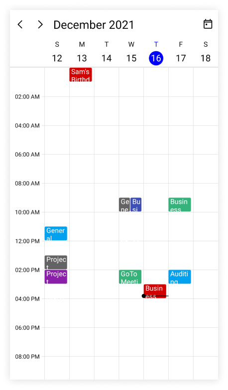
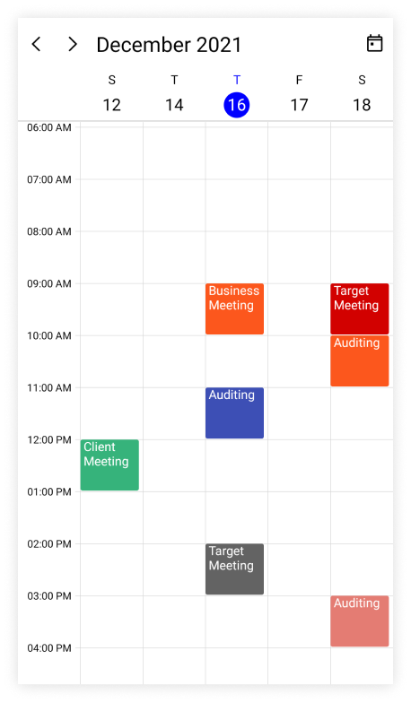
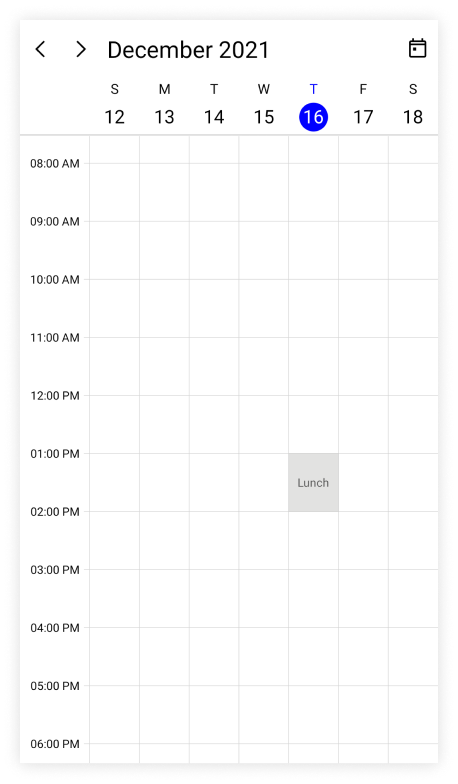
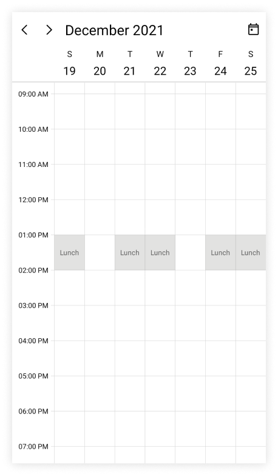
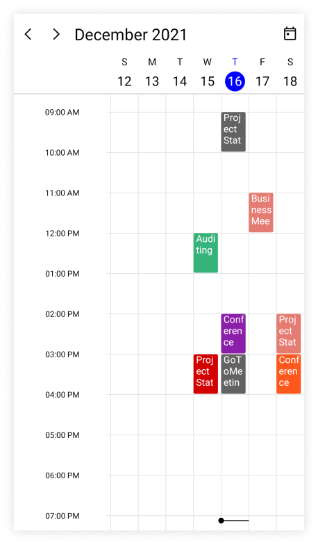
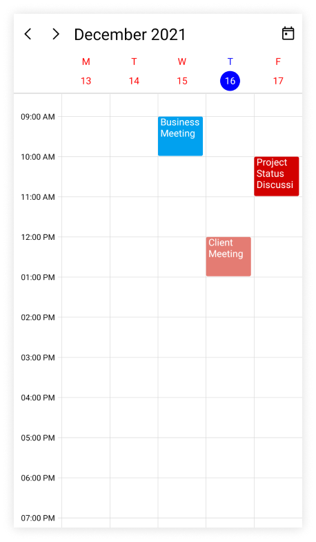
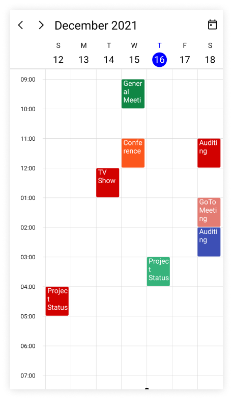
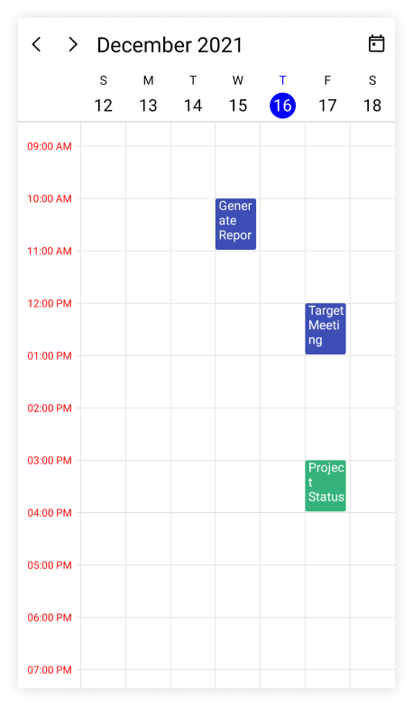

# Day and Week views in .NET MAUI Event Scheduler (SfScheduler)

The [.NET MAUI Scheduler](https://help.syncfusion.com/cr/maui/Syncfusion.Maui.Scheduler.SfScheduler.html) provides the ability to display the day, week, workweek views, and the current day will be visible by default. The appointments on a specific day will be arranged in the respective timeslots based on their duration.

* **Day view**: It displays a single day of the Scheduler.

* **Week view**: It displays all the days of a week.

* **Work week view**: It displays only the working days of a week. By default, Saturday and Sunday are not working days. It can be customized with any day of the week.

## Change time interval

The time interval between the time slots in the day, week and workweek views can be customized by using the [TimeInterval](https://help.syncfusion.com/cr/maui/Syncfusion.Maui.Scheduler.SchedulerTimeSlotViewSettings.html#Syncfusion_Maui_Scheduler_SchedulerTimeSlotViewSettings_TimeInterval) property of [DaysViewSettings](https://help.syncfusion.com/cr/maui/Syncfusion.Maui.Scheduler.SchedulerDaysViewSettings.html).




<scheduler:SfScheduler x:Name="Scheduler">
</scheduler:SfScheduler>




this.Scheduler.DaysViewSettings.TimeInterval = new TimeSpan(2, 0, 0);




N> To modify the `TimeInterval` value (in minutes), change the time labels format by setting the `TimeRulerFormat` value to hh:mm.

## Change time interval height

The time interval height can be customized for each time slot cell of the day, week, and workweek view by using the [TimeIntervalHeight](https://help.syncfusion.com/cr/maui/Syncfusion.Maui.Scheduler.SchedulerDaysViewSettings.html#Syncfusion_Maui_Scheduler_SchedulerDaysViewSettings_TimeIntervalHeight) property of [DaysViewSettings](https://help.syncfusion.com/cr/maui/Syncfusion.Maui.Scheduler.SchedulerDaysViewSettings.html).




<scheduler:SfScheduler x:Name="Scheduler" 
                       View="Week">
    <scheduler:SfScheduler.DaysViewSettings>
        <scheduler:SchedulerDaysViewSettings       
                       TimeIntervalHeight="120"/>
    </scheduler:SfScheduler.DaysViewSettings>
</scheduler:SfScheduler>




this.Scheduler.View = SchedulerView.Week;
this.Scheduler.DaysViewSettings.TimeIntervalHeight = 120;




## Flexible working days

By default, the [.NET MAUI Scheduler](https://help.syncfusion.com/cr/maui/Syncfusion.Maui.Scheduler.SfScheduler.html) considers the weekdays from Monday to Friday as working days. The days which are defined in this non-working days collection are considered as `non-working days.` Therefore, the weekend days are set to hide from the Scheduler.

The [NonWorkingDays](https://help.syncfusion.com/cr/maui/Syncfusion.Maui.Scheduler.SchedulerTimeSlotViewSettings.html#Syncfusion_Maui_Scheduler_SchedulerTimeSlotViewSettings_NonWorkingDays) property of [DaysViewSettings](https://help.syncfusion.com/cr/maui/Syncfusion.Maui.Scheduler.SchedulerDaysViewSettings.html) can also be used to show only the nonworking days of the week.




<scheduler:SfScheduler x:Name="Scheduler" 
                       View="WorkWeek">
    <scheduler:SfScheduler.DaysViewSettings>
        <scheduler:SchedulerDaysViewSettings       
                       NonWorkingDays="Monday,Wednesday" />
    </scheduler:SfScheduler.DaysViewSettings>
</scheduler:SfScheduler>




this.Scheduler.View = SchedulerView.WorkWeek;
this.Scheduler.DaysViewSettings.NonWorkingDays = SchedulerWeekDays.Monday | SchedulerWeekDays.Wednesday;




N> The `workweek` view displays exactly the defined working days on Scheduler control, whereas other views displays all the days.

## Flexible working hours

The default values for [StartHour](https://help.syncfusion.com/cr/maui/Syncfusion.Maui.Scheduler.SchedulerTimeSlotViewSettings.html#Syncfusion_Maui_Scheduler_SchedulerTimeSlotViewSettings_StartHour) and [EndHour](https://help.syncfusion.com/cr/maui/Syncfusion.Maui.Scheduler.SchedulerTimeSlotViewSettings.html#Syncfusion_Maui_Scheduler_SchedulerTimeSlotViewSettings_EndHour) are `0` and `24` respectively, to show all the time slots for a day, week, or workweek view. These properties may be set to show only the required time periods in [DaysViewSettings](https://help.syncfusion.com/cr/maui/Syncfusion.Maui.Scheduler.SchedulerDaysViewSettings.html). The `StartHour` and `EndHour` in time duration can be set to show the required time duration in minutes.




<scheduler:SfScheduler x:Name="Scheduler" 
                       View="Week">
    <scheduler:SfScheduler.DaysViewSettings>
        <scheduler:SchedulerDaysViewSettings       
                       StartHour="9"
                       EndHour="16" />
    </scheduler:SfScheduler.DaysViewSettings>
</scheduler:SfScheduler>




this.Scheduler.View = SchedulerView.Week;
this.Scheduler.DaysViewSettings.StartHour = 9;
this.Scheduler.DaysViewSettings.EndHour = 16;




N>
* The `NonWorkingDays` property will be applicable only for `workweek` and `Timeline workweek` views only. It is not applicable for the remaining views.
* No need to specify the decimal point values for `StartHour` and `EndHour`, if you do not want to set the minutes.
* The number of time slots will be calculated based on the total minutes of a day and time interval (total minutes of a day ((start hour - end hour) * 60) / time interval).
* If a custom timeInterval is given, then the number of time slots calculated based on the given `TimeInterval` should result in an integer value (total minutes % timeInterval = 0), otherwise the next immediate time interval that results in integer value when dividing total minutes of a day will be considered. For example, if TimeInterval=2 Hours 15 minutes and total minutes = 1440 (24 Hours per day), then the `TimeInterval` will be changed to ‘144’ (1440%144=0) by considering (total minutes % TimeInterval = 0), it will return integer value for time slots rendering.
* If the custom `StartHour` and `EndHour` are given, then the number of time slots calculated based on the given `StartHour` and `EndHour` should result in integer value, otherwise the next immediate `TimeInterval` will be considered until the result is integer value. For example, if the `StartHour` is 9 (09:00AM), `EndHour` is 18.25 (06:15 PM), `TimeInterval` is 30 minutes, and total minutes = 555 ((18.25-9)*60), then the `TimeInterval` will be changed to ’37 minutes’ (555%37=0) by considering (total minutes % timeInterval = 0) it will return the integer value for time slots rendering.

N> [View sample in GitHub](https://github.com/SyncfusionExamples/maui-scheduler-examples/tree/main/HighlightWorkingHour)

## Special time regions

The user interaction such as selection and highlights specific regions of day, week, and workweek views can be restricted by adding the [TimeRegions](https://help.syncfusion.com/cr/maui/Syncfusion.Maui.Scheduler.SchedulerTimeSlotViewSettings.html#Syncfusion_Maui_Scheduler_SchedulerTimeSlotViewSettings_TimeRegions) property of the [DaysViewSettings](https://help.syncfusion.com/cr/maui/Syncfusion.Maui.Scheduler.SchedulerDaysViewSettings.html) in the [SfScheduler](https://help.syncfusion.com/cr/maui/Syncfusion.Maui.Scheduler.SfScheduler.html). Set the [StartTime](https://help.syncfusion.com/cr/maui/Syncfusion.Maui.Scheduler.SchedulerRegionBase.html#Syncfusion_Maui_Scheduler_SchedulerRegionBase_StartTime) and [EndTime](https://help.syncfusion.com/cr/maui/Syncfusion.Maui.Scheduler.SchedulerRegionBase.html#Syncfusion_Maui_Scheduler_SchedulerRegionBase_EndTime) properties of `TimeRegions` to create a specialTimeRegion. Use the [TimeZone](https://help.syncfusion.com/cr/maui/Syncfusion.Maui.Scheduler.SchedulerTimeRegion.html#Syncfusion_Maui_Scheduler_SchedulerTimeRegion_TimeZone) property to set the specific timezone for start and end time of `TimeRegions.`

### Selection restriction in timeslots

Enable or disable the touch interaction of TimeRegion using the [EnablePointerInteraction](https://help.syncfusion.com/cr/maui/Syncfusion.Maui.Scheduler.SchedulerTimeRegion.html#Syncfusion_Maui_Scheduler_SchedulerTimeRegion_EnablePointerInteraction) property of [TimeRegion](https://help.syncfusion.com/cr/maui/Syncfusion.Maui.Scheduler.SchedulerTimeSlotViewSettings.html#Syncfusion_Maui_Scheduler_SchedulerTimeSlotViewSettings_TimeRegions). By default, its value is `true.`




<scheduler:SfScheduler x:Name="Scheduler"
                       View="Week">
</scheduler:SfScheduler>




this.Scheduler.View = SchedulerView.Week;
this.Scheduler.DaysViewSettings.TimeRegions = this.GetTimeRegion();

private ObservableCollection<SchedulerTimeRegion> GetTimeRegion()
{
    var timeRegions = new ObservableCollection<SchedulerTimeRegion>();
    var timeRegion = new SchedulerTimeRegion()
    {
        StartTime = DateTime.Today.Date.AddHours(13),
        EndTime = DateTime.Today.Date.AddHours(14),
        Text = "Lunch",
        EnablePointerInteraction = false,
    };

    timeRegions.Add(timeRegion);
    return timeRegions;
}




N> This property only restricts the interaction on region and it does not restrict the following:
* The Programmatic selection (if the user updates the selected date value dynamically).
* It does not clear the selection when the user selects the region and dynamically change the `EnablePointerInteraction` property to false.
* It does not restrict appointment interaction when the appointment placed in the region.
* It does not restrict the appointment interaction when the appointment is placed in the region.

### Recurring time region

The recurring time region on a daily, weekly, monthly, or yearly interval. The recurring special time regions can be created by setting the [RecurrenceRule](https://help.syncfusion.com/cr/maui/Syncfusion.Maui.Scheduler.SchedulerRegionBase.html#Syncfusion_Maui_Scheduler_SchedulerRegionBase_RecurrenceRule) property in [TimeRegion](https://help.syncfusion.com/cr/maui/Syncfusion.Maui.Scheduler.SchedulerTimeSlotViewSettings.html#Syncfusion_Maui_Scheduler_SchedulerTimeSlotViewSettings_TimeRegions).




<scheduler:SfScheduler x:Name="Scheduler"
                       View="Week">
</scheduler:SfScheduler>




this.Scheduler.View = SchedulerView.Week;
this.Scheduler.DaysViewSettings.TimeRegions = this.GetTimeRegion();

private ObservableCollection<SchedulerTimeRegion> GetTimeRegion()
{
    var timeRegions = new ObservableCollection<SchedulerTimeRegion>();
    var timeRegion = new SchedulerTimeRegion()
    {
        StartTime = DateTime.Today.Date.AddHours(13),
        EndTime = DateTime.Today.Date.AddHours(14),
        Text = "Lunch",
        EnablePointerInteraction = false,
        RecurrenceRule = "FREQ=DAILY;INTERVAL=1",
    };

    timeRegions.Add(timeRegion);
    return timeRegions;
}




N> [View sample in GitHub](https://github.com/SyncfusionExamples/maui-scheduler-examples/tree/main/HighlightNonWorkingHour)

### Recurrence exception dates

Any of occurrence that is an exception from the recurrence pattern time region can be deleted by using the [RecurrenceExceptionDates](https://help.syncfusion.com/cr/maui/Syncfusion.Maui.Scheduler.SchedulerRegionBase.html#Syncfusion_Maui_Scheduler_SchedulerRegionBase_RecurrenceExceptionDates) property of [TimeRegion](https://help.syncfusion.com/cr/maui/Syncfusion.Maui.Scheduler.SchedulerTimeRegion.html). The deleted occurrence date will be considered as a recurrence exception date.




<scheduler:SfScheduler x:Name="Scheduler"
                       View="Week">
</scheduler:SfScheduler>




this.Scheduler.View = SchedulerView.Week;
this.Scheduler.DaysViewSettings.TimeRegions = this.GetTimeRegion();

private ObservableCollection<SchedulerTimeRegion> GetTimeRegion()
{
    var timeRegions = new ObservableCollection<SchedulerTimeRegion>();
    var recurrenceExceptionDates = DateTime.Now.Date.AddDays(3);
    var timeRegion = new SchedulerTimeRegion()
    {
        StartTime = DateTime.Today.Date.AddHours(13),
        EndTime = DateTime.Today.Date.AddHours(14),
        Text = "Lunch",
        EnablePointerInteraction = false,
        RecurrenceRule = "FREQ=DAILY;INTERVAL=1",
        RecurrenceExceptionDates = new ObservableCollection<DateTime>()
        {
            recurrenceExceptionDates,
        }
    };

    timeRegions.Add(timeRegion);
    return timeRegions;
}




### Customize special time region appearance

The specialTimeRegion background and text style can be customized by using the [Background](https://help.syncfusion.com/cr/maui/Syncfusion.Maui.Scheduler.SchedulerRegionBase.html#Syncfusion_Maui_Scheduler_SchedulerRegionBase_Background) and [TextStyle](https://help.syncfusion.com/cr/maui/Syncfusion.Maui.Scheduler.SchedulerTimeRegion.html#Syncfusion_Maui_Scheduler_SchedulerTimeRegion_TextStyle) properties of [TimeRegion](https://help.syncfusion.com/cr/maui/Syncfusion.Maui.Scheduler.SchedulerTimeRegion.html). It is used to customize the background color for time region background and text style for the text of the specialTimeRegion.




<scheduler:SfScheduler x:Name="Scheduler"
                       View="Week">
</scheduler:SfScheduler>




this.Scheduler.View = SchedulerView.Week;
this.Scheduler.DaysViewSettings.TimeRegions = this.GetTimeRegion();

private ObservableCollection<SchedulerTimeRegion> GetTimeRegion()
{
    var textStyle = new SchedulerTextStyle()
    {
        TextColor = Colors.DarkBlue,
        FontSize = 14,
    };

    var timeRegions = new ObservableCollection<SchedulerTimeRegion>();
    var timeRegion = new SchedulerTimeRegion()
    {
        StartTime = DateTime.Today.Date.AddHours(13),
        EndTime = DateTime.Today.Date.AddHours(14),
        Text = "Lunch",
        EnablePointerInteraction = false,
        Background = Brush.Orange,
        TextStyle = textStyle
    };

    timeRegions.Add(timeRegion);
    return timeRegions;
}




## Full screen scheduler

The [.NET MAUI Scheduler](https://help.syncfusion.com/cr/maui/Syncfusion.Maui.Scheduler.SfScheduler.html) time interval height can be adjusted based on screen height by changing the [TimeIntervalHeight](https://help.syncfusion.com/cr/maui/Syncfusion.Maui.Scheduler.SchedulerDaysViewSettings.html#Syncfusion_Maui_Scheduler_SchedulerDaysViewSettings_TimeIntervalHeight) property of [DaysViewSettings](https://help.syncfusion.com/cr/maui/Syncfusion.Maui.Scheduler.SchedulerDaysViewSettings.html) to `-1.` It will auto-fit the day, week and work week views to the screen height.




<scheduler:SfScheduler x:Name="Scheduler" 
                       View="Week">
    <scheduler:SfScheduler.DaysViewSettings>
        <scheduler:SchedulerDaysViewSettings 
                       TimeIntervalHeight="-1"/>
    </scheduler:SfScheduler.DaysViewSettings>
</scheduler:SfScheduler>




this.Scheduler.View = SchedulerView.Week;
this.Scheduler.DaysViewSettings.TimeIntervalHeight = -1;




## Show current time indicator

You can show or hide the current time indicator in day, week, and workweek views of [SfScheduler](https://help.syncfusion.com/cr/maui/Syncfusion.Maui.Scheduler.SfScheduler.html) by using the [ShowCurrentTimeIndicator](https://help.syncfusion.com/cr/maui/Syncfusion.Maui.Scheduler.SchedulerTimeSlotViewSettings.html#Syncfusion_Maui_Scheduler_SchedulerTimeSlotViewSettings_ShowCurrentTimeIndicator) property of [DaysViewSettings](https://help.syncfusion.com/cr/maui/Syncfusion.Maui.Scheduler.SchedulerDaysViewSettings.html), and by default, its `true.`




<scheduler:SfScheduler x:Name="Scheduler" 
                       View="Week">
    <scheduler:SfScheduler.DaysViewSettings>
        <scheduler:SchedulerDaysViewSettings 
                       ShowCurrentTimeIndicator="False"/>
    </scheduler:SfScheduler.DaysViewSettings>
</scheduler:SfScheduler>




this.Scheduler.View = SchedulerView.Week;
this.Scheduler.DaysViewSettings.ShowCurrentTimeIndicator = false;




### Customize current time indicator appearance

The current time indicator can be customized by using the [CurrentTimeIndicatorBrush](https://help.syncfusion.com/cr/maui/Syncfusion.Maui.Scheduler.SchedulerTimeSlotViewSettings.html#Syncfusion_Maui_Scheduler_SchedulerTimeSlotViewSettings_CurrentTimeIndicatorBrush) property of [DaysViewSettings](https://help.syncfusion.com/cr/maui/Syncfusion.Maui.Scheduler.SchedulerDaysViewSettings.html) in the [SfScheduler](https://help.syncfusion.com/cr/maui/Syncfusion.Maui.Scheduler.SfScheduler.html).




<scheduler:SfScheduler x:Name="Scheduler" 
                       View="Week">
    <scheduler:SfScheduler.DaysViewSettings>
        <scheduler:SchedulerDaysViewSettings 
                       CurrentTimeIndicatorBrush="Blue"/>
    </scheduler:SfScheduler.DaysViewSettings>
</scheduler:SfScheduler>




this.Scheduler.View = SchedulerView.Week;
this.Scheduler.DaysViewSettings.CurrentTimeIndicatorBrush = Brush.Blue;




N>
The current time indicator color is applied only when the`ShowCurrentTimeIndicator` property is enabled.

## Change time ruler width

The [TimeRulerWidth](https://help.syncfusion.com/cr/maui/Syncfusion.Maui.Scheduler.SchedulerDaysViewSettings.html#Syncfusion_Maui_Scheduler_SchedulerDaysViewSettings_TimeRulerWidth) property of [DaysViewSettings](https://help.syncfusion.com/cr/maui/Syncfusion.Maui.Scheduler.SchedulerDaysViewSettings.html) can be used to customize the size of the time ruler view where the labels with the time are placed.




<scheduler:SfScheduler x:Name="Scheduler" 
                       View="Week">
    <scheduler:SfScheduler.DaysViewSettings>
        <scheduler:SchedulerDaysViewSettings 
                       TimeRulerWidth = "120"/>
    </scheduler:SfScheduler.DaysViewSettings>
</scheduler:SfScheduler>




this.Scheduler.View = SchedulerView.Week;
this.Scheduler.DaysViewSettings.TimeRulerWidth = 120;




## Minimum appointment duration

The [MinimumAppointmentDuration](https://help.syncfusion.com/cr/maui/Syncfusion.Maui.Scheduler.SchedulerTimeSlotViewSettings.html#Syncfusion_Maui_Scheduler_SchedulerTimeSlotViewSettings_MinimumAppointmentDuration) property allows to set an arbitrary height to appointments which have a minimum duration in the day, week, and workweek views so that the subject can be readable.




<scheduler:SfScheduler x:Name="Scheduler" 
                       View="Week">
    <scheduler:SfScheduler.DaysViewSettings>
        <scheduler:SchedulerDaysViewSettings 
                       MinimumAppointmentDuration="0:30:0" />
    </scheduler:SfScheduler.DaysViewSettings>
</scheduler:SfScheduler>




this.Scheduler.View = SchedulerView.Week;
this.Scheduler.DaysViewSettings.MinimumAppointmentDuration = new TimeSpan(0, 30, 0);




N>
*  The `MinimumAppointmentDuration` value will be set when an appointment duration value is lesser than `MinimumAppointmentDuration.`
* The appointment duration value will be set when the appointment duration value is greater than the `MinimumAppointmentDuration.`
*  The `TimeInterval` value will be set when the `MinimumAppointmentDuration` is greater than the `TimeInterval` with lesser appointment duration.
* The all-day appointment does not support `MinimumAppointmentDuration.`

N>
* [View scheduler appointment sample in GitHub](https://github.com/SyncfusionExamples/maui-scheduler-examples/tree/main/GettingStarted)
* [View business object sample in GitHub](https://github.com/SyncfusionExamples/maui-scheduler-examples/tree/main/BusinessObject)

## View header text formatting

The date and day format of SfScheduler ViewHeader can be customized by using the [DateFormat](https://help.syncfusion.com/cr/maui/Syncfusion.Maui.Scheduler.SchedulerViewHeaderSettings.html#Syncfusion_Maui_Scheduler_SchedulerViewHeaderSettings_DateFormat) and [DayFormat](https://help.syncfusion.com/cr/maui/Syncfusion.Maui.Scheduler.SchedulerViewHeaderSettings.html#Syncfusion_Maui_Scheduler_SchedulerViewHeaderSettings_DayFormat) properties of [DayViewSettings](https://help.syncfusion.com/cr/maui/Syncfusion.Maui.Scheduler.SchedulerDaysViewSettings.html).




<scheduler:SfScheduler x:Name="Scheduler"
                       View="Week">
</scheduler:SfScheduler>




this.Scheduler.View = SchedulerView.Week;
this.Scheduler.DaysViewSettings.ViewHeaderSettings.DayFormat = "dddd";
this.Scheduler.DaysViewSettings.ViewHeaderSettings.DateFormat = "dd";




### Customize view header text style

The background color and text style for the labels mentioning the time can be customized, by setting the [Background](https://help.syncfusion.com/cr/maui/Syncfusion.Maui.Scheduler.SchedulerHeaderSettingsBase.html#Syncfusion_Maui_Scheduler_SchedulerHeaderSettingsBase_Background), [DateTextStyle](https://help.syncfusion.com/cr/maui/Syncfusion.Maui.Scheduler.SchedulerViewHeaderSettings.html#Syncfusion_Maui_Scheduler_SchedulerViewHeaderSettings_DateTextStyle), and [DayTextStyle](https://help.syncfusion.com/cr/maui/Syncfusion.Maui.Scheduler.SchedulerViewHeaderSettings.html#Syncfusion_Maui_Scheduler_SchedulerViewHeaderSettings_DayTextStyle) properties of [DayViewSettings](https://help.syncfusion.com/cr/maui/Syncfusion.Maui.Scheduler.SchedulerDaysViewSettings.html) in the Scheduler.




<scheduler:SfScheduler x:Name="Scheduler"
                       View="Week">
</scheduler:SfScheduler>




this.Scheduler.View = SchedulerView.Week;
var dateTextStyle = new SchedulerTextStyle()
{
    TextColor = Colors.Red,
    FontSize = 12,
};

this.Scheduler.DaysViewSettings.ViewHeaderSettings.DateTextStyle = dateTextStyle;
var dayTextStyle = new SchedulerTextStyle()
{
    TextColor = Colors.Red,
    FontSize = 12,
};

this.Scheduler.DaysViewSettings.ViewHeaderSettings.DayTextStyle = dayTextStyle;
this.Scheduler.DaysViewSettings.ViewHeaderSettings.Background = Brush.LightGreen;




## Time text formatting

The format for the labels mentioning the time can be customized by setting the [TimeFormat](https://help.syncfusion.com/cr/maui/Syncfusion.Maui.Scheduler.SchedulerTimeSlotViewSettings.html#Syncfusion_Maui_Scheduler_SchedulerTimeSlotViewSettings_TimeFormat) property of [DayViewSettings](https://help.syncfusion.com/cr/maui/Syncfusion.Maui.Scheduler.SchedulerDaysViewSettings.html) in the Scheduler.




<scheduler:SfScheduler x:Name="Scheduler"
                       View="Week">
</scheduler:SfScheduler>




this.Scheduler.View = SchedulerView.Week;
this.Scheduler.DaysViewSettings.TimeFormat = "hh:mm";




N>
* By default, the scheduler time text format is `hh:mm tt.`

### Customize time ruler text style

The text style for the labels mentioning the time can be customized, by setting the [TimeRulerTextStyle](https://help.syncfusion.com/cr/maui/Syncfusion.Maui.Scheduler.SchedulerTimeSlotViewSettings.html#Syncfusion_Maui_Scheduler_SchedulerTimeSlotViewSettings_TimeRulerTextStyle) property of [DayViewSettings](https://help.syncfusion.com/cr/maui/Syncfusion.Maui.Scheduler.SchedulerDaysViewSettings.html) in the Scheduler.




<scheduler:SfScheduler x:Name="Scheduler"
                       View="Week">
</scheduler:SfScheduler>




this.Scheduler.View = SchedulerView.Week;
var timeRulerTextStyle = new SchedulerTextStyle()
{
    TextColor = Colors.Red,
    FontSize = 12,
};

this.Scheduler.DaysViewSettings.TimeRulerTextStyle = timeRulerTextStyle;




