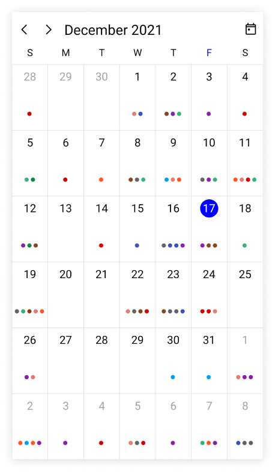
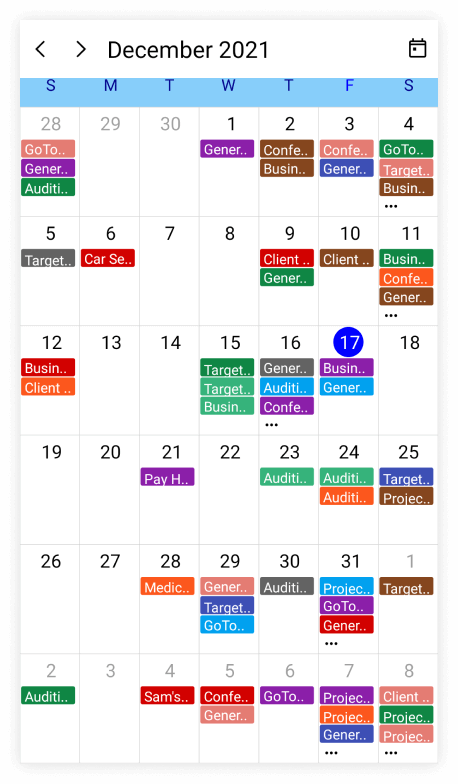
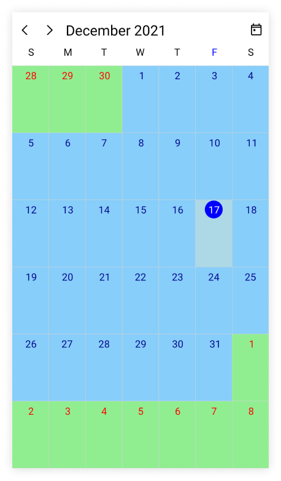

# Month View in .NET MAUI Scheduler (SfScheduler)

By default, the Month view displays the entire days of a particular month and current month initially. The current date color is differentiated from other dates of the current month, and also the color differentiation for dates will be applicable for the previous and next month dates.

By default, when an appointment is tried to create through Month view, it is considered to be created for an entire day.

## Appointment display mode

The scheduler month view appointment display can be handled by using the [AppointmentDisplayMode](https://help.syncfusion.com/cr/maui/Syncfusion.Maui.Scheduler.SchedulerMonthViewSettings.html#Syncfusion_Maui_Scheduler_SchedulerMonthViewSettings_AppointmentDisplayMode) property of [MonthViewSettings](https://help.syncfusion.com/cr/maui/Syncfusion.Maui.Scheduler.SchedulerMonthViewSettings.html). By default, `AppointmentDisplayMode` is set to `Text,` using the `AppointmentDisplayMode.` 

You can set the month view appointments display as follows.

* [None](https://help.syncfusion.com/cr/maui/Syncfusion.Maui.Scheduler.SchedulerMonthAppointmentDisplayMode.html#Syncfusion_Maui_Scheduler_SchedulerMonthAppointmentDisplayMode_None):  Appointment will not be displayed.
* [Indicator](https://help.syncfusion.com/cr/maui/Syncfusion.Maui.Scheduler.SchedulerMonthAppointmentDisplayMode.html#Syncfusion_Maui_Scheduler_SchedulerMonthAppointmentDisplayMode_Indicator):  Appointment will be denoted as the circle.
* [Text](https://help.syncfusion.com/cr/maui/Syncfusion.Maui.Scheduler.SchedulerMonthAppointmentDisplayMode.html#Syncfusion_Maui_Scheduler_SchedulerMonthAppointmentDisplayMode_Text):  Appointment subject will be displayed in the month cell.

  


<scheduler:SfScheduler x:Name="Scheduler" 
                       View="Month">
    <scheduler:SfScheduler.MonthViewSettings>
        <scheduler:SchedulerMonthViewSettings  
            AppointmentDisplayMode="Indicator"/>
    </scheduler:SfScheduler.MonthViewSettings>
</scheduler:SfScheduler>




this.Scheduler.View = SchedulerView.Month;
this.Scheduler.MonthViewSettings.AppointmentDisplayMode = SchedulerMonthAppointmentDisplayMode.Indicator;

  


N>
* [View scheduler appointment sample in GitHub](https://github.com/SyncfusionExamples/maui-scheduler-examples/tree/main/GettingStarted)

* [View business object sample in GitHub](https://github.com/SyncfusionExamples/maui-scheduler-examples/tree/main/BusinessObject)

## Hide leading and trailing dates

The previous and next month dates from a Scheduler month view can be hidden by using the [ShowLeadingAndTrailingDates](https://help.syncfusion.com/cr/maui/Syncfusion.Maui.Scheduler.SchedulerMonthViewSettings.html#Syncfusion_Maui_Scheduler_SchedulerMonthViewSettings_ShowLeadingAndTrailingDates) property in the [MonthViewSettings](https://help.syncfusion.com/cr/maui/Syncfusion.Maui.Scheduler.SchedulerMonthViewSettings.html) of the [SfScheduler](https://help.syncfusion.com/cr/maui/Syncfusion.Maui.Scheduler.SfScheduler.html). The `ShowLeadingAndTrailingDates` property defaults to `true.`

  


<scheduler:SfScheduler x:Name="Scheduler" 
                       View="Month">
    <scheduler:SfScheduler.MonthViewSettings>
        <scheduler:SchedulerMonthViewSettings  
            ShowLeadingAndTrailingDates="False"/>
    </scheduler:SfScheduler.MonthViewSettings>
</scheduler:SfScheduler>




this.Scheduler.View = SchedulerView.Month;
this.Scheduler.MonthViewSettings.ShowLeadingAndTrailingDates = false;

  


## Change day format of view header

Customize the day format of Scheduler view header by using the [DayFormat](https://help.syncfusion.com/cr/maui/Syncfusion.Maui.Scheduler.SchedulerViewHeaderSettings.html#Syncfusion_Maui_Scheduler_SchedulerViewHeaderSettings_DayFormat) property of [ViewHeaderSettings](https://help.syncfusion.com/cr/maui/Syncfusion.Maui.Scheduler.SchedulerMonthViewSettings.html#Syncfusion_Maui_Scheduler_SchedulerMonthViewSettings_ViewHeaderSettings) in [MonthViewSettings](https://help.syncfusion.com/cr/maui/Syncfusion.Maui.Scheduler.SchedulerMonthViewSettings.html).

  


<scheduler:SfScheduler x:Name="Scheduler" 
                       View="Month">
</scheduler:SfScheduler>




this.Scheduler.View = SchedulerView.Month;
this.Scheduler.MonthViewSettings.ViewHeaderSettings.DayFormat = "dddd";

  


## Customize view header appearance

Customize the month view header day text style, day format and background color by using the [DayTextStyle](https://help.syncfusion.com/cr/maui/Syncfusion.Maui.Scheduler.SchedulerViewHeaderSettings.html#Syncfusion_Maui_Scheduler_SchedulerViewHeaderSettings_DayTextStyle), [DayFormat](https://help.syncfusion.com/cr/maui/Syncfusion.Maui.Scheduler.SchedulerViewHeaderSettings.html#Syncfusion_Maui_Scheduler_SchedulerViewHeaderSettings_DayFormat) and [Background](https://help.syncfusion.com/cr/maui/Syncfusion.Maui.Scheduler.SchedulerHeaderSettingsBase.html#Syncfusion_Maui_Scheduler_SchedulerHeaderSettingsBase_Background) of [ViewHeaderSettings](https://help.syncfusion.com/cr/maui/Syncfusion.Maui.Scheduler.SchedulerMonthViewSettings.html#Syncfusion_Maui_Scheduler_SchedulerMonthViewSettings_ViewHeaderSettings) properties of [MonthViewSettings](https://help.syncfusion.com/cr/maui/Syncfusion.Maui.Scheduler.SchedulerMonthViewSettings.html) respectively.

  


<scheduler:SfScheduler x:Name="Scheduler" 
                       View="Month">
</scheduler:SfScheduler>




var dayTextStyle = new SchedulerTextStyle()
{
    TextColor = Colors.DarkBlue,
    FontSize = 14,
};
this.Scheduler.View = SchedulerView.Month;
this.Scheduler.MonthViewSettings.ViewHeaderSettings.Background = Brush.LightSkyBlue;
this.Scheduler.MonthViewSettings.ViewHeaderSettings.DayFormat = "dddd";
this.Scheduler.MonthViewSettings.ViewHeaderSettings.DayTextStyle = dayTextStyle;

  


## Customize month cell appearance

By using the [MonthCellStyle](https://help.syncfusion.com/cr/maui/Syncfusion.Maui.Scheduler.SchedulerMonthViewSettings.html#Syncfusion_Maui_Scheduler_SchedulerMonthViewSettings_MonthCellStyle) property of [MonthViewSettings](https://help.syncfusion.com/cr/maui/Syncfusion.Maui.Scheduler.SchedulerMonthViewSettings.html), the month properties such as [Background](https://help.syncfusion.com/cr/maui/Syncfusion.Maui.Scheduler.SchedulerMonthCellStyle.html#Syncfusion_Maui_Scheduler_SchedulerMonthCellStyle_Background), [TodayBackground](https://help.syncfusion.com/cr/maui/Syncfusion.Maui.Scheduler.SchedulerMonthCellStyle.html#Syncfusion_Maui_Scheduler_SchedulerMonthCellStyle_TodayBackground), [TrailingMonthBackground](https://help.syncfusion.com/cr/maui/Syncfusion.Maui.Scheduler.SchedulerMonthCellStyle.html#Syncfusion_Maui_Scheduler_SchedulerMonthCellStyle_TrailingMonthBackground), [LeadingMonthBackground](https://help.syncfusion.com/cr/maui/Syncfusion.Maui.Scheduler.SchedulerMonthCellStyle.html#Syncfusion_Maui_Scheduler_SchedulerMonthCellStyle_LeadingMonthBackground), [TextStyle](https://help.syncfusion.com/cr/maui/Syncfusion.Maui.Scheduler.SchedulerMonthCellStyle.html#Syncfusion_Maui_Scheduler_SchedulerMonthCellStyle_TextStyle), [TrailingMonthTextStyle](https://help.syncfusion.com/cr/maui/Syncfusion.Maui.Scheduler.SchedulerMonthCellStyle.html#Syncfusion_Maui_Scheduler_SchedulerMonthCellStyle_TrailingMonthTextStyle), and [LeadingMonthTextStyle](https://help.syncfusion.com/cr/maui/Syncfusion.Maui.Scheduler.SchedulerMonthCellStyle.html#Syncfusion_Maui_Scheduler_SchedulerMonthCellStyle_LeadingMonthTextStyle) can be customized.

  


<scheduler:SfScheduler x:Name="Scheduler" 
                       View="Month">
</scheduler:SfScheduler>




this.Scheduler.View = SchedulerView.Month;
var textStyle = new SchedulerTextStyle()
{
    TextColor = Colors.DarkBlue,
    FontSize = 14,
};

var leadingMonthTextStyle = new SchedulerTextStyle()
{
    TextColor = Colors.Red,
    FontSize = 14,
};
            
var trailingMonthTextStyle = new SchedulerTextStyle()
{
    TextColor = Colors.Red,
    FontSize = 14,
};

var monthCellStyle = new SchedulerMonthCellStyle()
{
    Background = Brush.LightSkyBlue,
    TodayBackground = Brush.LightBlue,
    LeadingMonthBackground = Brush.LightGreen,
    TrailingMonthBackground = Brush.LightYellow,
    TextStyle = textStyle,
    LeadingMonthTextStyle = leadingMonthTextStyle,
    TrailingMonthTextStyle = trailingMonthTextStyle
};

this.Scheduler.MonthViewSettings.MonthCellStyle = monthCellStyle;

  


