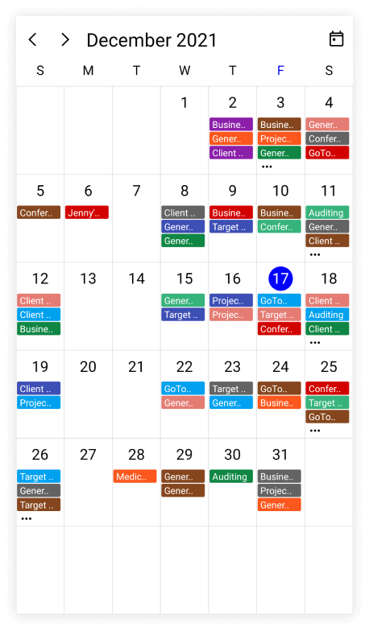
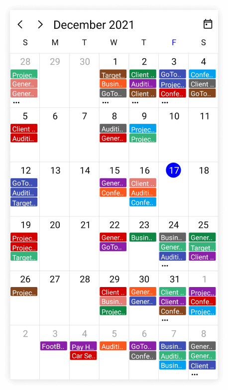
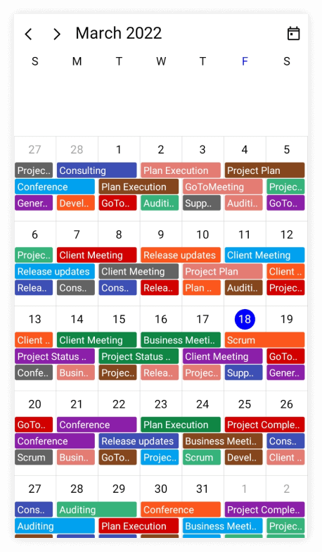

# Month View in .NET MAUI Scheduler (SfScheduler)

By default, the Month view displays the entire days of a particular month and current month initially. The current date color is differentiated from other dates of the current month, and also the color differentiation for dates will be applicable for the previous and next month dates.

By default, when an appointment is tried to create through Month view, it is considered to be created for an entire day.

N> The appointment views for each month cells will be updated depends on the month cells height. While resizing the layout, the following actions would be performed,
* If the appointment views overlaps with month cell dates or do not fit into the month cell height then the appointment view is changed from `AppointmentDisplayMode.Text` to `AppointmentDisplayMode.Indicator` view.
* If the indicator views overlaps with month cell dates, then the indicator view is changed from `AppointmentDisplayMode.Indicator` to `AppointmentDisplayMode.None.`

## Appointment display mode

The scheduler month view appointment display can be handled by using the `AppointmentDisplayMode` property of `MonthView.` By default, `AppointmentDisplayMode` is set to `Text,` using the `AppointmentDisplayMode.` 

You can set the month view appointments display as follows.

* [None](https://help.syncfusion.com/cr/maui/Syncfusion.Maui.Scheduler.SchedulerMonthAppointmentDisplayMode.html#Syncfusion_Maui_Scheduler_SchedulerMonthAppointmentDisplayMode_None):  Appointment will not be displayed.
* [Indicator](https://help.syncfusion.com/cr/maui/Syncfusion.Maui.Scheduler.SchedulerMonthAppointmentDisplayMode.html#Syncfusion_Maui_Scheduler_SchedulerMonthAppointmentDisplayMode_Indicator):  Appointment will be denoted as the circle.
* [Text](https://help.syncfusion.com/cr/maui/Syncfusion.Maui.Scheduler.SchedulerMonthAppointmentDisplayMode.html#Syncfusion_Maui_Scheduler_SchedulerMonthAppointmentDisplayMode_Text):  Appointment subject will be displayed in the month cell.

  


<scheduler:SfScheduler x:Name="Scheduler" 
                       View="Month">
    <scheduler:SfScheduler.MonthView>
        <scheduler:SchedulerMonthView 
                       AppointmentDisplayMode="Indicator"/>
    </scheduler:SfScheduler.MonthView>
</scheduler:SfScheduler>




this.Scheduler.View = SchedulerView.Month;
this.Scheduler.MonthView.AppointmentDisplayMode = SchedulerMonthAppointmentDisplayMode.Indicator;

  


N>
* [View scheduler appointment sample in GitHub](https://github.com/SyncfusionExamples/maui-scheduler-examples/tree/main/GettingStarted)

* [View business object sample in GitHub](https://github.com/SyncfusionExamples/maui-scheduler-examples/tree/main/BusinessObject)

## Hide leading and trailing dates

The previous and next month dates from a Scheduler month view can be hidden by using the `ShowLeadingAndTrailingDates` property in the `MonthView.` The `ShowLeadingAndTrailingDates` property defaults to `true.`

  


 <scheduler:SfScheduler x:Name="Scheduler" 
                        View="Month">
    <scheduler:SfScheduler.MonthView>
        <scheduler:SchedulerMonthView  
                       ShowLeadingAndTrailingDates="False"/>
    </scheduler:SfScheduler.MonthView>
 </scheduler:SfScheduler>




this.Scheduler.View = SchedulerView.Month;
this.Scheduler.MonthView.ShowLeadingAndTrailingDates = false;

  


## Change day format of view header

Customize the day format of Scheduler view header by using the `DayFormat` property of `ViewHeaderSettings` in `MonthView.`

  


<scheduler:SfScheduler x:Name="Scheduler" 
                       View="Month">
    <scheduler:SfScheduler.MonthView>
        <scheduler:SchedulerMonthView>
            <scheduler:SchedulerMonthView.ViewHeaderSettings>
                <scheduler:SchedulerViewHeaderSettings DayFormat="dddd" />
            </scheduler:SchedulerMonthView.ViewHeaderSettings>
        </scheduler:SchedulerMonthView>
    </scheduler:SfScheduler.MonthView>
</scheduler:SfScheduler>




this.Scheduler.View = SchedulerView.Month;
this.Scheduler.MonthView.ViewHeaderSettings.DayFormat = "dddd";

  


### View header height

The height of the ViewHeader can be customized by setting the `Height` property of `ViewHeaderSettings` in `MonthView.`




 <scheduler:SfScheduler x:Name="Scheduler" 
                        View="Month">
    <scheduler:SfScheduler.MonthView>
        <scheduler:SchedulerMonthView>
            <scheduler:SchedulerMonthView.ViewHeaderSettings>
                <scheduler:SchedulerViewHeaderSettings Height="100" />
            </scheduler:SchedulerMonthView.ViewHeaderSettings>
        </scheduler:SchedulerMonthView>
    </scheduler:SfScheduler.MonthView>
 </scheduler:SfScheduler>




this.Scheduler.View = SchedulerView.Month;
this.Scheduler.MonthView.ViewHeaderSettings.Height = 100;




### Customize view header appearance using text style

Customize the month view header day text style, day format and background color by using the `DayTextStyle,` `DayFormat` and `Background` of `ViewHeaderSettings` properties of `MonthView` respectively.

  


 <scheduler:SfScheduler x:Name="Scheduler" 
                        View="Month">
    <scheduler:SfScheduler.MonthView>
        <scheduler:SchedulerMonthView>
            <scheduler:SchedulerMonthView.ViewHeaderSettings>
                <scheduler:SchedulerViewHeaderSettings DayFormat="dddd"
                                                       Background="LightSkyBlue"/>
            </scheduler:SchedulerMonthView.ViewHeaderSettings>
        </scheduler:SchedulerMonthView>
    </scheduler:SfScheduler.MonthView>
</scheduler:SfScheduler>




var dayTextStyle = new SchedulerTextStyle()
{
    TextColor = Colors.DarkBlue,
    FontSize = 14,
};
this.Scheduler.View = SchedulerView.Month;
this.Scheduler.MonthView.ViewHeaderSettings.Background = Brush.LightSkyBlue;
this.Scheduler.MonthView.ViewHeaderSettings.DayFormat = "dddd";
this.Scheduler.MonthView.ViewHeaderSettings.DayTextStyle = dayTextStyle;

  


### Customize view header appearance using DataTemplate

You can customize the view header appearance by using the `ViewHeaderTemplate` property of `MonthView` in the `SfScheduler.`

  
    

 <scheduler:SfScheduler x:Name="Scheduler" 
                        View="Month">
    <scheduler:SfScheduler.MonthView>
        <scheduler:SchedulerMonthView>
            <scheduler:SchedulerMonthView.ViewHeaderTemplate>
                <DataTemplate>
                    <Grid Background = "BlueViolet" >
                        <Label x:Name="label" HorizontalOptions="Center" VerticalOptions="Center" Text="{Binding StringFormat='{0:ddd}'}" TextColor="White" FontSize="Subtitle" FontFamily="Bold" />
                    </Grid>
                </DataTemplate>
            </scheduler:SchedulerMonthView.ViewHeaderTemplate>
        </scheduler:SchedulerMonthView>
    </scheduler:SfScheduler.MonthView>
 </scheduler:SfScheduler>




### Customize view header appearance using DataTemplateSelector

You can customize the view header appearance by using the `ViewHeaderTemplate` property of `MonthView` in the `SfScheduler.` The `DataTemplateSelector` can choose a `DataTemplate` at runtime based on the value of a data-bound to scheduler view header by using the `ViewHeaderTemplate.` It lets to choose a different data template for each view header, customizing the appearance of a particular view header based on certain conditions.




 <Grid>
    <Grid.Resources>
        <DataTemplate x:Key="normaldatesTemplate">
            <Grid Background = "lightBlue">
                <Label x:Name="label" HorizontalOptions="Center" VerticalOptions="Center" Text="{Binding StringFormat='{0:ddd}'}"  TextColor="Red" />
            </Grid>
        </DataTemplate>
        <DataTemplate x:Key="todayDatesTemplate">
            <Grid Background = "LightGreen" >
                <Label x:Name="label" HorizontalOptions="Center" VerticalOptions="Center" Text="{Binding StringFormat='{0:ddd}'}"  TextColor="Orange" />
            </Grid>
        </DataTemplate>
        <local:MonthViewHeaderTemplateSelector x:Key="monthViewHeaderTemplateSelector"  TodayDatesTemplate="{StaticResource todayDatesTemplate}"  NormaldatesTemplate="{StaticResource normaldatesTemplate}" />
    </Grid.Resources>
    <scheduler:SfScheduler x:Name="Scheduler" 
                           View="Month">
        <scheduler:SfScheduler.MonthView>
            <scheduler:SchedulerMonthView ViewHeaderTemplate = "{StaticResource monthViewHeaderTemplateSelector}"/>
        </scheduler:SfScheduler.MonthView>
    </scheduler:SfScheduler>
 </Grid>




public class MonthViewHeaderTemplateSelector : DataTemplateSelector
{
    public MonthViewHeaderTemplateSelector()
    {
    }
    public DataTemplate TodayDatesTemplate { get; set; }
    public DataTemplate NormaldatesTemplate { get; set; }
    protected override DataTemplate OnSelectTemplate(object item, BindableObject container)
    {
        var viewHeaderDetails = (DateTime)item;
        if (viewHeaderDetails.Date.Month == DateTime.Today.Month)
            return TodayDatesTemplate;
        return NormaldatesTemplate;
    }
}

  


## Month cell appearance

The month cell can be customized by using the `MonthView` property of the `SfScheduler.`

### Customize month cell appearance using text style

By using the `CellStyle` property of `MonthView,` the month properties such as `Background,` `TodayBackground,` `TrailingMonthBackground,` `LeadingMonthBackground,` `TextStyle,` `TrailingMonthTextStyle,` and `LeadingMonthTextStyle` can be customized.

  


<scheduler:SfScheduler x:Name="Scheduler" 
                       View="Month">
</scheduler:SfScheduler>




this.Scheduler.View = SchedulerView.Month;
var textStyle = new SchedulerTextStyle()
{
    TextColor = Colors.DarkBlue,
    FontSize = 14,
};

var leadingMonthTextStyle = new SchedulerTextStyle()
{
    TextColor = Colors.Red,
    FontSize = 14,
};

var trailingMonthTextStyle = new SchedulerTextStyle()
{
    TextColor = Colors.Red,
    FontSize = 14,
};

var monthCellStyle = new SchedulerMonthCellStyle()
{
    Background = Brush.LightSkyBlue,
    TodayBackground = Brush.LightBlue,
    LeadingMonthBackground = Brush.LightGreen,
    TrailingMonthBackground = Brush.LightYellow,
    TextStyle = textStyle,
    LeadingMonthTextStyle = leadingMonthTextStyle,
    TrailingMonthTextStyle = trailingMonthTextStyle
};

this.Scheduler.MonthView.CellStyle = monthCellStyle;

  


### Customize month cell appearance using DataTemplate

You can customize the month cell appearance by using the `CellTemplate` property of `MonthView` in the `SfScheduler.`




 <scheduler:SfScheduler x:Name="Scheduler" 
                        View="Month">
    <scheduler:SfScheduler.MonthView>
        <scheduler:SchedulerMonthView>
            <scheduler:SchedulerMonthView.CellTemplate>
                <DataTemplate>
                    <Border Background = "BlueViolet">
                        <Label HorizontalTextAlignment="Center" TextColor="White" Text="{Binding DateTime.Day}"/>
                    </Border>
                </DataTemplate>
            </scheduler:SchedulerMonthView.CellTemplate>
        </scheduler:SchedulerMonthView>
    </scheduler:SfScheduler.MonthView>
 </scheduler:SfScheduler>




N>
* The BindingContext of the `CellTemplate` is the `SchedulerMonthCellDetails.`