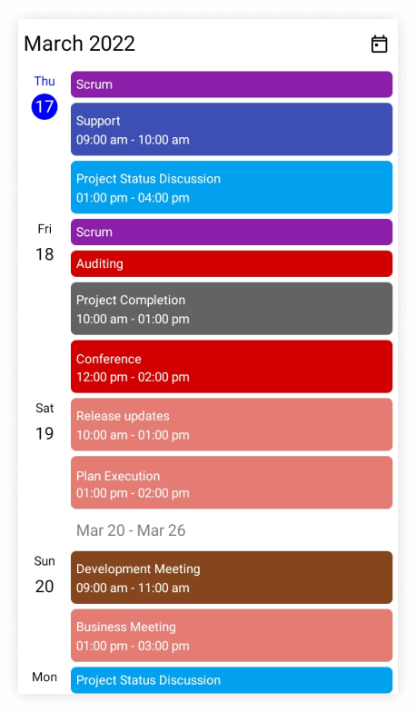
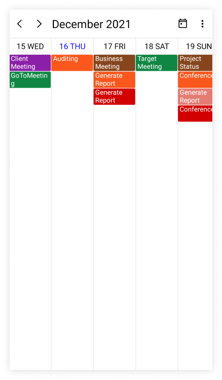
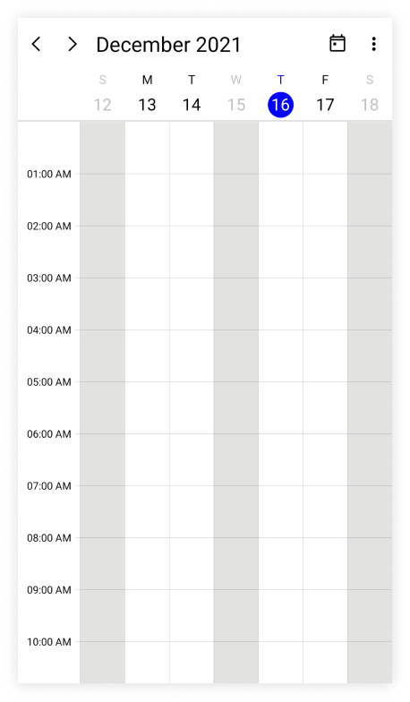
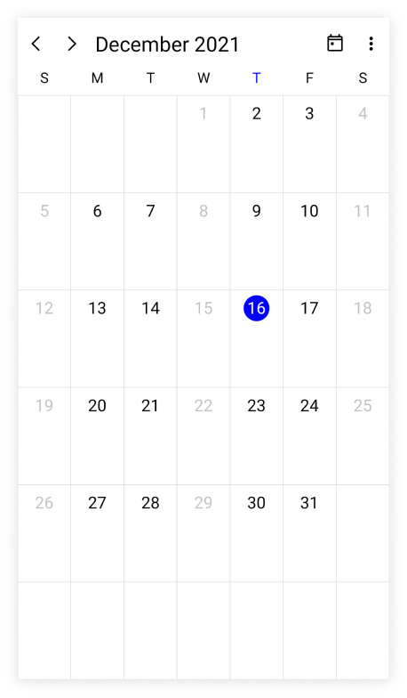
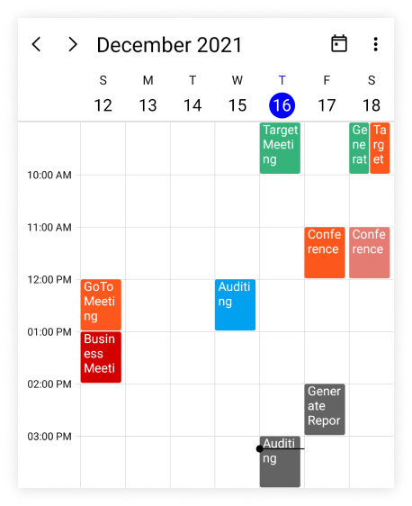

# Overview of .NET MAUI Scheduler (SfScheduler)

The Syncfusion .NET MAUI Scheduler (SfScheduler) has eight different types of built-in configurable view modes that provides all the common scheduling functionalities to display appointments in different views, and allows users to create and manage appointments efficiently. It exposes user interface for custom working days and hours, and basic operations such as viewing daily/all day/spanned appointments, date navigation, selection, and Data binding to different sources.

## Key features

 *  **Built-in views**: The .NET MAUI Scheduler provides a wide range of built-in view modes including Day, Week, WorkWeek, Month, Agenda, TimelineDay, TimelineWeek, TimelineWorkWeek, and TimelineMonth. These view modes allows to display appointments across different days and months.

 

 * **Events**: Appointments contain information about events scheduled at specific times. In addition to the default appointments, users can create their own collections that map various fields such as start time, end time, subject, notes, and recurrence to appointments.

 

 * **Recurrence events**: Easily configure the recurring events on a daily, weekly, monthly, or yearly basis with optimized recurrence options. Also skip or change the occurrence of a recurring appointment.

 

 * **Appointment mapping**: The .NET MAUI Scheduler control supports to map any custom object to populate appointments or events.

 * **Timezone**: The display appointments can be created in various time zones in the system time zone. The appointment start and end times are also automatically adjusted and displayed based on the daylight savings time.

 * **Agenda view**: The agenda view displays a list of scheduled appointments grouped by week, between set minimum and maximum dates. You can customize everything from the date and time formats to the styling of each header.

 

 * **Timeline month view**: The appointments will be displayed on a horizontal axis, with each column representing a day of the month.

 

 * **First day of the week**: Customize the first day of the week as needed. It defaults to Sunday.

 
 
 * **Flexible working days**: The workdays in a workweek can be customized such that the nonworking days are hidden.

 * **Minimum and maximum date time**: By setting [MinimumDateTime](https://help.syncfusion.com/cr/maui/Syncfusion.Maui.Scheduler.SfScheduler.html#Syncfusion_Maui_Scheduler_SfScheduler_MinimumDateTime) and [MaximumDateTime](https://help.syncfusion.com/cr/maui/Syncfusion.Maui.Scheduler.SfScheduler.html#Syncfusion_Maui_Scheduler_SfScheduler_MaximumDateTime) properties, you can limit the date range available in the Scheduler and prevent navigation beyond that range.

 * **Special time regions (Blocking time intervals)**: Interactions and selections can be disabled for specific time ranges. This is useful when the user interaction has to be blocked during holidays or another special events, and to highlight those time slots in day, week, workweek, timeline day, timeline week, and timeline workweek.

 

 * **Selectable day predicate (Blackout dates)**: Any date can be disabled in a scheduler to make it inactive. The selection of weekends and holidays can be easily prevented by disabling them.

 

 * **Hide leading and trailing dates**: Hiding the previous and next month's dates will enhance the appearance of the scheduler.

 

 * **Custom start and end hours**: The event scheduler timeslot view can be displayed with specific time durations by hiding the unwanted hours.

 

 * **Windows and Mac Catalyst layouts**: The mouse hovering effect is now applied to all scheduler elements.