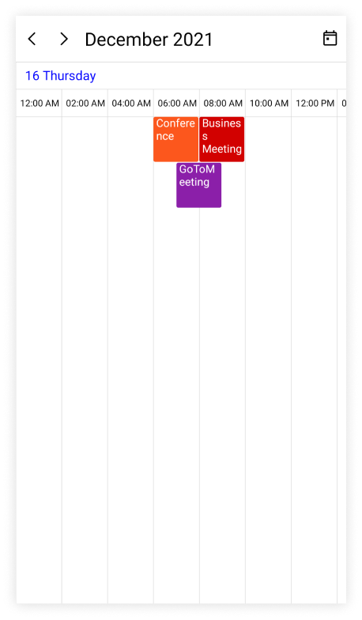
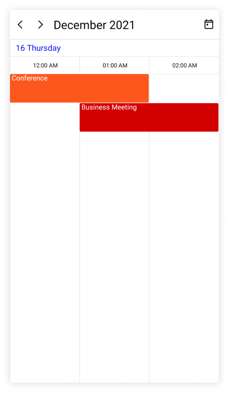
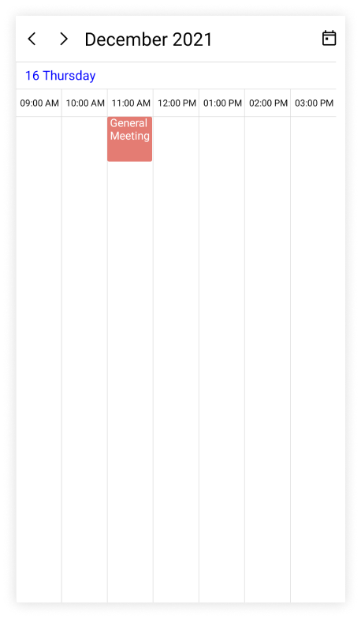
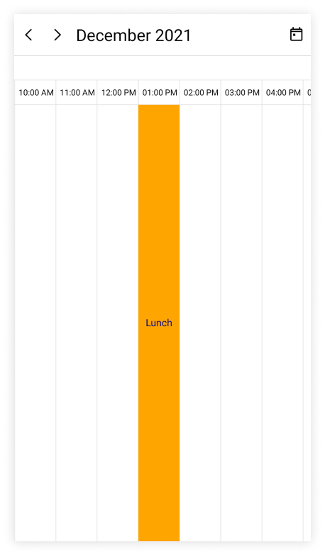
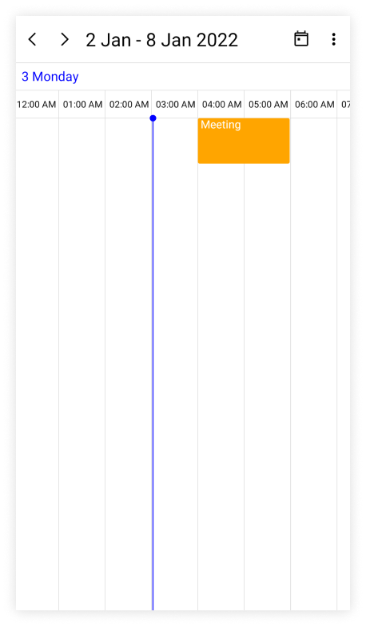
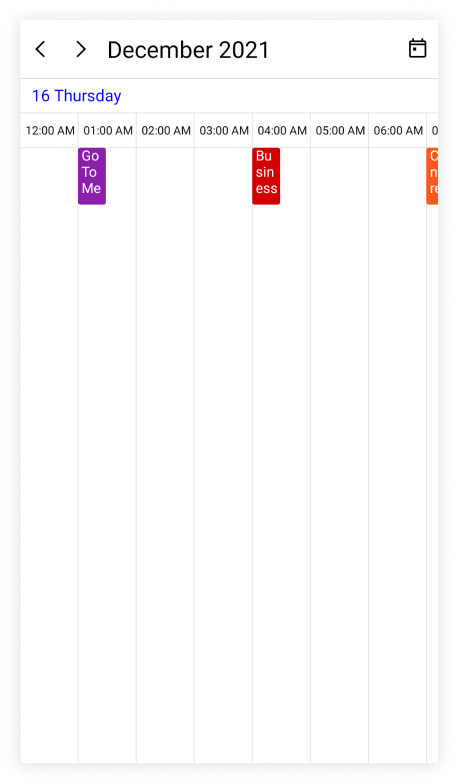
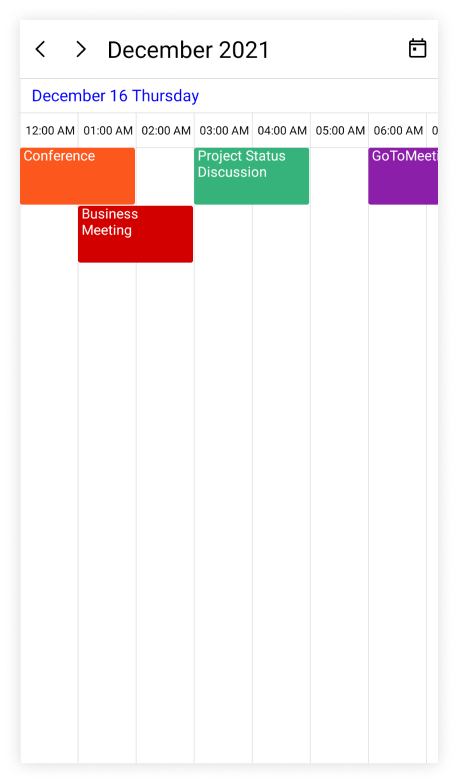

# Timeline Views in .NET MAUI Scheduler (SfScheduler)

The timelineView displays the date inside the horizontal time axis with the desired count of each day. See the past or future dates by scrolling to the right or left. The appointments on a specific day will be arranged in the respective timeslots based on their duration.

* **Timeline day view**: It displays a single day in the horizontal time axis of the Scheduler.

* **Timeline week view**: It displays all the days of a week in horizontal time axis. The past or future dates can be viewed by scrolling to right or left.

* **Timeline work week view**: It displays only the working days of a week in horizontal axis. By default, Saturday and Sunday are not working days. You can customize it with any day of the week.

* **Timeline month**: A horizontal axis displaying appointments across all days of a month is displayed, where each column represents a single day.

## Change time interval

The time interval between the time slots in the timeline day, timeline week, and timeline workweek views can be customized by using the `TimeInterval` property of `TimelineView.`




<scheduler:SfScheduler x:Name="Scheduler" 
                       View="TimelineWeek">
    <scheduler:SfScheduler.TimelineView>
        <scheduler:SchedulerTimelineView TimeInterval="2:0:0" />
    </scheduler:SfScheduler.TimelineView>
</scheduler:SfScheduler>




this.Scheduler.View = SchedulerView.TimelineWeek;
this.Scheduler.TimelineView.TimeInterval = new TimeSpan(2, 0, 0);




N> To modify the `TimeInterval` value (in minutes), change the time labels format by setting the `TimeRulerFormat` value to `hh:mm.`

## Change time interval width

The Time interval width can be customized for each time slot cell of the timeline day, timeline week, timeline workweek, and timeline month views by using the `TimeIntervalWidth` property of `TimelineView.`




 <scheduler:SfScheduler x:Name="Scheduler" 
                        View="TimelineWeek">
    <scheduler:SfScheduler.TimelineView>
        <scheduler:SchedulerTimelineView 
                       TimeIntervalWidth="120" />
    </scheduler:SfScheduler.TimelineView>
 </scheduler:SfScheduler>




this.Scheduler.View = SchedulerView.TimelineWeek;
this.Scheduler.TimelineView.TimeIntervalWidth = 120;




## Flexible working days

By default, the [.NET MAUI Scheduler](https://help.syncfusion.com/cr/maui/Syncfusion.Maui.Scheduler.SfScheduler.html) considers the weekdays from Monday to Friday as working days. The days which are defined in this non-working days collection are considered as `non-working days.` Therefore, the weekend days are set to hide from the Scheduler.

The `NonWorkingDays` property of `TimelineView` can also be used to show only the nonworking days of the week.




<scheduler:SfScheduler x:Name="Scheduler" 
                       View="TimelineWorkWeek">
    <scheduler:SfScheduler.TimelineView>
        <scheduler:SchedulerTimelineView 
                       NonWorkingDays="Monday,Wednesday" />
    </scheduler:SfScheduler.TimelineView>
</scheduler:SfScheduler>




this.Scheduler.View = SchedulerView.TimelineWorkWeek;
this.Scheduler.TimelineView.NonWorkingDays = SchedulerWeekDays.Monday | SchedulerWeekDays.Wednesday;




N> The `Timeline workweek` view displays exactly the defined working days on Scheduler control, whereas other views displays all the days.

## Flexible working hours

The default values for `StartHour` and `EndHour` are `0` and `24` respectively, to show all the time slots for a timeline day, timeline week, or timeline workweek view. You may set these properties to show only the required time periods in `TimelineView.` You can set `StartHour` and `EndHour` in the time duration to show the required time duration in minutes.




<scheduler:SfScheduler x:Name="Scheduler" 
                       View="TimelineWeek">
    <scheduler:SfScheduler.TimelineView>
            <scheduler:SchedulerTimelineView 
                       StartHour="9"
                       EndHour="16" />
    </scheduler:SfScheduler.TimelineView>
</scheduler:SfScheduler>




this.Scheduler.View = SchedulerView.TimelineWeek;
this.Scheduler.TimelineView.StartHour = 9;
this.Scheduler.TimelineView.EndHour = 16;




N>
* The `NonWorkingDays` property will be applicable only for `workWeek` and `TimelineWorkWeek` views only, and not be applicable for the remaining views.
* No need to specify the decimal point values for `StartHour` and `EndHour`, if you do not want to set the minutes.
* The number of time slots will be calculated based on total minutes of a day and time interval (total minutes of a day ((start hour - end hour) * 60) / time interval).
* If a custom timeInterval is given, then the number of time slots calculated based on the given `TimeInterval` should result in an integer value (total minutes % timeInterval = 0), otherwise the next immediate time interval that results in integer value when dividing total minutes of a day will be considered. For example, if TimeInterval=2 Hours 15 minutes and total minutes = 1440 (24 Hours per day), then the `TimeInterval` will be changed to ‘144’ (1440%144=0) by considering (total minutes % TimeInterval = 0), it will return integer value for time slots rendering.
* If the custom `StartHour` and `EndHour` are given, then the number of time slots calculated based on the given `StartHour` and `EndHour` should result in integer value, otherwise the next immediate `TimeInterval` will be considered until the result is integer value. For example, if the `StartHour` is 9 (09:00AM), `EndHour` is 18.25 (06:15 PM), `TimeInterval` is 30 minutes, and total minutes = 555 ((18.25-9)*60), then the `TimeInterval` will be changed to ’37 minutes’ (555%37=0) by considering (total minutes % timeInterval = 0) it will return the integer value for time slots rendering.

N> [View sample in GitHub](https://github.com/SyncfusionExamples/maui-scheduler-examples/tree/main/HighlightWorkingHour)

## Special time regions

The user interaction such as selection and highlights specific regions of timeline day, timeline week, and timeline workweek views can be restricted by adding the `TimeRegions` property of the `TimelineView` in the [SfScheduler](https://help.syncfusion.com/cr/maui/Syncfusion.Maui.Scheduler.SfScheduler.html). You need to set the [StartTime](https://help.syncfusion.com/cr/maui/Syncfusion.Maui.Scheduler.SchedulerRegionBase.html#Syncfusion_Maui_Scheduler_SchedulerRegionBase_StartTime) and [EndTime](https://help.syncfusion.com/cr/maui/Syncfusion.Maui.Scheduler.SchedulerRegionBase.html#Syncfusion_Maui_Scheduler_SchedulerRegionBase_EndTime) properties of `TimeRegions` to create a specialTimeRegion, you can use the [TimeZone](https://help.syncfusion.com/cr/maui/Syncfusion.Maui.Scheduler.SchedulerTimeRegion.html#Syncfusion_Maui_Scheduler_SchedulerTimeRegion_TimeZone) property to set the specific timezone for start and end time of `TimeRegions.`

### Selection restriction in timeslots

You can enable or disable the touch interaction of TimeRegion using the [EnablePointerInteraction](https://help.syncfusion.com/cr/maui/Syncfusion.Maui.Scheduler.SchedulerTimeRegion.html#Syncfusion_Maui_Scheduler_SchedulerTimeRegion_EnablePointerInteraction) property of `TimeRegion.` By default, its value is `true.`




<scheduler:SfScheduler x:Name="Scheduler" 
                       View="TimelineWeek">
</scheduler:SfScheduler>




this.Scheduler.View = SchedulerView.TimelineWeek;
this.Scheduler.TimelineView.TimeRegions = this.GetTimeRegion();

private ObservableCollection<SchedulerTimeRegion> GetTimeRegion()
{
    var timeRegions = new ObservableCollection<SchedulerTimeRegion>();
    var timeRegion = new SchedulerTimeRegion()
    {
        StartTime = DateTime.Today.Date.AddHours(13),
        EndTime = DateTime.Today.Date.AddHours(14),
        Text = "Lunch",
        EnablePointerInteraction = false,
    };

    timeRegions.Add(timeRegion);
    return timeRegions;
}




N> This property only restricts the interaction on region and it does not restrict the following:
* The Programmatic selection (if the user updates the selected date value dynamically).
* It does not clear the selection when the user selects the region and dynamically change the `EnablePointerInteraction` property to false.
* It does not restrict appointment interaction when the appointment placed in the region.
* It does not restrict the appointment rendering on a region, when the appointments are loaded from data services or added programmatically.

### Recurring time region

The recurring time region on a daily, weekly, monthly, or yearly interval. The recurring special time regions can be created by setting the [RecurrenceRule](https://help.syncfusion.com/cr/maui/Syncfusion.Maui.Scheduler.SchedulerRegionBase.html#Syncfusion_Maui_Scheduler_SchedulerRegionBase_RecurrenceRule) property in `TimeRegion.`




<scheduler:SfScheduler x:Name="Scheduler" 
                       View="TimelineWeek">
</scheduler:SfScheduler>




this.Scheduler.View = SchedulerView.TimelineWeek;
this.Scheduler.TimelineView.TimeRegions = this.GetTimeRegion();

private ObservableCollection<SchedulerTimeRegion> GetTimeRegion()
{
    var timeRegions = new ObservableCollection<SchedulerTimeRegion>();
    var timeRegion = new SchedulerTimeRegion()
    {
        StartTime = DateTime.Today.Date.AddHours(13),
        EndTime = DateTime.Today.Date.AddHours(14),
        Text = "Lunch",
        EnablePointerInteraction = false,
        RecurrenceRule = "FREQ=DAILY;INTERVAL=1",
    };

    timeRegions.Add(timeRegion);
    return timeRegions;
}




N> [View sample in GitHub](https://github.com/SyncfusionExamples/maui-scheduler-examples/tree/main/HighlightNonWorkingHour)

### Recurrence exception dates

Any occurrence that is an exception from the recurrence pattern time region can be deleted by using the [RecurrenceExceptionDates](https://help.syncfusion.com/cr/maui/Syncfusion.Maui.Scheduler.SchedulerRegionBase.html#Syncfusion_Maui_Scheduler_SchedulerRegionBase_RecurrenceExceptionDates) property of `TimeRegion.` The deleted occurrence date will be considered as a recurrence exception date.




<scheduler:SfScheduler x:Name="Scheduler" 
                       View="TimelineWeek">
</scheduler:SfScheduler>




this.Scheduler.View = SchedulerView.TimelineWeek;
this.Scheduler.TimelineView.TimeRegions = this.GetTimeRegion();

private ObservableCollection<SchedulerTimeRegion> GetTimeRegion()
{
    var timeRegions = new ObservableCollection<SchedulerTimeRegion>();
    var recurrenceExceptionDates = DateTime.Now.Date.AddDays(3);
    var timeRegion = new SchedulerTimeRegion()
    {
        StartTime = DateTime.Today.Date.AddHours(13),
        EndTime = DateTime.Today.Date.AddHours(14),
        Text = "Lunch",
        EnablePointerInteraction = false,
        RecurrenceRule = "FREQ=DAILY;INTERVAL=1",
        RecurrenceExceptionDates = new ObservableCollection<DateTime>()
        {
            recurrenceExceptionDates,
        }
    };

    timeRegions.Add(timeRegion);
    return timeRegions;
}




### Customize special time region appearance

The specialTimeRegion background and text style can be customized by using the [Background](https://help.syncfusion.com/cr/maui/Syncfusion.Maui.Scheduler.SchedulerRegionBase.html#Syncfusion_Maui_Scheduler_SchedulerRegionBase_Background) and [TextStyle](https://help.syncfusion.com/cr/maui/Syncfusion.Maui.Scheduler.SchedulerTimeRegion.html#Syncfusion_Maui_Scheduler_SchedulerTimeRegion_TextStyle) properties of `TimeRegion` that is used to customize the background color for time region background and text style for the text of the specialTimeRegion.




<scheduler:SfScheduler x:Name="Scheduler" 
                       View="TimelineWeek">
</scheduler:SfScheduler>




this.Scheduler.View = SchedulerView.TimelineWeek;
this.Scheduler.TimelineView.TimeRegions = this.GetTimeRegion();

private ObservableCollection<SchedulerTimeRegion> GetTimeRegion()
{
    var textStyle = new SchedulerTextStyle()
    {
        TextColor = Colors.DarkBlue,
        FontSize = 14,
    };

    var timeRegions = new ObservableCollection<SchedulerTimeRegion>();
    var timeRegion = new SchedulerTimeRegion()
    {
        StartTime = DateTime.Today.Date.AddHours(13),
        EndTime = DateTime.Today.Date.AddHours(14),
        Text = "Lunch",
        EnablePointerInteraction = false,
        Background = Brush.Orange,
        TextStyle = textStyle
    };

    timeRegions.Add(timeRegion);
    return timeRegions;
}




## Full screen scheduler

The [.NET MAUI Scheduler](https://help.syncfusion.com/cr/maui/Syncfusion.Maui.Scheduler.SfScheduler.html) time interval width can be adjusted based on screen width by changing the `TimeIntervalWidth` property of `TimelineView` to `-1.` It will auto-fit the timeline day, timeline week and timeline work week views to the screen width.




<scheduler:SfScheduler x:Name="Scheduler" 
                       View="TimelineDay">
    <scheduler:SfScheduler.TimelineView>
        <scheduler:SchedulerTimelineView 
                       TimeIntervalWidth="-1" />
    </scheduler:SfScheduler.TimelineView>
</scheduler:SfScheduler>




this.Scheduler.View = SchedulerView.TimelineDay;
this.Scheduler.TimelineView.TimeIntervalWidth = -1;




## Show current time indicator

You can show or hide the current time indicator in timeline day, timeline week, and timeline workweek views of [SfScheduler](https://help.syncfusion.com/cr/maui/Syncfusion.Maui.Scheduler.SfScheduler.html) by using the `ShowCurrentTimeIndicator` property of `TimelineView,` and by default, its `true.`




 <scheduler:SfScheduler x:Name="Scheduler" 
                        View="TimelineWeek">
    <scheduler:SfScheduler.TimelineView>
        <scheduler:SchedulerTimelineView 
                       ShowCurrentTimeIndicator="False"/>
    </scheduler:SfScheduler.TimelineView>
 </scheduler:SfScheduler>




this.Scheduler.View = SchedulerView.TimelineWeek;
this.Scheduler.TimelineView.ShowCurrentTimeIndicator = false;




### Customize current time indicator appearance

The current time indicator can be customized by using the `CurrentTimeIndicatorBrush` property of `TimelineView` in the [SfScheduler](https://help.syncfusion.com/cr/maui/Syncfusion.Maui.Scheduler.SfScheduler.html).




<scheduler:SfScheduler x:Name="Scheduler" 
                       View="TimelineWeek">
    <scheduler:SfScheduler.TimelineView>
            <scheduler:SchedulerTimelineView 
                       CurrentTimeIndicatorBrush="Green" />
    </scheduler:SfScheduler.TimelineView>
</scheduler:SfScheduler>




this.Scheduler.View = SchedulerView.TimelineWeek;
this.Scheduler.TimelineView.CurrentTimeIndicatorBrush = Brush.Green;




N>
The current time indicator color is applied only when the`ShowCurrentTimeIndicator` property is enabled.

## Change time ruler height

The `TimeRulerHeight` property of `TimelineView` can be used to customize the size of the time ruler view where the labels with the time are placed.




<scheduler:SfScheduler x:Name="Scheduler" 
                       View="TimelineWeek">
    <scheduler:SfScheduler.TimelineView>
        <scheduler:SchedulerTimelineView 
                       TimeRulerHeight="100" />
    </scheduler:SfScheduler.TimelineView>
</scheduler:SfScheduler>




this.Scheduler.View = SchedulerView.TimelineWeek;
this.Scheduler.TimelineView.TimeRulerHeight = 100;




## Minimum appointment duration

The `MinimumAppointmentDuration` property allows to set an arbitrary height to appointments which have a minimum duration in the timeline day, timeline week, and timeline workweek views so that the subject can be readable.




<scheduler:SfScheduler x:Name="Scheduler" 
                       View="TimelineWeek">
    <scheduler:SfScheduler.TimelineView>
            <scheduler:SchedulerTimelineView 
                       MinimumAppointmentDuration="0:30:0" />
    </scheduler:SfScheduler.TimelineView>
</scheduler:SfScheduler>




this.Scheduler.View = SchedulerView.TimelineWeek;
this.Scheduler.TimelineView.MinimumAppointmentDuration = new TimeSpan(0, 30, 0);




N>
* The `MinimumAppointmentDuration` value will be set when an appointment duration value is lesser than `MinimumAppointmentDuration.`
* Appointment duration value will be set when the appointment duration value is greater than `MinimumAppointmentDuration`.
* The `TimeInterval` value will be set when the `MinimumAppointmentDuration` is greater than `TimeInterval` with lesser appointment duration.
* The all-day appointment does not support `MinimumAppointmentDuration.`

N>
* [View scheduler appointment sample in GitHub](https://github.com/SyncfusionExamples/maui-scheduler-examples/tree/main/GettingStarted)
* [View business object sample in GitHub](https://github.com/SyncfusionExamples/maui-scheduler-examples/tree/main/BusinessObject)

## View header text formatting

The date and day format of SfScheduler view header can be customized by using the `DateFormat` and `DayFormat` properties of `TimelineView.`




 <scheduler:SfScheduler x:Name="Scheduler" 
                        View="TimelineWeek">
    <scheduler:SfScheduler.TimelineView>
        <scheduler:SchedulerTimelineView>
            <scheduler:SchedulerTimelineView.ViewHeaderSettings>
                <scheduler:SchedulerViewHeaderSettings DayFormat="dddd" 
                                                       DateFormat="MMMM dd"/>
            </scheduler:SchedulerTimelineView.ViewHeaderSettings>
        </scheduler:SchedulerTimelineView>
    </scheduler:SfScheduler.TimelineView>
 </scheduler:SfScheduler>




this.Scheduler.View = SchedulerView.TimelineWeek;
this.Scheduler.TimelineView.ViewHeaderSettings.DayFormat = "dddd";
this.Scheduler.TimelineView.ViewHeaderSettings.DateFormat = "MMMM dd";




### Customize view header text style

The background color and text style for the labels mentioning the time can be customized, by setting the `Background,` `DateTextStyle,` and `DayTextStyle` properties of `TimelineView.`




 <scheduler:SfScheduler x:Name="Scheduler" 
                        View="TimelineWeek">
    <scheduler:SfScheduler.TimelineView>
        <scheduler:SchedulerTimelineView>
            <scheduler:SchedulerTimelineView.ViewHeaderSettings>
                <scheduler:SchedulerViewHeaderSettings Background="LightGreen"/>
            </scheduler:SchedulerTimelineView.ViewHeaderSettings>
        </scheduler:SchedulerTimelineView>
    </scheduler:SfScheduler.TimelineView>
 </scheduler:SfScheduler>




this.Scheduler.View = SchedulerView.TimelineWeek;
var dateTextStyle = new SchedulerTextStyle()
{
    TextColor = Colors.Red,
    FontSize = 12,
};

this.Scheduler.TimelineView.ViewHeaderSettings.DateTextStyle = dateTextStyle;
var dayTextStyle = new SchedulerTextStyle()
{
    TextColor = Colors.Red,
    FontSize = 12,
};

this.Scheduler.TimelineView.ViewHeaderSettings.DayTextStyle = dayTextStyle;
this.Scheduler.TimelineView.ViewHeaderSettings.Background = Brush.LightGreen;




## Time text formatting

The format for the labels mentioning the time can be customized by setting the `TimeFormat` property of `TimelineView` in the [SfScheduler](https://help.syncfusion.com/cr/maui/Syncfusion.Maui.Scheduler.SfScheduler.html).




 <scheduler:SfScheduler x:Name="Scheduler" 
                        View="TimelineWeek">
    <scheduler:SfScheduler.TimelineView>
        <scheduler:SchedulerTimelineView TimeFormat="hh:mm" />
    </scheduler:SfScheduler.TimelineView>
 </scheduler:SfScheduler>




this.Scheduler.View = SchedulerView.TimelineWeek;
this.Scheduler.TimelineView.TimeFormat = "hh:mm";




N>
* By default, the scheduler time text format is `hh:mm tt.`

### Customize time ruler text style

The text style for the labels mentioning the time can be customized, by setting the `TimeRulerTextStyle` properties of `TimelineView` in the [SfScheduler](https://help.syncfusion.com/cr/maui/Syncfusion.Maui.Scheduler.SfScheduler.html).




<scheduler:SfScheduler x:Name="Scheduler" 
                       View="TimelineWeek">
</scheduler:SfScheduler>




this.Scheduler.View = SchedulerView.TimelineWeek;
var timeRulerTextStyle = new SchedulerTextStyle()
{
    TextColor = Colors.Red,
    FontSize = 12,
};

this.Scheduler.TimelineView.TimeRulerTextStyle = timeRulerTextStyle;




