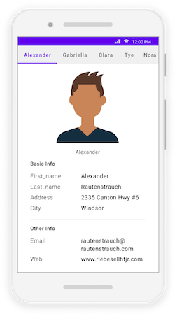

# Getting Started with .NET MAUI Tab View (SfTabView)

This section explains the steps required to configure the .NET MAUI Tab View control and customize its elements.

## Adding SfTabView reference

Syncfusion .NET MAUI components are available in [nuget.org](https://www.nuget.org/). To add SfTabView to your project, open the NuGet package manager in Visual Studio, search for `Syncfusion.Maui.TabView` and then install it.

## Create a simple Tab View

This section explains how to create a Tab View and configure it. The control can be configured entirely in C# code or by using XAML markup. The following screenshot illustrates the output of Tab View on iOS, Android and MacCatalyst.

### Creating the project

Create a new .NET MAUI application in Visual Studio.

### Adding SfTabView control

Add the nuget to the project as discussed in the above reference section.

Add the namespace as shown in the following code.





xmlns:tabView="clr-namespace:Syncfusion.Maui.TabView;assembly=Syncfusion.Maui.TabView"
	




using Syncfusion.Maui.TabView;





Set the control to content in `ContentPage`.

Tab items can be added to the Tab View through the `Items` property of `SfTabView`, which holds the collection of `SfTabItem` through `TabItemsCollection`.





<?xml version="1.0" encoding="utf-8" ?>
<ContentPage xmlns="http://schemas.microsoft.com/dotnet/2021/maui"
            xmlns:x="http://schemas.microsoft.com/winfx/2009/xaml"
            x:Class="TabViewMauiSample.MainPage"
            xmlns:local="clr-namespace:TabViewMauiSample"
            xmlns:tabView="clr-namespace:Syncfusion.Maui.TabView;assembly=Syncfusion.Maui.TabView"
            BackgroundColor="{DynamicResource PageBackgroundColor}">
    <ContentPage.Content> 
        <tabView:SfTabView /> 
    </ContentPage.Content>  
</ContentPage>





using Syncfusion.Maui.TabView;

namespace GettingStarted  
{  
    public partial class MainPage : ContentPage                  
    {   
        private SfTabView tabView;   
        public MainPage()   
        {   
            InitializeComponent();       
            tabView = new SfTabView();   
            this.Content = tabView;  
        }  
    }  
}  



